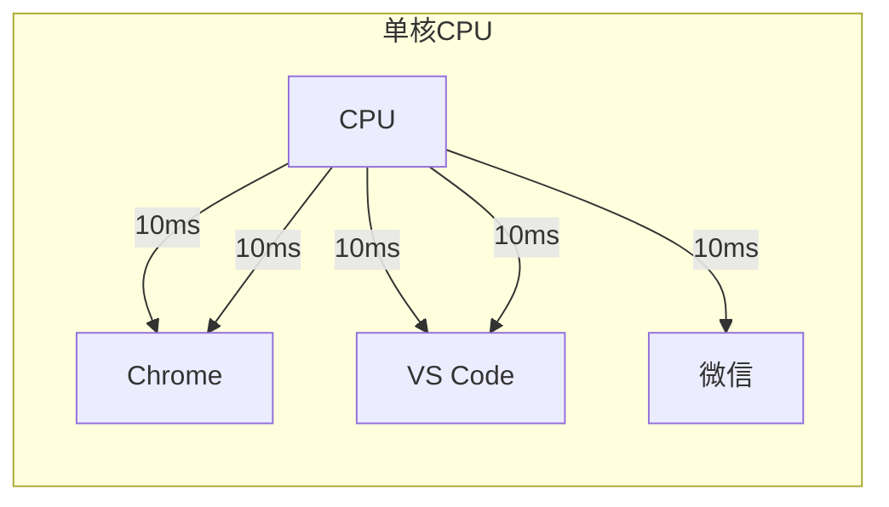

# 操作系统分类：批处理 / 分时 / 实时

> **一句话**：操作系统按"人和电脑交互的方式"分为三类——批处理、分时、实时。分布式不属于"操作系统类型"，是多台电脑组成的系统架构。

---

## 一、先搞清楚分类逻辑

按 **人跟电脑怎么交互** 来分，有三类：

```text
我写好程序 → 交给电脑 → 多久给我结果？

                      ↓

批处理：明天来拿结果（不交互）

分时：  立刻响应我（有交互，但可以慢几毫秒）

实时：  必须准时响应（慢了就出事故）
```

**三种都是单台电脑的操作系统类型。**

---

## 二、三种操作系统逐个讲

### 1. 批处理操作系统（Batch OS）

#### 时代背景

```text
1950-1960 年代，电脑比房子还大，几百万美元一台。

一个公司共用一台电脑，不是一个人用一台。

你的程序写在穿孔纸带上 → 交给操作员

操作员攒一批作业 → 一次性喂给电脑

第二天你来拿结果

全程不能跟电脑说话。你写程序的时候，电脑在算别人的程序。
```

#### 特征

| 维度 | 说明 |
| ------ | ------ |
| 交互性 | ❌ **没有**。提交后不能干预 |
| 响应时间 | 小时级/天级。不着急 |
| 追求目标 | **吞吐量**——单位时间算完多少作业 |
| 调度算法 | FCFS（先来先得）、SJF（短作业优先） |

#### 生活类比

```text
把胶卷送到照相馆：

你拍完一卷 → 交给店员 → 攒够一批一起洗 → 明天来取

你不能在暗房里说"这张再亮一点"——没法交互。
```

#### 现在还有吗？

有。**大数据离线计算** 就是批处理：

```text
MapReduce/Spark 任务：

你写好代码 → 提交给集群 → 跑一晚上 → 第二天看结果

银行批量结算：

半夜跑脚本，把所有账户的利息算一遍

跟 1960 年代的批处理本质上是一样的。
```

---

### 2. 分时操作系统（Time-Sharing OS）

#### 为什么出现？

```text
电脑太贵了，但大家都想"自己用"。怎么办？

分时系统把一个 CPU 的时间切成小块（时间片），

轮流分配给每个用户的进程。

切换够快 → 每个用户觉得"这台电脑是我的"。

这就是现代操作系统的基础——Windows、Linux、macOS 都是分时系统。
```

#### 特征

| 维度 | 说明 |
| ------ | ------ |
| 交互性 | ✅ **强**。你敲键盘立刻有反应 |
| 响应时间 | < 100ms 就算流畅。晚一点没关系，别太晚 |
| 追求目标 | **响应速度** |
| 调度算法 | RR（时间片轮转）、MLFQ（多级反馈队列） |

#### 核心机制：时间片轮转

```text
一台电脑，CPU 一个：

Chrome 跑 20ms  →  暂停

VS Code 跑 20ms  →  暂停  

微信 跑 20ms  →  暂停

Chrome 又跑 20ms  →  暂停

……

切换够快 → 你感觉三者在"同时运行"

这叫 并发（concurrency），不是 并行（parallelism）。
```



**分时系统的核心：用时间片轮转，让多个进程"看起来"在同时跑。**

#### 生活类比

```text
大学机房 40 个人用 20 台电脑：

每人用半小时，到点了换人。

你在用的半小时里，你觉得"这台电脑是我的"。

分时操作系统 = 这个"半小时轮流机制"。
```

---

### 3. 实时操作系统（RTOS - Real-Time OS）

#### 和分时的根本区别

```text
分时：快点响应就行（100ms 内都行）

实时：必须在规定时间内响应，慢了就是事故。

分时追求"快"，实时追求"准时"。
```

#### 两种实时

| 类型 | 超时的后果 | 例子 |
| ------ | ----------- | ------ |
| **硬实时** | 系统崩溃、人员伤亡 | 安全气囊必须在碰撞后 10ms 内弹出 |
| **软实时** | 体验下降，不致命 | 视频掉帧、游戏卡顿 |

#### 特征

| 维度 | 说明 |
| ------ | ------ |
| 交互性 | 看场景，但重点是**确定性** |
| 响应时间 | 硬性规定（如 1ms 以内必须响应） |
| 追求目标 | **可预测性**——保证在截止时间前完成 |
| 调度算法 | EDF（最早截止时间优先）、优先级抢占 |

#### 生活类比

```text
分时：奶茶店做奶茶，3 分钟内做好就行

实时：心脏起搏器，心脏停跳后 0.1 秒必须放电

奶茶晚 1 分钟 → 顾客催一下

起搏器晚 0.1 秒 → 人晕了
```

#### 现在的实时系统在哪

```text
你的微波炉、洗衣机、路由器 → 跑的可能是 FreeRTOS

汽车的刹车系统 → 跑 QNX 或 VxWorks

工业机器人焊接 → 控制在 ±1ms 的精度

这些设备不需要交互（不需要你打字），

但必须在规定时间做完该做的事。
```

---

## 三、一张表对比三种操作系统

| 维度 | 批处理 | 分时 | 实时 |
| ------ | -------- | ------ | ------ |
| 交互？ | ❌ 不能 | ✅ 能 | ⚠️ 部分能 |
| 响应要求 | 无所谓 | <100ms | 硬性截止时间 |
| 追求 | 吞吐量 | 响应速度 | 确定性 |
| 调度算法 | FCFS、SJF | RR、MLFQ | EDF、优先级 |
| 典型例子 | Hadoop 离线计算 | Windows / Linux / macOS | FreeRTOS / QNX |
| 你每天都在用？ | 偶尔 | **天天用** | **很多设备里跑着** |

---

## 四、分布式系统——它不是"操作系统类型"

### 先说不该放一起比的原因

```text
上面三种说的都是"一台电脑的操作系统"：

批处理：一个人用一台电脑（不交互地算）

分时：  多个人用一台电脑（轮流，每人感觉自己在独占）

实时：  一个人用一台电脑（但必须准时）

分布式：一堆电脑连在一起工作
```

**分布式系统不是一个"操作系统类型"，而是一种"系统架构"。**

```text
分类不对：

✅ 正确：

  操作系统类型：批处理 / 分时 / 实时

  系统架构：单机 / 分布式

❌ 错误：

  "操作系统类型：批处理、分时、实时、分布式"
```

### 那到底怎么区分？

```text
分时/批处理/实时 讨论的是：

  一台电脑上，CPU 怎么分配、人机怎么交互

分布式 讨论的是：

  多台电脑怎么连起来干活，对外假装是一台

分布式系统里的每一台电脑，本身有自己的操作系统：
```

```mermaid
graph TD
    subgraph 分布式系统（系统架构）
        S1["服务器A<br/>跑的 Linux（分时系统）"]
        S2["服务器B<br/>跑的 Linux（分时系统）"]
        S3["服务器C<br/>跑的 Linux（分时系统）"]
    end
    S1 ---|"网络协作"| S2
    S2 ---|"网络协作"| S3
    S3 ---|"网络协作"| S1
```

### 分布式系统的核心

| 概念 | 说明 |
| ------ | ------ |
| 核心思想 | 多台电脑假装是一台 |
| 需要解决的问题 | 数据一致性、容错、网络通信 |
| 典型例子 | Google 搜索、微信后台、Hadoop 集群 |
| 和操作系统的关系 | **每台节点有自己的 OS（通常是分时系统 Linux）** |

### 分布式 vs 分时 最直观的区别

```text
分时：一台电脑，多个进程轮流用 CPU

      你感觉"几个程序同时跑"

分布式：多台电脑，通过网络协作

       你感觉"只有一台电脑在提供服务"

分时把"一个 CPU"切成时间片分给多个进程

分布式把"多台电脑"聚合成一台虚拟电脑
```

---

## 五、一句话讲清

### Q：操作系统有哪些分类？

> 按交互方式分三种：批处理（提交后不交互，追求吞吐量）、分时（很多人共用一台，追求响应速度）、实时（必须准时，慢了出事故）。分时是现在最常用的，Windows/Linux/macOS 都是分时系统。

### Q：分布式系统和分时系统是同一类东西吗？

> 不是。分时是操作系统类型——一台电脑上多个进程轮流跑。分布式是系统架构——多台电脑连起来协作。分布式系统里的每台电脑本身通常跑的是 Linux（分时系统），两者不在一个层面。

### Q：分时系统为什么用 RR 调度？

> 因为分时系统追求响应速度，RR 的时间片轮转让每个进程都有机会跑，谁都不会等太久。时间片设 20-50ms，用户感觉不到切换，觉得进程在同时跑。

---

## 六、记忆口诀

```text
批处理——交作业，明天取（不管交互）

分时——大家一起轮流用电脑（管交互）

实时——晚了就出人命（管准时）

分布式——多台假装一台（系统架构，不是 OS 类型）
```

---

**总结**：批处理、分时、实时是三种**单机操作系统类型**，按交互方式和响应要求划分。分布式是**系统架构**，跟操作系统分类不是一个维度。分时是你每天都在用的（Win/Linux/macOS），批处理是离线大数据，实时是你的家电和汽车里跑的东西。

## 相关链接

- 📋 目录：[[00-操作系统]]

- 📚 学习清单：[[八股文学习清单]]

- 🔗 [[20-操作系统基础CPU调度流程中断系统调用上下文切换|20 操作系统基础]]
- 🔗 [[21-用户态与内核态|21 用户态与内核态]]
- 🔗 [[22-用户态进入内核态三种方式|22 用户态进入内核态三种方式]]
- 🔗 [[八股文笔记/Python/00-Python|Python八股文]]
- 🔗 [[八股文笔记/React-TS-JS/00-React-TS-JS|React-TS-JS八股文]]
- 🔗 [[八股文笔记/MySQL/00-MySQL|MySQL八股文]]

