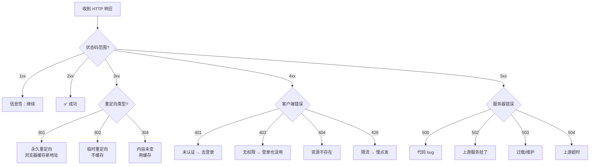

## 一、HTTP 状态码（必背基础题）

### 1.1 状态码是什么？

> 服务器收到你的请求后，除了返回你要的数据，还会返回一个**三位数的"回应码"**，告诉你这次请求的结果怎么样。

**通俗比喻**：你去餐厅点菜，服务员（服务器）给你上菜时会附一张小纸条：

```text
200 = "您的菜来了，请慢用"           → 成功
301 = "这道菜搬到隔壁分店了"          → 永久重定向
404 = "菜单上没这道菜"               → 找不到
500 = "厨房着火了"                   → 服务器内部错误
```

### 1.2 五大类速记

| 类别 | 范围 | 一句话 | 通俗比喻 |
| :---: | :---: | :--- | :--- |
| **1xx** | 100~199 | 信息性，"收到了，继续" | 服务员说"您的单子我接了，稍等" |
| **2xx** | 200~299 | 成功 | 菜端上来了 |
| **3xx** | 300~399 | 重定向，"去别的地方找" | "这道菜搬到新地址了" |
| **4xx** | 400~499 | 客户端错误，"你搞错了" | "你点了一道不存在的菜" |
| **5xx** | 500~599 | 服务器错误，"我搞砸了" | "厨房出问题了" |

> **记忆口诀**：1 继续、2 成功、3 搬家、4 你的锅、5 我的锅。

#### 状态码决策树



---

### 1.3 每类必须记住的状态码

#### 2xx 成功

| 状态码 | 含义 | 通俗解释 |
| :---: | :--- | :--- |
| **200 OK** | 请求成功 | 菜端上来了，吃吧 |
| **201 Created** | 资源创建成功 | 你新注册了一个账号，注册成功 |
| **204 No Content** | 成功但没有返回体 | 你删了一条记录，成功了，但没啥好返回的 |

```python
# FastAPI 中返回不同状态码的示例
from fastapi import FastAPI, status       # 导入 FastAPI 和状态码常量

app = FastAPI()                            # 创建应用实例

@app.post("/users", status_code=201)       # 创建用户，返回 201 Created
def create_user(name: str):
    return {"name": name}                  # 返回创建的用户信息

@app.delete("/users/{id}", status_code=204)  # 删除用户，返回 204 No Content
def delete_user(id: int):
    pass                                   # 删除成功，不返回任何内容
```

#### 3xx 重定向

| 状态码 | 含义 | 通俗解释 |
| :---: | :--- | :--- |
| **301 Moved Permanently** | 永久搬家 | 那家店永久搬到新地址了，以后直接去新的 |
| **302 Found** | 临时搬家 | 那家店今天装修，临时换个地方，明天还回原址 |
| **304 Not Modified** | 内容没变，用缓存 | 你问"菜单变了吗？"，服务员说"没变，看上次那份就行" |

> **301 vs 302 的关键区别**：
> - **301**：浏览器会**记住**新地址，下次直接去新的（缓存重定向）
> - **302**：浏览器**不记**，每次还先去旧地址问一下

**304 的生活场景**：你每天早上问楼下保安"今天小区有新通知吗？"。保安说"没有，昨天的通知还有效"——你就不需要重新抄一遍，用昨天的笔记就行。这就是**缓存**，304 就是"没变，用你手头的"。

```python
# 304 在 FastAPI 中的体现（ETag / If-None-Match）
from fastapi import FastAPI, Request, Response   # 导入必要模块

app = FastAPI()                                   # 创建应用实例

@app.get("/data")                                 # 定义 GET 接口
async def get_data(request: Request):
    current_etag = "abc123"                       # 当前资源的版本标识（哈希值）
    client_etag = request.headers.get("if-none-match")  # 客户端上次拿到的版本标识

    if client_etag == current_etag:               # 如果客户端的版本和服务器一样
        return Response(status_code=304)          # 返回 304：没变，用你缓存的
    return {"data": "some content"}               # 有变化，返回新数据
```

#### 4xx 客户端错误

| 状态码 | 含义 | 通俗解释 |
| :---: | :--- | :--- |
| **400 Bad Request** | 请求格式有误 | 你填的表单有问题，服务器看不懂 |
| **401 Unauthorized** | 未认证（没登录） | 你没带门票，进不去 |
| **403 Forbidden** | 已认证但没权限 | 你有门票但这是 VIP 区，你等级不够 |
| **404 Not Found** | 资源不存在 | 你要找的页面/资源不存在 |
| **405 Method Not Allowed** | 方法不允许 | 这个接口只接受 GET，你用了 POST |
| **409 Conflict** | 冲突 | 你要注册的用户名已经被别人用了 |
| **429 Too Many Requests** | 请求太频繁 | 你 1 秒发了 100 次请求，服务器说你慢点 |

> **401 vs 403 重点掌握**：
> - **401** = 你**没证明你是谁**（没带身份证）→ 去登录
> - **403** = 你**证明了你是谁**，但**你没权限干这事**（你有身份证但不是管理员）→ 登录也没用

**生活场景**：

```text
你去公司大楼：

前台："请出示工牌"  →  你没工牌  →  401 Unauthorized（先去办工牌）

前台：验了工牌，你确实是员工
但你要进"CEO 办公室"  →  你不是 CEO  →  403 Forbidden（你是谁不重要，你没权限）
```

#### 5xx 服务器错误

| 状态码 | 含义 | 通俗解释 |
| :---: | :--- | :--- |
| **500 Internal Server Error** | 服务器内部错误 | 厨房炸了，不知道啥原因 |
| **502 Bad Gateway** | 网关/上游服务挂了 | 前台接了你的单，但后厨没响应 |
| **503 Service Unavailable** | 服务暂时不可用 | 餐厅今天歇业，明天再来 |
| **504 Gateway Timeout** | 网关超时 | 前台等后厨等太久，放弃了 |

> **500 vs 502 vs 503 vs 504**：
> - **500**：代码 bug，服务器自己崩了
> - **502**：服务器作为中间人，后面的上游服务挂了（比如 Nginx 反代的后端崩了）
> - **503**：服务暂时过载或维护中（通常可重试）
> - **504**：服务器作为中间人，等上游服务等超时了

**生活场景——餐厅打比方**：

```text
500  →  厨师炒菜时着火了（服务器代码 bug）
502  →  你点了外卖，骑手说"餐厅关门了"（上游服务挂了）
503  →  餐厅门口挂着"今日盘点，暂停营业"（过载/维护）
504  →  你点了菜，等了 30 分钟还没上，你走了（超时）
```

---

## 相关链接

- 📋 目录：[[00-计算机网络]]
- 📚 学习清单：[[八股文学习清单]]
- 🔗 [[19-HTTP基础|HTTP基础]] — HTTP 请求/响应结构
- 🔗 [[11-GET与POST与PUT与DELETE|GET与POST与PUT与DELETE]] — 请求方法与幂等性
- 🔗 [[22-RESTful设计|RESTful设计]] — RESTful API 设计规范
- 🔗 [[17-HTTP缓存强缓存与协商缓存|HTTP缓存]] — 304 状态码与缓存机制

