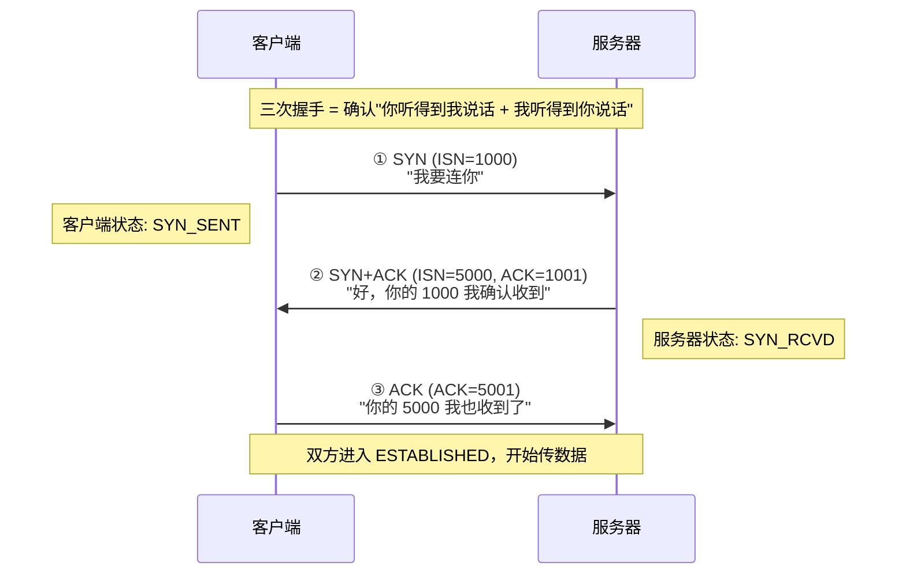
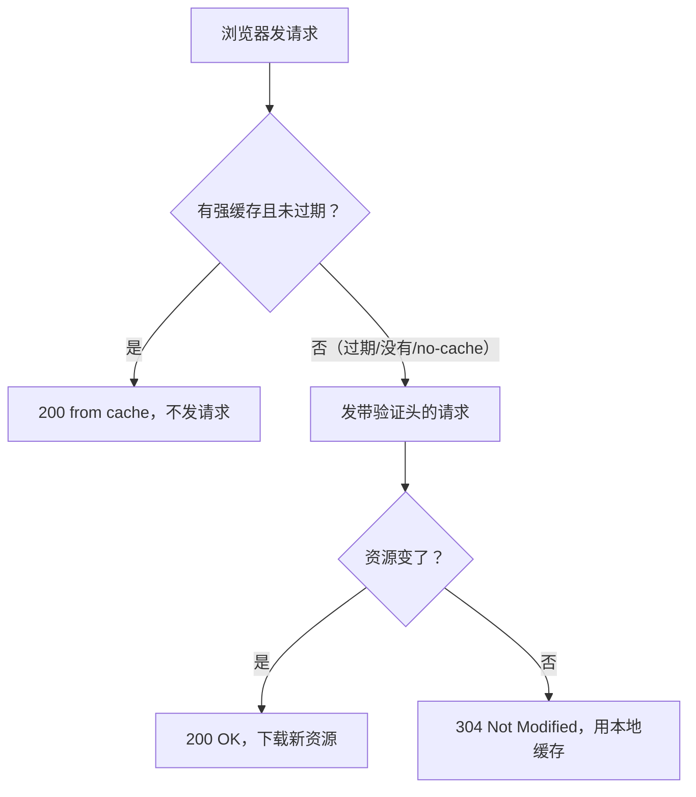
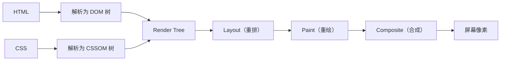

# 从输入 URL 到页面展示全流程

> 从第十九天笔记提取：DNS 解析链路、TCP 三次握手、TLS/HTTPS 握手、HTTP 缓存策略、浏览器渲染流程（DOM-CSSOM-Render Tree-Layout-Paint-Composite）

---

## 一、全流程概览

"祖传第一题"分两大段：

- **网络段**：URL → DNS → TCP → TLS → HTTP → 响应
- **渲染段**：HTML → DOM → CSSOM → Render Tree → Layout → Paint → Composite

---

## 二、网络段

### 2.1 URL 解析

浏览器先把输入拆解：协议（scheme）、主机（host）、端口（port）、路径（path）、查询参数（query）、锚点（hash）。

浏览器先干两件事：
1. **HSTS 强制 HTTPS**：浏览器内置了一个"只走 HTTPS"的域名名单，即使你输入 `http://`，浏览器内部直接改成 `https://`
2. **缓存查找**：还没发请求之前，先翻自己的 HTTP 缓存，强缓存命中了直接返回

### 2.2 DNS 解析

互联网靠 IP 通信，但人记不住 IP，只记得域名。DNS 就是翻译官。

#### 四级缓存链

```text
浏览器缓存 → OS 缓存（hosts 文件） → 路由器缓存 → ISP DNS 服务器
```

每层都有缓存，能省则省。四级都没命中才真正开始 DNS 查询。

#### DNS 的层级结构

域名从右往左读：`www.example.com`

- **根域名服务器**：全球 13 组，存所有顶级域名的"下一级找谁"
- **顶级域名服务器（TLD）**：存某个顶级域下所有二级域名的"下一级找谁"（.com、.cn、.org）
- **权威 DNS 服务器**：真正存 IP 的地方，域名和 IP 的最终对应关系

查询过程：根返回 .com 的 NS → .com 返回 example.com 的 NS → 权威服务器返回 A 记录（IP）

#### 递归 vs 迭代

- **递归**（客户端到 ISP DNS）：你只问一次，ISP 替你跑全程
- **迭代**（ISP DNS 到各级服务器）：每级只告诉你下一级找谁，你自己去问

实际部署中是"递归 + 迭代"混合：客户端到本地 DNS 是递归，本地 DNS 到各级服务器是迭代。

#### 常见 DNS 记录类型

| 记录类型 | 含义 | 例子 |
| :--- | :--- | :--- |
| `A` | 域名 → IPv4 地址 | `example.com → 93.184.216.34` |
| `AAAA` | 域名 → IPv6 地址 | `example.com → 2606:...` |
| `CNAME` | 别名 → 真名 | `www.example.com → example.com`（还得再查一次 A 记录） |
| `NS` | 某级域名的权威 DNS 服务器 | `example.com 的 DNS 服务器是 ns1.example.com` |
| `MX` | 邮件服务器 | `给 @example.com 发邮件 → 投递到 mail.example.com` |

### 2.3 TCP 三次握手

拿到 IP 后，浏览器要和服务器建立 TCP 连接。



#### 为什么不是两次？

两次无法阻止历史连接 — 旧的 SYN 延迟到达会让服务器建立无效连接（半开连接），浪费资源。

#### 为什么不是四次？

服务器的 SYN 和 ACK 可以合并发送（TCP 头部支持 SYN 和 ACK 标志位同时置 1），三次刚好，四次冗余。

#### SYN Flood 攻击（进阶亮点）

攻击者大量发 SYN，但永远不回 ACK，塞满服务器的半连接队列。

**防御方案**：SYN Cookie（收到 SYN 时不分配资源，把关键信息编码进 ISN 返回）、缩短 SYN Timeout、防火墙限流。

### 2.4 TLS/HTTPS 握手

如果 URL 是 `https://`，TCP 三次握手之后还得做 TLS 握手。

#### 核心思路：非对称加密协商密钥 → 对称加密传数据

- **非对称加密**：安全但慢（比对称加密慢 100-1000 倍）
- **对称加密**：快但有密钥分发问题

TLS 的解法：握手阶段用非对称加密把对称密钥协商好，通信阶段用对称加密传实际数据。

#### TLS 1.2 握手（2 RTT）

```text
① ClientHello：客户端告诉服务器支持的 TLS 版本和加密套件，带上随机数 Random_C
② ServerHello：服务器选加密套件，返回证书（含公钥）+ 随机数 Random_S
③ ClientKeyExchange：客户端生成 Pre-Master Secret，用服务器公钥加密发过去
④ Finished：双方各自用 Random_C + Random_S + Pre-Master 算出 Session Key，验证密钥一致
```

#### TLS 1.3 优化到 1 RTT

- 砍掉加密套件协商，客户端在 ClientHello 里直接猜 + 把密钥材料一起发过去
- 服务器一次性回复全部

#### RTT 总计

- TCP(1 RTT) + TLS 1.2(2 RTT) = **3 RTT** 后才能发 HTTP 请求
- TCP(1 RTT) + TLS 1.3(1 RTT) = **2 RTT** 后才能发 HTTP 请求

#### 数字证书防伪

浏览器验证证书：用 CA 公钥验证数字签名 → 检查域名匹配 → 检查是否过期 → 检查是否被吊销。

攻击者无法获取有效证书：自己生成假证书签名验不过；去 CA 申请 example.com 的证书，CA 要求证明你真的拥有这个域名。

### 2.5 HTTP 缓存策略

缓存分为两种 — **强缓存**（不发请求）和**协商缓存**（发请求问一声）。

#### 强缓存

- HTTP/1.0：`Expires: Wed, 21 Oct 2025 07:28:00 GMT`（绝对时间，依赖客户端时间）
- HTTP/1.1：`Cache-Control: max-age=3600`（相对时间，从请求时刻起 3600 秒内直接用缓存）

命中强缓存 → 状态码显示 `200 (from disk cache)` 或 `200 (from memory cache)`

#### 协商缓存

- **Last-Modified / If-Modified-Since**：服务器记录文件最后修改时间，下次请求带这个时间去比对
- **ETag / If-None-Match**：服务器记录文件哈希值，下次请求带这个哈希去比对（更精准）

没变 → 304 Not Modified（用缓存）；变了 → 200 OK + 新内容

#### 缓存判断流程



#### 特殊值：Cache-Control: no-cache

不是"不缓存"，而是"缓存了但每次必须验证"。跳过强缓存检查，直接进协商缓存。

#### JS/CSS 用强缓存，HTML 用协商缓存

- **JS/CSS**：文件名带了内容 hash（`[contenthash]`），内容不变 hash 不变，直接从缓存拿；内容变了 hash 跟着变，等于新 URL
- **HTML**：是入口文件，必须保证每次拿到最新的 JS/CSS 引用。强缓存了 HTML 就拿不到最新 JS/CSS 文件名，可能白屏

---

## 三、浏览器渲染段

### 3.1 渲染五步流水线



### 3.2 第一步：HTML → DOM 树

四步过程：

1. **字节 → 字符**：根据 HTTP 响应头的 `Content-Type` 和 charset，把字节流解码成字符
2. **字符 → Token（词法分析）**：逐个字符扫描，碰到 `<` 就知道"开始标签来了"
3. **Token → 节点对象（语法分析）**：按顺序消费 Token，遇到 StartTag 创建节点，遇到 EndTag 弹出栈
4. **节点 → DOM 树**：所有节点挂好，形成树状结构

**DOM 解析是渐进的** — 浏览器边下载边解析。但遇到 `<script>` 时会暂停 DOM 解析（因为 JS 可能 `document.write()` 修改 HTML）。

### 3.3 第二步：CSS → CSSOM 树

CSS 是**渲染阻塞资源** — 浏览器必须等整个 CSS 文件解析完、构建 CSSOM，才能继续渲染。

原因：如果一边加载 CSS 一边渲染，页面样式会一直变（FOUC — Flash of Unstyled Content，"裸奔闪烁"）。

### 3.4 第三步：DOM + CSSOM → Render Tree

- DOM 里的**可见节点** + CSSOM 里的样式 → 进入 Render 树
- `<head>` → 不渲染，不在 Render 树
- `display: none` → 不在 Render 树（Layout 直接跳过）
- `visibility: hidden` → 在 Render 树，占着坑，只是看不见
- `<script>` → 不渲染，不在 Render 树

### 3.5 第四步：Layout（重排）

计算每个节点在屏幕上的精确位置和大小 — 宽度、高度、x、y、margin、padding、border。

### 3.6 第五步：Paint（重绘）

把 Layout 结果变成屏幕上的像素。按层绘制：背景 → 边框 → 文字 → 阴影。

### 3.7 第六步：Composite（合成）

浏览器把页面拆成多个图层（根图层、`transform` 提升的图层、`<video>`/`<canvas>` 自己的图层），GPU 把各图层按 z-index 叠成最终画面。

`transform`/`opacity` 只触发合成，不走 Layout 和 Paint → 60fps 丝滑。

---

## 四、重排 vs 重绘

### 触发重排（Reflow）— 改了布局

- 添加/删除可见 DOM 元素
- 修改元素的 width / height / margin / padding / border
- 修改元素的 position / display / float / overflow
- 浏览器窗口 resize
- 读取 offsetWidth、offsetHeight、scrollTop、getComputedStyle

### 触发重绘（Repaint）— 只改外观

- color、background、box-shadow、border-color、outline、visibility

### 只触发合成（Composite）— 性能最优

- transform（translate / rotate / scale）
- opacity

### 代价对比

**重排 > 重绘 > 合成**

重排一定触发重绘，重绘不一定触发重排。动画用 `transform` 和 `opacity` 而不是 `left`/`top`。

---

## 五、CSS 放 head、JS 放 body 底部的原因

### CSS 是渲染阻塞资源

CSSOM 树没建好，浏览器绝不动手渲染。CSS 越早加载越好 → 放 `<head>` 里。

### JS 是解析阻塞资源

浏览器遇到 `<script>`（不带 async/defer），暂停 DOM 解析。因为 JS 可能 `document.write()` 往 HTML 里写新内容。JS 越晚加载越好 → 放 `<body>` 底部。

---

## 六、async vs defer

| 加载方式 | 下载行为 | 执行时机 | 保证顺序 | 适用场景 |
| :--- | :--- | :--- | :---: | :--- |
| 普通 `<script>` | 阻塞 DOM，下载+执行都阻塞 | 下载完立刻执行 | 是 | 极少用 |
| `<script async>` | 异步下载，不阻塞 DOM | 下载完立刻执行（可能乱序） | 否 | 独立脚本（统计、广告） |
| `<script defer>` | 异步下载，不阻塞 DOM | DOM 解析完后按书写顺序执行 | 是 | 大部分业务代码 |

**规则**：如果你的 JS 写了 `document.getElementById()` 这种东西，必须用 defer，不然 DOM 还没出来就报错了。

---

## 七、白屏优化策略

用户输入 URL 到看到内容，中间这些阶段都可能白屏：

1. **网络延迟** → DNS 预解析 `<link rel="dns-prefetch">`、CDN、压缩
2. **HTML 下载慢** → 服务端渲染（SSR）、骨架屏
3. **CSS 阻塞渲染** → 首屏 CSS 内联到 `<style>`，非首屏 CSS 延迟加载
4. **JS 阻塞 DOM 解析** → JS 放 `<body>` 底部 + defer

### CRP（Critical Rendering Path）核心优化

1. 减少关键资源数量
2. 减少关键资源大小（压缩、tree-shaking）
3. 缩短关键路径长度（减少请求往返次数）

---

## 八、快速问答

| 问题 | 一句话答案 |
| :--- | :--- |
| 输入 URL 到页面展示发生了什么？ | DNS 解析 IP → TCP 三次握手 → TLS 握手 → HTTP 请求 → 服务器响应 → 浏览器解析 HTML 构建 DOM → 解析 CSS 构建 CSSOM → 合体 Render 树 → Layout → Paint → Composite |
| TCP 为什么三次握手不是两次？ | 两次无法阻止历史连接 — 旧的 SYN 延迟到达会让服务器建立无效连接 |
| 强缓存和协商缓存区别？ | 强缓存不发请求直接用（200 from cache），协商缓存发请求问服务器变没变（304） |
| CSS 放 `<head>` 的原因？ | CSS 是渲染阻塞资源，CSSOM 构建完前不渲染，放 head 尽早开始下载避免白屏 |
| JS 放 `<body>` 底部的原因？ | JS 是解析阻塞资源，遇到 `<script>` 暂停 DOM 构建，放底部让 DOM 和页面先出来 |
| async 和 defer 的区别？ | async 下载完立刻执行（乱序，适合独立脚本）；defer DOM 解析完才执行（顺序，适合业务 JS） |
| 什么是重排？ | 改了布局属性（宽高、位置、display）→ 重新 Layout → 贵 |
| 什么是重绘？ | 只改视觉属性（颜色、背景）→ 跳过 Layout → 比重排便宜 |
| transform 和 left 做动画有什么区别？ | `left` 触发重排，`transform` 只触发合成（GPU）→ 性能差距巨大 |


## 相关链接

- 📋 目录：[[00-计算机网络]]
- 📚 学习清单：[[八股文学习清单]]
- 🔗 [[八股文笔记/React-TS-JS/React/02-虚拟DOMVirtualDOM|虚拟DOM]] — 浏览器渲染与 React 虚拟 DOM 的关联
- 🔗 [[八股文笔记/计算机网络/34-DNS解析过程|DNS解析过程]] — URL 解析的第一步是 DNS
- 🔗 [[八股文笔记/操作系统/19-零拷贝sendfile_mmap_splice|零拷贝]] — 浏览器渲染涉及零拷贝技术
- 🔗 [[02-TCP三次握手|TCP三次握手与四次挥手]] — 网络段 TCP 连接建立
- 🔗 [[13-HTTPS加密流程|HTTPS加密流程]] — TLS 握手阶段
- 🔗 [[35-HTTP强缓存与协商缓存|HTTP强缓存与协商缓存]] — 缓存策略详解
- 🔗 [[18-网络段从输入URL到收到响应|网络段从输入URL到收到响应]] — 网络段独立详解
- 🔗 [[23-浏览器渲染段从HTML到像素|浏览器渲染段]] — 渲染段独立详解
- 🔗 [[19-HTTP基础|HTTP基础]] — HTTP 请求/响应结构
