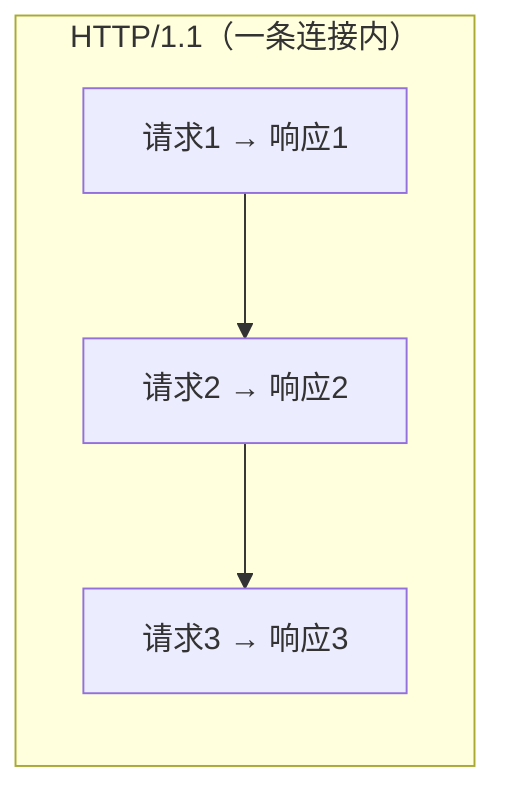
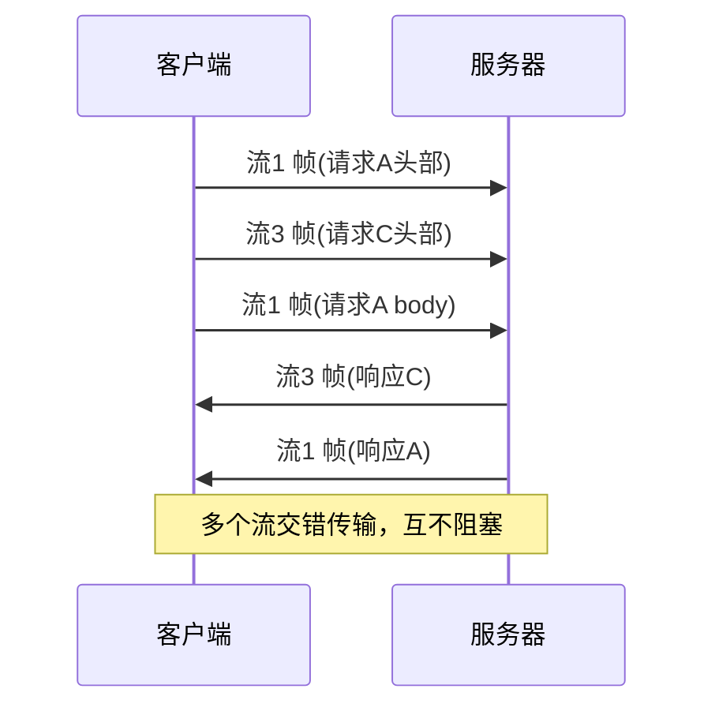

# HTTP/2 多路复用
## 一句话总结

> **HTTP/2 多路复用 = 在一个 TCP 连接里，多个请求/响应像"交错的车流"同时跑，不用再像 HTTP/1.1 那样排成一队等前面的走完。**

---

## 一、为什么需要多路复用？（HTTP/1.1 的痛点）

HTTP/1.1 虽然支持长连接（keep-alive），但有个致命问题——**队头阻塞（Head-of-Line Blocking, HOLB）**：

- 浏览器和服务器之间通常只开 **约 6 条** TCP 连接（浏览器并发限制）。
- 每条连接里，请求必须 **串行**：前一个响应没回来，后面的请求就只能排队干等。
- 哪怕第 1 个请求只是卡了 100ms，后面同一连接上的请求全被堵在后面。

> 像什么？单车道公路，前面的车抛锚了，后面所有车一起堵死。

---

## 二、HTTP/2 怎么解决的？二进制分帧层

HTTP/2 引入了一个 **二进制分帧层（Binary Framing Layer）**，把数据拆成最小的"帧（Frame）"：

- **流（Stream）**：一次请求/响应对应一个逻辑流，有唯一 **流 ID**。
- **消息（Message）**：一个请求或响应 = 一个消息，由多个帧组成。
- **帧（Frame）**：最小传输单位，包含 `流ID` + `类型` + `数据`。

多个流的帧可以 **交错（interleave）** 在同一个 TCP 连接里发送，接收端按 `流ID` 重组。

---

## 三、常问：多路复用解决了什么？没解决什么？

| 维度 | HTTP/1.1 | HTTP/2 | HTTP/3 |
| :--- | :--- | :--- | :--- |
| 应用层队头阻塞 | ❌ 存在（串行） | ✅ 解决（多路复用） | ✅ 解决 |
| 底层队头阻塞 | TCP 丢包阻塞整条 | **TCP 丢包仍阻塞整条** | ✅ 解决（QUIC over UDP） |
| 传输格式 | 文本 | 二进制帧 | 二进制帧 |
| 头部压缩 | 无 | HPACK | QPACK |

> ❗ **易错点**：HTTP/2 **只解决了应用层的队头阻塞**。一旦底层 TCP 丢了一个包，整条连接（里面所有流）都要等这个包重传——这就是 **TCP 层队头阻塞**。HTTP/3 把底层换成 QUIC（基于 UDP），才彻底解决。

---

## 四、和 HTTP/1.1 的关键区别速记

- **多路复用**：一个连接并发多个请求，不用开 6 条连接排队。
- **二进制帧**：解析更高效，不用一行行读文本。
- **HPACK 头部压缩**：重复的请求头只发增量，省带宽。
- **服务器推送（Server Push）**：服务器可主动推资源（已逐渐弃用，因缓存策略复杂）。

---

## 相关链接

- 📋 目录：[[00-计算机网络]]
- 📚 学习清单：[[八股文学习清单]]
- 🔗 HTTP版本演进 — 各版本特性总览（本篇为其展开）
- 🔗 [[31-WebSocket全双工通信|WebSocket]] — 另一种"双向实时"方案
- 🔗 [[14-浏览器输入URL到页面展示|URL到页面展示]] — 多路复用如何影响页面加载
