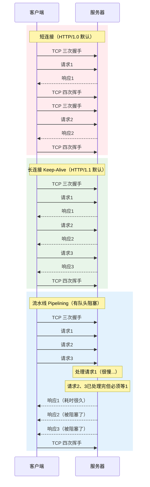
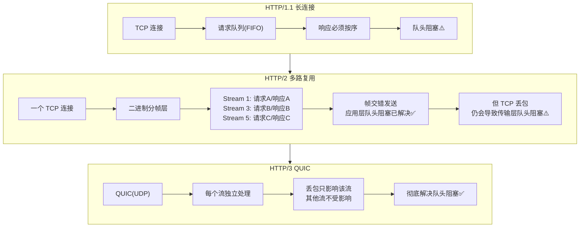

## 五、长连接 & 短连接 & 流水线

常见的问题"连接管理三兄弟"——短连接、长连接、流水线，本质上都是 HTTP 为了优化性能在不同阶段想出来的招。我们来把这三兄弟的底裤扒干净。

### 1) 短连接：打完电话就挂，下次再打

**HTTP/1.0 的默认模式。** 每次 HTTP 请求都要走一遍完整流程：

```text
三次握手建立 TCP → 发送请求 → 接收响应 → 四次挥手关闭 TCP
```

比如你打开一个网页，里面有 10 张图片，浏览器就要：
- 建 10 次 TCP 连接（10 × 3次握手）
- 断 10 次 TCP 连接（10 × 4次挥手）

**通俗比喻：** 就像一个话痨朋友，每问你一个问题就打一次电话，问完就挂。下一句又想问，再打一次。一个月下来电话费爆炸。

**缺点：**
- **高延迟**：每次请求都要经历 TCP 三次握手和慢启动，增加 RTT（Round-Trip Time，往返时间）
- **资源浪费**：频繁创建和销毁 TCP 连接，消耗 CPU、内存和端口资源
- **拥塞控制失效**：每个新连接都从初始拥塞窗口开始，无法充分利用已建立的连接带宽

### 2) 长连接 Keep-Alive：一个电话聊到底

**HTTP/1.1 默认开启长连接。** 一条 TCP 连接可以传输多个 HTTP 请求/响应，不用反复"握手-挥手"。

```text
三次握手建立 TCP → 请求1 → 响应1 → 请求2 → 响应2 → ... → 空闲超时/主动关闭
```

**通俗比喻：** 这次聪明了，拨通电话后不挂，一口气把所有问题问完。只要电话两端都没说"再见"，线路就一直通着。

**Connection 头部控制：**

```http
# HTTP/1.1 默认就是长连接，这个头可以省略
Connection: keep-alive

# 如果想强制关闭，客户端或服务端任一方发这个
Connection: close

# 非标准但广泛支持的保活参数
Keep-Alive: timeout=5, max=100
# timeout: 空闲连接在 5 秒后断开
# max: 这个连接最多处理 100 个请求
```

**关闭方式：**

| 关闭触发条件 | 说明 |
| :--- | :--- |
| `Connection: close` | 客户端或服务器显式要求关闭 |
| 超时（timeout） | 如 Nginx 的 `keepalive_timeout`，空闲超过设定时间自动断开 |
| 请求数达到上限 | 如 Nginx 的 `keepalive_requests`，处理完 N 个请求后主动断 |
| 网络异常 | 断网、路由器故障等导致 TCP 中断 |

**优点：**
- 减少 TCP 握手/挥手开销，降低延迟
- 复用连接减少 CPU 和内存消耗
- 利于 TCP 拥塞控制窗口增长，提高吞吐量

**缺点：**
- **队头阻塞（Head-of-Line Blocking）**：即使连接是持久的，如果第一个请求处理很慢（比如查大数据库），它后面的请求也得排队等着——因为 HTTP/1.1 的响应**必须按请求顺序返回**。这就是 HTTP 最经典的性能瓶颈。

### 3) 流水线 Pipelining：不等回复就连着问

**建立在长连接之上的"激进优化"。** 客户端不用等上一个响应回来，就可以连续发多个请求。但服务器**必须按收到请求的顺序**依次返回响应。

**通俗比喻：** 你去快餐店，不用等第一份餐做好，就连着报"汉堡、薯条、可乐"。但后厨的规定是——必须按你报的顺序出餐。结果厨房里汉堡机器坏了，薯条和可乐明明做好了也得在旁边干等着，不能先给你。

**工作流程：**

```text
客户端：发请求1 → 发请求2 → 发请求3（不等回复，连发）
服务器：处理1 → 处理2 → 处理3
客户端：收响应1 → 收响应2 → 收响应3（必须按序接收）
```



**流水线的致命缺陷——队头阻塞的具体表现：**

- 如果请求 1 的响应处理或传输很慢，响应 2 和响应 3 即使准备好了，也必须排队等响应 1 发完
- 如果中途某个请求失败或连接断开，客户端和服务器需要复杂逻辑判断哪些请求已处理、哪些需要重试
- 重试非幂等请求（如 POST）可能导致副作用（重复创建数据）
- **很多代理服务器不完全支持或错误实现流水线，可能导致请求/响应错乱**

**现状：** 由于这些根本性缺陷，**现代浏览器和服务器默认禁用流水线**。它是一个"理论上美好但实践中失败"的特性。

### 4) 从流水线到多路复用：HTTP/2 和 HTTP/3 怎么解决的？



**HTTP/2 的核心改进：**
- **二进制分帧**：把 HTTP 消息拆成独立的"帧"（HEADERS 帧、DATA 帧等），每个请求/响应流分配唯一 Stream ID
- **多路复用**：不同 Stream 的帧可以交错发送，不按顺序，接收端按 Stream ID 重组
- 这解决了 **HTTP 应用层的队头阻塞**，但 **TCP 传输层的队头阻塞** 仍然存在——一个 TCP 包丢了，所有 Stream 都得等重传

**HTTP/3 的终极方案：**
- 把传输层从 TCP 换成 **QUIC（基于 UDP）**
- 在 QUIC 层面实现多路复用，每个流独立处理
- 丢包只影响该包所属的流，其他流完全不受影响
- 还支持 0-RTT 连接建立，进一步减少延迟

### 5) 对比总结

| 特性 | HTTP/1.0 短连接 | HTTP/1.1 长连接 | HTTP/1.1 流水线 | HTTP/2 多路复用 | HTTP/3 QUIC |
| :--- | :--- | :--- | :--- | :--- | :--- |
| 连接模式 | 请求-响应-关闭 | 多请求复用同一连接 | 多请求复用同一连接 | 单连接多路复用 | 单连接多路复用 |
| 请求发送 | 等上一个响应完成 | 通常等上一个响应完成 | 无需等待，连续发送 | 随时交错发送帧 | 随时交错发送帧 |
| 响应顺序 | 自然顺序 | 必须按请求顺序 | 必须按请求顺序 | 帧可交错，按流ID重组 | 帧可交错，按流ID重组 |
| 队头阻塞 | 无（连接独立） | 存在（应用层） | 严重（应用层） | 存在（传输层TCP） | 基本解决 |
| 默认状态 | 历史协议 | 默认启用 | 广泛禁用 | 主流 | 新兴协议 |

---
### 延伸追问

**Q: 为什么流水线没能解决队头阻塞？**

因为流水线虽然可以并发发送请求，但 HTTP/1.1 协议规定**响应必须严格按照请求的发送顺序返回**。这是一个"串行响应"模型——如果队头请求的响应处理慢了（比如查了一个慢 SQL），后面已经处理好的响应也只能干等着。这不是实现问题，是**协议设计层面的限制**。

**Q: HTTP/2 的多路复用和 HTTP/1.1 的流水线有什么区别？**

核心区别：流水线是"并发发送，串行响应"；多路复用是"并发发送，乱序响应，按 Stream ID 重组"。

打个比方：
- 流水线 = 你去食堂打饭，报了一串菜名，但阿姨必须按你报的顺序打菜，红烧肉没做好，后面的番茄炒蛋也拿不到
- HTTP/2 多路复用 = 食堂改成自助餐，每个菜一个窗口，你同时排 3 队，哪个先好就先拿哪个，最后自己按菜单编号拼成一桌

**Q: HTTP/2 完全解决了队头阻塞吗？**

**没有！** HTTP/2 只解决了 **应用层**（HTTP 协议层）的队头阻塞。但是 HTTP/2 所有流都跑在**同一条 TCP 连接**上，TCP 本身是有序传输的——丢了一个 TCP 包，后续所有包都得等重传，所有 Stream 全被卡住。这叫 **TCP 传输层的队头阻塞**。

HTTP/3 改用基于 UDP 的 QUIC 协议，每个流独立，丢包只影响自己的流，这才算基本解决。

---
## 相关链接

- HTTP版本演进
- [[31-WebSocket全双工通信|WebSocket全双工通信]]
- [[15-HTTP2多路复用|HTTP/2多路复用]]
- 📋 目录：[[00-计算机网络]]
- 📚 学习清单：[[八股文学习清单]]
