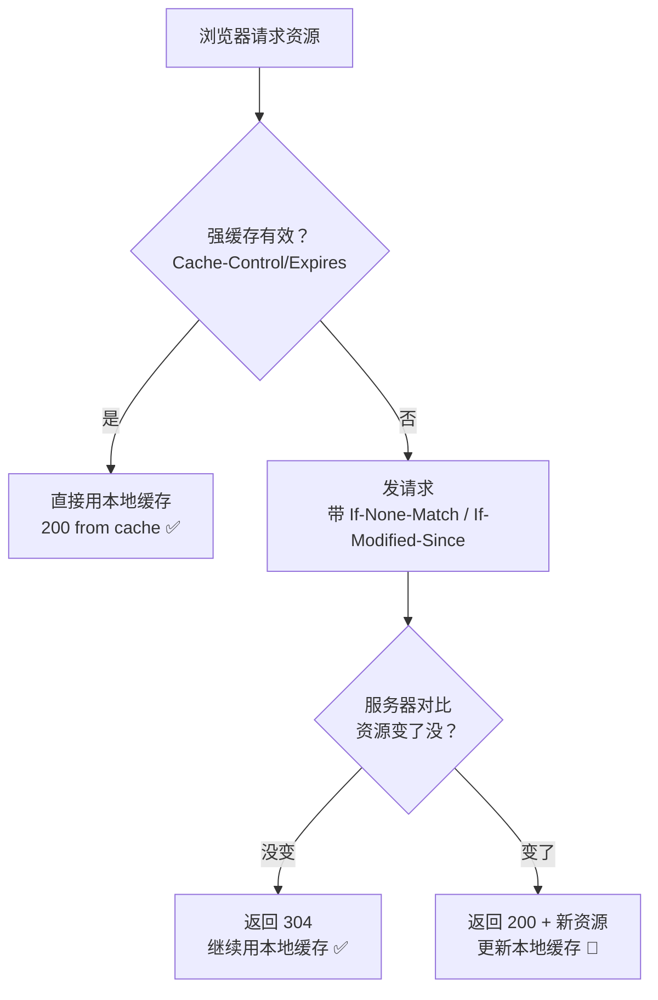

# HTTP缓存强缓存与协商缓存
## HTTP缓存（强缓存与协商缓存·补充）

> 本篇是 [[19-HTTP基础|HTTP基础]] 与 [[35-HTTP强缓存与协商缓存|强缓存 vs 协商缓存]] 的**补充速览**，请求头速查已并入 [[19-HTTP基础|HTTP基础]]，深度原理看上面两篇。

### 4.1 HTTP缓存（减少请求，提速）

> 两类缓存，靠请求头+响应头配合控制。

#### 1）强缓存（不发请求）

> 资源没过期，**直接读本地文件**，连请求都不发。状态码 `200 (from cache)`。

**控制头：**
- `Cache-Control: max-age=3600`（缓存1小时，优先级高）
- `Expires: Thu, 01 Jan 2025 00:00:00 GMT`（过期时间点，已过时）

#### 2）协商缓存（发请求校验）

> 强缓存过期了，发请求**问服务器**资源更新没。
> - 未更新 → 返回 **304**，继续用本地缓存
> - 已更新 → 返回 **200 + 新资源**

**两组校验规则：**

| 方式 | 请求头 | 响应头 | 原理 |
| :--- | :--- | :--- | :--- |
| 时间校验 | `If-Modified-Since` | `Last-Modified` | 对比文件最后修改时间 |
| 指纹校验 | `If-None-Match` | `ETag` | 对比文件内容的唯一指纹（MD5等） |

> ETag比修改时间更精准：文件内容微调但修改时间不变，ETag能识别出来。

#### 缓存流程图

#### ❗ 易错点

> **304不是报错，是优化** — 说明缓存还能用，省了重新下载的流量和时间。

---

## 相关链接

- 📋 目录：[[00-计算机网络]]
- 📚 学习清单：[[八股文学习清单]]
- 🔗 [[19-HTTP基础|HTTP基础]] — 请求头与响应头基础
- 🔗 [[35-HTTP强缓存与协商缓存|HTTP强缓存与协商缓存]] — 缓存深度原理（本篇为其补充速览）
- 🔗 [[10-HTTP状态码|HTTP状态码]] — 304 状态码的含义
- 🔗 [[八股文笔记/Redis/06-缓存淘汰策略LRU与LFU|Redis缓存淘汰策略]] — HTTP缓存与Redis缓存的设计思路对比

