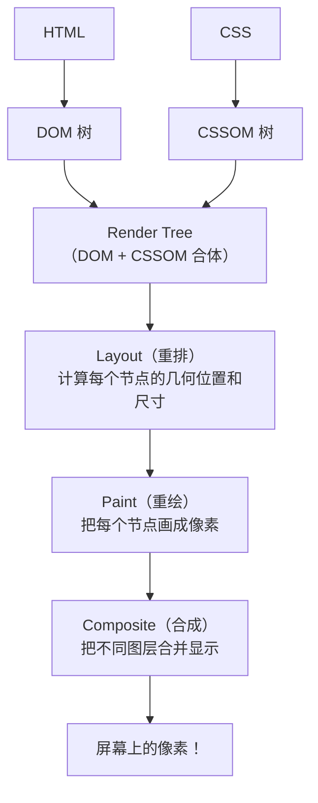
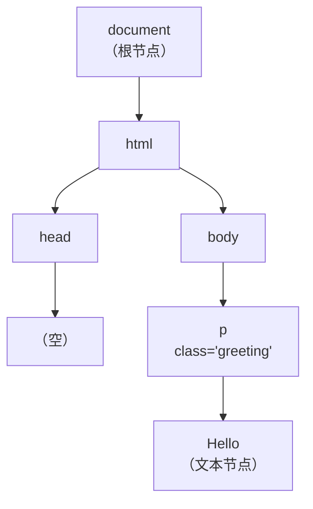
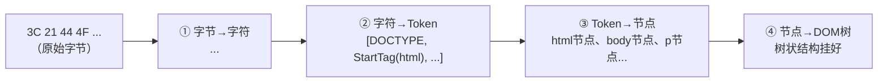
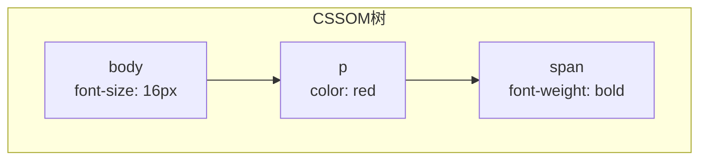
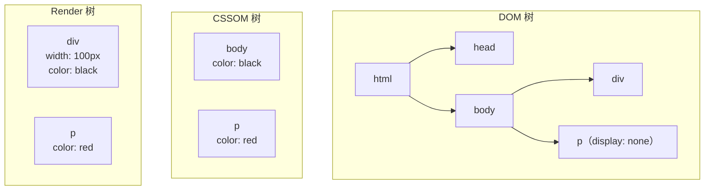

# 浏览器渲染段从HTML到像素
## 第二章：浏览器渲染段——从 HTML 到像素

> **浏览器拿到了 HTML 字节流——下面全是浏览器的活了。**

### 2.0 先忘掉术语——用"做菜"理解渲染全流程

```text
浏览器渲染页面 ≈ 厨师看着菜谱做一道菜。
```

##### 菜谱（HTML）vs 厨房规范（CSS）

| 菜谱（HTML） | 厨房规范（CSS） |
| :--- | :--- |
| 主料：西红柿 × 2 | 规范1：西红柿切成块，边长 2cm |
| 主料：鸡蛋 × 3 | 规范2：鸡蛋打散，加盐 3g |
| 步骤：① 炒鸡蛋 ② 炒西红柿 | 规范3：装盘时西红柿在下面，鸡蛋在上面 |

##### 厨师（浏览器）的处理流程

1. **读菜谱 → 理清结构（DOM 树）**
   - "这道菜用了 2 种主料、2 个步骤"
   - → 就是搞清楚 HTML 里有什么元素、谁套在谁里面

2. **读规范 → 理清规则（CSSOM 树）**
   - "西红柿切块、鸡蛋加盐、装盘顺序"
   - → 就是搞清楚每个元素应该长什么样

3. **菜谱 + 规范 → 完整的做菜方案（Render 树）**
   - 把①的结构和②的规则配对："鸡蛋这个料 → 要打散加盐"
   - ⚠️ 菜谱里写"装饰用香菜"但你决定不放 → 不上桌 → 不在 Render 树
   - → `display:none` 的元素同理——存在但不渲染

4. **算分量 → 定尺寸位置（Layout / 重排）**
   - "鸡蛋块占盘子 60% 的面积，西红柿块占 40%，间距 2cm"
   - → 精确计算每个元素在屏幕上的 x、y、宽、高

5. **动手做 → 实际烹饪（Paint / 重绘）**
   - 切西红柿、打鸡蛋、下锅炒 → 实际生成像素
   - → 把每个元素画出来：背景色 → 边框 → 文字 → 阴影，一层层画

6. **装盘 → 最终呈现（Composite / 合成）**
   - 西红柿铺底、鸡蛋盖上面 → 叠在一起端上桌
   - → GPU 把各个图层按 z-index 叠成最终画面，输出到屏幕

##### 用这个类比理解"为什么重排比重绘贵"

| 类型 | 顾客要求 | 要重来的步骤 | 成本 |
| :--- | :--- | :--- | :--- |
| **重排**（改布局） | "鸡蛋块切大一点" | ④ → ⑤ → ⑥ | 三步全重来！💀 |
| **重绘**（改外观） | "多撒点葱花" | ⑤ → ⑥ | 只重来后两步 ⚠️ |
| **合成**（只改图层） | "盘子转 15 度" | ⑥ | GPU 秒完成 ✅ |

| 做菜 | 浏览器渲染 | 改了会怎样 |
| :--- | :--- | :--- |
| 读菜谱，理清结构 | 解析 HTML → DOM 树 | 页面结构变了 |
| 读规范，理清规则 | 解析 CSS → CSSOM 树 | 样式规则变了 |
| 菜谱+规范→做菜方案 | DOM + CSSOM → Render树 | （自动触发后续步骤） |
| 算分量，定尺寸 | Layout（重排） | 改宽高/位置触发这步 |
| 动手烹饪，实际做菜 | Paint（重绘） | 改颜色/背景触发这步 |
| 装盘，叠在一起 | Composite（合成） | transform 只触发这步 |

### 2.0b 渲染流水线全景（骨架图）



> **一句话讲清**："渲染五步——**解析（DOM / CSSOM）→ 合并（Render Tree）→ 布局（Layout）→ 绘制（Paint）→ 合成（Composite）**。后面三步是性能优化的核心——重排重绘合成各有代价。"

---

### 2.1 第一步：解析 HTML → DOM 树

> **浏览器收到的 HTML 是一串 0 和 1——它怎么从"乱码"变成自己能理解的树？分四步。**

#### 用一段真实的 HTML 走一遍

```text
假设服务器返回了这 3 行 HTML：

  <!DOCTYPE html>
  <html>
    <body>
      <p class="greeting">Hello</p>
    </body>
  </html>
```

```text
服务器返回的原始数据（字节流）：
  3C 21 44 4F 43 54 59 50 45 20 68 74 6D 6C 3E 0A 3C 68 74 6D 6C 3E ...

浏览器根据 HTTP 响应头里的 Content-Type: text/html; charset=utf-8
→ 知道用 UTF-8 编码来解码

解码后变成人能读的字符：
  < ! D O C T Y P E   h t m l > 换行 < h t m l > ...

就是：<!DOCTYPE html>\n<html>\n  <body>\n    <p class="greeting">Hello</p>\n  </body>\n</html>
```

##### 第 2 步：字符 → Token（词法分析——切词）

浏览器逐个字符扫描，碰到 `<` 就知道"开始标签来了"，碰到 `>` 就知道"标签结束了"。

**扫描结果——产出一串 Token：**

| 序号 | Token 类型 | Token 内容 |
| :---: | :--- | :--- |
| ① | DOCTYPE | html |
| ② | StartTag | html |
| ③ | StartTag | body |
| ④ | StartTag | p（附带属性：`class="greeting"`） |
| ⑤ | Character | "Hello"（标签之间的文本也是 Token！） |
| ⑥ | EndTag | p |
| ⑦ | EndTag | body |
| ⑧ | EndTag | html |

**类比——中文分词：**
- "我今天吃饭" → ["我", "今天", "吃饭"]
- `<p>Hello</p>` → [StartTag(p), Character("Hello"), EndTag(p)]

##### 第 3 步：Token → 节点对象（语法分析——搭积木）

浏览器按顺序消费 Token，遇到 StartTag 就创建一个节点对象：

```text
读到 ② StartTag(html)   → 创建 html 节点，压入"待闭合栈"
读到 ③ StartTag(body)   → 创建 body 节点，挂到 html 下面，压入栈
读到 ④ StartTag(p)      → 创建 p 节点（附带 class="greeting"），挂到 body 下面
读到 ⑤ Character(Hello) → 创建文本节点 "Hello"，挂到 p 下面
读到 ⑥ EndTag(p)        → p 标签闭合了，从栈里弹出 p
读到 ⑦ EndTag(body)     → body 闭合，弹出 body
读到 ⑧ EndTag(html)     → html 闭合，弹出 html → 栈空，解析完成
```

##### 第 4 步：节点 → DOM 树（最终产物）

所有节点挂好之后的完整树结构：



这棵树就是 JS 能操作的东西——你在代码里写 `document.querySelector('p.greeting')`，就是在这棵树上按 class 搜节点。

##### 一张图总结四步



> 本质上和"编译原理"里的词法分析→语法分析→AST 是一回事，只不过 HTML 解析的产物叫 DOM 树而不是 AST。

**关键细节：DOM 解析是渐进的——浏览器边下载边解析，不是等整个 HTML 下完才开始。** 但遇到 `<script>` 时会暂停 DOM 解析（因为 JS 可能 `document.write()` 修改 HTML）。

---

### 2.2 第二步：解析 CSS → CSSOM 树

```text
CSS 解析比 DOM 解析更"阻塞"——CSS 是渲染阻塞资源。

浏览器必须等整个 CSS 文件解析完 → 构建 CSSOM → 才能继续渲染。

为什么？
  如果浏览器一边加载 CSS 一边渲染 → 页面样式会一直变（闪烁）
  → 用户看到的是丑陋的"未样式内容闪烁"（FOUC）

  CSSOM 构建完之前，浏览器不会渲染任何内容。
```



---

### 2.3 第三步：合并 → Render 树

```text
DOM 树 + CSSOM 树 → Render 树

规则：
  ✅ DOM 里的可见节点 → 带着 CSSOM 里的样式 → 进入 Render 树
  ❌ <head> → 不渲染 → 不在 Render 树
  ❌ display: none → 不在 Render 树（Layout 直接跳过）
  ❌ <script> → 不渲染 → 不在 Render 树
  ⚠️ visibility: hidden → 在 Render 树！占着坑，只是看不见
```



- `display:none` 的 p → 不在 Render 树 ❌
- `<script>` → 不在 Render 树 ❌
- `<head>` → 不在 Render 树 ❌

---

### 2.4 第四步：Layout（布局 / 重排）——算位置和尺寸

```text
Render Tree 里每个节点都带着样式，但还不知道"放在屏幕哪个位置"。

Layout 做的事：
  ① 从根节点开始，计算每个节点的几何信息
     → 宽度、高度、x、y、margin、padding、border
  
  ② 盒子模型计算 → 内容区 + 内边距 + 边框 + 外边距
  
  ③ 文档流 → 块级元素独占一行，行内元素排成一行
  
  ④ 百分比 → 转成绝对像素值

Layout 的结果 = "Layout Tree"（或叫 Box Tree）
每个节点都确定了在屏幕上的精确位置和大小。
```

---

### 2.5 第五步：Paint（绘制 / 重绘）——画像素

```text
Layout 算好了位置 → Paint 开始画

Paint 做的事：
  ① 把 Layout 结果变成屏幕上的像素
  ② 按层绘制——先画背景 → 再画边框 → 再画文字 → 再画阴影
  ③ 生成"绘制指令"（drawing commands）交给合成线程

Paint 的结果 = 一堆"绘制层"（Layer）
```

---

### 2.6 第六步：Composite（合成）——GPU 拼图层

```text
浏览器把页面拆成多个图层：
  → 根图层（root layer）
  → transform: translateZ(0) 提升的图层
  → will-change 提升的图层
  → <video> / <canvas> 自己的图层

每个图层独立绘制 → 合成线程把它们拼在一起 → 交给 GPU → 输出到屏幕

为什么分图层？
  → 某些图层变了，只重绘那个图层 → 不用全页面重排重绘
  → transform/opacity 只触发合成 → 不走 Layout 和 Paint → 60fps 丝滑
```

---

## 相关链接

- 📋 目录：[[00-计算机网络]]
- 📚 学习清单：[[八股文学习清单]]
- 🔗 [[14-浏览器输入URL到页面展示|浏览器输入URL到页面展示]] — 完整流程（含网络段）
- 🔗 [[18-网络段从输入URL到收到响应|网络段]] — 渲染段之前的网络段

