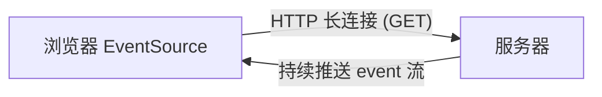
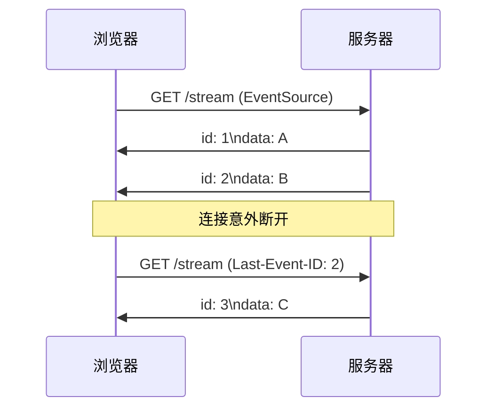

# SSE 服务器推送
## 一句话总结

> **SSE（Server-Sent Events）= 服务器通过一条普通的 HTTP 长连接，单向、持续地把数据"推"给浏览器。浏览器只收，不主动发。**

---

## 一、SSE 是什么

- 基于 **HTTP** 的单向通信技术：只能 **服务器 → 浏览器**。
- 使用 `text/event-stream` 媒体类型，数据以纯文本流形式持续发送。
- 浏览器原生提供 **EventSource** API，几行代码就能用，无需手动解析帧。



> 像什么？你订了报纸，邮局每天把新报纸塞进你家信箱（单向），你不用每次都跑去邮局问"有新报纸吗"。

---

## 二、基本用法（浏览器侧）

```javascript
const es = new EventSource("/api/stream");
es.onmessage = (e) => {
  console.log("收到消息:", e.data);
};
es.addEventListener("custom", (e) => {
  console.log("自定义事件:", e.data);
});
```

服务器每发一段，格式形如（`\n\n` 表示一条 event 结束）：

```text
data: 第一条消息\n\n
event: custom\ndata: 自定义内容\n\n
```

---

## 三、断线重连（SSE 的强项）

SSE 自带 **自动重连** 机制，这是它相比裸 WebSocket 的一大优势：

- 连接断开后，浏览器 **自动重新发起** EventSource 连接，无需手写重连逻辑。
- 服务器可发送 `id: <序号>` 字段标记每条消息。
- 重连时浏览器自动带上 **`Last-Event-ID`** 请求头，服务器可据此 **断点续传**，只补发丢失之后的消息。



---

## 四、常问：SSE vs WebSocket

| 维度 | SSE | WebSocket |
| :--- | :--- | :--- |
| 通信方向 | 单向（服务器→浏览器） | 全双工（双向） |
| 底层协议 | 普通 HTTP（长连接） | HTTP 升级（101）后独立帧协议 |
| 浏览器 API | 原生 EventSource | 需手写或库（如 ws） |
| 断线重连 | **内置自动重连 + Last-Event-ID** | 需手写指数退避重连 |
| 数据格式 | 文本流（text/event-stream） | 文本帧 / 二进制帧 |
| 适用场景 | 消息通知、日志流、行情推送 | 聊天、协同编辑、游戏 |

> **怎么选**：只需要服务器推 → SSE 更简单（自带重连）；需要双向通信 → WebSocket。

---

## 相关链接

- 📋 目录：[[00-计算机网络]]
- 📚 学习清单：[[八股文学习清单]]
- 🔗 [[31-WebSocket全双工通信|WebSocket]] — SSE 是"阉割版"的单向推送，WebSocket 是双向
- 🔗 [[14-浏览器输入URL到页面展示|URL到页面展示]] — 推送场景的网络基础
- 🔗 HTTP版本演进 — SSE 基于 HTTP/1.1 长连接
