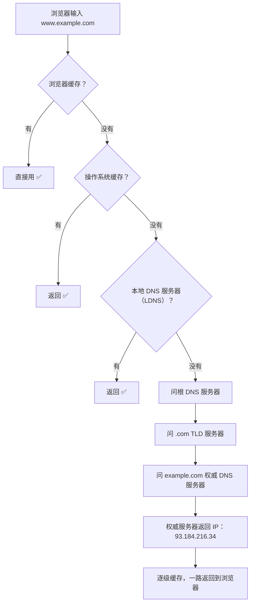

# DNS 解析过程

## 一句话总结

> **你在浏览器输入 example.com → 浏览器一层层问过去，直到找到这个域名对应的 IP。像查户口：先问自己记不记得（缓存）→ 不记得问本地村长（本地 DNS）→ 村长不记得问省厅（根/顶级/权威 DNS）→ 一层层往上问，直到找到答案。**

---

## 🌰 你在浏览器输入 example.com 发生了什么

### 先搞清楚问题

你输入 example.com，回车。
浏览器要发 HTTP 请求，但不知道发给谁。
因为它只知道域名，不知道 IP 地址。

没有 IP 地址，连 TCP 三次握手都做不了。

所以第一步永远是：找到这个域名对应的 IP。这个过程就是 DNS 解析。

> **像什么？** 你想给朋友寄快递。你只知道他叫"张三"（域名），但不知道他家地址（IP）。快递员没法送。你查了一下通讯录，找到"张三 → 北京市朝阳区xxx"（IP）。然后才能寄。

---

## 一、DNS 解析的完整过程（层层递进）

你输入 `www.example.com`，回车。

**第一步：浏览器缓存**
- 浏览器先问自己："我之前查过 www.example.com 吗？"
- 查过 → 直接用缓存里的 IP ✅
- 没查过 → 继续问

**第二步：操作系统缓存**
- 浏览器没找到 → 问操作系统："你知道 www.example.com 的 IP 吗？"
- 操作系统查自己的 DNS 缓存
- 有 → 返回给浏览器 ✅
- 没有 → 继续问

**第三步：本地 DNS 服务器（LDNS）**
- 操作系统 → 问本地 DNS 服务器
- 本地 DNS 服务器一般是你的网络运营商提供的（电信、移动、联通），或者你手动设的（114.114.114.114、8.8.8.8）
- 本地 DNS 服务器查自己的缓存
- 有 → 返回 ✅
- 没有 → 继续往上问

> 本地 DNS 服务器一般离你很近（同城），延迟很低。

**第四步：根 DNS 服务器**
本地 DNS 服务器不知道 → 问根 DNS 服务器。

全球有 13 组根 DNS 服务器。它们不知道每个域名的具体 IP。它们只告诉你一件事：".com 的服务器在哪。"

根服务器回："www.example.com 是 .com 结尾的。.com 的权威 DNS 服务器地址是 a.iana-servers.net。"

**第五步：顶级域名 DNS 服务器（TLD）**
本地 DNS 服务器 → 问 .com 的 DNS 服务器。

.com 服务器也不知道 www.example.com 的具体 IP。它只告诉你："example.com 这个域名的权威 DNS 服务器在哪。"

.com 服务器回："example.com 的权威 DNS 服务器是 dns.example.com。"

**第六步：权威 DNS 服务器**
本地 DNS 服务器 → 问 example.com 的权威 DNS 服务器。

权威 DNS 服务器是域名所有者（比如 example.com 的管理员）配置的，它知道这个域名下所有记录的真正答案。

权威服务器回："www.example.com 的 IP 是 93.184.216.34"

**第七步：返回结果 + 逐级缓存**

本地 DNS 服务器拿到 93.184.216.34：
1. 把这个结果缓存起来（设一个 TTL，比如 600 秒）
2. 返回给你的操作系统

操作系统也缓存一份。

浏览器拿到 93.184.216.34 → 开始 TCP 三次握手 → 发 HTTP 请求

### 画成流程图



---

## 二、DNS 用 UDP 还是 TCP？

### 平时为什么用 UDP？

你查一个域名：你问"www.example.com 的 IP 是啥？"（几十字节），DNS 回"93.184.216.34"（十几个字节）。

一问一答，数据很小。为什么要像 TCP 那样先建连接再发？没必要。

**UDP 就够了：**
你问 → DNS 回 → 你拿到结果。一次搞定，不用三次握手，不用四次挥手。快。

> **像什么？**
> 你路过前台，随口问："王经理在哪个办公室？" 前台："301。" 你："好的。" 说完就走了。不需要登记、不需要握手。
>
> 如果非要用 TCP：
> 你："你好，我们可以开始对话吗？"（SYN）→ 前台："可以。"（SYN+ACK）→ 你："好，开始了。"（ACK）→ 你："王经理在哪个办公室？" → 前台："301。" → 你："好的，对话结束。"（FIN）→ 前台："好的，再见。"（FIN）→ 你："再见。"（ACK）
> 为了问一句话，来回 7 步。

所以 DNS 默认用 UDP，省掉建连开销。端口 53。

### 什么时候切成 TCP？

大部分情况 UDP 够了。但有两种情况不够。

**情况一：回答太长了，UDP 装不下。**

UDP 的一个包最多装 512 字节（DNS 的经典限制）。大部分查询的回答只有几十字节，没事。

但如果这个域名配了很多记录：多组 IP、一大段 TXT 验证文本、长长的一串 MX 记录……回答加起来超过 512 字节了。

怎么办？DNS 服务器的回应里设一个"截断"标记（TC=1）："我这回答太长了，UDP 塞不下。你用 TCP 重新查一次吧。"

客户端收到标记后，用 TCP 重新发同样的查询。TCP 没有 512 字节的限制，想回多长回多长。

> **像什么？** 你路过前台问路，前台说："这个地址很长，我背不出来。你拿纸笔来，我写给你。" 你拿了纸笔（建 TCP 连接），前台才把完整地址写给你。

**情况二：DNS 服务器之间同步数据（区域传输）。**

主 DNS 服务器要把全部数据复制到从 DNS 服务器。可能有几千条记录，数据量很大。

用 UDP 发？可能丢包、可能乱序、可能丢一半。两台服务器数据就不一致了。

这种场景必须用 TCP：丢了能重传 → 保证完整；按顺序到达 → 保证不乱。

> **像什么？** 你要把一整本通讯录从旧手机传到新手机。你不会一条一条念（UDP 慢慢传，还可能传错），而是用数据线连起来（TCP），整本完整复制过去。

### 总结

日常查 IP → UDP（快就完了，一问一答几十分之一秒）
回答太长 → 切成 TCP（UDP 装不下，换 TCP 一次传完）
服务器同步 → 必须 TCP（数据多，丢了重传保证完整）

## 三、DNS 缓存

每级都有缓存，为的就是少往上问。

**浏览器缓存：** 浏览器自己记。几秒到几分钟（取决于 TTL）。Chrome 看缓存：`chrome://net-internals/#dns`

**操作系统缓存：** 操作系统记的。所有应用共享。Windows 看缓存：`ipconfig /displaydns`

**本地 DNS 服务器缓存：** 运营商 DNS 服务器记的。用户越多共享，命中率越高。一个用户查了一次，同运营商的其他用户就不用再查了。

**TTL（Time To Live）：** 每条 DNS 记录都有一个 TTL（比如 600 秒）。告诉缓存："这记录 600 秒内有效，过期了重新查。"
- TTL 太短 → 每次都要查源站，慢
- TTL 太长 → 域名换了 IP，用户还在用旧 IP 访问不到
- 一般网站 TTL 设 300~600 秒（5~10 分钟）
- 要做域名迁移时，提前把 TTL 改短（比如 60 秒），等旧记录过期了再切，用户不受影响

---

## 四、DNS 记录类型

DNS 不只是一个"域名→IP"的翻译器。它是一本电话簿，上面可以记各种信息。不同类型的记录记不同的东西。

### A 记录——最基础，域名→IPv4 地址

你说一个域名，DNS 告诉你一个 IP。

```text
www.example.com → 93.184.216.34
```

这就是 DNS 最主要干的事。"这个域名在哪个服务器上？"

A = Address（地址）。只记 IPv4 地址（像 192.168.1.1 这种四组数字的）。

### AAAA 记录——域名→IPv6 地址

跟 A 记录完全一样，只是记的是 IPv6 地址（更长的那套）。

```text
www.example.com → 2001:db8::1
```

为什么叫 AAAA（四个 A）？因为 IPv6 地址比 IPv4 长得多，A 记录不够用了，用四个 A 表示"这是新一代的地址记录"。

### CNAME 记录——域名→另一个域名（别名）

不直接告诉 IP，而是说"这个域名等于另一个域名"。

```text
blog.example.com → example.com
```

当用户访问 blog.example.com 时，DNS 说："blog.example.com 就是 example.com，你去查 example.com 的 IP 吧。"

**常用于：**

1. **一个网站有多个域名**
   - `example.com` 和 `www.example.com` 指向同一个网站
   - 你配一条：`www.example.com → example.com`（CNAME）
   - 再配一条：`example.com → 93.184.216.34`（A 记录）
   - 以后换服务器，只改 example.com 的 A 记录，www.example.com 自动跟着走

2. **CDN**
   - 你的网站 example.com 用了 Cloudflare CDN
   - DNS 配的是：`example.com → something.cloudflare.com`（CNAME）
   - 用户查 example.com 的 IP 时，DNS 实际上是查到 Cloudflare 的服务器 IP
   - 流量先经过 CDN，CDN 再把内容给你

> **像什么？** A 记录 = 公司通讯录上直接写着"张三 → 北京市朝阳区xx号"。CNAME 记录 = 写着"张三 → 去问李四，李四知道他在哪"。

### MX 记录——域名→邮件服务器

告诉全世界："发到这个域名的邮件，送到哪个服务器去。"

```text
example.com → mail.example.com
```
（发到 xxx@example.com 的邮件，送到 mail.example.com）

**优先级：** 一个域名可以配多个 MX 记录，带优先级数字。

```text
example.com → mail.example.com（优先级 10）
example.com → backup.example.com（优先级 20）
```

邮件发送方先试优先级小的（10），如果 mail.example.com 收不到，再试优先级大的（20）backup。

> **像什么？** 你搬家了。你在邮局登记："寄到张三的信，先送到 xx路1号（优先级高），如果没人收，再送到 xx路2号（优先级低）。"

### NS 记录——域名→这个域名的"管家"

告诉全世界："这个域名的所有记录，去问谁。"

```text
example.com → dns.example.com
```

用户查 www.example.com 时，根 DNS → .com TLD DNS → .com 说："example.com 的权威 DNS 是 dns.example.com，去问它。"

dns.example.com 就是 example.com 的"管家"。这个域名的 A 记录、MX 记录、CNAME 记录全部由它说了算。

> **像什么？** 你要查一家公司的信息。你问工商局（根 DNS），工商局说："这家公司归海淀区工商局管（NS 记录），你去问他们。" 你去问海淀区工商局（权威 DNS），拿到公司的详细资料。

### TXT 记录——贴一张"便利贴"

不翻译任何东西，就是存一段文本。你可以往里面写任何你想写的内容。

**干什么用？**

**场景一：证明"这个域名是我的"**

你要给 example.com 申请 SSL 证书（HTTPS 那个证书）。CA（证书颁发机构）要确认这个域名真的是你的。

CA 说："你在 example.com 的 DNS 里加一条 TXT 记录，内容写 'ca-verification=abc123'。"

你照做了。CA 去查 example.com 的 TXT 记录，看到确实有 'ca-verification=abc123'。
→ 证明你确实有管理这个域名的权限
→ CA 才给你签发证书

**场景二：防垃圾邮件**

你收到一封来自 xxx@example.com 的邮件。你的邮件服务器去查 example.com 的 TXT 记录：
```text
v=spf1 include:_spf.google.com ~all
```

意思："这个域名发的邮件应该来自 Google 的邮件服务器。"

如果发件 IP 不是 Google 的 → 这封邮件可能是假的 → 标记为垃圾邮件。

> **像什么？** 你在大楼门口贴了一张便利贴："送快递的请放前台"（给快递员看的说明）。路过的人都能看到这张便利贴。它不是地址（A 记录），也不是邮局（MX 记录），就是一段额外的文字说明。

---

## 五、DNS 常问

### 你访问一个网站慢，怎么排查是不是 DNS 问题？

场景：你打开 example.com，等了很久才加载出来。或者直接打不开。

怎么知道是不是 DNS 的问题？三步走。

**第一步：手动查一下 DNS**

打开命令行（cmd），敲：
```text
nslookup example.com
```

正常情况下它应该很快（几毫秒）返回一个 IP。

**看什么？**

1. "Server: Unknown" 或者解析超时 → DNS 服务器本身有问题，响应慢或者连不上
2. 返回的 IP 不对 → 比如 example.com 应该返回 93.184.216.34，但返回了 127.0.0.1（本机地址）或其他奇怪的 IP → 你的 DNS 可能被劫持了。你访问 example.com 实际打开的是别的网站
3. 等了 5 秒才出结果 → DNS 服务器响应慢。每次访问网站都要先等 5 秒查 DNS

**第二步：换一个 DNS 服务器再试试**

先搞懂"默认 DNS"和"公共 DNS"是什么。

你连上网络的时候（WiFi 或插网线），操作系统会自动拿到一个 DNS 服务器地址。这个一般是你的网络运营商（电信、移动、联通）给的。你不手动改的话，操作系统就用这个。

你的电脑查域名 → 默认发给这个运营商给的 DNS 服务器。所以你的 DNS 查询速度完全取决于这台服务器的快慢。如果它慢了或坏了，你所有网站打开都慢。

**怎么确认？**

打开命令行，先不加参数查一次：
```text
nslookup example.com
```
→ 返回了 IP（比如 93.184.216.34），但花了 2 秒才出来。

然后后面加一个 IP 参数，手动指定用另一台 DNS 查：
```text
nslookup example.com 114.114.114.114
```
→ 几毫秒就返回了结果。

两行命令的区别：第一行用你默认的 DNS 查（运营商的）。第二行用 114.114.114.114 查（公共的，不是你运营商的）。

如果第二行很快，第一行很慢：
→ 你运营商的 DNS 有问题
→ 去网络设置里把 DNS 改成 114.114.114.114 就好了

**常用的公共 DNS（相当于免费的、更好用的"查号台"）：**
- 114.114.114.114（国内用，快）
- 8.8.8.8（Google 的，全球通用，但国内可能慢）
- 223.5.5.5（阿里的，国内快）

**第三步：清本地缓存**

有时候你之前查过 example.com，结果是旧的。比如 example.com 前几天换了服务器（IP 变了），但你本机还缓存着旧 IP。你访问的还是旧服务器。

清缓存：`ipconfig /flushdns`

清完再试一次 nslookup，看是不是拿到新 IP 了。

**总结：**
1. 查，看是不是 DNS 本身慢或返回了错误 IP
2. 换 DNS 服务器，看是不是运营商的问题
3. 清缓存，看是不是本地记了旧 IP

### DNS 劫持是什么？

你用运营商的 DNS 查 example.com。正常应该返回 93.184.216.34。但运营商在 DNS 服务器上改了记录：返回了 10.0.0.1（运营商的广告页面 IP）。

你访问 example.com → 实际打开的是广告页面。这叫 **DNS 劫持**。

**解法：**
1. 用公共 DNS（114.114.114.114、8.8.8.8）。但运营商的 DNS 请求可能会被中间人劫持
2. 用 **DNS over HTTPS（DoH）**。DNS 查询走 HTTPS 加密，中间人看不懂，劫持不了。Chrome 和 Firefox 默认支持 DoH

### 你改了 DNS 解析为什么没生效？

你刚把 example.com 的 IP 从 1.1.1.1 改成 2.2.2.2。自己访问还是 1.1.1.1。

因为缓存还没过期（TTL 还没到）。你查的时候，本地 DNS 服务器返回了缓存的旧记录。等 TTL 到期了，它重新去权威服务器查，才能拿到新记录。

所以做域名迁移之前，先把 TTL 改小（比如 60 秒），等个几分钟，再改 IP。这样切得快。

---

## 一句话讲清

> **延伸提问："DNS 解析过程说一下。"**
>
> "从浏览器输入域名到拿到 IP，一共经过七步。
>
> 先查浏览器缓存、再查操作系统缓存、再查本地 DNS 服务器。三层缓存都没命中，本地 DNS 服务器开始递归查询。
>
> 先问根 DNS 服务器（得到顶级域名的地址），再问顶级域名 DNS 服务器（得到权威 DNS 服务器的地址），最后问权威 DNS 服务器（得到真正的 IP）。
>
> 拿到 IP 后逐级缓存，返回给浏览器。
>
> 整个过程大部分用 UDP（快），响应太大时才用 TCP。
>
> DNS 劫持就是运营商在你查询的时候改了你的结果。用 DoH（DNS over HTTPS）可以防劫持。"

---

## 记忆口诀

> **七步查 IP：浏览器缓存→操作系统缓存→本地 DNS→根 DNS→TLD DNS→权威 DNS→返回。**
> **每级都有缓存，为的是少往上问。**
> **默认走 UDP，响应太大才切 TCP。**
> **TTL 控制缓存时间，迁域名前先改小 TTL。**
> **DNS 劫持 = 运营商改你的查询结果。防劫持用 DoH（加密 DNS 查询）。**

## 相关链接

- 📋 目录：[[00-计算机网络]]
- 📚 学习清单：[[八股文学习清单]]
- 🔗 [[14-浏览器输入URL到页面展示|浏览器输入URL到页面展示]] — DNS 解析是 URL 输入到页面展示的第一步
- 🔗 [[36-CDN原理与DNS调度|CDN原理与DNS调度]] — CDN 基于 DNS 调度实现就近访问
- 🔗 [[01-OSI七层与TCP_IP四层|OSI七层模型]] — DNS 属于应用层协议
