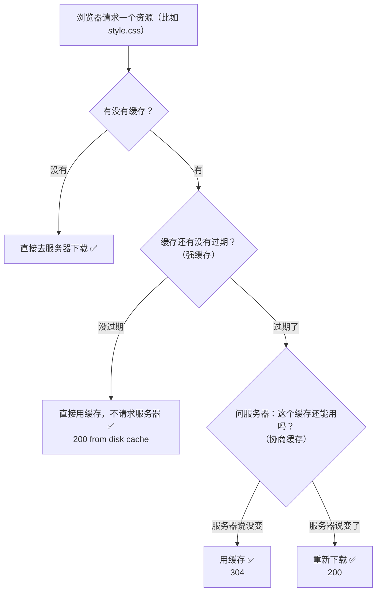

# 强缓存 vs 协商缓存

## 一句话总结

> **强缓存是浏览器自己说了算——过期时间内直接用缓存，不跟服务器打招呼。协商缓存是浏览器问服务器"我这个缓存还能用吗"——服务器说行就用，不行就重新下载。强缓存快但可能用旧数据，协商缓存慢一点但保证最新。**

---

## 🌰 先搞懂：浏览器为什么要缓存

你打开一个网页，里面有一张图片 logo.png。

第二次打开同一个网页。如果每次都要重新下载这张图片，那你每次打开网页都要等几秒。

实际上：
- 第一次打开：下载 logo.png（200ms）
- 第二次打开：浏览器直接从硬盘加载缓存的 logo.png（5ms）
- 快了 40 倍

缓存的核心作用就一个：已经下载过的资源，不要重复下载。

### 两种缓存的工作流程



---

## 一、强缓存（不需要问服务器）

强缓存 = 浏览器自己判断："这个文件还没过期，直接用。"

整个过程完全不和服务器通信。浏览器看到过期时间还没到，直接从本地磁盘加载。速度最快，因为连网络请求都没发。

> **像什么？** 你家的冰箱里有昨天的剩饭。你看了一眼生产日期，今天没过期。直接拿出来热了就吃（强缓存）。不用打电话问饭店"这饭还能吃吗"。

### 强缓存怎么控制？

服务器在返回 HTTP 响应时，通过响应头告诉浏览器缓存多久。

**方式一：Expires（HTTP/1.0）**

```text
Expires: Wed, 09 Jul 2026 12:00:00 GMT
```
→ "这个资源在 2026 年 7 月 9 日 12 点之前都有效"

问题：用的是绝对时间。服务器和浏览器时钟不一致 → 缓存可能提前过期或过期了还在用。

**方式二：Cache-Control（HTTP/1.1，现在都用这个）**

```text
Cache-Control: max-age=3600
```
→ "这个资源从你收到开始算 1 小时内有效"

用的是相对时间（从你拿到的那一刻开始算）。不管你在哪个时区，从你拿到开始倒计时 3600 秒。不依赖服务器和客户端时间一致。

现在一般不用 Expires 了，都用 Cache-Control: max-age。

### 强缓存生效时你看到什么？

打开浏览器开发者工具（F12）→ Network 标签。

看到某个请求的 Status 是：
- `(disk cache)` ← 从硬盘缓存的
- `(memory cache)` ← 从内存缓存的
- `(from cache)` ← 强缓存命中，根本没有发请求

Size 那一列显示：`from disk cache` 或 `from memory cache`。大小是 0（因为没有从网络下载）。

---

## 二、协商缓存（需要问服务器）

强缓存过期了，或者你设了 no-cache。浏览器不确定缓存还能不能用。于是问服务器："我这个缓存版本还能用吗？"

- 如果服务器说"没变"：返回 304 Not Modified。不返回资源本身（省流量）。浏览器用自己的旧缓存
- 如果服务器说"变了"：返回 200 OK + 新的资源内容。浏览器用新的，更新缓存

### 协商缓存有两种问法

#### 方式一：按时间问（Last-Modified / If-Modified-Since）

服务器第一次返回资源时，在响应头里带上最后修改时间：

```text
Last-Modified: Wed, 08 Jul 2026 10:00:00 GMT
```
→ "这个文件最后修改时间是 2026 年 7 月 8 日 10 点"

浏览器把这个时间记下来。强缓存过期后，浏览器发请求时带上：

```text
If-Modified-Since: Wed, 08 Jul 2026 10:00:00 GMT
```
→ "这个文件在 2026 年 7 月 8 日 10 点之后有没有改过？"

**服务器：**
- 没改过 → 304（用缓存）
- 改过了 → 200 + 新文件

**问题：**
1. 时间精度是秒。1 秒内改了两次，判断不出来
2. 文件没改但服务器迁移了，时间变了，重新下载

#### 方式二：按指纹问（ETag / If-None-Match）

服务器第一次返回资源时，给这个资源算一个"指纹"（哈希值）：

```text
ETag: "abc123xyz"
```
→ "这个文件的指纹是 abc123xyz"

指纹 = 对文件内容做哈希。内容变了，指纹就变。内容没变，指纹永远一样。

浏览器把这个指纹记下来。强缓存过期后，浏览器发请求时带上：

```text
If-None-Match: "abc123xyz"
```
→ "这个文件的指纹还是 abc123xyz 吗？"

**服务器：**
- 指纹没变 → 304（文件没改过，用缓存）✅
- 指纹变了 → 200 + 新文件 + 新 ETag ✅

比 Last-Modified 精确（指纹变才是真变了）。

### 为什么两种都要？

ETag 更精确，但不是每个服务器都支持。所以 HTTP 标准让两者并存：

服务器同时返回 Last-Modified 和 ETag。浏览器同时发 If-Modified-Since 和 If-None-Match。服务器优先检查 ETag。ETag 一致再看 Last-Modified（或者只看 ETag）。

两种都带上，兼容所有服务器。

---

## 三、对比总结

| | 强缓存 | 协商缓存 |
| :--- | :--- | :--- |
| **要不要发请求** | 不请求服务器，浏览器自己判断 | 要请求服务器，问服务器"能用吗" |
| **状态码** | 200（from cache） | 304（Not Modified） |
| **控制头** | Cache-Control: max-age=3600 / Expires | ETag / Last-Modified + If-None-Match / If-Modified-Since |
| **速度** | 最快（没网络请求） | 中等（有请求但没下载资源） |
| **数据新鲜度** | 可能用旧的（过期时间内不验证） | 永远是最新的（服务器确认过） |
| **像什么** | 冰箱里的剩饭，看日期没过期就吃 | 打电话问饭店"这剩饭还能吃吗" |

---

## 四、Cache-Control 的其他指令

不只 max-age，还有别的控制方式：

| 指令 | 含义 | 说明 |
| :--- | :--- | :--- |
| `no-cache` | 每次都要问服务器缓存能不能用 | 不是不缓存，是每次都要协商 |
| `no-store` | 完全不缓存 | 适合银行卡号、密码等敏感数据 |
| `public` | 谁都可以缓存 | 浏览器、CDN、代理服务器都能存 |
| `private` | 只有浏览器可以缓存 | CDN 和代理不能存，适合用户个人信息 |
| `must-revalidate` | 缓存过期后必须去服务器验证 | 不能用过期的 |

---

## 五、实际项目中怎么配

不同的资源用不同的缓存策略。

| 资源类型 | 缓存策略 | 说明 |
| :--- | :--- | :--- |
| **HTML** | `Cache-Control: no-cache` | 时效性最强，每次都要最新的 |
| **CSS / JS**（带哈希文件名） | `Cache-Control: max-age=31536000`（一年） | 内容变了文件名就变，强缓存一年 |
| **图片 / 字体** | `Cache-Control: max-age=2592000`（一个月） | 一般不频繁变 |
| **API 接口** | `Cache-Control: no-store` | 数据实时性高，不缓存 |

---

## 一句话讲清

> **延伸提问："强缓存和协商缓存有什么区别？"**
>
> "强缓存是浏览器自己判断——缓存没过期就直接用，不发任何网络请求。最快。控制头是 Cache-Control: max-age。
>
> 协商缓存是强缓存过期后，浏览器发请求问服务器'我这个缓存还能用吗'。服务器返回 304 就说继续用，返回 200 就说已经更新了，下载新的。控制头是 ETag / If-None-Match 和 Last-Modified / If-Modified-Since。
>
> 强缓存快但可能用旧数据，协商缓存慢一点但永远最新。两者配合使用：强缓存覆盖大部分时间，过期后再用协商缓存验证。"

---

## 记忆口诀

> **强缓存 = 没过期直接用，不发请求。Cache-Control: max-age 控制。**
> **协商缓存 = 过期了问服务器，304 继续用旧，200 下载新的。ETag 按指纹判断。**
> **强缓存快但可能旧，协商缓存新但慢一点。两者配合用。**
> **no-cache 不是不缓存，是不用强缓存，每次都要协商。no-store 才是不缓存。**


## 相关链接

- 📋 目录：[[00-计算机网络]]
- 📚 学习清单：[[八股文学习清单]]
- 🔗 [[17-HTTP缓存强缓存与协商缓存|HTTP缓存（补充）]] — 缓存补充笔记，更深入细节
- 🔗 [[14-浏览器输入URL到页面展示|浏览器输入URL到页面展示]] — 缓存策略在全流程中的位置
- 🔗 [[10-HTTP状态码|HTTP状态码]] — 304 状态码与协商缓存的关系
