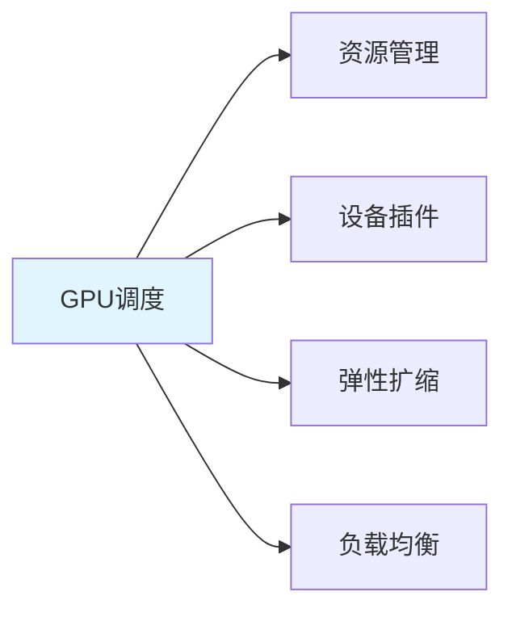

---

title: "GPU 调度原理（nvidia-device-plugin）+ 弹性扩缩容"

tags:

  - k8s

  - 技术学习

  - 学习笔记

created: "2026-07-21"

---

# GPU 调度原理（nvidia-device-plugin）+ 弹性扩缩容

> **一句话**：GPU调度是K8s中管理GPU资源的关键技术，通过nvidia-device-plugin可以将GPU资源暴露给K8s调度器。弹性扩缩容可以根据负载动态调整GPU Pod数量。

## 1. GPU调度基础
### 1.1 什么是GPU调度？



**GPU调度**：K8s中管理GPU资源的技术，包括资源发现、分配、监控和扩缩容。

### 1.2 nvidia-device-plugin

```yaml

# nvidia-device-plugin DaemonSet

apiVersion: apps/v1

kind: DaemonSet

metadata:

  name: nvidia-device-plugin-daemonset

  namespace: kube-system

spec:

  selector:

    matchLabels:

      name: nvidia-device-plugin-ds

  template:

    metadata:

      labels:

        name: nvidia-device-plugin-ds

    spec:

      tolerations:

      - key: nvidia.com/gpu

        operator: Exists

        effect: NoSchedule

      containers:

      - name: nvidia-device-plugin-ctr

        image: nvcr.io/nvidia/k8s-device-plugin:v0.14.0

        securityContext:

          allowPrivilegeEscalation: false

        volumeMounts:

        - name: device-plugin

          mountPath: /var/lib/kubelet/device-plugins

      volumes:

      - name: device-plugin

        hostPath:

          path: /var/lib/kubelet/device-plugins

```

## 2. GPU资源管理
### 2.1 GPU资源请求

```yaml

apiVersion: apps/v1

kind: Deployment

metadata:

  name: gpu-app

spec:

  replicas: 2

  selector:

    matchLabels:

      app: gpu-app

  template:

    metadata:

      labels:

        app: gpu-app

    spec:

      containers:

      - name: gpu-app

        image: gpu-app:latest

        resources:

          limits:

            nvidia.com/gpu: 1  # 请求1个GPU

          requests:

            memory: "4Gi"

            cpu: "2"

```

### 2.2 GPU资源类型

| 资源类型 | 说明 |

|----------|------|

| nvidia.com/gpu | GPU设备 |

| nvidia.com/gpu-memory | GPU显存 |

| nvidia.com/gpu-core | GPU核心 |

## 3. 弹性扩缩容
### 3.1 HPA自动扩缩

```yaml

apiVersion: autoscaling/v2

kind: HorizontalPodAutoscaler

metadata:

  name: gpu-app-hpa

spec:

  scaleTargetRef:

    apiVersion: apps/v1

    kind: Deployment

    name: gpu-app

  minReplicas: 1

  maxReplicas: 10

  metrics:

  - type: Resource

    resource:

      name: nvidia.com/gpu

      target:

        type: Utilization

        averageUtilization: 80

  - type: Resource

    resource:

      name: cpu

      target:

        type: Utilization

        averageUtilization: 70

```

### 3.2 GPU使用率监控

```python

import subprocess

import json

def get_gpu_usage():

    """获取GPU使用率"""

    try:

        result = subprocess.run(

            ['nvidia-smi', '--query-gpu=utilization.gpu,memory.used,memory.total', '--format=csv,nounits,noheader'],

            capture_output=True,

            text=True

        )

        lines = result.stdout.strip().split('\n')

        gpus = []

        for line in lines:

            parts = line.split(', ')

            gpus.append({

                'utilization': int(parts[0]),

                'memory_used': int(parts[1]),

                'memory_total': int(parts[2])

            })

        return gpus

    except Exception as e:

        print(f"获取GPU信息失败: {e}")

        return []

```

## 4. 实际案例
### 4.1 AI模型服务部署

```yaml

# ai-model-deployment.yaml

apiVersion: apps/v1

kind: Deployment

metadata:

  name: ai-model-service

spec:

  replicas: 2

  selector:

    matchLabels:

      app: ai-model

  template:

    metadata:

      labels:

        app: ai-model

    spec:

      containers:

      - name: model

        image: ai-model:latest

        ports:

        - containerPort: 8000

        resources:

          limits:

            nvidia.com/gpu: 1

            memory: "8Gi"

            cpu: "4"

          requests:

            memory: "4Gi"

            cpu: "2"

        env:

        - name: MODEL_PATH

          value: "/models/llama-7b"

---

# ai-model-service.yaml

apiVersion: v1

kind: Service

metadata:

  name: ai-model-service

spec:

  selector:

    app: ai-model

  ports:

  - port: 80

    targetPort: 8000

  type: LoadBalancer

---

# ai-model-hpa.yaml

apiVersion: autoscaling/v2

kind: HorizontalPodAutoscaler

metadata:

  name: ai-model-hpa

spec:

  scaleTargetRef:

    apiVersion: apps/v1

    kind: Deployment

    name: ai-model-service

  minReplicas: 2

  maxReplicas: 8

  metrics:

  - type: Resource

    resource:

      name: nvidia.com/gpu

      target:

        type: Utilization

        averageUtilization: 70

```

### 4.2 多GPU任务

```yaml

# multi-gpu-deployment.yaml

apiVersion: apps/v1

kind: Deployment

metadata:

  name: multi-gpu-app

spec:

  replicas: 1

  selector:

    matchLabels:

      app: multi-gpu

  template:

    metadata:

      labels:

        app: multi-gpu

    spec:

      containers:

      - name: app

        image: multi-gpu-app:latest

        resources:

          limits:

            nvidia.com/gpu: 4  # 请求4个GPU

            memory: "32Gi"

            cpu: "8"

```

## 5. 常用命令
### 5.1 GPU资源查看

```bash

# 查看节点GPU资源

kubectl describe node <node-name> | grep nvidia.com/gpu

# 查看Pod GPU使用

kubectl top pod

# 查看nvidia-smi

kubectl exec -it <pod-name> -- nvidia-smi

```

### 5.2 GPU调试

```bash

# 查看nvidia-device-plugin日志

kubectl logs -n kube-system <nvidia-device-plugin-pod>

# 检查GPU设备

kubectl exec -it <pod-name> -- ls /dev/nvidia*

```

## 6. 常见坑点
### 1. GPU资源未暴露

```bash

# 解决：检查nvidia-device-plugin是否运行

kubectl get pods -n kube-system | grep nvidia

```

### 2. GPU显存不足

```yaml

# 解决：减少GPU显存请求或增加显存

resources:

  limits:

    nvidia.com/gpu: 1

    memory: "8Gi"  # 增加显存

```

### 3. GPU利用率低

```yaml

# 解决：调整HPA策略，减少副本数

spec:

  minReplicas: 1

  maxReplicas: 5

```

## 核心要点

```yaml

# GPU资源请求

resources:

  limits:

    nvidia.com/gpu: 1

    memory: "8Gi"

# HPA配置

apiVersion: autoscaling/v2

kind: HorizontalPodAutoscaler

spec:

  scaleTargetRef:

    apiVersion: apps/v1

    kind: Deployment

    name: gpu-app

  minReplicas: 1

  maxReplicas: 10

  metrics:

  - type: Resource

    resource:

      name: nvidia.com/gpu

      target:

        type: Utilization

        averageUtilization: 80

```

## 速记卡（面试闪卡）

**Q1：一句话讲清「GPU 调度原理（nvidia-device-plugin）+ 弹性扩缩容」到底是什么？**

A：K8s 靠 nvidia-device-plugin 把 GPU 暴露成可调度资源，再用 HPA 按负载弹性扩缩 Pod。

**Q2：device-plugin 原理 —— 怎么理解？**

A：device-plugin 是个 DaemonSet，跑在每个 GPU 节点上，把 `/dev/nvidia*` 设备"上报"给 K8s 调度器，让 Pod 能用 `nvidia.com/gpu: 1` 来申请卡。就像小区物业把每栋楼的停车位登记到调度中心，你要用车位就先跟中心报备——这叫 device plugin（设备插件）机制。

**Q3：GPU 资源请求 —— 怎么理解？**

A：在 Pod 的 resources.limits 里写 `nvidia.com/gpu: 1` 就是"要一张卡"，还能细分 `gpu-memory`、`gpu-core`。但 GPU 不能像 CPU 那样切半张——要么整卡，要么多卡。这叫 resource request（资源请求），调度器靠它做节点亲和与 bin-packing。

**Q4：弹性扩缩容 HPA —— 怎么理解？**

A：HPA 盯着 GPU 利用率（比如平均 80%）自动增减 Pod 副本，min/maxReplicas 兜住上下限。像电梯根据人流自动加开班次——忙了多开几部，闲了收几部。这叫 horizontal pod autoscaler（水平 Pod 自动扩缩）。

**Q5：常见坑点 —— 怎么理解？**

A：三大坑：①插件没跑→节点根本没 GPU 资源可调度；②显存不够→Pod 起不来，得调 limits；③利用率低→副本太多白烧钱。记住 device-plugin 是"有卡能被看见"的前提，HPA 是"用多少开多少"的油门。

**Q6：核心速记主线有哪些？**

- device-plugin：DaemonSet 上报 GPU 给调度器

- 资源：limits 写 nvidia.com/gpu，整卡分配

- HPA：按 GPU 利用率自动扩缩副本

- 坑：插件未跑、显存不足、利用率低烧钱

**口诀**

A：GPU 调度靠插件，

设备上报才可见；

HPA 按需副本变，

利用率高最省钱。

## 相关链接

- 📋 目录：[[00-K8s]]

- 📚 学习清单：[[技术学习路线图#K8s 容器编排]]

- 🔗 [[01-Pod-Service-Deployment核心概念|核心概念]]

- 🔗 [[02-minikube本地部署|minikube本地部署]]

