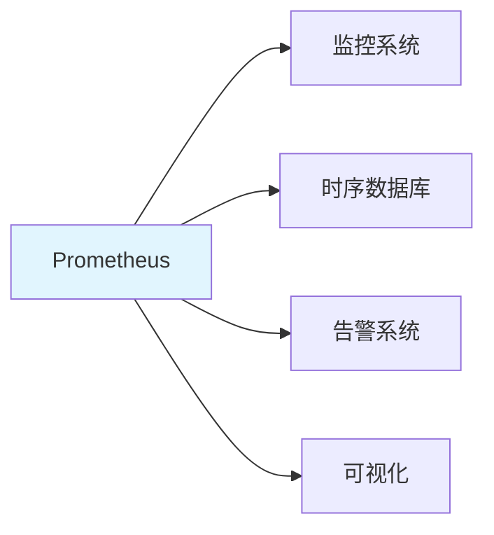
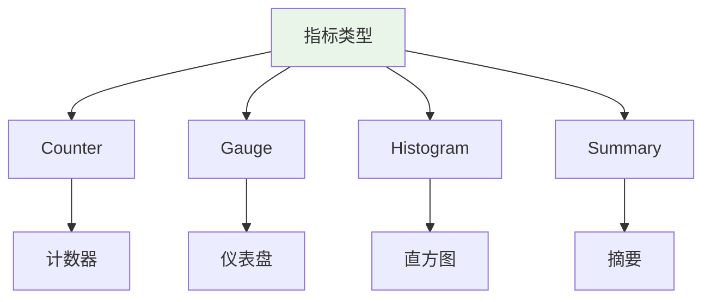

---

title: "Prometheus 四层指标：HTTP / RAG / LLM / 系统，自定义 buckets + CollectorRegistry"

tags:

  - prometheus

  - 技术学习

created: "2026-07-21"

---

# Prometheus 四层指标：HTTP / RAG / LLM / 系统，自定义 buckets + CollectorRegistry

> **一句话**：Prometheus是一个开源的监控和告警系统，通过指标（metrics）来监控应用状态。四层指标包括HTTP层、RAG层、LLM层和系统层，覆盖AI应用的全链路监控。

## 1. Prometheus 基础
### 1.1 什么是Prometheus？



**Prometheus**：开源的监控和告警系统，通过HTTP协议拉取（pull）指标数据。

### 1.2 核心概念

| 概念 | 说明 |
|------|------|
| Metric | 指标，如请求数、延迟等 |
| Label | 标签，用于区分不同维度 |
| Target | 被监控的目标 |
| Scrape | 拉取指标数据 |
| Alert | 告警规则 |

## 2. 指标类型
### 2.1 四种指标类型



| 类型 | 说明 | 示例 |
|------|------|------|
| Counter | 只增不减的计数器 | 请求总数、错误总数 |
| Gauge | 可增可减的仪表盘 | 当前连接数、内存使用 |
| Histogram | 统计分布 | 请求延迟分布 |
| Summary | 类似Histogram | 请求延迟分位数 |

### 2.2 Python实现

```python

from prometheus_client import Counter, Gauge, Histogram, Summary

# Counter：计数器

REQUEST_COUNT = Counter(

    'http_requests_total',

    'Total HTTP requests',

    ['method', 'endpoint', 'status']

)

# Gauge：仪表盘

ACTIVE_CONNECTIONS = Gauge(

    'active_connections',

    'Number of active connections'

)

# Histogram：直方图

REQUEST_DURATION = Histogram(

    'http_request_duration_seconds',

    'HTTP request duration in seconds',

    ['method', 'endpoint'],

    buckets=[0.1, 0.3, 0.5, 1.0, 2.0, 5.0]

)

# Summary：摘要

REQUEST_LATENCY = Summary(

    'http_request_latency_seconds',

    'HTTP request latency in seconds',

    ['method', 'endpoint']

)

```

## 3. 四层指标设计
### 3.1 HTTP层指标

```python

# HTTP层指标

HTTP_REQUEST_COUNT = Counter(

    'http_requests_total',

    'Total HTTP requests',

    ['method', 'endpoint', 'status']

)

HTTP_REQUEST_DURATION = Histogram(

    'http_request_duration_seconds',

    'HTTP request duration',

    ['method', 'endpoint'],

    buckets=[0.1, 0.3, 0.5, 1.0, 2.0, 5.0]

)

HTTP_REQUEST_SIZE = Summary(

    'http_request_size_bytes',

    'HTTP request size',

    ['method', 'endpoint']

)

HTTP_RESPONSE_SIZE = Summary(

    'http_response_size_bytes',

    'HTTP response size',

    ['method', 'endpoint']

)

```

### 3.2 RAG层指标

```python

# RAG层指标

RAG_QUERY_COUNT = Counter(

    'rag_queries_total',

    'Total RAG queries',

    ['status']

)

RAG_QUERY_DURATION = Histogram(

    'rag_query_duration_seconds',

    'RAG query duration',

    ['step'],  # retrieval, generation

    buckets=[0.1, 0.3, 0.5, 1.0, 2.0, 5.0]

)

RAG_RETRIEVAL_COUNT = Counter(

    'rag_retrieval_count',

    'Number of documents retrieved',

    ['query_type']

)

RAG_GENERATION_TOKENS = Summary(

    'rag_generation_tokens',

    'Tokens generated in RAG response'

)

```

### 3.3 LLM层指标

```python

# LLM层指标

LLM_REQUEST_COUNT = Counter(

    'llm_requests_total',

    'Total LLM requests',

    ['model', 'status']

)

LLM_REQUEST_DURATION = Histogram(

    'llm_request_duration_seconds',

    'LLM request duration',

    ['model'],

    buckets=[0.5, 1.0, 2.0, 5.0, 10.0, 30.0]

)

LLM_TOKEN_USAGE = Counter(

    'llm_tokens_total',

    'Total LLM tokens used',

    ['model', 'type']  # type: input/output

)

LLM_COST = Counter(

    'llm_cost_dollars',

    'LLM cost in dollars',

    ['model']

)

```

### 3.4 系统层指标

```python

# 系统层指标

SYSTEM_CPU_USAGE = Gauge(

    'system_cpu_usage_percent',

    'System CPU usage'

)

SYSTEM_MEMORY_USAGE = Gauge(

    'system_memory_usage_bytes',

    'System memory usage'

)

SYSTEM_DISK_USAGE = Gauge(

    'system_disk_usage_bytes',

    'System disk usage'

)

SYSTEM_NETWORK_IO = Counter(

    'system_network_io_bytes_total',

    'System network I/O',

    ['interface', 'direction']  # direction: in/out

)

```

## 4. 自定义buckets
### 4.1 什么是buckets？

```python

# 默认buckets

DEFAULT_BUCKETS = (.005, .01, .025, .05, .1, .25, .5, 1.0, 2.5, 5.0, 10.0, float("inf"))

# 自定义buckets

REQUEST_DURATION = Histogram(

    'http_request_duration_seconds',

    'HTTP request duration',

    buckets=[0.1, 0.3, 0.5, 1.0, 2.0, 5.0, 10.0]

)

```

### 4.2 选择合适的buckets

```python

# 选择覆盖常见延迟范围的buckets

LATENCY_BUCKETS = [0.05, 0.1, 0.2, 0.5, 1.0, 2.0, 5.0, 10.0]

# 对于请求大小

SIZE_BUCKETS = [100, 500, 1000, 5000, 10000, 50000, 100000]

```

## 5. CollectorRegistry
### 5.1 什么是CollectorRegistry？

```python

from prometheus_client import CollectorRegistry, Counter, generate_latest

# 创建自定义registry

registry = CollectorRegistry()

# 注册指标

REQUEST_COUNT = Counter(

    'http_requests_total',

    'Total HTTP requests',

    ['method', 'endpoint'],

    registry=registry

)

# 使用自定义registry

REQUEST_COUNT.labels(method='GET', endpoint='/api').inc()

# 生成指标

output = generate_latest(registry)

```

### 5.2 多应用监控

```python

# 每个应用使用独立的registry

app1_registry = CollectorRegistry()

app2_registry = CollectorRegistry()

# 应用1的指标

app1_counter = Counter(

    'app1_requests_total',

    'Total requests for app1',

    registry=app1_registry

)

# 应用2的指标

app2_counter = Counter(

    'app2_requests_total',

    'Total requests for app2',

    registry=app2_registry

)

```

## 6. FastAPI集成
### 6.1 中间件集成

```python

from fastapi import FastAPI, Request

from prometheus_client import Counter, Histogram, generate_latest

import time

app = FastAPI()

# 指标定义

REQUEST_COUNT = Counter(

    'http_requests_total',

    'Total HTTP requests',

    ['method', 'endpoint', 'status']

)

REQUEST_DURATION = Histogram(

    'http_request_duration_seconds',

    'HTTP request duration',

    ['method', 'endpoint']

)

@app.middleware("http")

async def prometheus_middleware(request: Request, call_next):

    """Prometheus中间件"""

    start_time = time.time()

    # 处理请求

    response = await call_next(request)

    # 记录指标

    duration = time.time() - start_time

    REQUEST_COUNT.labels(

        method=request.method,

        endpoint=request.url.path,

        status=response.status_code

    ).inc()

    REQUEST_DURATION.labels(

        method=request.method,

        endpoint=request.url.path

    ).observe(duration)

    return response

@app.get("/metrics")

async def metrics():

    """Prometheus指标端点"""

    return Response(

        content=generate_latest(),

        media_type="text/plain"

    )

```

### 6.2 RAG应用监控

```python

from prometheus_client import Counter, Histogram

# RAG指标

RAG_QUERY_COUNT = Counter(

    'rag_queries_total',

    'Total RAG queries',

    ['status']

)

RAG_RETRIEVAL_DURATION = Histogram(

    'rag_retrieval_duration_seconds',

    'RAG retrieval duration',

    buckets=[0.1, 0.3, 0.5, 1.0, 2.0]

)

RAG_GENERATION_DURATION = Histogram(

    'rag_generation_duration_seconds',

    'RAG generation duration',

    buckets=[0.5, 1.0, 2.0, 5.0, 10.0]

)

async def rag_query(query: str):

    """RAG查询"""

    start_time = time.time()

    try:

        # 检索

        retrieval_start = time.time()

        documents = await retrieve_documents(query)

        RAG_RETRIEVAL_DURATION.observe(time.time() - retrieval_start)

        # 生成

        generation_start = time.time()

        answer = await generate_answer(query, documents)

        RAG_GENERATION_DURATION.observe(time.time() - generation_start)

        RAG_QUERY_COUNT.labels(status='success').inc()

        return answer

    except Exception as e:

        RAG_QUERY_COUNT.labels(status='error').inc()

        raise

```

## 7. 常见坑点
### 1. 指标命名不规范

```python

# 错误：命名不一致

http_requests = Counter('http_requests', 'HTTP requests')

Http_Requests = Counter('Http_Requests', 'HTTP requests')

# 正确：使用snake_case

http_requests_total = Counter('http_requests_total', 'Total HTTP requests')

```

### 2. 标签基数过高

```python

# 错误：标签值太多

user_id_label = Counter('requests', 'Requests', ['user_id'])  # 可能有百万用户

# 正确：使用有限标签

endpoint_label = Counter('requests', 'Requests', ['endpoint'])  # 端点数量有限

```

### 3. 忘记初始化指标

```python

# 解决：在应用启动时初始化指标

@app.on_event("startup")

async def startup():

    # 初始化指标

    REQUEST_COUNT.labels(method='GET', endpoint='/').inc(0)

```

## 核心要点

```python

from prometheus_client import Counter, Gauge, Histogram, Summary

# Counter：只增不减

counter = Counter('name', 'desc', ['label'])

counter.labels(label='value').inc()

# Gauge：可增可减

gauge = Gauge('name', 'desc')

gauge.set(100)

# Histogram：统计分布

histogram = Histogram('name', 'desc', buckets=[0.1, 1.0, 10.0])

histogram.observe(0.5)

# Summary：分位数

summary = Summary('name', 'desc')

summary.observe(0.5)

```

## 速记卡（面试闪卡）

**Q1：一句话讲清「Prometheus 四层指标：HTTP / RAG / LLM / 系统，自定义 buckets + CollectorRegistry」到底是什么？**

A：用 Prometheus 给 AI 应用做全链路监控，分 HTTP/RAG/LLM/系统四层指标。

**Q2：题目：四层监控全景（four-layer metrics） —— 怎么理解？**

A：像给 AI 应用装四块仪表盘：HTTP 层看请求、RAG 层看检索生成、LLM 层看 token 与花费、系统层看 CPU 内存。一层不漏，全链路延迟与错误尽收眼底。

**Q3：思路：四种指标类型（Counter/Gauge/Histogram/Summary） —— 怎么理解？**

A：Counter 只增不减（请求数）、Gauge 可增可减（连接数）、Histogram 分桶看分布（延迟）、Summary 直接给分位数。像四种量杯：有的只往上加，有的能升降，有的量分布。

**Q4：代码：自定义 buckets（custom buckets） —— 怎么理解？**

A：Histogram 必须定义 buckets 覆盖常见延迟，如 `[0.1,0.3,0.5,1,2,5]`；默认桶太细可定制。buckets 选错会让分位数失真——像秤的刻度，量程不对称量出来就偏。

**Q5：实战：CollectorRegistry 多应用（custom registry） —— 怎么理解？**

A：用 `CollectorRegistry` 给每个应用独立注册指标，`generate_latest(registry)` 单独导出，避免多应用指标互相污染。常配合 FastAPI 中间件自动记录请求与延迟。

**Q6：核心速记主线有哪些？**

- 题目：AI 应用四层监控 HTTP/RAG/LLM/系统

- 思路：Counter/Gauge/Histogram/Summary 四种类型

- 代码：Histogram 自定义 buckets 覆盖延迟分布

- 实战：CollectorRegistry 隔离多应用指标

- 坑点：命名 snake_case、勿用高基数标签

**口诀**

A：四层指标全链路，

Counter Gauge 分步；

桶拟刻度量分布，

Registry 隔离不糊涂。

## 相关链接

- 📋 目录：[[00-可观测性与监控]]

- 📚 学习清单：[[技术学习路线图#可观测性与监控]]

- 🔗 [[02-Grafana-Dashboard预置面板|Grafana Dashboard]]

- 🔗 [[05-结构化JSON日志|结构化日志]]

