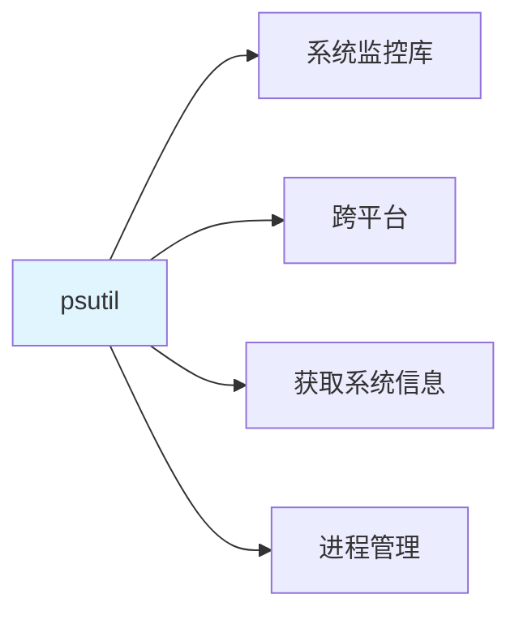

# 系统资源监控：psutil 采集 RSS 内存 / CPU% / 线程数

> **一句话**：psutil是Python的系统监控库，可以获取CPU、内存、磁盘、网络等系统资源信息。在AI应用中，常用于监控系统资源使用情况，防止资源耗尽。

## 1. psutil 基础

### 1.1 什么是psutil？



**psutil**：Python的系统监控库，支持Linux、Windows、macOS等平台。

### 1.2 安装

```bash
pip install psutil
```

## 2. 系统资源采集

### 2.1 内存监控

```python
import psutil

# 获取内存信息
memory = psutil.virtual_memory()

# RSS内存（ Resident Set Size）
rss_memory = memory.used  # 已使用内存

# 内存使用率
memory_percent = memory.percent

# 可用内存
available_memory = memory.available

print(f"RSS内存: {rss_memory / 1024 / 1024:.2f} MB")
print(f"内存使用率: {memory_percent}%")
print(f"可用内存: {available_memory / 1024 / 1024:.2f} MB")
```

### 2.2 CPU监控

```python
import psutil

# CPU使用率
cpu_percent = psutil.cpu_percent(interval=1)

# 每个CPU核心的使用率
cpu_per_core = psutil.cpu_percent(interval=1, percpu=True)

# CPU频率
cpu_freq = psutil.cpu_freq()

# CPU统计
cpu_stats = psutil.cpu_stats()

print(f"CPU使用率: {cpu_percent}%")
print(f"每个核心: {cpu_per_core}")
print(f"CPU频率: {cpu_freq.current} MHz")
```

### 2.3 进程监控

```python
import psutil

# 获取当前进程
process = psutil.Process()

# 进程内存信息
memory_info = process.memory_info()
rss = memory_info.rss  # RSS内存
vms = memory_info.vms  # VMS内存

# 进程CPU信息
cpu_percent = process.cpu_percent(interval=1)

# 线程数
num_threads = process.num_threads()

print(f"进程RSS内存: {rss / 1024 / 1024:.2f} MB")
print(f"进程CPU使用率: {cpu_percent}%")
print(f"线程数: {num_threads}")
```

## 3. 完整监控脚本

### 3.1 系统资源监控

```python
import psutil
import time
import json
from datetime import datetime

def monitor_system_resources():
    """监控系统资源"""
    while True:
        # 内存信息
        memory = psutil.virtual_memory()
        
        # CPU信息
        cpu_percent = psutil.cpu_percent(interval=1)
        
        # 磁盘信息
        disk = psutil.disk_usage('/')
        
        # 网络信息
        net_io = psutil.net_io_counters()
        
        # 监控数据
        data = {
            "timestamp": datetime.now().isoformat(),
            "memory": {
                "total": memory.total,
                "used": memory.used,
                "available": memory.available,
                "percent": memory.percent
            },
            "cpu": {
                "percent": cpu_percent,
                "count": psutil.cpu_count()
            },
            "disk": {
                "total": disk.total,
                "used": disk.used,
                "free": disk.free,
                "percent": disk.percent
            },
            "network": {
                "bytes_sent": net_io.bytes_sent,
                "bytes_recv": net_io.bytes_recv
            }
        }
        
        # 输出JSON
        print(json.dumps(data, indent=2))
        
        # 等待10秒
        time.sleep(10)

if __name__ == "__main__":
    monitor_system_resources()
```

### 3.2 进程资源监控

```python
import psutil
import time

def monitor_process_resources(pid=None):
    """监控进程资源"""
    if pid:
        process = psutil.Process(pid)
    else:
        process = psutil.Process()
    
    while True:
        # 内存信息
        memory_info = process.memory_info()
        
        # CPU信息
        cpu_percent = process.cpu_percent(interval=1)
        
        # 线程信息
        num_threads = process.num_threads()
        
        # 文件描述符
        num_fds = process.num_fds() if hasattr(process, 'num_fds') else None
        
        print(f"PID: {process.pid}")
        print(f"RSS内存: {memory_info.rss / 1024 / 1024:.2f} MB")
        print(f"VMS内存: {memory_info.vms / 1024 / 1024:.2f} MB")
        print(f"CPU使用率: {cpu_percent}%")
        print(f"线程数: {num_threads}")
        if num_fds:
            print(f"文件描述符: {num_fds}")
        print("-" * 50)
        
        time.sleep(5)

if __name__ == "__main__":
    monitor_process_resources()
```

## 4. Prometheus集成

### 4.1 自定义指标

```python
import psutil
from prometheus_client import Gauge, start_http_server

# 定义指标
MEMORY_USAGE = Gauge(
    'system_memory_usage_bytes',
    'System memory usage in bytes'
)

CPU_USAGE = Gauge(
    'system_cpu_usage_percent',
    'System CPU usage percentage'
)

THREAD_COUNT = Gauge(
    'process_thread_count',
    'Number of threads in process'
)

def collect_metrics():
    """收集系统指标"""
    # 内存
    memory = psutil.virtual_memory()
    MEMORY_USAGE.set(memory.used)
    
    # CPU
    cpu_percent = psutil.cpu_percent(interval=1)
    CPU_USAGE.set(cpu_percent)
    
    # 线程数
    process = psutil.Process()
    THREAD_COUNT.set(process.num_threads())

if __name__ == "__main__":
    # 启动Prometheus HTTP服务器
    start_http_server(8000)
    
    # 定期收集指标
    while True:
        collect_metrics()
        time.sleep(10)
```

## 5. 告警集成

### 5.1 内存告警

```python
import psutil

def check_memory_usage(threshold=80):
    """检查内存使用率"""
    memory = psutil.virtual_memory()
    
    if memory.percent > threshold:
        print(f"警告：内存使用率过高！当前: {memory.percent}%")
        return True
    
    return False

def check_process_memory(pid=None, threshold_mb=1024):
    """检查进程内存使用"""
    if pid:
        process = psutil.Process(pid)
    else:
        process = psutil.Process()
    
    memory_info = process.memory_info()
    rss_mb = memory_info.rss / 1024 / 1024
    
    if rss_mb > threshold_mb:
        print(f"警告：进程内存使用过高！当前: {rss_mb:.2f} MB")
        return True
    
    return False
```

### 5.2 CPU告警

```python
import psutil

def check_cpu_usage(threshold=80):
    """检查CPU使用率"""
    cpu_percent = psutil.cpu_percent(interval=1)
    
    if cpu_percent > threshold:
        print(f"警告：CPU使用率过高！当前: {cpu_percent}%")
        return True
    
    return False
```

## 6. 实际案例

### 6.1 FastAPI应用监控

```python
import psutil
from fastapi import FastAPI
from prometheus_client import Gauge

app = FastAPI()

# 定义指标
APP_MEMORY_USAGE = Gauge(
    'app_memory_usage_bytes',
    'Application memory usage'
)

APP_CPU_USAGE = Gauge(
    'app_cpu_usage_percent',
    'Application CPU usage'
)

@app.on_event("startup")
async def startup():
    # 启动时记录初始状态
    process = psutil.Process()
    APP_MEMORY_USAGE.set(process.memory_info().rss)

@app.middleware("http")
async def monitor_middleware(request, call_next):
    # 请求处理前
    process = psutil.Process()
    start_memory = process.memory_info().rss
    
    # 处理请求
    response = await call_next(request)
    
    # 请求处理后
    end_memory = process.memory_info().rss
    memory_diff = end_memory - start_memory
    
    # 更新指标
    APP_MEMORY_USAGE.set(end_memory)
    APP_CPU_USAGE.set(psutil.cpu_percent(interval=0.1))
    
    return response
```

## 7. 常见坑点

### 1. 采样间隔太短
```python
# 问题：采样间隔太短，CPU使用率不准
cpu_percent = psutil.cpu_percent(interval=0.1)  # 太短

# 解决：使用合适的采样间隔
cpu_percent = psutil.cpu_percent(interval=1)  # 1秒
```

### 2. 忘记处理异常
```python
# 问题：没有处理psutil异常
memory = psutil.virtual_memory()

# 解决：添加异常处理
try:
    memory = psutil.virtual_memory()
except Exception as e:
    print(f"获取内存信息失败: {e}")
```

### 3. 跨平台兼容性
```python
# 问题：某些方法在不同平台行为不同
# 解决：检查平台兼容性
import psutil
import platform

if platform.system() == "Linux":
    # Linux特定代码
    num_fds = process.num_fds()
elif platform.system() == "Windows":
    # Windows特定代码
    num_handles = process.num_handles()
```

## 核心要点

```python
import psutil

# 内存
memory = psutil.virtual_memory()
rss = memory.used
percent = memory.percent

# CPU
cpu_percent = psutil.cpu_percent(interval=1)

# 进程
process = psutil.Process()
rss = process.memory_info().rss
cpu_percent = process.cpu_percent(interval=1)
threads = process.num_threads()
```

## 速记卡（面试闪卡）

**Q1：一句话讲清「系统资源监控：psutil 采集 RSS 内存 / CPU% / 线程数」到底是什么？**
A：**psutil**：Python的系统监控库，支持Linux、Windows、macOS等平台。

**Q2：1. psutil 基础 —— 怎么理解？**
A：**psutil**：Python的系统监控库，支持Linux、Windows、macOS等平台。

**Q3：核心速记主线有哪些？**
A：抓住这几根：1. psutil 基础、2. 系统资源采集、3. 完整监控脚本、4. Prometheus集成、5. 告警集成、6. 实际案例。


## 相关链接

- 📋 目录：[[00-可观测性与监控]]
- 📚 学习清单：[[技术学习清单#可观测性与监控]]
- 🔗 [[01-Prometheus四层指标|Prometheus指标]]
- 🔗 [[05-结构化JSON日志|结构化日志]]
- 项目实践：[[项目实战/ai-resume笔记/01_技术研读/01_架构概览|ai-resume: 架构概览]]
- 项目实践：[[项目实战/cr-agent笔记/01-技术研读/09-LLM评测体系搭建|cr-agent: LLM评测体系搭建]]
