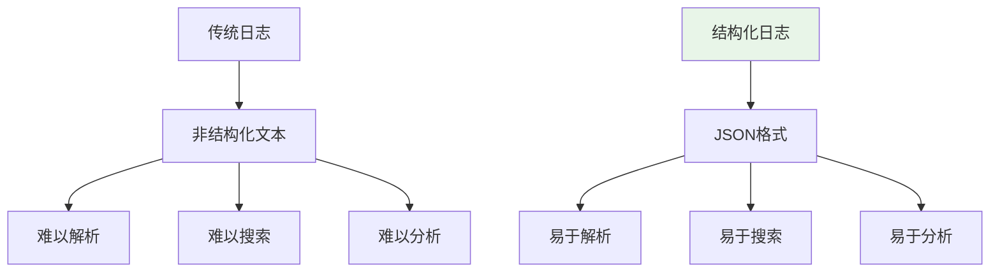

# 结构化 JSON 日志：JSONFormatter + 时间戳/级别/来源/消息/异常统一格式

> **一句话**：结构化日志是将日志信息以结构化格式（如JSON）输出，便于后续分析和处理。JSON格式包含时间戳、级别、来源、消息、异常等统一字段。

## 1. 结构化日志基础

### 1.1 为什么需要结构化日志？



**传统日志问题**：
- 非结构化文本，难以解析
- 难以搜索和过滤
- 难以进行统计分析

### 1.2 结构化日志优势

| 优势 | 说明 |
|------|------|
| 易于解析 | JSON格式，程序可直接解析 |
| 易于搜索 | 可按字段搜索和过滤 |
| 易于分析 | 可进行统计分析 |
| 易于存储 | 可存储到Elasticsearch等系统 |

## 2. JSONFormatter实现

### 2.1 基础实现

```python
import logging
import json
from datetime import datetime

class JSONFormatter(logging.Formatter):
    def format(self, record):
        log_entry = {
            "timestamp": datetime.utcnow().isoformat(),
            "level": record.levelname,
            "logger": record.name,
            "message": record.getMessage(),
            "module": record.module,
            "function": record.funcName,
            "line": record.lineno
        }
        
        # 添加异常信息
        if record.exc_info:
            log_entry["exception"] = self.formatException(record.exc_info)
        
        # 添加额外字段
        if hasattr(record, 'extra_data'):
            log_entry["extra"] = record.extra_data
        
        return json.dumps(log_entry, ensure_ascii=False)
```

### 2.2 使用示例

```python
import logging

# 创建logger
logger = logging.getLogger("myapp")
logger.setLevel(logging.INFO)

# 创建handler
handler = logging.StreamHandler()
handler.setFormatter(JSONFormatter())

# 添加handler
logger.addHandler(handler)

# 使用logger
logger.info("用户登录", extra={"user_id": 123, "ip": "192.168.1.1"})
logger.error("数据库连接失败", exc_info=True)
```

## 3. 统一日志格式

### 3.1 标准字段

```python
class StandardJSONFormatter(logging.Formatter):
    def format(self, record):
        log_entry = {
            # 时间戳
            "timestamp": datetime.utcnow().isoformat(),
            "level": record.levelname,
            
            # 来源信息
            "logger": record.name,
            "module": record.module,
            "function": record.funcName,
            "line": record.lineno,
            
            # 消息内容
            "message": record.getMessage(),
            
            # 异常信息
            "exception": None,
            
            # 额外字段
            "extra": {}
        }
        
        # 异常信息
        if record.exc_info:
            log_entry["exception"] = {
                "type": record.exc_info[0].__name__,
                "message": str(record.exc_info[1]),
                "traceback": self.formatException(record.exc_info)
            }
        
        # 额外字段
        extra_fields = {
            k: v for k, v in record.__dict__.items()
            if k not in logging.LogRecord("").__dict__.keys()
            and not k.startswith("_")
        }
        log_entry["extra"] = extra_fields
        
        return json.dumps(log_entry, ensure_ascii=False, default=str)
```

### 3.2 使用示例

```python
# 配置日志
logging.basicConfig(
    level=logging.INFO,
    handlers=[logging.StreamHandler()]
)

# 设置自定义formatter
handler = logging.StreamHandler()
handler.setFormatter(StandardJSONFormatter())
logger = logging.getLogger("myapp")
logger.addHandler(handler)

# 使用
logger.info("用户操作", extra={
    "user_id": 123,
    "action": "login",
    "ip": "192.168.1.1"
})
```

## 4. 高级功能

### 4.1 请求ID集成

```python
import logging
import uuid
from contextvars import ContextVar

# 请求ID上下文变量
request_id_var: ContextVar[str] = ContextVar('request_id', default='')

class RequestContextFilter(logging.Filter):
    def filter(self, record):
        record.request_id = request_id_var.get('')
        return True

class RequestContextFormatter(logging.Formatter):
    def format(self, record):
        log_entry = {
            "timestamp": datetime.utcnow().isoformat(),
            "level": record.levelname,
            "request_id": record.request_id,
            "logger": record.name,
            "message": record.getMessage()
        }
        
        if record.exc_info:
            log_entry["exception"] = self.formatException(record.exc_info)
        
        return json.dumps(log_entry, ensure_ascii=False)
```

### 4.2 性能日志

```python
import time
import logging

class PerformanceLogger:
    def __init__(self, logger):
        self.logger = logger
    
    def log_operation(self, operation_name, func):
        """记录操作性能"""
        start_time = time.time()
        
        try:
            result = func()
            duration = time.time() - start_time
            
            self.logger.info(f"操作完成", extra={
                "operation": operation_name,
                "duration": duration,
                "status": "success"
            })
            
            return result
        
        except Exception as e:
            duration = time.time() - start_time
            
            self.logger.error(f"操作失败", extra={
                "operation": operation_name,
                "duration": duration,
                "status": "error",
                "error": str(e)
            })
            
            raise

# 使用
logger = logging.getLogger("performance")
perf_logger = PerformanceLogger(logger)

def slow_operation():
    time.sleep(1)
    return "result"

result = perf_logger.log_operation("slow_operation", slow_operation)
```

### 4.3 审计日志

```python
import logging
import json
from datetime import datetime

class AuditLogger:
    def __init__(self, logger):
        self.logger = logger
    
    def log_user_action(self, user_id, action, details=None):
        """记录用户操作"""
        log_entry = {
            "timestamp": datetime.utcnow().isoformat(),
            "event_type": "user_action",
            "user_id": user_id,
            "action": action,
            "details": details or {}
        }
        
        self.logger.info(json.dumps(log_entry, ensure_ascii=False))
    
    def log_system_event(self, event_type, details=None):
        """记录系统事件"""
        log_entry = {
            "timestamp": datetime.utcnow().isoformat(),
            "event_type": event_type,
            "details": details or {}
        }
        
        self.logger.info(json.dumps(log_entry, ensure_ascii=False))

# 使用
audit_logger = AuditLogger(logging.getLogger("audit"))
audit_logger.log_user_action(123, "login", {"ip": "192.168.1.1"})
```

## 5. 实际案例

### 5.1 FastAPI集成

```python
import logging
import json
from fastapi import FastAPI, Request
import uuid

app = FastAPI()

# 配置日志
logging.basicConfig(
    level=logging.INFO,
    format='%(message)s',
    handlers=[logging.StreamHandler()]
)

logger = logging.getLogger("fastapi")

@app.middleware("http")
async def logging_middleware(request: Request, call_next):
    # 生成请求ID
    request_id = str(uuid.uuid4())
    
    # 记录请求开始
    logger.info("请求开始", extra={
        "request_id": request_id,
        "method": request.method,
        "url": str(request.url)
    })
    
    # 处理请求
    response = await call_next(request)
    
    # 记录请求结束
    logger.info("请求结束", extra={
        "request_id": request_id,
        "status_code": response.status_code
    })
    
    return response
```

### 5.2 日志存储到Elasticsearch

```python
from elasticsearch import Elasticsearch
import logging
import json

class ElasticsearchHandler(logging.Handler):
    def __init__(self, es_host, index_name):
        super().__init__()
        self.es = Elasticsearch(es_host)
        self.index_name = index_name
    
    def emit(self, record):
        log_entry = self.format(record)
        
        try:
            self.es.index(
                index=self.index_name,
                body=json.loads(log_entry)
            )
        except Exception as e:
            print(f"Failed to send log to Elasticsearch: {e}")

# 配置
es_handler = ElasticsearchHandler(
    es_host="localhost:9200",
    index_name="app-logs"
)

logger = logging.getLogger("myapp")
logger.addHandler(es_handler)
```

## 6. 常见坑点

### 1. 日志格式不一致
```python
# 问题：不同模块日志格式不一致
# 解决：统一使用JSONFormatter
handler = logging.StreamHandler()
handler.setFormatter(JSONFormatter())
```

### 2. 性能问题
```python
# 问题：日志格式化太慢
# 解决：异步日志或批量发送
import asyncio
from concurrent.futures import ThreadPoolExecutor

executor = ThreadPoolExecutor(max_workers=4)

async def async_log(message):
    loop = asyncio.get_event_loop()
    await loop.run_in_executor(executor, logger.info, message)
```

### 3. 敏感信息泄露
```python
# 问题：日志中包含敏感信息
# 解决：添加日志过滤器
class SensitiveDataFilter(logging.Filter):
    def filter(self, record):
        # 过滤敏感信息
        if hasattr(record, 'password'):
            record.password = '***'
        return True
```

## 核心要点

```python
import logging
import json

class JSONFormatter(logging.Formatter):
    def format(self, record):
        log_entry = {
            "timestamp": datetime.utcnow().isoformat(),
            "level": record.levelname,
            "message": record.getMessage()
        }
        return json.dumps(log_entry)

# 使用
handler = logging.StreamHandler()
handler.setFormatter(JSONFormatter())
logger = logging.getLogger("myapp")
logger.addHandler(handler)
logger.info("测试消息")
```

## 速记卡（面试闪卡）

**Q1：一句话讲清「结构化 JSON 日志：JSONFormatter + 时间戳/级别/来源/消息/异常统一格式」到底是什么？**
A：**传统日志问题**：
非结构化文本，难以解析
难以搜索和过滤
难以进行统计分析
| 优势 | 说明 |
|------|------|
| 易于解析 | JSON格式，程序可直接解析 |
| 易于搜索 | 可按字段搜索和过滤 |
| 易于分析 | 可进行统计分析 |
| 易于存储 | 可存储到Elasticsearch等系统 |

**Q2：1. 结构化日志基础 —— 怎么理解？**
A：**传统日志问题**：
非结构化文本，难以解析
难以搜索和过滤
难以进行统计分析
| 优势 | 说明 |
|------|------|
| 易于解析 | JSON格式，程序可直接解析 |
| 易于搜索 | 可按字段搜索和过滤 |
| 易于分析 | 可进行统计分析 |
| 易于存储 | 可存储到Elasticsearch等系统 |

**Q3：核心速记主线有哪些？**
A：抓住这几根：1. 结构化日志基础、2. JSONFormatter实现、3. 统一日志格式、4. 高级功能、5. 实际案例、6. 常见坑点。


## 相关链接

- 📋 目录：[[00-可观测性与监控]]
- 📚 学习清单：[[技术学习清单#可观测性与监控]]
- 🔗 [[06-PII脱敏|PII脱敏]]
- 🔗 [[07-日志采样|日志采样]]
- 项目实践：[[项目实战/ai-resume笔记/01_技术研读/01_架构概览|ai-resume: 架构概览]]
- 项目实践：[[项目实战/cr-agent笔记/01-技术研读/09-LLM评测体系搭建|cr-agent: LLM评测体系搭建]]
