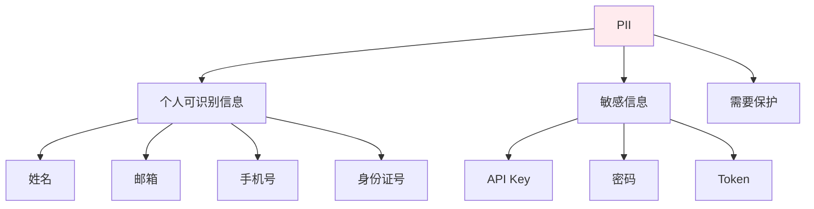

---

title: "PII 脱敏：正则替换邮箱/手机/身份证/API Key/Bearer Token"

tags:

  - pii脱敏

  - 技术学习

created: "2026-07-21"

---

# PII 脱敏：正则替换邮箱/手机/身份证/API Key/Bearer Token

> **一句话**：PII（个人可识别信息）脱敏是对敏感信息进行替换、遮蔽或删除，防止信息泄露。在日志、监控、测试等场景中，需要对邮箱、手机、身份证、API Key等敏感信息进行脱敏处理。

## 1. PII脱敏基础
### 1.1 什么是PII？



**PII**：Personally Identifiable Information，个人可识别信息。

### 1.2 脱敏方法

| 方法 | 说明 | 示例 |
|------|------|------|
| 替换 | 用固定值替换 | `***@***.com` |
| 遮蔽 | 保留部分信息 | `138****1234` |
| 删除 | 完全删除 | `""` |
| 哈希 | 单向哈希 | `sha256(email)` |

## 2. 正则表达式脱敏
### 2.1 邮箱脱敏

```python

import re

def mask_email(email: str) -> str:

    """邮箱脱敏"""

    pattern = r'([a-zA-Z0-9._%+-]+)@([a-zA-Z0-9.-]+\.[a-zA-Z]{2,})'

    def replace(match):

        username = match.group(1)

        domain = match.group(2)

        # 保留首字母和域名

        if len(username) > 2:

            masked_username = username[0] + '*' * (len(username) - 2) + username[-1]

        else:

            masked_username = '*' * len(username)

        return f"{masked_username}@{domain}"

    return re.sub(pattern, replace, email)

# 示例

print(mask_email("zhangsan@example.com"))  # z*****n@example.com

print(mask_email("ab@example.com"))        # **@example.com

```

### 2.2 手机号脱敏

```python

import re

def mask_phone(phone: str) -> str:

    """手机号脱敏"""

    pattern = r'(\d{3})\d{4}(\d{4})'

    return re.sub(pattern, r'\1****\2', phone)

# 示例

print(mask_phone("13812345678"))  # 138****5678

```

### 2.3 身份证号脱敏

```python

import re

def mask_id_card(id_card: str) -> str:

    """身份证号脱敏"""

    pattern = r'(\d{6})\d{8}(\d{4})'

    return re.sub(pattern, r'\1********\2', id_card)

# 示例

print(mask_id_card("110101199001011234"))  # 110101********1234

```

### 2.4 API Key脱敏

```python

import re

def mask_api_key(api_key: str) -> str:

    """API Key脱敏"""

    if len(api_key) > 8:

        return api_key[:4] + '*' * (len(api_key) - 8) + api_key[-4:]

    else:

        return '*' * len(api_key)

# 示例

print(mask_api_key("sk-1234567890abcdef"))  # sk-1******cdef

```

### 2.5 Bearer Token脱敏

```python

import re

def mask_bearer_token(token: str) -> str:

    """Bearer Token脱敏"""

    pattern = r'Bearer\s+([a-zA-Z0-9._-]+)'

    def replace(match):

        token_value = match.group(1)

        if len(token_value) > 10:

            masked = token_value[:5] + '*' * (len(token_value) - 10) + token_value[-5:]

        else:

            masked = '*' * len(token_value)

        return f"Bearer {masked}"

    return re.sub(pattern, replace, token)

# 示例

print(mask_bearer_token("Bearer eyJhbGciOiJIUzI1NiIsInR5cCI6IkpXVCJ9"))

# Bearer eyJh**********************IJXVCJ9

```

## 3. 完整脱敏工具
### 3.1 综合脱敏类

```python

import re

from typing import Dict, Any

class PIIMasker:

    """PII脱敏工具"""

    def __init__(self):

        self.patterns = {

            'email': r'[a-zA-Z0-9._%+-]+@[a-zA-Z0-9.-]+\.[a-zA-Z]{2,}',

            'phone': r'\d{11}',

            'id_card': r'\d{18}',

            'api_key': r'sk-[a-zA-Z0-9]{20,}',

            'bearer_token': r'Bearer\s+[a-zA-Z0-9._-]{20,}'

        }

    def mask_text(self, text: str) -> str:

        """对文本进行PII脱敏"""

        # 邮箱脱敏

        text = re.sub(

            self.patterns['email'],

            lambda m: self._mask_email(m.group()),

            text

        )

        # 手机号脱敏

        text = re.sub(

            self.patterns['phone'],

            lambda m: self._mask_phone(m.group()),

            text

        )

        # 身份证号脱敏

        text = re.sub(

            self.patterns['id_card'],

            lambda m: self._mask_id_card(m.group()),

            text

        )

        # API Key脱敏

        text = re.sub(

            self.patterns['api_key'],

            lambda m: self._mask_api_key(m.group()),

            text

        )

        # Bearer Token脱敏

        text = re.sub(

            self.patterns['bearer_token'],

            lambda m: self._mask_bearer_token(m.group()),

            text

        )

        return text

    def _mask_email(self, email: str) -> str:

        """邮箱脱敏"""

        parts = email.split('@')

        if len(parts) == 2:

            username, domain = parts

            if len(username) > 2:

                masked_username = username[0] + '*' * (len(username) - 2) + username[-1]

            else:

                masked_username = '*' * len(username)

            return f"{masked_username}@{domain}"

        return email

    def _mask_phone(self, phone: str) -> str:

        """手机号脱敏"""

        if len(phone) == 11:

            return phone[:3] + '****' + phone[7:]

        return phone

    def _mask_id_card(self, id_card: str) -> str:

        """身份证号脱敏"""

        if len(id_card) == 18:

            return id_card[:6] + '********' + id_card[14:]

        return id_card

    def _mask_api_key(self, api_key: str) -> str:

        """API Key脱敏"""

        if len(api_key) > 8:

            return api_key[:4] + '*' * (len(api_key) - 8) + api_key[-4:]

        return '*' * len(api_key)

    def _mask_bearer_token(self, token: str) -> str:

        """Bearer Token脱敏"""

        if token.startswith('Bearer '):

            token_value = token[7:]

            if len(token_value) > 10:

                masked = token_value[:5] + '*' * (len(token_value) - 10) + token_value[-5:]

            else:

                masked = '*' * len(token_value)

            return f"Bearer {masked}"

        return token

# 使用

masker = PIIMasker()

text = "用户邮箱是zhangsan@example.com，手机号是13812345678"

masked_text = masker.mask_text(text)

print(masked_text)

# 用户邮箱是z*****n@example.com，手机号是138****5678

```

## 4. 日志脱敏
### 4.1 日志过滤器

```python

import logging

import re

class PIIFilter(logging.Filter):

    """PII脱敏过滤器"""

    def __init__(self):

        super().__init__()

        self.masker = PIIMasker()

    def filter(self, record):

        # 对日志消息进行脱敏

        if isinstance(record.msg, str):

            record.msg = self.masker.mask_text(record.msg)

        # 对额外字段进行脱敏

        if hasattr(record, 'extra_data'):

            record.extra_data = self._mask_dict(record.extra_data)

        return True

    def _mask_dict(self, data: dict) -> dict:

        """对字典进行脱敏"""

        masked_data = {}

        for key, value in data.items():

            if isinstance(value, str):

                masked_data[key] = self.masker.mask_text(value)

            elif isinstance(value, dict):

                masked_data[key] = self._mask_dict(value)

            else:

                masked_data[key] = value

        return masked_data

# 使用

logger = logging.getLogger("myapp")

logger.addFilter(PIIFilter())

# 日志中的PII会被自动脱敏

logger.info("用户登录", extra={"email": "zhangsan@example.com"})

```

### 4.2 FastAPI中间件

```python

from fastapi import FastAPI, Request

import logging

app = FastAPI()

masker = PIIMasker()

@app.middleware("http")

async def pii_masking_middleware(request: Request, call_next):

    # 对请求体进行脱敏

    if request.body:

        body = await request.body()

        masked_body = masker.mask_text(body.decode())

        # 这里只是示例，实际需要重新构建请求

    # 处理请求

    response = await call_next(request)

    return response

```

## 5. 高级脱敏
### 5.1 自定义脱敏规则

```python

class CustomPIIMasker(PIIMasker):

    """自定义PII脱敏工具"""

    def __init__(self):

        super().__init__()

        # 添加自定义模式

        self.patterns['custom_id'] = r'CUSTOM-\d{8}'

    def _mask_custom_id(self, custom_id: str) -> str:

        """自定义ID脱敏"""

        return custom_id[:7] + '****' + custom_id[-4:]

# 使用

masker = CustomPIIMasker()

text = "订单号是CUSTOM-12345678"

masked_text = masker.mask_text(text)

```

### 5.2 选择性脱敏

```python

class SelectivePIIMasker(PIIMasker):

    """选择性PII脱敏工具"""

    def __init__(self, mask_types: list = None):

        super().__init__()

        self.mask_types = mask_types or ['email', 'phone']

    def mask_text(self, text: str) -> str:

        """对文本进行选择性PII脱敏"""

        if 'email' in self.mask_types:

            text = re.sub(

                self.patterns['email'],

                lambda m: self._mask_email(m.group()),

                text

            )

        if 'phone' in self.mask_types:

            text = re.sub(

                self.patterns['phone'],

                lambda m: self._mask_phone(m.group()),

                text

            )

        return text

# 只脱敏邮箱和手机号

masker = SelectivePIIMasker(['email', 'phone'])

```

## 6. 常见坑点
### 1. 正则表达式不准确

```python

# 问题：正则表达式匹配不准确

pattern = r'\d{11}'  # 可能匹配其他11位数字

# 解决：使用更精确的正则表达式

pattern = r'1[3-9]\d{9}'  # 只匹配手机号

```

### 2. 性能问题

```python

# 问题：频繁编译正则表达式

def mask_text(text):

    pattern = r'[a-zA-Z0-9._%+-]+@[a-zA-Z0-9.-]+\.[a-zA-Z]{2,}'

    return re.sub(pattern, mask_email, text)

# 解决：预编译正则表达式

EMAIL_PATTERN = re.compile(r'[a-zA-Z0-9._%+-]+@[a-zA-Z0-9.-]+\.[a-zA-Z]{2,}')

def mask_text(text):

    return EMAIL_PATTERN.sub(mask_email, text)

```

### 3. 脱敏不彻底

```python

# 解决：添加更多模式，定期更新脱敏规则

```

## 核心要点

```python

import re

# 邮箱脱敏

def mask_email(email):

    pattern = r'([a-zA-Z0-9._%+-]+)@([a-zA-Z0-9.-]+\.[a-zA-Z]{2,})'

    def replace(match):

        username = match.group(1)

        if len(username) > 2:

            return username[0] + '*' * (len(username) - 2) + username[-1] + '@' + match.group(2)

        return '*' * len(username) + '@' + match.group(2)

    return re.sub(pattern, replace, email)

# 手机号脱敏

def mask_phone(phone):

    return re.sub(r'(\d{3})\d{4}(\d{4})', r'\1****\2', phone)

```

## 速记卡（面试闪卡）

**Q1：一句话讲清「PII 脱敏：正则替换邮箱/手机/身份证/API Key/Bearer Token」到底是什么？**

A：对日志中的敏感信息做替换、遮蔽或删除以防泄露。

**Q2：1. PII脱敏基础 —— 怎么理解？**

A：像给简历打码保护隐私：PII（Personally Identifiable Information，个人可识别信息）包括姓名邮箱手机身份证；脱敏四法——替换、遮蔽、删除、哈希。

**Q3：2. 正则表达式脱敏 —— 怎么理解？**

A：用正则匹配模式再 re.sub 打码：邮箱 user@domain、手机 11 位、身份证 18 位、sk- 开头的 API Key、Bearer xxx 的 Token。核心是"先识别后打码"。

**Q4：3. 完整脱敏工具 —— 怎么理解？**

A：封装成 PIIMasker 类，内部 patterns 字典存各类正则，mask_text 依次脱敏；还可继承做自定义规则（如 CUSTOM- 订单号）。

**Q5：4. 日志脱敏 —— 怎么理解？**

A：用 logging.Filter 自动脱敏每条日志，FastAPI 中间件拦请求体。三坑：正则要精确（手机用 1[3-9]\d{9}）、要预编译、规则定期更新。

**Q6：核心速记主线有哪些？**

- PII 五类：邮箱/手机/身份证/API Key/Token

- 四法：替换、遮蔽、删除、哈希

- 正则匹配模式后 re.sub 打码，patterns 字典统一管理

- 日志用 Filter、接口用中间件，正则要精确且预编译

**口诀**

A：敏感信息要打码

替换遮蔽删哈希

正则匹配五类敏

日志中间件别落

## 相关链接

- 📋 目录：[[00-可观测性与监控]]

- 📚 学习清单：[[技术学习路线图#可观测性与监控]]

- 🔗 [[05-结构化JSON日志|结构化日志]]

- 🔗 [[07-日志采样|日志采样]]

