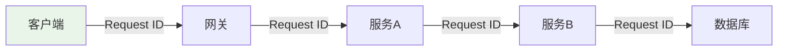
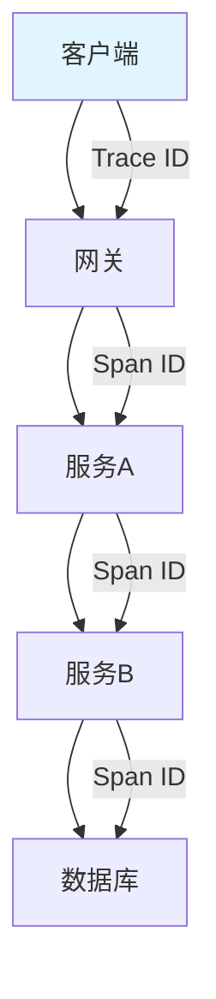

---

title: "Request ID + 全链路追踪：contextvars + UUID4 + 响应头 X-Request-ID + StepTimer 耗时收集器"

tags:

  - 链路追踪

  - 技术学习

created: "2026-07-21"

---

# Request ID + 全链路追踪：contextvars + UUID4 + 响应头 X-Request-ID + StepTimer 耗时收集器

> **一句话**：Request ID是用于标识单个请求的唯一标识符，全链路追踪是跟踪请求在分布式系统中的完整路径。通过contextvars、UUID4、响应头X-Request-ID和StepTimer可以实现完整的链路追踪。

## 1. Request ID 基础
### 1.1 什么是Request ID？



**Request ID**：用于标识单个请求的唯一标识符，可以跟踪请求在分布式系统中的完整路径。

### 1.2 为什么需要Request ID？

| 优势 | 说明 |
|------|------|
| 问题定位 | 快速找到请求在哪个环节出错 |
| 性能分析 | 分析每个环节的耗时 |
| 日志关联 | 关联同一请求的所有日志 |
| 依赖分析 | 了解服务间依赖关系 |

## 2. contextvars 实现
### 2.1 基础实现

```python

import contextvars

import uuid

# 定义上下文变量

request_id_var: contextvars.ContextVar[str] = contextvars.ContextVar('request_id', default='')

def get_request_id() -> str:

    """获取当前请求ID"""

    return request_id_var.get()

def set_request_id(request_id: str = None) -> str:

    """设置请求ID"""

    if request_id is None:

        request_id = str(uuid.uuid4())

    token = request_id_var.set(request_id)

    return token

def reset_request_id(token):

    """重置请求ID"""

    request_id_var.reset(token)

```

### 2.2 FastAPI集成

```python

from fastapi import FastAPI, Request

import uuid

app = FastAPI()

@app.middleware("http")

async def request_id_middleware(request: Request, call_next):

    # 获取或生成Request ID

    request_id = request.headers.get("X-Request-ID", str(uuid.uuid4()))

    # 设置到上下文变量

    token = set_request_id(request_id)

    try:

        # 处理请求

        response = await call_next(request)

        # 添加到响应头

        response.headers["X-Request-ID"] = request_id

        return response

    finally:

        # 重置上下文变量

        reset_request_id(token)

```

## 3. 全链路追踪
### 3.1 什么是全链路追踪？



**全链路追踪**：跟踪请求在分布式系统中的完整路径，包括每个环节的耗时、状态等信息。

### 3.2 核心概念

| 概念 | 说明 |
|------|------|
| Trace ID | 整个请求链路的唯一标识 |
| Span ID | 单个操作的唯一标识 |
| Parent Span ID | 父操作的标识 |
| Span | 单个操作的信息 |

## 4. StepTimer 耗时收集器
### 4.1 基础实现

```python

import time

from contextlib import contextmanager

from typing import Dict, List

class StepTimer:

    """步骤耗时收集器"""

    def __init__(self):

        self.steps: List[Dict] = []

        self.current_step = None

    @contextmanager

    def step(self, step_name: str):

        """记录步骤耗时"""

        start_time = time.time()

        try:

            yield

        finally:

            duration = time.time() - start_time

            self.steps.append({

                "step": step_name,

                "duration": duration,

                "start_time": start_time

            })

    def get_total_duration(self) -> float:

        """获取总耗时"""

        return sum(step["duration"] for step in self.steps)

    def get_steps(self) -> List[Dict]:

        """获取所有步骤"""

        return self.steps

    def to_dict(self) -> Dict:

        """转换为字典"""

        return {

            "total_duration": self.get_total_duration(),

            "steps": self.steps

        }

# 使用

timer = StepTimer()

with timer.step("数据库查询"):

    # 模拟数据库查询

    time.sleep(0.1)

with timer.step("外部API调用"):

    # 模拟外部API调用

    time.sleep(0.2)

print(timer.to_dict())

```

### 4.2 与Request ID集成

```python

import contextvars

import uuid

import time

from contextlib import contextmanager

from typing import Dict, List

# 上下文变量

request_id_var: contextvars.ContextVar[str] = contextvars.ContextVar('request_id', default='')

timer_var: contextvars.ContextVar['StepTimer'] = contextvars.ContextVar('timer', default=None)

class StepTimer:

    """步骤耗时收集器"""

    def __init__(self, request_id: str):

        self.request_id = request_id

        self.steps: List[Dict] = []

    @contextmanager

    def step(self, step_name: str):

        """记录步骤耗时"""

        start_time = time.time()

        try:

            yield

        finally:

            duration = time.time() - start_time

            self.steps.append({

                "request_id": self.request_id,

                "step": step_name,

                "duration": duration,

                "start_time": start_time

            })

    def to_dict(self) -> Dict:

        """转换为字典"""

        return {

            "request_id": self.request_id,

            "total_duration": sum(step["duration"] for step in self.steps),

            "steps": self.steps

        }

@contextmanager

def request_timer(request_id: str = None):

    """请求计时器上下文管理器"""

    if request_id is None:

        request_id = str(uuid.uuid4())

    # 设置请求ID

    token = request_id_var.set(request_id)

    # 创建计时器

    timer = StepTimer(request_id)

    timer_token = timer_var.set(timer)

    try:

        yield timer

    finally:

        # 重置上下文变量

        request_id_var.reset(token)

        timer_var.reset(timer_token)

def get_timer() -> StepTimer:

    """获取当前请求的计时器"""

    return timer_var.get()

```

## 5. 实际案例
### 5.1 FastAPI完整实现

```python

from fastapi import FastAPI, Request

import uuid

import time

import contextvars

from contextlib import contextmanager

from typing import Dict, List

app = FastAPI()

# 上下文变量

request_id_var: contextvars.ContextVar[str] = contextvars.ContextVar('request_id', default='')

timer_var: contextvars.ContextVar['StepTimer'] = contextvars.ContextVar('timer', default=None)

class StepTimer:

    """步骤耗时收集器"""

    def __init__(self, request_id: str):

        self.request_id = request_id

        self.steps: List[Dict] = []

    @contextmanager

    def step(self, step_name: str):

        """记录步骤耗时"""

        start_time = time.time()

        try:

            yield

        finally:

            duration = time.time() - start_time

            self.steps.append({

                "step": step_name,

                "duration": duration

            })

    def to_dict(self) -> Dict:

        return {

            "request_id": self.request_id,

            "total_duration": sum(step["duration"] for step in self.steps),

            "steps": self.steps

        }

@app.middleware("http")

async def tracking_middleware(request: Request, call_next):

    # 获取或生成Request ID

    request_id = request.headers.get("X-Request-ID", str(uuid.uuid4()))

    # 设置到上下文变量

    token = request_id_var.set(request_id)

    timer = StepTimer(request_id)

    timer_token = timer_var.set(timer)

    try:

        # 处理请求

        response = await call_next(request)

        # 添加到响应头

        response.headers["X-Request-ID"] = request_id

        # 添加耗时信息到响应头

        timer_dict = timer.to_dict()

        response.headers["X-Response-Time"] = f"{timer_dict['total_duration']:.3f}s"

        return response

    finally:

        # 重置上下文变量

        request_id_var.reset(token)

        timer_var.reset(timer_token)

@app.get("/api/data")

async def get_data():

    """示例接口"""

    timer = timer_var.get()

    # 记录步骤耗时

    with timer.step("数据库查询"):

        # 模拟数据库查询

        await asyncio.sleep(0.1)

    with timer.step("外部API调用"):

        # 模拟外部API调用

        await asyncio.sleep(0.2)

    return {"data": "value", "timer": timer.to_dict()}

```

### 5.2 日志关联

```python

import logging

import contextvars

# 请求ID上下文变量

request_id_var: contextvars.ContextVar[str] = contextvars.ContextVar('request_id', default='')

class RequestIdFilter(logging.Filter):

    """日志过滤器：添加request_id"""

    def filter(self, record):

        record.request_id = request_id_var.get('unknown')

        return True

# 配置日志

logger = logging.getLogger(__name__)

logger.addFilter(RequestIdFilter())

handler = logging.StreamHandler()

handler.setFormatter(logging.Formatter(

    '%(asctime)s [%(request_id)s] %(levelname)s: %(message)s'

))

logger.addHandler(handler)

# 使用

logger.info("处理请求")  # 自动包含request_id

```

## 6. 高级功能
### 6.1 分布式追踪

```python

import contextvars

import uuid

# 分布式追踪上下文变量

trace_id_var: contextvars.ContextVar[str] = contextvars.ContextVar('trace_id', default='')

span_id_var: contextvars.ContextVar[str] = contextvars.ContextVar('span_id', default='')

def create_span(span_name: str):

    """创建新的span"""

    parent_span_id = span_id_var.get()

    span_id = str(uuid.uuid4())

    # 设置span ID

    token = span_id_var.set(span_id)

    return {

        "trace_id": trace_id_var.get(),

        "span_id": span_id,

        "parent_span_id": parent_span_id,

        "span_name": span_name

    }

# 使用

span = create_span("数据库查询")

print(span)

# }

```

### 6.2 耗时告警

```python

import time

from typing import Dict

class StepTimerWithAlert(StepTimer):

    """带告警的步骤耗时收集器"""

    def __init__(self, request_id: str, alert_threshold: float = 1.0):

        super().__init__(request_id)

        self.alert_threshold = alert_threshold

    @contextmanager

    def step(self, step_name: str):

        """记录步骤耗时"""

        start_time = time.time()

        try:

            yield

        finally:

            duration = time.time() - start_time

            self.steps.append({

                "step": step_name,

                "duration": duration

            })

            # 检查是否需要告警

            if duration > self.alert_threshold:

                self._send_alert(step_name, duration)

    def _send_alert(self, step_name: str, duration: float):

        """发送告警"""

        print(f"告警：步骤 {step_name} 耗时过长: {duration:.3f}s")

```

## 7. 常见坑点
### 1. Request ID不一致

```python

# 解决：在服务间传递Request ID

headers = {"X-Request-ID": request_id}

response = await client.get("http://service-b/api", headers=headers)

```

### 2. 上下文变量丢失

```python

# 解决：手动传递上下文变量

async def background_task():

    request_id = request_id_var.get()

    # 使用request_id

```

### 3. 性能影响

```python

# 解决：只在调试模式启用

if DEBUG:

    with timer.step("操作"):

        # 操作

else:

    # 直接执行

    pass

```

## 核心要点

```python

import contextvars

import uuid

# Request ID

request_id_var: contextvars.ContextVar[str] = contextvars.ContextVar('request_id', default='')

# 设置

token = request_id_var.set(str(uuid.uuid4()))

# 获取

request_id = request_id_var.get()

# 重置

request_id_var.reset(token)

# StepTimer

with timer.step("操作"):

    # 执行操作

    pass

```

## 速记卡（面试闪卡）

**Q1：一句话讲清「Request ID + 全链路追踪：contextvars + UUID4 + 响应头 X-Request-ID + StepTimer 耗时收集器」到底是什么？**

A：Request ID 用唯一标识串联一次请求在分布式系统的完整路径，便于定位与计耗时。

**Q2：1. Request ID 基础 —— 怎么理解？**

A：像快递单号：每请求发一个唯一 ID，串起它在各服务间的完整足迹（Request ID，请求标识）。

**Q3：2. contextvars 实现 —— 怎么理解？**

A：像专属便签：contextvars 给每个请求存独立 ID，协程间不串号（Context Variable，上下文变量）。

**Q4：3. 全链路追踪 —— 怎么理解？**

A：像一路监控：Trace ID 串全链、Span ID 记每步，看耗时与状态（Trace/Span，链路与跨度）。

**Q5：4. StepTimer 耗时收集器 —— 怎么理解？**

A：像分段秒表：用 with 包住每步，自动累计各阶段耗时（Step Timer，步骤计时器）。

**Q6：核心速记主线有哪些？**

- Request ID：唯一标识单请求，跨服务传递

- contextvars 隔离各请求上下文，防串号

- 全链路：Trace ID + Span ID 记录路径与耗时

- StepTimer 用上下文管理器收集分段耗时

**口诀**

A：请求单号串全程

contextvars 防串门

Trace Span 记足迹

StepTimer 算时分

## 相关链接

- 📋 目录：[[00-可观测性与监控]]

- 📚 学习清单：[[技术学习路线图#可观测性与监控]]

- 🔗 [[05-contextvars与request_id链路追踪|contextvars基础]]

- 🔗 [[07-日志采样|日志采样]]

