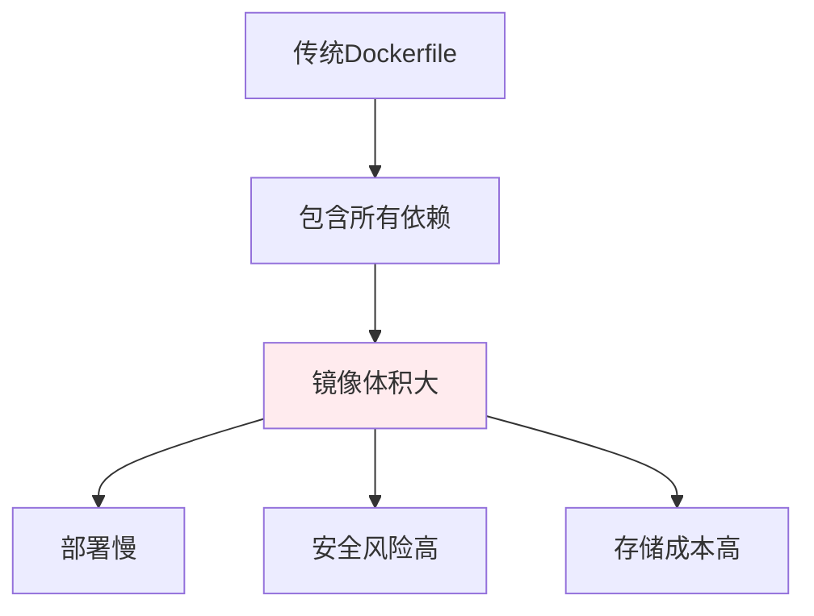

---

title: "Docker 多阶段构建：builder + runtime 分离，减少镜像体积"

tags:

  - docker

  - 技术学习

created: "2026-07-21"

---

# Docker 多阶段构建：builder + runtime 分离，减少镜像体积

> **一句话**：Docker多阶段构建允许在一个Dockerfile中使用多个阶段，将构建环境和运行环境分离，从而减少最终镜像的体积。在AI应用中，多阶段构建可以显著减少镜像大小，加快部署速度。

## 1. 为什么需要多阶段构建？
### 1.1 传统构建的问题



**传统构建的问题**：

1. **镜像体积大**：包含编译工具、依赖库、源代码等

2. **部署慢**：传输大镜像耗时

3. **安全风险高**：包含不必要的工具和依赖

4. **存储成本高**：占用更多存储空间

### 1.2 多阶段构建的优势

| 优势 | 说明 | 示例 |

|------|------|------|

| 镜像体积小 | 只包含运行时必要的文件 | 从1GB减少到100MB |

| 部署快 | 传输小镜像更快 | 从10分钟减少到1分钟 |

| 安全性高 | 不包含编译工具 | 减少攻击面 |

| 缓存友好 | 构建缓存更高效 | 依赖不变时快速构建 |

## 2. 基础用法
### 2.1 简单示例

```dockerfile

# 阶段1：构建

FROM python:3.11 as builder

WORKDIR /app

COPY requirements.txt .

RUN pip install --user -r requirements.txt

# 阶段2：运行

FROM python:3.11-slim

WORKDIR /app

COPY --from=builder /root/.local /root/.local

COPY . .

ENV PATH=/root/.local/bin:$PATH

CMD ["python", "app.py"]

```

### 2.2 Python项目示例

```dockerfile

# 阶段1：构建依赖

FROM python:3.11 as builder

WORKDIR /app

COPY requirements.txt .

RUN pip install --user --no-cache-dir -r requirements.txt

# 阶段2：运行

FROM python:3.11-slim

WORKDIR /app

# 复制安装的依赖

COPY --from=builder /root/.local /root/.local

# 复制应用代码

COPY . .

# 设置环境变量

ENV PATH=/root/.local/bin:$PATH

ENV PYTHONDONTWRITEBYTECODE=1

ENV PYTHONUNBUFFERED=1

# 暴露端口

EXPOSE 8000

# 运行应用

CMD ["uvicorn", "app:app", "--host", "0.0.0.0", "--port", "8000"]

```

## 3. 高级用法
### 3.1 多阶段构建复杂项目

```dockerfile

# 阶段1：安装系统依赖

FROM python:3.11 as system-deps

RUN apt-get update && apt-get install -y \

    build-essential \

    libpq-dev \

    && rm -rf /var/lib/apt/lists/*

# 阶段2：安装Python依赖

FROM python:3.11 as python-deps

WORKDIR /app

COPY requirements.txt .

RUN pip install --user --no-cache-dir -r requirements.txt

# 阶段3：构建前端

FROM node:18 as frontend-builder

WORKDIR /app

COPY package*.json ./

RUN npm ci

COPY . .

RUN npm run build

# 阶段4：最终运行

FROM python:3.11-slim

# 安装运行时依赖

RUN apt-get update && apt-get install -y \

    libpq5 \

    && rm -rf /var/lib/apt/lists/*

WORKDIR /app

# 复制Python依赖

COPY --from=python-deps /root/.local /root/.local

# 复制前端构建结果

COPY --from=frontend-builder /app/dist /app/static

# 复制应用代码

COPY . .

# 设置环境变量

ENV PATH=/root/.local/bin:$PATH

ENV PYTHONDONTWRITEBYTECODE=1

ENV PYTHONUNBUFFERED=1

# 暴露端口

EXPOSE 8000

# 运行应用

CMD ["uvicorn", "app:app", "--host", "0.0.0.0", "--port", "8000"]

```

### 3.2 使用构建参数

```dockerfile

# 阶段1：构建

FROM python:3.11 as builder

ARG APP_VERSION=1.0.0

ARG BUILD_ENV=production

WORKDIR /app

COPY requirements.txt .

RUN pip install --user --no-cache-dir -r requirements.txt

# 阶段2：运行

FROM python:3.11-slim

ARG APP_VERSION

ARG BUILD_ENV

WORKDIR /app

COPY --from=builder /root/.local /root/.local

COPY . .

ENV PATH=/root/.local/bin:$PATH

ENV APP_VERSION=$APP_VERSION

ENV BUILD_ENV=$BUILD_ENV

EXPOSE 8000

CMD ["python", "app.py"]

```

### 3.3 条件构建

```dockerfile

# 阶段1：构建

FROM python:3.11 as builder

WORKDIR /app

COPY requirements.txt .

RUN pip install --user --no-cache-dir -r requirements.txt

# 阶段2：运行（基础版本）

FROM python:3.11-slim as base

WORKDIR /app

COPY --from=builder /root/.local /root/.local

COPY . .

ENV PATH=/root/.local/bin:$PATH

EXPOSE 8000

# 阶段3：运行（生产版本）

FROM base as production

ENV APP_ENV=production

CMD ["uvicorn", "app:app", "--host", "0.0.0.0", "--port", "8000"]

# 阶段4：运行（开发版本）

FROM base as development

ENV APP_ENV=development

CMD ["uvicorn", "app:app", "--host", "0.0.0.0", "--port", "8000", "--reload"]

```

## 4. 优化技巧
### 4.1 减少层数

```dockerfile

# 不好：每条命令一层

RUN apt-get update

RUN apt-get install -y build-essential

RUN rm -rf /var/lib/apt/lists/*

# 好：合并命令

RUN apt-get update && \

    apt-get install -y build-essential && \

    rm -rf /var/lib/apt/lists/*

```

### 4.2 利用缓存

```dockerfile

# 不好：先复制代码再安装依赖

COPY . .

RUN pip install -r requirements.txt

# 好：先复制依赖文件再安装

COPY requirements.txt .

RUN pip install -r requirements.txt

COPY . .

```

### 4.3 使用`.dockerignore`

```dockerignore

# .dockerignore文件

.git

.github

.vscode

__pycache__

*.pyc

*.pyo

.env

.venv

venv

node_modules

dist

build

```

## 5. 实际案例
### 5.1 FastAPI项目

```dockerfile

# 阶段1：构建

FROM python:3.11 as builder

WORKDIR /app

COPY requirements.txt .

RUN pip install --user --no-cache-dir -r requirements.txt

# 阶段2：运行

FROM python:3.11-slim

WORKDIR /app

COPY --from=builder /root/.local /root/.local

COPY . .

ENV PATH=/root/.local/bin:$PATH

ENV PYTHONDONTWRITEBYTECODE=1

ENV PYTHONUNBUFFERED=1

EXPOSE 8000

CMD ["uvicorn", "app.main:app", "--host", "0.0.0.0", "--port", "8000"]

```

### 5.2 React前端项目

```dockerfile

# 阶段1：构建

FROM node:18 as builder

WORKDIR /app

COPY package*.json ./

RUN npm ci

COPY . .

RUN npm run build

# 阶段2：运行

FROM nginx:alpine

COPY --from=builder /app/dist /usr/share/nginx/html

COPY nginx.conf /etc/nginx/conf.d/default.conf

EXPOSE 80

CMD ["nginx", "-g", "daemon off;"]

```

### 5.3 全栈项目

```dockerfile

# 阶段1：构建后端

FROM python:3.11 as backend-builder

WORKDIR /backend

COPY backend/requirements.txt .

RUN pip install --user --no-cache-dir -r requirements.txt

# 阶段2：构建前端

FROM node:18 as frontend-builder

WORKDIR /frontend

COPY frontend/package*.json ./

RUN npm ci

COPY frontend/ .

RUN npm run build

# 阶段3：运行后端

FROM python:3.11-slim as backend

WORKDIR /backend

COPY --from=backend-builder /root/.local /root/.local

COPY backend/ .

ENV PATH=/root/.local/bin:$PATH

EXPOSE 8000

CMD ["uvicorn", "main:app", "--host", "0.0.0.0", "--port", "8000"]

# 阶段4：运行前端

FROM nginx:alpine as frontend

COPY --from=frontend-builder /frontend/dist /usr/share/nginx/html

COPY nginx.conf /etc/nginx/conf.d/default.conf

EXPOSE 80

CMD ["nginx", "-g", "daemon off;"]

```

## 6. 常见坑点
### 1. 忘记设置工作目录

```dockerfile

# 错误：没有设置WORKDIR

FROM python:3.11

COPY . .

RUN pip install -r requirements.txt

# 正确：设置WORKDIR

FROM python:3.11

WORKDIR /app

COPY . .

RUN pip install -r requirements.txt

```

### 2. 依赖安装不完整

```dockerfile

# 错误：只复制了requirements.txt

COPY requirements.txt .

RUN pip install -r requirements.txt

# 正确：确保所有依赖文件都复制

COPY requirements.txt .

COPY setup.py .

COPY pyproject.toml .

RUN pip install -r requirements.txt

```

### 3. 环境变量设置错误

```dockerfile

# 错误：环境变量在RUN之后设置

RUN pip install -r requirements.txt

ENV PATH=/root/.local/bin:$PATH

# 正确：环境变量在RUN之前设置

ENV PATH=/root/.local/bin:$PATH

RUN pip install -r requirements.txt

```

## 核心要点

```dockerfile

# 多阶段构建基本结构

FROM image:tag as builder

# 构建阶段

FROM image:tag

COPY --from=builder /source /destination

# Python项目示例

FROM python:3.11 as builder

WORKDIR /app

COPY requirements.txt .

RUN pip install --user -r requirements.txt

FROM python:3.11-slim

WORKDIR /app

COPY --from=builder /root/.local /root/.local

COPY . .

ENV PATH=/root/.local/bin:$PATH

CMD ["python", "app.py"]

```

## 速记卡（面试闪卡）

**Q1：一句话讲清「Docker 多阶段构建：builder + runtime 分离，减少镜像体积」到底是什么？**

A：Docker 多阶段构建在一个 Dockerfile 里分多个阶段，只把运行时需要的文件拷进最终镜像以大幅瘦身。

**Q2：1. 为什么需要多阶段构建？ —— 怎么理解？**

A：传统构建把编译工具、源码全打进镜像，导致体积大、部署慢、攻击面大。多阶段构建像搬家只带必需品：builder 阶段编译，runtime 阶段只 COPY 产物。Multi-stage Build（多阶段构建）把构建环境与运行环境彻底分离。

**Q3：2. 基础用法 —— 怎么理解？**

A：第一阶段 `FROM python:3.11 as builder` 装依赖；第二阶段 `FROM python:3.11-slim` 用 `COPY --from=builder` 只拷运行产物。最终镜像从 1GB 降到 100MB，部署更快、更安全。

**Q4：3. 高级用法 —— 怎么理解？**

A：可叠加系统依赖、Python 依赖、前端构建等多个阶段，最后 runtime 阶段只聚合必要产物。还能用 ARG/ENV 区分生产/开发，或用 `as` 别名做条件构建（base → production/development）。

**Q5：4. 优化技巧 —— 怎么理解？**

A：合并 RUN 减少层数；先 COPY 依赖文件再安装以利用缓存；用 `.dockerignore` 排除 node_modules 等。核心要点就是 builder 与 runtime 分离、COPY --from 搬运产物。

**Q6：核心速记主线有哪些？**

- 动机：传统镜像臃肿，分离构建与运行环境

- 基础：builder 编译，runtime 用 --from 拷产物

- 高级：多阶段聚合、ARG/ENV 分环境

- 优化：合并层、缓存依赖、.dockerignore

**口诀**

A：Docker 分阶段造，

builder 编 runtime 跑；

只拷产物镜像瘦，

缓存忽略少不了。

## 相关链接

- 📋 目录：[[00-工程化与部署]]

- 📚 学习清单：[[技术学习路线图#工程化与部署]]

- 🔗 [[02-Docker-Compose多环境编排|Docker Compose多环境]]

- 🔗 [[04-GitHub-Actions-CI流水线|GitHub Actions CI]]

