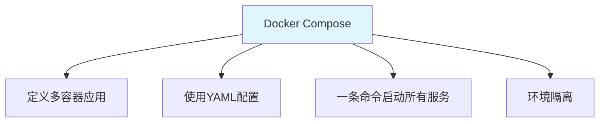
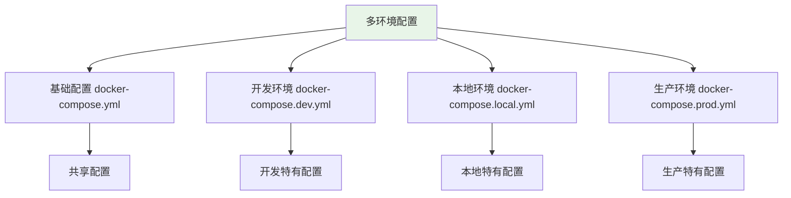

# Docker Compose 多环境声明式编排：.dev / .local / .prod 配置分离

> **一句话**：Docker Compose是定义和运行多容器Docker应用的工具，通过配置文件可以轻松管理多个服务。多环境编排允许为开发、本地、生产等不同环境使用不同的配置。

## 1. Docker Compose 基础

### 1.1 什么是Docker Compose？



**Docker Compose**：一个用于定义和运行多容器Docker应用程序的工具，使用YAML文件配置应用的服务。

### 1.2 基础配置

```yaml
# docker-compose.yml
version: '3.8'

services:
  web:
    build: .
    ports:
      - "8000:8000"
    environment:
      - DATABASE_URL=postgresql://user:pass@db:5432/mydb
    depends_on:
      - db
  
  db:
    image: postgres:15
    environment:
      - POSTGRES_USER=user
      - POSTGRES_PASSWORD=pass
      - POSTGRES_DB=mydb
    volumes:
      - postgres_data:/var/lib/postgresql/data

volumes:
  postgres_data:
```

## 2. 多环境配置

### 2.1 环境分离策略



### 2.2 基础配置

```yaml
# docker-compose.yml（基础配置）
version: '3.8'

services:
  app:
    build:
      context: .
      dockerfile: Dockerfile
    ports:
      - "8000:8000"
    environment:
      - APP_ENV=development
    volumes:
      - .:/app
    command: uvicorn app:app --host 0.0.0.0 --port 8000 --reload

  db:
    image: postgres:15
    volumes:
      - postgres_data:/var/lib/postgresql/data

  redis:
    image: redis:alpine

volumes:
  postgres_data:
```

### 2.3 开发环境配置

```yaml
# docker-compose.dev.yml
version: '3.8'

services:
  app:
    environment:
      - APP_ENV=development
      - DEBUG=true
      - DATABASE_URL=postgresql://user:pass@db:5432/mydb_dev
    volumes:
      - .:/app
      - ./logs:/app/logs
    command: uvicorn app:app --host 0.0.0.0 --port 8000 --reload

  db:
    environment:
      - POSTGRES_DB=mydb_dev
    ports:
      - "5432:5432"

  redis:
    ports:
      - "6379:6379"
```

### 2.4 本地环境配置

```yaml
# docker-compose.local.yml
version: '3.8'

services:
  app:
    environment:
      - APP_ENV=local
      - DEBUG=true
      - DATABASE_URL=postgresql://user:pass@db:5432/mydb_local
    volumes:
      - .:/app
    command: uvicorn app:app --host 0.0.0.0 --port 8000 --reload

  db:
    environment:
      - POSTGRES_DB=mydb_local
    ports:
      - "5432:5432"
    volumes:
      - postgres_local_data:/var/lib/postgresql/data

  redis:
    ports:
      - "6379:6379"

volumes:
  postgres_local_data:
```

### 2.5 生产环境配置

```yaml
# docker-compose.prod.yml
version: '3.8'

services:
  app:
    environment:
      - APP_ENV=production
      - DEBUG=false
      - DATABASE_URL=postgresql://user:pass@db:5432/mydb_prod
    deploy:
      replicas: 3
      resources:
        limits:
          cpus: '0.5'
          memory: 512M
    command: uvicorn app:app --host 0.0.0.0 --port 8000

  db:
    environment:
      - POSTGRES_DB=mydb_prod
    volumes:
      - postgres_prod_data:/var/lib/postgresql/data
    deploy:
      resources:
        limits:
          cpus: '1.0'
          memory: 1G

  redis:
    command: redis-server --appendonly yes
    volumes:
      - redis_prod_data:/data

volumes:
  postgres_prod_data:
  redis_prod_data:
```

## 3. 环境变量管理

### 3.1 使用.env文件

```bash
# .env文件
APP_ENV=development
DEBUG=true
DATABASE_URL=postgresql://user:pass@db:5432/mydb
SECRET_KEY=dev-secret-key
```

```yaml
# docker-compose.yml
version: '3.8'

services:
  app:
    env_file:
      - .env
    environment:
      - APP_ENV=${APP_ENV}
      - DEBUG=${DEBUG}
```

### 3.2 环境特定.env文件

```bash
# .env.dev
APP_ENV=development
DEBUG=true
DATABASE_URL=postgresql://user:pass@db:5432/mydb_dev
SECRET_KEY=dev-secret-key

# .env.prod
APP_ENV=production
DEBUG=false
DATABASE_URL=postgresql://user:pass@db:5432/mydb_prod
SECRET_KEY=prod-secret-key
```

### 3.3 使用环境变量文件

```yaml
# docker-compose.dev.yml
version: '3.8'

services:
  app:
    env_file:
      - .env.dev
```

## 4. 常用命令

### 4.1 启动服务

```bash
# 使用基础配置启动
docker-compose up -d

# 使用开发环境配置启动
docker-compose -f docker-compose.yml -f docker-compose.dev.yml up -d

# 使用生产环境配置启动
docker-compose -f docker-compose.yml -f docker-compose.prod.yml up -d
```

### 4.2 停止服务

```bash
# 停止所有服务
docker-compose down

# 停止并删除卷
docker-compose down -v
```

### 4.3 查看日志

```bash
# 查看所有服务日志
docker-compose logs -f

# 查看特定服务日志
docker-compose logs -f app
```

### 4.4 执行命令

```bash
# 在运行中的容器中执行命令
docker-compose exec app python manage.py migrate

# 启动新容器执行命令
docker-compose run --rm app python manage.py createsuperuser
```

## 5. 实际案例

### 5.1 FastAPI + PostgreSQL + Redis

```yaml
# docker-compose.yml
version: '3.8'

services:
  app:
    build: .
    ports:
      - "8000:8000"
    environment:
      - DATABASE_URL=postgresql://user:pass@db:5432/mydb
      - REDIS_URL=redis://redis:6379
    depends_on:
      - db
      - redis

  db:
    image: postgres:15
    environment:
      - POSTGRES_USER=user
      - POSTGRES_PASSWORD=pass
      - POSTGRES_DB=mydb
    volumes:
      - postgres_data:/var/lib/postgresql/data

  redis:
    image: redis:alpine
    volumes:
      - redis_data:/data

volumes:
  postgres_data:
  redis_data:
```

### 5.2 多环境部署脚本

```bash
#!/bin/bash
# deploy.sh

ENV=${1:-dev}

case $ENV in
  dev)
    docker-compose -f docker-compose.yml -f docker-compose.dev.yml up -d
    ;;
  local)
    docker-compose -f docker-compose.yml -f docker-compose.local.yml up -d
    ;;
  prod)
    docker-compose -f docker-compose.yml -f docker-compose.prod.yml up -d
    ;;
  *)
    echo "Usage: $0 {dev|local|prod}"
    exit 1
    ;;
esac
```

## 6. 常见坑点

### 1. 环境变量冲突
```yaml
# 问题：环境变量在多个地方定义
services:
  app:
    environment:
      - APP_ENV=development
    env_file:
      - .env  # 可能覆盖上面的设置

# 解决：明确优先级，env_file优先级低于environment
```

### 2. 服务启动顺序
```yaml
# 问题：app启动时db还没准备好
services:
  app:
    depends_on:
      - db
    # depends_on只保证容器启动顺序，不保证服务就绪

# 解决：使用healthcheck
services:
  db:
    image: postgres:15
    healthcheck:
      test: ["CMD-SHELL", "pg_isready -U user -d mydb"]
      interval: 10s
      timeout: 5s
      retries: 5
  
  app:
    depends_on:
      db:
        condition: service_healthy
```

### 3. 卷权限问题
```yaml
# 问题：容器内外用户权限不一致
services:
  app:
    volumes:
      - .:/app  # 可能导致权限问题

# 解决：指定用户
services:
  app:
    user: "1000:1000"  # 指定用户ID和组ID
    volumes:
      - .:/app
```

## 核心要点

```yaml
# 多环境配置
docker-compose -f docker-compose.yml -f docker-compose.dev.yml up -d

# 环境变量
environment:
  - KEY=value
env_file:
  - .env

# 常用命令
docker-compose up -d      # 启动
docker-compose down        # 停止
docker-compose logs -f     # 日志
docker-compose exec app bash  # 进入容器
```

## 速记卡（面试闪卡）

**Q1：一句话讲清「Docker Compose 多环境声明式编排：.dev / .local / .prod 配置分离」到底是什么？**
A：**Docker Compose**：一个用于定义和运行多容器Docker应用程序的工具，使用YAML文件配置应用的服务。

**Q2：1. Docker Compose 基础 —— 怎么理解？**
A：**Docker Compose**：一个用于定义和运行多容器Docker应用程序的工具，使用YAML文件配置应用的服务。

**Q3：核心速记主线有哪些？**
A：抓住这几根：1. Docker Compose 基础、2. 多环境配置、3. 环境变量管理、4. 常用命令、5. 实际案例、6. 常见坑点。


## 相关链接

- 📋 目录：[[00-工程化与部署]]
- 📚 学习清单：[[技术学习清单#工程化与部署]]
- 🔗 [[01-Docker多阶段构建|Docker多阶段构建]]
- 🔗 [[04-GitHub-Actions-CI流水线|GitHub Actions CI]]
- 项目实践：[[项目实战/ai-resume笔记/01_技术研读/01_架构概览|ai-resume: 架构概览]]
- 项目实践：[[项目实战/cr-agent笔记/01-技术研读/12-项目规格与TechStack|cr-agent: 项目规格与TechStack]]
