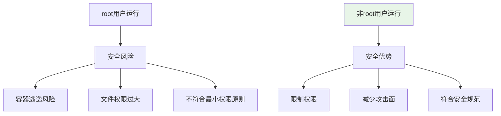
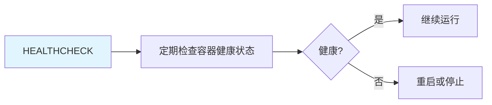
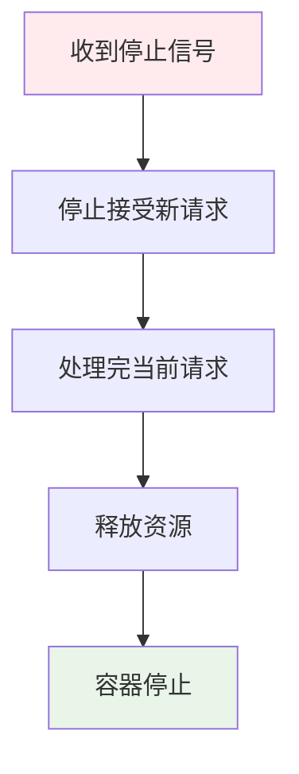

# Docker 最佳实践：非 root 用户 + HEALTHCHECK + 优雅关闭

> **一句话**：Docker最佳实践包括使用非root用户运行容器、添加健康检查、实现优雅关闭等，可以提高容器的安全性和可靠性。

## 1. 非root用户运行

### 1.1 为什么需要非root用户？



**安全风险**：
- 容器逃逸：root用户可能突破容器隔离
- 文件权限：root可以修改系统文件
- 最小权限原则：应该只授予必要的权限

### 1.2 实现方法

```dockerfile
# 创建非root用户
RUN groupadd -r appuser && useradd -r -g appuser appuser

# 设置工作目录权限
WORKDIR /app
RUN chown -R appuser:appuser /app

# 切换到非root用户
USER appuser

# 运行应用
CMD ["python", "app.py"]
```

### 1.3 完整示例

```dockerfile
FROM python:3.11-slim

# 安装系统依赖
RUN apt-get update && apt-get install -y \
    build-essential \
    && rm -rf /var/lib/apt/lists/*

# 创建非root用户
RUN groupadd -r appuser && useradd -r -g appuser -d /app -s /sbin/nologin appuser

# 设置工作目录
WORKDIR /app

# 复制依赖文件
COPY requirements.txt .
RUN pip install --user -r requirements.txt

# 复制应用代码
COPY . .

# 设置权限
RUN chown -R appuser:appuser /app

# 切换到非root用户
USER appuser

# 设置环境变量
ENV PATH=/home/appuser/.local/bin:$PATH

# 暴露端口
EXPOSE 8000

# 运行应用
CMD ["uvicorn", "app:app", "--host", "0.0.0.0", "--port", "8000"]
```

## 2. HEALTHCHECK 健康检查

### 2.1 什么是HEALTHCHECK？



**HEALTHCHECK**：Docker指令，用于定期检查容器的健康状态。

### 2.2 实现方法

```dockerfile
# 基础健康检查
HEALTHCHECK --interval=30s --timeout=3s --start-period=5s --retries=3 \
  CMD curl -f http://localhost:8000/health || exit 1

# 使用自定义脚本
HEALTHCHECK --interval=30s --timeout=3s --start-period=5s --retries=3 \
  CMD python health_check.py || exit 1
```

### 2.3 参数说明

| 参数 | 说明 | 默认值 |
|------|------|--------|
| interval | 检查间隔 | 30s |
| timeout | 超时时间 | 3s |
| start-period | 启动等待时间 | 0s |
| retries | 重试次数 | 3 |

### 2.4 健康检查脚本

```python
# health_check.py
import requests
import sys

def health_check():
    try:
        response = requests.get("http://localhost:8000/health", timeout=5)
        if response.status_code == 200:
            print("Health check passed!")
            return True
    except Exception as e:
        print(f"Health check failed: {e}")
    
    return False

if __name__ == "__main__":
    success = health_check()
    sys.exit(0 if success else 1)
```

## 3. 优雅关闭

### 3.1 什么是优雅关闭？



**优雅关闭**：容器收到停止信号后，先处理完当前请求，再停止运行。

### 3.2 实现方法

```dockerfile
# 设置停止信号
STOPSIGNAL SIGTERM

# 设置停止超时时间
STOPSIGNAL SIGTERM
# 或在docker-compose.yml中
# stop_grace_period: 30s
```

### 3.3 应用代码实现

```python
# FastAPI应用实现优雅关闭
from fastapi import FastAPI
import signal
import asyncio

app = FastAPI()

@app.on_event("startup")
async def startup():
    print("Starting up...")

@app.on_event("shutdown")
async def shutdown():
    print("Shutting down gracefully...")
    # 清理资源
    await close_database_connections()
    await stop_background_tasks()

# 或使用现代方式
from contextlib import asynccontextmanager

@asynccontextmanager
async def lifespan(app: FastAPI):
    # 启动
    print("Starting up...")
    yield
    # 关闭
    print("Shutting down gracefully...")
    await close_database_connections()

app = FastAPI(lifespan=lifespan)
```

### 3.4 Docker Compose配置

```yaml
# docker-compose.yml
services:
  app:
    build: .
    stop_grace_period: 30s  # 30秒内完成当前请求
    stop_signal: SIGTERM
```

## 4. 其他最佳实践

### 4.1 使用.dockerignore

```dockerignore
# .dockerignore
.git
.github
.vscode
__pycache__
*.pyc
*.pyo
.env
.venv
venv
node_modules
dist
build
*.md
!README.md
```

### 4.2 多阶段构建

```dockerfile
# 使用多阶段构建减少镜像体积
FROM python:3.11 as builder
WORKDIR /app
COPY requirements.txt .
RUN pip install --user -r requirements.txt

FROM python:3.11-slim
WORKDIR /app
COPY --from=builder /root/.local /root/.local
COPY . .
ENV PATH=/root/.local/bin:$PATH
CMD ["python", "app.py"]
```

### 4.3 固定版本标签

```dockerfile
# 不好：使用latest标签
FROM python:latest

# 好：使用固定版本标签
FROM python:3.11.4-slim
```

### 4.4 减少层数

```dockerfile
# 不好：每条命令一层
RUN apt-get update
RUN apt-get install -y build-essential
RUN rm -rf /var/lib/apt/lists/*

# 好：合并命令
RUN apt-get update && \
    apt-get install -y build-essential && \
    rm -rf /var/lib/apt/lists/*
```

## 5. 实际案例

### 5.1 FastAPI应用最佳实践

```dockerfile
FROM python:3.11-slim

# 安装系统依赖
RUN apt-get update && apt-get install -y \
    curl \
    && rm -rf /var/lib/apt/lists/*

# 创建非root用户
RUN groupadd -r appuser && useradd -r -g appuser appuser

# 设置工作目录
WORKDIR /app

# 复制依赖文件
COPY requirements.txt .
RUN pip install --user -r requirements.txt

# 复制应用代码
COPY . .

# 设置权限
RUN chown -R appuser:appuser /app

# 切换到非root用户
USER appuser

# 设置环境变量
ENV PATH=/home/appuser/.local/bin:$PATH
ENV PYTHONDONTWRITEBYTECODE=1
ENV PYTHONUNBUFFERED=1

# 暴露端口
EXPOSE 8000

# 健康检查
HEALTHCHECK --interval=30s --timeout=3s --start-period=5s --retries=3 \
  CMD curl -f http://localhost:8000/health || exit 1

# 优雅关闭
STOPSIGNAL SIGTERM

# 运行应用
CMD ["uvicorn", "app:app", "--host", "0.0.0.0", "--port", "8000"]
```

## 6. 常见坑点

### 1. 忘记设置HEALTHCHECK
```dockerfile
# 问题：容器无法被Docker健康检查监控
# 解决：添加HEALTHCHECK指令
HEALTHCHECK --interval=30s --timeout=3s --retries=3 \
  CMD curl -f http://localhost:8000/health || exit 1
```

### 2. 优雅关闭超时
```dockerfile
# 问题：容器在处理请求时被强制停止
# 解决：设置足够的停止超时时间
STOPSIGNAL SIGTERM
# 或在docker-compose.yml中
# stop_grace_period: 60s
```

### 3. 非root用户权限问题
```dockerfile
# 问题：非root用户无法访问某些文件
# 解决：确保文件权限正确
RUN chown -R appuser:appuser /app
```

## 核心要点

```dockerfile
# 非root用户
RUN groupadd -r appuser && useradd -r -g appuser appuser
USER appuser

# 健康检查
HEALTHCHECK --interval=30s --timeout=3s --retries=3 \
  CMD curl -f http://localhost:8000/health || exit 1

# 优雅关闭
STOPSIGNAL SIGTERM
# 或 docker-compose.yml: stop_grace_period: 30s
```

## 速记卡（面试闪卡）

**Q1：一句话讲清「Docker 最佳实践：非 root 用户 + HEALTHCHECK + 优雅关闭」到底是什么？**
A：**安全风险**：
容器逃逸：root用户可能突破容器隔离
文件权限：root可以修改系统文件
最小权限原则：应该只授予必要的权限

**Q2：1. 非root用户运行 —— 怎么理解？**
A：**安全风险**：
容器逃逸：root用户可能突破容器隔离
文件权限：root可以修改系统文件
最小权限原则：应该只授予必要的权限

**Q3：2. HEALTHCHECK 健康检查 —— 怎么理解？**
A：**HEALTHCHECK**：Docker指令，用于定期检查容器的健康状态。
| 参数 | 说明 | 默认值 |
|------|------|--------|
| interval | 检查间隔 | 30s |
| timeout | 超时时间 | 3s |
| start-period | 启动等待时间 | 0s |
| retries | 重试次数 | 3 |

**Q4：3. 优雅关闭 —— 怎么理解？**
A：**优雅关闭**：容器收到停止信号后，先处理完当前请求，再停止运行。

**Q5：核心速记主线有哪些？**
A：抓住这几根：1. 非root用户运行、2. HEALTHCHECK 健康检查、3. 优雅关闭、4. 其他最佳实践、5. 实际案例、6. 常见坑点。


## 相关链接

- 📋 目录：[[00-工程化与部署]]
- 📚 学习清单：[[技术学习清单#工程化与部署]]
- 🔗 [[01-Docker多阶段构建|Docker多阶段构建]]
- 🔗 [[02-Docker-Compose多环境编排|Docker Compose多环境]]
- 项目实践：[[项目实战/ai-resume笔记/01_技术研读/01_架构概览|ai-resume: 架构概览]]
- 项目实践：[[项目实战/cr-agent笔记/01-技术研读/12-项目规格与TechStack|cr-agent: 项目规格与TechStack]]
