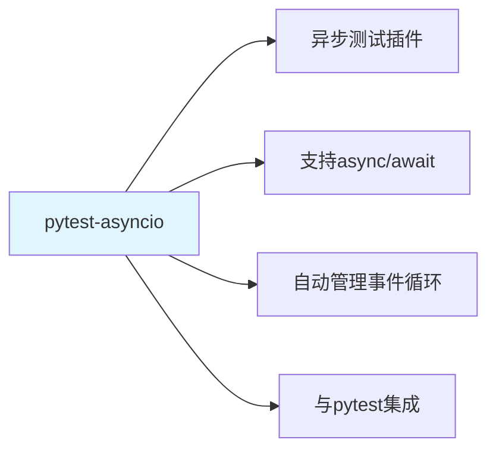
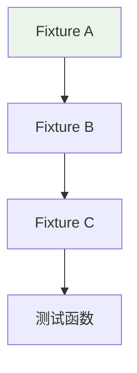
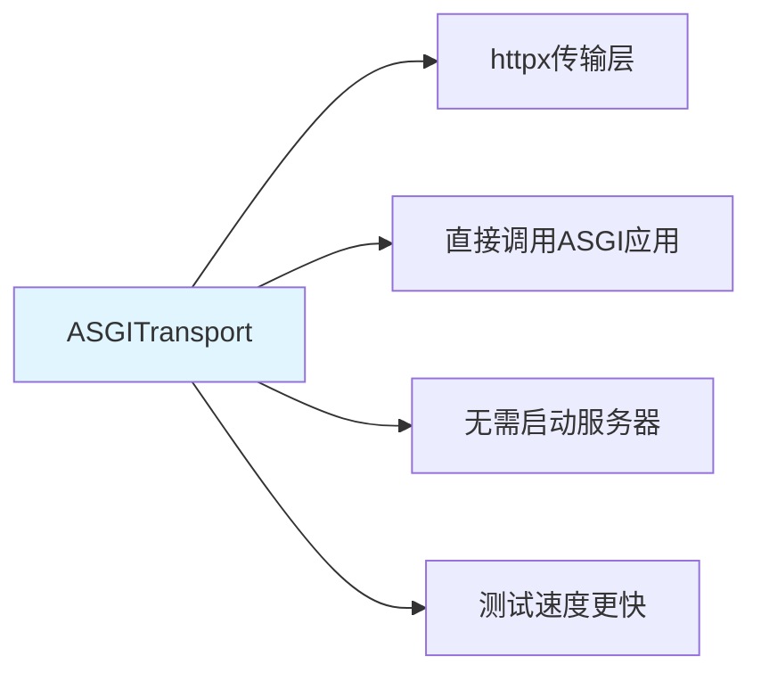

---

title: "pytest 异步测试基础设施：pytest-asyncio + fixture 链 + ASGITransport 无服务器测试"

tags:

  - pytest

  - 技术学习

created: "2026-07-21"

---

# pytest 异步测试基础设施：pytest-asyncio + fixture 链 + ASGITransport 无服务器测试

> **一句话**：pytest-asyncio是pytest的异步测试插件，支持async/await语法。结合ASGITransport可以实现无服务器测试，不需要启动真实的Web服务器。

## 1. pytest-asyncio 基础
### 1.1 什么是pytest-asyncio？



**pytest-asyncio**：pytest的异步测试插件，支持async/await语法。

### 1.2 安装和配置

```bash

# 安装

pip install pytest-asyncio

```

```ini

# pytest.ini

[pytest]

asyncio_mode = auto

```

### 1.3 基础用法

```python

# test_example.py

import pytest

@pytest.mark.asyncio

async def test_async_function():

    result = await some_async_function()

    assert result == expected_value

# 或使用auto模式

async def test_async_function_auto():

    result = await some_async_function()

    assert result == expected_value

```

## 2. Fixture 链
### 2.1 什么是Fixture链？



**Fixture链**：多个fixture之间的依赖关系，形成链式调用。

### 2.2 异步Fixture

```python

# conftest.py

import pytest

import asyncio

from httpx import AsyncClient, ASGITransport

@pytest.fixture

async def async_client():

    """异步HTTP客户端fixture"""

    transport = ASGITransport(app=app)

    async with AsyncClient(transport=transport, base_url="http://test") as client:

        yield client

@pytest.fixture

async def async_db_session():

    """异步数据库会话fixture"""

    async with async_session() as session:

        yield session

        await session.rollback()

@pytest.fixture

async def async_user(async_db_session):

    """异步用户fixture"""

    user = User(name="test", email="test@example.com")

    async_db_session.add(user)

    await async_db_session.commit()

    yield user

    await async_db_session.delete(user)

    await async_db_session.commit()

```

### 2.3 Fixture链示例

```python

# test_user.py

import pytest

@pytest.mark.asyncio

async def test_create_user(async_client, async_user):

    """测试创建用户"""

    response = await async_client.post("/users/", json={

        "name": "new_user",

        "email": "new@example.com"

    })

    assert response.status_code == 200

    assert response.json()["name"] == "new_user"

@pytest.mark.asyncio

async def test_get_user(async_client, async_user):

    """测试获取用户"""

    response = await async_client.get(f"/users/{async_user.id}")

    assert response.status_code == 200

    assert response.json()["name"] == "test"

```

## 3. ASGITransport 无服务器测试
### 3.1 什么是ASGITransport？



**ASGITransport**：httpx提供的传输层，可以直接调用ASGI应用，无需启动服务器。

### 3.2 基础用法

```python

# test_api.py

import pytest

from httpx import AsyncClient, ASGITransport

from app.main import app

@pytest.mark.asyncio

async def test_read_main():

    transport = ASGITransport(app=app)

    async with AsyncClient(transport=transport, base_url="http://test") as client:

        response = await client.get("/")

        assert response.status_code == 200

        assert response.json() == {"Hello": "World"}

```

### 3.3 完整示例

```python

# conftest.py

import pytest

from httpx import AsyncClient, ASGITransport

from app.main import app

@pytest.fixture

async def client():

    transport = ASGITransport(app=app)

    async with AsyncClient(transport=transport, base_url="http://test") as client:

        yield client

# test_api.py

import pytest

@pytest.mark.asyncio

async def test_create_item(client):

    response = await client.post("/items/", json={"name": "test"})

    assert response.status_code == 200

    assert response.json()["name"] == "test"

@pytest.mark.asyncio

async def test_read_items(client):

    response = await client.get("/items/")

    assert response.status_code == 200

    assert isinstance(response.json(), list)

```

## 4. 测试数据库
### 4.1 异步数据库测试

```python

# conftest.py

import pytest

from sqlalchemy.ext.asyncio import create_async_engine, AsyncSession

from sqlalchemy.orm import sessionmaker

TEST_DATABASE_URL = "sqlite+aiosqlite:///./test.db"

engine = create_async_engine(TEST_DATABASE_URL)

async_session = sessionmaker(engine, class_=AsyncSession, expire_on_commit=False)

@pytest.fixture

async def db_session():

    async with engine.begin() as conn:

        await conn.run_sync(Base.metadata.create_all)

    async with async_session() as session:

        yield session

        await session.rollback()

    async with engine.begin() as conn:

        await conn.run_sync(Base.metadata.drop_all)

```

### 4.2 测试数据

```python

# conftest.py

@pytest.fixture

async def test_user(db_session):

    user = User(name="test", email="test@example.com")

    db_session.add(user)

    await db_session.commit()

    await db_session.refresh(user)

    yield user

    await db_session.delete(user)

    await db_session.commit()

```

## 5. 高级用法
### 5.1 参数化测试

```python

import pytest

@pytest.mark.asyncio

@pytest.mark.parametrize("input,expected", [

    (1, 2),

    (2, 4),

    (3, 6),

])

async def test_double(input, expected):

    result = await double_async(input)

    assert result == expected

```

### 5.2 异常测试

```python

import pytest

@pytest.mark.asyncio

async def test_async_exception():

    with pytest.raises(ValueError):

        await async_function_that_raises()

```

### 5.3 超时测试

```python

import pytest

@pytest.mark.asyncio

async def test_async_timeout():

    with pytest.raises(asyncio.TimeoutError):

        await asyncio.wait_for(slow_async_function(), timeout=1.0)

```

## 6. 实际案例
### 6.1 FastAPI项目测试

```python

# tests/test_users.py

import pytest

from httpx import AsyncClient

@pytest.mark.asyncio

async def test_create_user(client):

    response = await client.post("/users/", json={

        "name": "Alice",

        "email": "alice@example.com"

    })

    assert response.status_code == 200

    data = response.json()

    assert data["name"] == "Alice"

    assert "id" in data

@pytest.mark.asyncio

async def test_get_user(client, test_user):

    response = await client.get(f"/users/{test_user.id}")

    assert response.status_code == 200

    assert response.json()["name"] == "test"

@pytest.mark.asyncio

async def test_get_users(client, test_user):

    response = await client.get("/users/")

    assert response.status_code == 200

    assert len(response.json()) >= 1

```

## 7. 常见坑点
### 1. 忘记标记异步测试

```python

# 问题：异步测试没有标记@pytest.mark.asyncio

async def test_async():

    result = await async_function()

    assert result

# 解决：添加标记

@pytest.mark.asyncio

async def test_async():

    result = await async_function()

    assert result

```

### 2. Fixture作用域

```python

# 问题：fixture作用域不正确

@pytest.fixture

async def db_session():

    # 每个测试都创建新会话

    async with async_session() as session:

        yield session

# 解决：使用适当的作用域

@pytest.fixture(scope="session")

async def db_session():

    # 整个测试会话共享一个会话

    async with async_session() as session:

        yield session

```

### 3. 异步上下文管理器

```python

# 问题：异步上下文管理器使用错误

async def test_async_context():

    async with async_context_manager() as ctx:

        # 错误：没有等待异步操作

        ctx.do_something()

# 解决：正确使用异步上下文管理器

async def test_async_context():

    async with async_context_manager() as ctx:

        await ctx.do_something_async()

```

## 核心要点

```python

# 安装

pip install pytest-asyncio

# 测试函数

@pytest.mark.asyncio

async def test_example():

    result = await async_function()

    assert result

# Fixture

@pytest.fixture

async def async_fixture():

    async with context_manager() as ctx:

        yield ctx

```

## 速记卡（面试闪卡）

**Q1：一句话讲清「pytest 异步测试基础设施：pytest-asyncio + fixture 链 + ASGITransport 无服务器测试」到底是什么？**

A：pytest-asyncio 跑异步测试，fixture 链组装依赖，ASGITransport 免起服务器。

**Q2：1. pytest-asyncio 基础 —— 让 pytest 跑协程 —— 怎么理解？**

A：pytest-asyncio 像给 pytest 装了个异步翻译官：用 @pytest.mark.asyncio 标记，它就自动开事件循环把 async 函数跑完，再判断言。英文 asyncio_mode=auto。

**Q3：2. Fixture 链 —— 依赖接力棒 —— 怎么理解？**

A：Fixture 像乐高底座：一个 fixture 可以依赖另一个（async_user 依赖 async_db_session），pytest 自动按依赖顺序搭好再喂给测试，像接力棒一级级传。英文 fixture chain。

**Q4：3. ASGITransport 无服务器测试 —— 直连应用 —— 怎么理解？**

A：ASGITransport 像内部电梯：不走 HTTP 端口、不启动真实服务器，直接把请求送进 ASGI app 内部跑完。测试秒级、还不用占端口。英文 ASGITransport。

**Q5：4. 测试数据库与高级用法 —— 怎么理解？**

A：测试库用内存 sqlite + 异步 engine，每个用例建表、跑完 rollback 清空；再配合 parametrize 批量测、pytest.raises 验异常、wait_for 验超时，覆盖各种边界。英文 rollback / parametrize。

**Q6：核心速记主线有哪些？**

- pytest-asyncio：asyncio_mode=auto 自动跑协程测试

- Fixture 链：fixture 互相依赖，自动组装测试上下文

- ASGITransport：直连 ASGI 应用，免起真实服务器

- 测试库：内存 sqlite + rollback，用例间互不污染

- 高级：parametrize 参数化、raises 验异常、超时测试

**口诀**

A：pytest 异步靠 asyncio，

fixture 链把依赖抱；

不走端口直接跑，

无服务器测试真轻巧。

## 相关链接

- 📋 目录：[[00-工程化与部署]]

- 📚 学习清单：[[技术学习路线图#工程化与部署]]

- 🔗 unittest.mock

- 🔗 [[07-pre-commit代码规范|pre-commit代码规范]]

