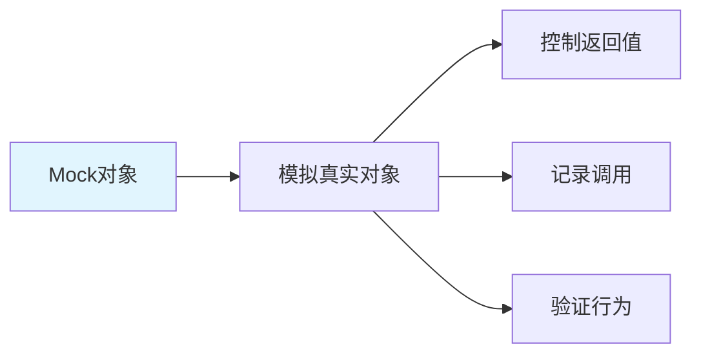

---

title: "unittest.mock：AsyncMock / MagicMock / patch 模拟外部 LLM 服务"

tags:

  - unittest

  - 技术学习

created: "2026-07-21"

---

# unittest.mock：AsyncMock / MagicMock / patch 模拟外部 LLM 服务

> **一句话**：unittest.mock是Python标准库的mock模块，可以模拟对象和函数的行为。在测试中，常用于模拟外部服务（如LLM API、数据库）以隔离测试环境。

## 1. unittest.mock 基础
### 1.1 什么是mock？



**Mock**：模拟对象，用于替代真实对象进行测试。

### 1.2 基础用法

```python

from unittest.mock import Mock, MagicMock, patch

# 创建Mock对象

mock_obj = Mock()

# 设置返回值

mock_obj.method.return_value = "mocked result"

# 调用方法

result = mock_obj.method()

assert result == "mocked result"

# 验证调用

mock_obj.method.assert_called_once()

```

## 2. MagicMock vs Mock
### 2.1 MagicMock

```python

from unittest.mock import MagicMock

# MagicMock支持魔法方法

mock = MagicMock()

mock.__len__.return_value = 10

# 可以直接使用len()

assert len(mock) == 10

# Mock不支持魔法方法

mock_basic = Mock()

# len(mock_basic)  # 会报错

```

### 2.2 选择建议

| 特性 | Mock | MagicMock |
|------|------|-----------|
| 魔法方法 | ❌ | ✅ |
| 属性访问 | ✅ | ✅ |
| 方法调用 | ✅ | ✅ |
| 上下文管理器 | ❌ | ✅ |
| 迭代器 | ❌ | ✅ |

## 3. AsyncMock
### 3.1 什么是AsyncMock？

```python

from unittest.mock import AsyncMock

# 创建异步Mock

mock_async = AsyncMock()

# 设置异步返回值

mock_async.async_method.return_value = "async result"

# 异步调用

async def test_async():

    result = await mock_async.async_method()

    assert result == "async result"

```

### 3.2 异步上下文管理器

```python

from unittest.mock import AsyncMock, MagicMock

# 异步上下文管理器

mock_context = AsyncMock()

mock_context.__aenter__.return_value = mock_context

mock_context.__aexit__.return_value = None

# 使用

async def test_async_context():

    async with mock_context as ctx:

        await ctx.do_something()

```

## 4. patch 装饰器
### 4.1 基础用法

```python

from unittest.mock import patch

# 装饰器形式

@patch('app.module.function')

def test_with_patch(mock_function):

    mock_function.return_value = "patched"

    result = app.module.function()

    assert result == "patched"

# 上下文管理器形式

def test_with_context():

    with patch('app.module.function') as mock_function:

        mock_function.return_value = "patched"

        result = app.module.function()

        assert result == "patched"

```

### 4.2 patch方法

```python

from unittest.mock import patch, MagicMock

# patch返回值

@patch('app.module.function')

def test_patch_return_value(mock_function):

    mock_function.return_value = 42

    assert app.module.function() == 42

# patch侧效果

@patch('app.module.function')

def test_patch_side_effect(mock_function):

    mock_function.side_effect = [1, 2, 3]

    assert app.module.function() == 1

    assert app.module.function() == 2

    assert app.module.function() == 3

# patch异常

@patch('app.module.function')

def test_patch_exception(mock_function):

    mock_function.side_effect = ValueError("error")

    with pytest.raises(ValueError):

        app.module.function()

```

## 5. 模拟外部LLM服务
### 5.1 模拟OpenAI API

```python

from unittest.mock import AsyncMock, patch

import pytest

# 模拟OpenAI API

@patch('openai.ChatCompletion.acreate')

async def test_mock_openai(mock_create):

    mock_create.return_value = {

        "choices": [

            {

                "message": {

                    "content": "Mocked response"

                }

            }

        ]

    }

    # 调用LLM

    response = await call_llm("test prompt")

    assert response == "Mocked response"

    # 验证调用

    mock_create.assert_called_once()

```

### 5.2 模拟流式响应

```python

@patch('openai.ChatCompletion.acreate')

async def test_mock_streaming(mock_create):

    # 模拟流式响应

    mock_create.return_value = [

        {"choices": [{"delta": {"content": "Hello"}}]},

        {"choices": [{"delta": {"content": " World"}}]},

        {"choices": [{"delta": {}}]}

    ]

    # 测试流式处理

    async for chunk in stream_llm_response("test"):

        assert chunk in ["Hello", " World"]

```

### 5.3 模拟多模型后端

```python

from unittest.mock import AsyncMock, MagicMock

class MockLLMBackend:

    def __init__(self):

        self.call_count = 0

    async def generate(self, prompt):

        self.call_count += 1

        return f"Response {self.call_count}"

# 测试

async def test_multi_model_backend():

    backend = MockLLMBackend()

    response1 = await backend.generate("prompt1")

    assert response1 == "Response 1"

    response2 = await backend.generate("prompt2")

    assert response2 == "Response 2"

    assert backend.call_count == 2

```

## 6. 实际案例
### 6.1 FastAPI测试

```python

# test_api.py

import pytest

from unittest.mock import AsyncMock, patch

from httpx import AsyncClient

@pytest.mark.asyncio

@patch('app.services.llm.call_llm')

async def test_chat_endpoint(mock_llm):

    mock_llm.return_value = "Mocked AI response"

    async with AsyncClient(app=app, base_url="http://test") as client:

        response = await client.post("/chat/", json={"message": "test"})

    assert response.status_code == 200

    assert response.json()["response"] == "Mocked AI response"

    mock_llm.assert_called_once_with("test")

```

### 6.2 模拟数据库

```python

from unittest.mock import AsyncMock, MagicMock

@pytest.fixture

def mock_db_session():

    session = AsyncMock()

    session.commit = AsyncMock()

    session.rollback = AsyncMock()

    return session

@pytest.mark.asyncio

async def test_create_user(mock_db_session):

    # 模拟数据库操作

    user = User(name="test", email="test@example.com")

    mock_db_session.add(user)

    await mock_db_session.commit()

    # 验证调用

    mock_db_session.add.assert_called_once_with(user)

    mock_db_session.commit.assert_called_once()

```

### 6.3 模拟外部API

```python

from unittest.mock import AsyncMock, patch

@patch('httpx.AsyncClient.get')

async def test_external_api(mock_get):

    mock_get.return_value = AsyncMock(

        status_code=200,

        json=lambda: {"data": "test"}

    )

    async with httpx.AsyncClient() as client:

        response = await client.get("https://api.example.com/data")

    assert response.status_code == 200

    assert response.json() == {"data": "test"}

```

## 7. 高级用法
### 7.1 调用计数

```python

from unittest.mock import Mock

mock = Mock()

mock.method()

# 验证调用次数

assert mock.method.call_count == 1

mock.method.assert_called_once()

# 验证调用参数

mock.method.assert_called_with("arg1", "arg2")

```

### 7.2 调用历史

```python

from unittest.mock import Mock

mock = Mock()

mock.method("first")

mock.method("second")

# 获取所有调用

calls = mock.method.call_args_list

assert len(calls) == 2

assert calls[0].args == ("first",)

assert calls[1].args == ("second",)

```

### 7.3 mock属性

```python

from unittest.mock import MagicMock

mock = MagicMock()

mock.attribute = "value"

# 访问属性

assert mock.attribute == "value"

# 验证属性访问

mock.assert_called()

```

## 8. 常见坑点
### 1. 忘记导入

```python

# 解决：确保导入正确的模块

from unittest.mock import Mock, MagicMock, AsyncMock, patch

```

### 2. 异步mock配置错误

```python

# 问题：异步方法没有使用AsyncMock

mock = Mock()

mock.async_method = AsyncMock()  # 正确

# 解决：异步方法使用AsyncMock

```

### 3. patch路径错误

```python

# 问题：patch路径不正确

@patch('app.module.function')  # 可能错误

@patch('app.services.llm.function')  # 正确

# 解决：确保patch路径是导入路径，不是文件路径

```

## 核心要点

```python

from unittest.mock import Mock, MagicMock, AsyncMock, patch

# 基础Mock

mock = Mock()

mock.method.return_value = "result"

# MagicMock（支持魔法方法）

mock = MagicMock()

mock.__len__.return_value = 10

# AsyncMock（异步支持）

mock = AsyncMock()

await mock.async_method()

# patch

@patch('app.module.function')

def test(mock_func):

    mock_func.return_value = "patched"

```

## 速记卡（面试闪卡）

**Q1：一句话讲清「unittest.mock：AsyncMock / MagicMock / patch 模拟外部 LLM 服务」到底是什么？**

A：unittest.mock 用 Mock 替身隔离外部依赖（LLM/DB），控制返回值、记录调用，让测试又快又稳。

**Q2：一、Mock 与 MagicMock（test double） —— 怎么理解？**

A：Mock 是替身对象，替掉真实对象——设 return_value 控制返回，用 assert_called_once 验调用。MagicMock 是增强版，额外支持魔法方法（len()、with 上下文、迭代），普通 Mock 不支持。规则：要用 len/with/for 就上 MagicMock。

**Q3：二、AsyncMock 管异步（async test double） —— 怎么理解？**

A：遇到 async def 的接口（如异步 LLM 调用）必须用 AsyncMock，用 Mock 会报错。设 return_value 后 await 它即可；要模拟异步上下文管理器，配好 __aenter__/__aexit__ 的 return_value。这是测异步代码和流式响应的关键。

**Q4：三、patch 替换目标（monkeypatch） —— 怎么理解？**

A：patch 在测试时把目标对象换成 Mock，用完自动还原。可装饰器 @patch('模块.函数') 或 with patch(...) 上下文。重点：patch 路径是「导入路径」不是文件路径（如 patch('app.services.llm.call_llm')）；side_effect 能模拟多次返回或抛异常。

**Q5：四、实战：模拟 LLM / DB / API（isolate I/O） —— 怎么理解？**

A：测 FastAPI 接口时用 @patch 替掉 call_llm，返回假响应，再 async with AsyncClient 打接口，验状态码与 mock 调用参数。同理 Mock 数据库 session、httpx 外部 API。核心价值：不真调 LLM/不连库，测试快、稳定、可离线跑。

**Q6：核心速记主线有哪些？**

- 概念：Mock 替身隔离外部依赖，控制返回、记录调用

- 选型：要魔法方法/异步用 MagicMock/AsyncMock

- patch：按导入路径替换，装饰器或上下文，自动还原

- 实战：模拟 LLM/DB/API，测试快且可离线

- 易错：异步用 AsyncMock；patch 用导入路径非文件路径

**口诀**

A：unittest.mock 替身立，

外部依赖全隔离；

Magic Async 各司职，

patch 路径要记悉。

## 相关链接

- 📋 目录：[[00-工程化与部署]]

- 📚 学习清单：[[技术学习路线图#工程化与部署]]

- 🔗 [[08-pytest异步测试基础设施|pytest异步测试]]

- 🔗 [[07-pre-commit代码规范|pre-commit代码规范]]

