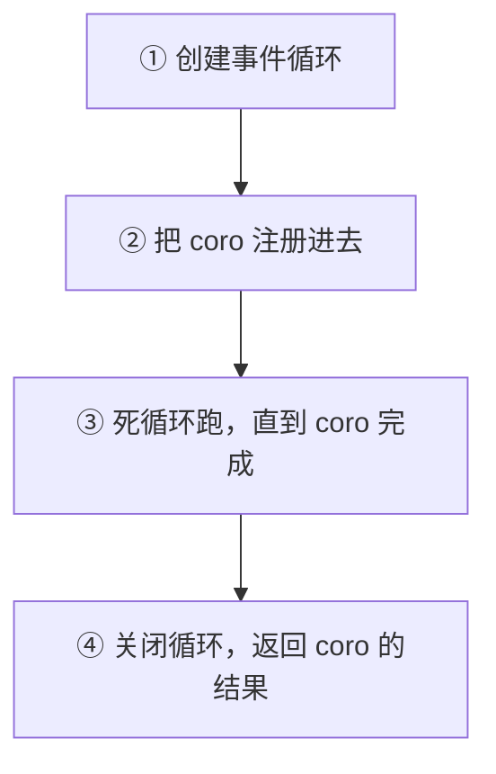
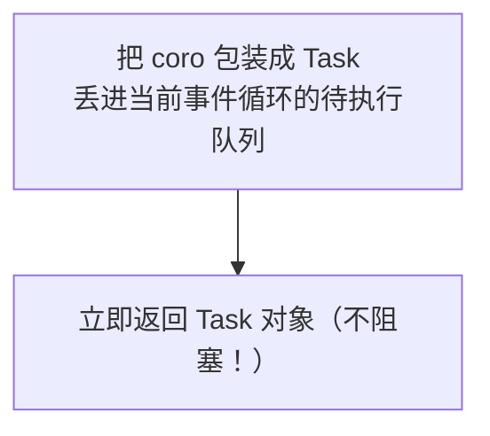

# asyncio 核心 API 与 Task 并发


---

## 三个核心 API

```python
import asyncio

# ① 定义协程函数 — async def 不是普通函数，调用它返回 coroutine 对象，不会立即执行
async def say(name: str, delay: float) -> str:
    await asyncio.sleep(delay)    # 异步版 time.sleep()，不阻塞事件循环
    return f"{name} 说完了"

# ② 运行 — asyncio.run() 创建事件循环 + 跑协程 + 清理，整个程序只调一次
result = asyncio.run(say("小明", 1.0))

# ③ 创建 Task — 不等待，立即把协程"提交到后台"跑
task = asyncio.create_task(say("小红", 2.0))
```

```text
asyncio.run() vs asyncio.create_task():

asyncio.run(coro):
```



```text
  一个程序只调一次，是整个异步程序的"入口"

asyncio.create_task(coro):
```



```text
  拿到的 task 是一个"承诺"——"我会跑的，你先忙"
```

---

## 串行 vs 并发

```python
import asyncio

# ============================================================
# ❌ 串行 — await 一个一个等，白写了 async
# ============================================================
async def download_serial(urls: list[str]) -> list[str]:
    results = []
    for url in urls:
        result = await fetch(url)   # 等 url1 完成才发 url2，跟同步一样慢
        results.append(result)
    return results
    # 10 个 URL → ~10s（每个 1s）

# ============================================================
# ✅ 并发 — create_task 全部发射 + gather 统一收
# ============================================================
async def download_concurrent(urls: list[str]) -> list[str]:
    tasks = [asyncio.create_task(fetch(url)) for url in urls]
    results = await asyncio.gather(*tasks)
    return results
    # 10 个 URL → ~1s（最慢的那个决定总时间）

async def fetch(url: str) -> str:
    print(f"开始请求 {url}")
    await asyncio.sleep(1.0)
    print(f"完成请求 {url}")
    return f"{url} 的内容"
```

```text
时间线对比:

串行 (await 一个一个来):
URL1: [====1s====]
URL2:              [====1s====]
URL3:                           [====1s====]
总时间: 3s

并发 (create_task + gather):
URL1: [====1s====]
URL2: [====1s====]    ← 三个同时跑！
URL3: [====1s====]
总时间: 1s
```

> [!note] 核心原则
> `create_task()` 是"发射"——立即返回不阻塞；`await` 是"等待"——暂停当前协程等结果。**先 create_task 发射全部，再 gather 统一收**，这才是正确的并发姿势。

---

## gather vs Task 四种用法

```python
import asyncio

async def fetch(id: int) -> dict:
    await asyncio.sleep(0.5)
    return {"id": id, "data": f"数据{id}"}

async def main():
    # ============================================================
    # 用法1: gather — 等全部完成，按传入顺序返回结果列表
    # ============================================================
    results = await asyncio.gather(
        fetch(1),
        fetch(2),
        fetch(3),
    )
    # results = [{"id":1,"data":"数据1"}, {"id":2,...}, {"id":3,...}]
    # 返回顺序 = 传入顺序，不是完成顺序

    # ============================================================
    # 用法2: as_completed — 谁先完成先处理谁
    # ============================================================
    tasks = [asyncio.create_task(fetch(i)) for i in range(5)]
    for done_task in asyncio.as_completed(tasks):
        result = await done_task
        print(f"最快完成: {result}")

    # ============================================================
    # 用法3: return_exceptions — 某个任务挂了不影响其他
    # ============================================================
    async def risky_fetch(id: int) -> str:
        if id == 2:
            raise ValueError(f"{id} 炸了")
        await asyncio.sleep(0.3)
        return f"ok_{id}"

    results = await asyncio.gather(
        risky_fetch(1),
        risky_fetch(2),
        risky_fetch(3),
        return_exceptions=True,
    )
    # results = ["ok_1", ValueError("2 炸了"), "ok_3"]
    for i, r in enumerate(results):
        if isinstance(r, Exception):
            print(f"任务{i+1} 失败: {r}")
        else:
            print(f"任务{i+1} 成功: {r}")

    # ============================================================
    # 用法4: wait_for — 加超时控制
    # ============================================================
    async def slow_fetch():
        await asyncio.sleep(10)
        return "太慢了"

    try:
        result = await asyncio.wait_for(slow_fetch(), timeout=2.0)
    except asyncio.TimeoutError:
        print("超时！2 秒没返回，取消请求")
```

---

## 常见错误

```python
# ❌ 错误1：忘记 await — 协程没被执行
async def get_data():
    return "data"

async def main():
    result = get_data()          # 返回 coroutine 对象，不是 "data"！
    print(type(result))          # <class 'coroutine'>

    result = await get_data()    # ✅ await 才真正执行
    print(result)                # "data"


# ❌ 错误2：在协程里用 time.sleep() — 阻塞整个事件循环
import time
async def bad():
    time.sleep(5)                # 整个线程停 5 秒，所有协程都被卡住
    return "done"

async def good():
    await asyncio.sleep(5)       # ✅ 把控制权还给事件循环，别的协程可以跑
    return "done"


# ❌ 错误3：在同步函数里 await
def normal_func():
    await asyncio.sleep(1)       # SyntaxError! 普通函数不能 await

async def coroutine_func():
    await asyncio.sleep(1)       # ✅ 只有 async def 的函数才能用 await


# ❌ 错误4：create_task 之后没保存引用，Task 可能被 GC 回收
async def main():
    asyncio.create_task(fetch(1))   # 没保存引用，Task 可能还没跑就没了

    task = asyncio.create_task(fetch(1))  # ✅ 保存引用
    await task


# ❌ 错误5：在已有事件循环的环境用 asyncio.run()（如 Jupyter）
# asyncio.run(main())   # RuntimeError

# ✅ Jupyter 里直接用 await
# await main()
```

---

## 速查

```python
# 创建并发任务
tasks = [asyncio.create_task(coro) for coro in coros]
results = await asyncio.gather(*tasks)

# 超时控制
try:
    result = await asyncio.wait_for(slow_coro, timeout=5.0)
except asyncio.TimeoutError:
    print("超时")

# 按完成顺序处理
for done in asyncio.as_completed(tasks):
    result = await done
```

---

## 速记卡（面试闪卡）

**Q1：一句话讲清「asyncio 核心 API 与 Task 并发」到底是什么？**
A：---

**Q2：三个核心 API —— 怎么理解？**
A：---

**Q3：串行 vs 并发 —— 怎么理解？**
A：[!note] 核心原则
 是"发射"——立即返回不阻塞； 是"等待"——暂停当前协程等结果。**先 create_task 发射全部，再 gather 统一收**，这才是正确的并发姿势。
---

**Q4：gather vs Task 四种用法 —— 怎么理解？**
A：---

**Q5：常见错误 —— 怎么理解？**
A：---

**Q6：核心速记主线有哪些？**
A：抓住这几根：三个核心 API、串行 vs 并发、gather vs Task 四种用法、常见错误、速查。


## 相关链接

- 下一篇：[[02-aiohttp异步HTTP客户端]]
- 项目实践：[[项目实战/ai-resume笔记/01_技术研读/01_架构概览|ai-resume: 架构概览]]
- 项目实践：[[项目实战/cr-agent笔记/01-技术研读/04-三层容错与并发bug|cr-agent: 三层容错与并发bug]]

---
→ [[技术学习清单#asyncio（AI 后端核心）]]
