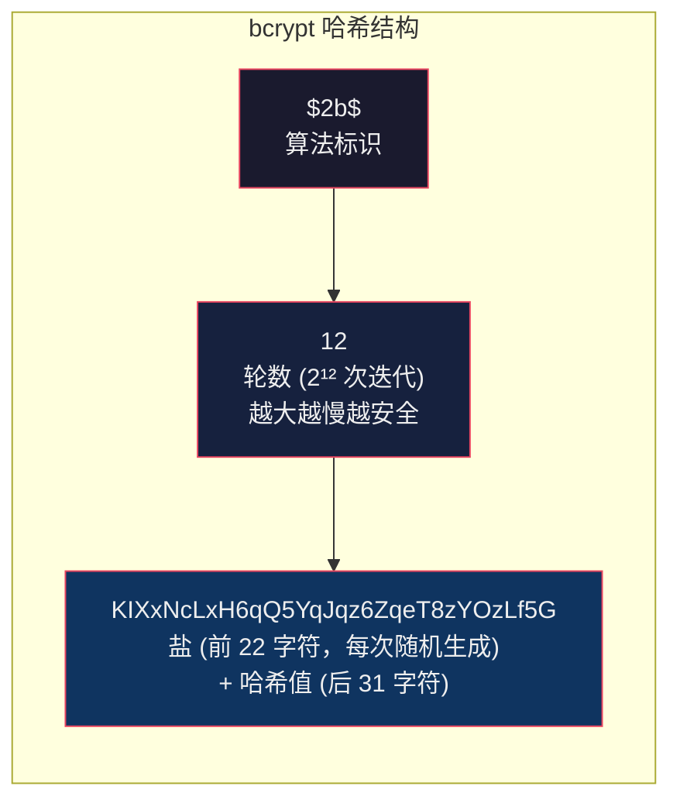
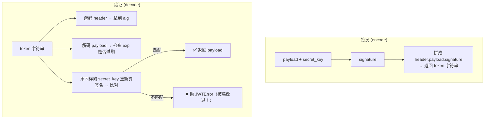
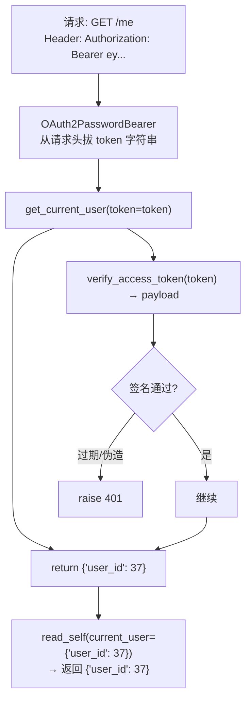
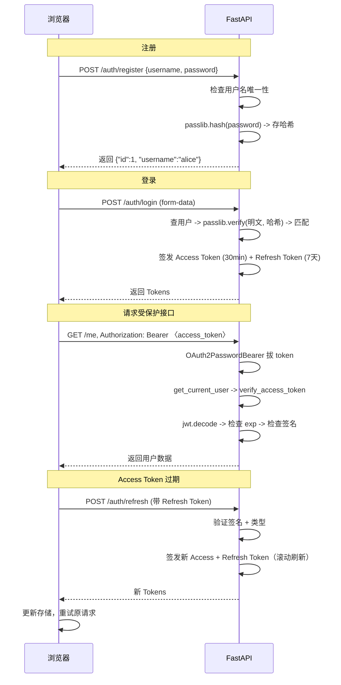

---

title: "FastAPI + JWT 全链路实现"

created: "2025-07-12"

tags:

  - 技术学习

  - python

  - fastapi

  - jwt

  - 鉴权

---

# FastAPI + JWT 全链路实现

---

## 依赖安装

```bash

pip install "python-jose[cryptography]" passlib[bcrypt] python-multipart

```

| 包 | 用途 |
|---|------|
| python-jose | JWT 签发 (encode) + 验证 (decode) |
| passlib | 密码哈希（bcrypt 算法） |
| python-multipart | FastAPI 解析 form-data（登录接口用） |

---

## 第一步：密码哈希 — 永远不存明文

```python

from passlib.context import CryptContext

# 创建密码上下文 — bcrypt 是业界标准

pwd_context = CryptContext(schemes=["bcrypt"], deprecated="auto")

# 哈希密码 — 注册时用

plain_password = "my_secret_123"

hashed = pwd_context.hash(plain_password)

# 验证密码 — 登录时用

is_valid = pwd_context.verify("my_secret_123", hashed)   # → True

is_valid = pwd_context.verify("wrong_password", hashed)  # → False

```



```text

为什么用 bcrypt 而不用 SHA256？

SHA256("password123") → 永远是同一个结果

  → 可以建彩虹表（大量常见密码的 SHA256 结果）

  → 数据库泄露后，查表秒破

bcrypt("password123") → 每次结果不同（随机盐）

  → 无法建彩虹表

  → 验证时 bcrypt 内部把盐取出来，用同样的盐哈希输入的密码再比较

  → 2^12 轮迭代，故意慢（~0.3s），暴力破解成本极高

```

---

## 第二步：JWT 签发 + 验证

```python

from datetime import datetime, timedelta, timezone

from jose import JWTError, jwt

from typing import Optional

# ============================================================

SECRET_KEY = "a3f8b2c1d4e5f6a7b8c9d0e1f2a3b4c5d6e7f8a9b0c1d2e3f4a5b6"

ALGORITHM = "HS256"

ACCESS_TOKEN_EXPIRE_MINUTES = 30

REFRESH_TOKEN_EXPIRE_DAYS = 7

# ============================================================

def create_access_token(data: dict, expires_delta: Optional[timedelta] = None) -> str:

    to_encode = data.copy()

    if expires_delta:

        expire = datetime.now(timezone.utc) + expires_delta

    else:

        expire = datetime.now(timezone.utc) + timedelta(minutes=ACCESS_TOKEN_EXPIRE_MINUTES)

    to_encode.update({"exp": expire, "iat": datetime.now(timezone.utc)})

    encoded_jwt = jwt.encode(to_encode, SECRET_KEY, algorithm=ALGORITHM)

    return encoded_jwt

# ============================================================

def verify_access_token(token: str) -> dict:

    try:

        payload = jwt.decode(token, SECRET_KEY, algorithms=[ALGORITHM])

        return payload

    except JWTError:

        raise

# ============================================================

def create_refresh_token(data: dict) -> str:

    to_encode = data.copy()

    expire = datetime.now(timezone.utc) + timedelta(days=REFRESH_TOKEN_EXPIRE_DAYS)

    to_encode.update({

        "exp": expire,

        "iat": datetime.now(timezone.utc),

        "type": "refresh",

    })

    return jwt.encode(to_encode, SECRET_KEY, algorithm=ALGORITHM)

```



---

## 第三步：FastAPI 依赖注入

```python

from fastapi import Depends, HTTPException, status

from fastapi.security import OAuth2PasswordBearer

# 定义 Token 提取器 — 从请求头 Authorization: Bearer <token> 拔 token

oauth2_scheme = OAuth2PasswordBearer(tokenUrl="/auth/login")

async def get_current_user(token: str = Depends(oauth2_scheme)) -> dict:

    credentials_exception = HTTPException(

        status_code=status.HTTP_401_UNAUTHORIZED,

        detail="无法验证凭据",

        headers={"WWW-Authenticate": "Bearer"},

    )

    try:

        payload = verify_access_token(token)

        user_id: str = payload.get("sub")

        if user_id is None:

            raise credentials_exception

    except JWTError:

        raise credentials_exception

    return {"user_id": int(user_id)}

# 在路由中使用

@app.get("/me")

async def read_self(current_user: dict = Depends(get_current_user)):

    return {"user_id": current_user["user_id"]}

```



> [!note] OAuth2PasswordRequestForm

> 登录接口接收的是 form-data 格式（x-www-form-urlencoded），不是 JSON。这是 FastAPI OAuth2 的默认规范。

---

## 第四步：注册 + 登录 + 刷新 — 完整路由

```python

from fastapi import FastAPI, Depends, HTTPException, status

from fastapi.security import OAuth2PasswordBearer, OAuth2PasswordRequestForm

from pydantic import BaseModel

from datetime import timedelta

app = FastAPI(title="JWT 鉴权 Demo")

# ============================================================

fake_users_db: dict[str, dict] = {}

# ============================================================

class UserRegister(BaseModel):

    username: str

    password: str

class UserOut(BaseModel):

    id: int

    username: str

class TokenResponse(BaseModel):

    access_token: str

    refresh_token: str

    token_type: str = "bearer"

class RefreshRequest(BaseModel):

    refresh_token: str

# ============================================================

@app.post("/auth/register", response_model=UserOut)

async def register(data: UserRegister):

    if data.username in fake_users_db:

        raise HTTPException(status_code=400, detail="用户名已存在")

    hashed_password = pwd_context.hash(data.password)

    user_id = len(fake_users_db) + 1

    fake_users_db[data.username] = {

        "id": user_id,

        "username": data.username,

        "hashed_password": hashed_password,

    }

    return {"id": user_id, "username": data.username}

# ============================================================

@app.post("/auth/login", response_model=TokenResponse)

async def login(form_data: OAuth2PasswordRequestForm = Depends()):

    user = fake_users_db.get(form_data.username)

    if not user:

        raise HTTPException(status_code=401, detail="用户名或密码错误")

    if not pwd_context.verify(form_data.password, user["hashed_password"]):

        raise HTTPException(status_code=401, detail="用户名或密码错误")

    access_token = create_access_token(data={"sub": str(user["id"])})

    refresh_token = create_refresh_token(data={"sub": str(user["id"])})

    return {

        "access_token": access_token,

        "refresh_token": refresh_token,

        "token_type": "bearer",

    }

# ============================================================

@app.post("/auth/refresh", response_model=TokenResponse)

async def refresh_access_token(data: RefreshRequest):

    try:

        payload = verify_access_token(data.refresh_token)

    except JWTError:

        raise HTTPException(status_code=401, detail="Refresh Token 无效或过期")

    if payload.get("type") != "refresh":

        raise HTTPException(status_code=401, detail="非法 Token 类型")

    user_id = payload.get("sub")

    new_access = create_access_token(data={"sub": user_id})

    new_refresh = create_refresh_token(data={"sub": user_id})

    return {

        "access_token": new_access,

        "refresh_token": new_refresh,

        "token_type": "bearer",

    }

# ============================================================

@app.get("/me", response_model=UserOut)

async def read_self(current_user: dict = Depends(get_current_user)):

    user_id = current_user["user_id"]

    for username, user in fake_users_db.items():

        if user["id"] == user_id:

            return {"id": user["id"], "username": user["username"]}

    raise HTTPException(status_code=404, detail="用户不存在")

```

---

## 完整鉴权链路



---

## 速查
### JWT 最小骨架

```python

# 配置

SECRET_KEY = os.environ["JWT_SECRET"]

ALGORITHM = "HS256"

# 签发

def create_token(user_id: int, minutes: int = 30) -> str:

    expire = datetime.now(timezone.utc) + timedelta(minutes=minutes)

    return jwt.encode(

        {"sub": str(user_id), "exp": expire, "iat": datetime.now(timezone.utc)},

        SECRET_KEY, algorithm=ALGORITHM

    )

# 验证

def verify_token(token: str) -> dict:

    return jwt.decode(token, SECRET_KEY, algorithms=[ALGORITHM])

# FastAPI 依赖注入

oauth2 = OAuth2PasswordBearer(tokenUrl="/auth/login")

async def get_user(token: str = Depends(oauth2)) -> dict:

    try:

        return verify_token(token)

    except JWTError:

        raise HTTPException(401, "无效凭据")

@app.get("/me")

async def me(user: dict = Depends(get_user)):

    return user

```

### 密码处理

```python

from passlib.context import CryptContext

pwd = CryptContext(schemes=["bcrypt"])

hashed = pwd.hash("mypassword")            # 注册

valid = pwd.verify("mypassword", hashed)   # 登录

```

---

## 速记卡（面试闪卡）

**Q1：一句话讲清「FastAPI + JWT 全链路实现」到底是什么？**

A：用 FastAPI 实现注册、登录签发与验证 JWT 的鉴权链路。

**Q2：第一步：密码哈希 — 永远不存明文 —— 怎么理解？**

A：像把密码锁进保险箱：用 bcrypt 哈希后只存密文，验证时内部取盐重算比对。bcrypt 带随机盐+2¹² 轮迭代，抗彩虹表、故意慢。

**Q3：第二步：JWT 签发 + 验证 —— 怎么理解？**

A：像发临时门禁卡：create_access_token 用 secret 把 payload 签成 header.payload.signature；verify 时重算签名比对，过期/伪造抛 JWTError。

**Q4：第三步：FastAPI 依赖注入 —— 怎么理解？**

A：用 OAuth2PasswordBearer 从 Authorization 头拔 token，Depends(get_current_user) 里 verify 后返 user_id；失败抛 401。这是 Dependency Injection（依赖注入）。

**Q5：第四步：注册 + 登录 + 刷新 — 完整路由 —— 怎么理解？**

A：注册存 bcrypt 哈希；登录验证后发 Access(30min)+Refresh(7天) 双 Token；/auth/refresh 验签名+类型滚动换新，登录用 form-data。

**Q6：核心速记主线有哪些？**

- 密码永存明文，bcrypt 哈希+随机盐+慢迭代

- JWT = header.payload.signature，靠 secret 签名防篡改

- OAuth2PasswordBearer 拔 token，Depends 注入当前用户

- 双 Token：Access 短、Refresh 长，刷新滚动换新

**口诀**

A：密码不存明

bcrypt上锁

JWT门禁卡

依赖注入活

## 相关链接

- 上一篇：[[03-JWT原理与设计]]

- 下一篇：[[05-JWT综合实战与并发压测]]

---

→ [[技术学习路线图#JWT 鉴权]]

