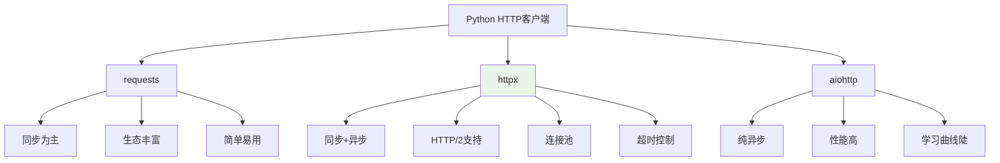
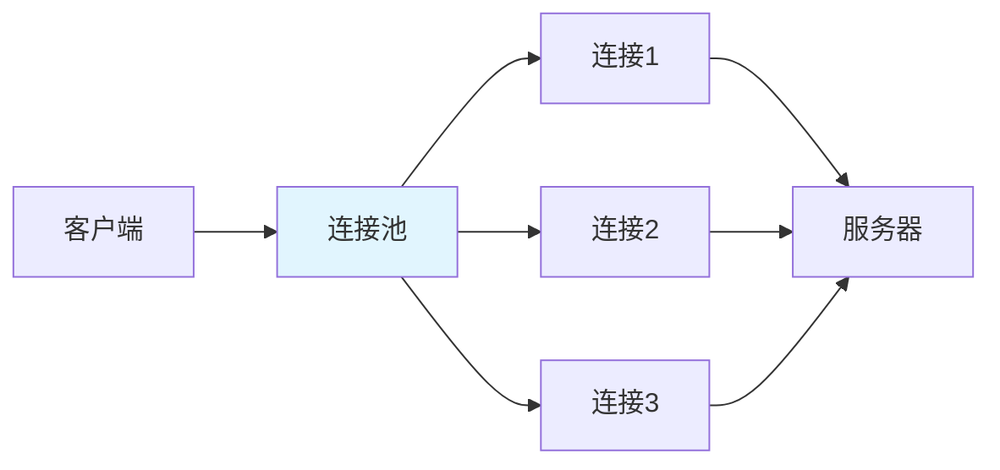

# httpx AsyncClient：连接池+超时控制+Streaming响应

> **一句话**：`httpx` 是现代Python HTTP客户端，支持同步和异步，提供连接池、超时控制、流式响应等高级功能。在AI应用中，常用于调用外部API（如LLM服务、第三方API）。

## 1. httpx 简介

### 1.1 为什么选择 httpx？



| 特性 | requests | httpx | aiohttp |
|------|----------|-------|---------|
| 同步 | ✅ | ✅ | ❌ |
| 异步 | ❌ | ✅ | ✅ |
| HTTP/2 | ❌ | ✅ | ❌ |
| 连接池 | ❌ | ✅ | ✅ |
| 超时控制 | 基础 | 高级 | 高级 |
| 流式响应 | ✅ | ✅ | ✅ |

### 1.2 安装

```bash
pip install httpx
# 异步支持（已内置）
# pip install httpx[http2]  # HTTP/2支持
```

## 2. 基础用法

### 2.1 同步客户端

```python
import httpx

# 基础请求
response = httpx.get("https://api.example.com/data")
print(response.status_code)
print(response.json())

# 带参数
response = httpx.get(
    "https://api.example.com/search",
    params={"query": "python", "page": 1}
)

# POST请求
response = httpx.post(
    "https://api.example.com/users",
    json={"name": "Alice", "age": 30}
)
```

### 2.2 异步客户端

```python
import httpx
import asyncio

async def fetch_data():
    async with httpx.AsyncClient() as client:
        response = await client.get("https://api.example.com/data")
        return response.json()

# 使用
data = asyncio.run(fetch_data())
```

## 3. 连接池

### 3.1 什么是连接池？



**连接池**：预先创建一组HTTP连接，重复使用，避免每次请求都建立新连接。

**好处**：
1. 减少TCP握手开销
2. 提高性能
3. 控制并发连接数

### 3.2 httpx连接池配置

```python
import httpx

# 创建带连接池的客户端
client = httpx.AsyncClient(
    # 连接池配置
    limits=httpx.Limits(
        max_connections=100,        # 最大连接数
        max_keepalive_connections=20,  # 最大保持连接数
        keepalive_expiry=30         # 保持连接超时（秒）
    ),
    # 超时配置
    timeout=httpx.Timeout(
        connect=5.0,    # 连接超时
        read=30.0,      # 读取超时
        write=5.0,      # 写入超时
        pool=5.0        # 连接池超时
    )
)

async def fetch_with_pool():
    async with client:
        # 多个请求复用连接
        response1 = await client.get("https://api1.example.com")
        response2 = await client.get("https://api2.example.com")
        return response1, response2
```

## 4. 超时控制

### 4.1 超时类型

```python
import httpx

# 单一超时
client = httpx.AsyncClient(timeout=30.0)

# 分级超时
client = httpx.AsyncClient(
    timeout=httpx.Timeout(
        connect=5.0,    # 建立连接超时
        read=30.0,      # 读取响应超时
        write=5.0,      # 发送请求超时
        pool=5.0        # 等待连接池超时
    )
)
```

### 4.2 超时处理

```python
import httpx
import asyncio

async def fetch_with_timeout():
    try:
        async with httpx.AsyncClient(timeout=10.0) as client:
            response = await client.get("https://api.example.com/slow")
            return response.json()
    except httpx.TimeoutException as e:
        print(f"请求超时: {e}")
        # 重试或降级
        return None
    except httpx.ConnectError as e:
        print(f"连接失败: {e}")
        return None
```

## 5. Streaming响应

### 5.1 流式下载

```python
async def download_file(url: str, save_path: str):
    """流式下载大文件"""
    async with httpx.AsyncClient() as client:
        async with client.stream("GET", url) as response:
            with open(save_path, "wb") as f:
                async for chunk in response.aiter_bytes(chunk_size=8192):
                    f.write(chunk)
```

### 5.2 流式API响应

```python
async def stream_api_response():
    """流式处理API响应"""
    async with httpx.AsyncClient() as client:
        async with client.stream("GET", "https://api.example.com/stream") as response:
            async for line in response.aiter_lines():
                if line:
                    data = json.loads(line)
                    yield data
```

## 6. ASGITransport（测试用）

### 6.1 什么是ASGITransport？

`ASGITransport` 允许httpx直接测试ASGI应用（如FastAPI），无需启动服务器。

```python
from fastapi import FastAPI
import httpx

app = FastAPI()

@app.get("/test")
async def test_endpoint():
    return {"message": "Hello"}

# 测试
async def test_app():
    transport = httpx.ASGITransport(app=app)
    async with httpx.AsyncClient(transport=transport) as client:
        response = await client.get("http://testserver/test")
        assert response.status_code == 200
        assert response.json() == {"message": "Hello"}
```

## 7. AI应用中的httpx

### 7.1 调用LLM API

```python
import httpx
import json

async def call_llm_api(prompt: str):
    """调用LLM API（如OpenAI）"""
    async with httpx.AsyncClient(timeout=60.0) as client:
        response = await client.post(
            "https://api.openai.com/v1/chat/completions",
            headers={
                "Authorization": f"Bearer {API_KEY}",
                "Content-Type": "application/json"
            },
            json={
                "model": "gpt-3.5-turbo",
                "messages": [{"role": "user", "content": prompt}],
                "stream": True
            }
        )
        
        # 流式处理
        async for line in response.aiter_lines():
            if line.startswith("data: "):
                data = json.loads(line[6:])
                if data.get("choices"):
                    content = data["choices"][0]["delta"].get("content", "")
                    if content:
                        yield content
```

### 7.2 并发调用多个API

```python
async def call_multiple_apis():
    """并发调用多个API"""
    async with httpx.AsyncClient() as client:
        # 并发请求
        tasks = [
            client.get("https://api1.example.com"),
            client.get("https://api2.example.com"),
            client.get("https://api3.example.com")
        ]
        
        responses = await asyncio.gather(*tasks, return_exceptions=True)
        
        results = []
        for i, response in enumerate(responses):
            if isinstance(response, Exception):
                results.append({"error": str(response)})
            else:
                results.append(response.json())
        
        return results
```

## 8. 常见坑点

### 1. 客户端未关闭
```python
# 错误：未使用async with
client = httpx.AsyncClient()
response = await client.get("https://api.example.com")
# 忘记关闭客户端

# 正确：使用async with自动关闭
async with httpx.AsyncClient() as client:
    response = await client.get("https://api.example.com")
```

### 2. 连接池耗尽
```python
# 问题：并发请求过多，连接池满
# 解决：调整连接池大小或使用信号量
semaphore = asyncio.Semaphore(10)  # 限制并发数

async def limited_fetch(url):
    async with semaphore:
        async with httpx.AsyncClient() as client:
            return await client.get(url)
```

### 3. 超时设置不当
```python
# 问题：超时太短导致频繁超时
# 解决：根据API响应时间调整
client = httpx.AsyncClient(
    timeout=httpx.Timeout(
        connect=10.0,   # 连接超时
        read=60.0,      # 读取超时（LLM生成可能很慢）
        write=10.0,
        pool=10.0
    )
)
```

### 4. 重试机制缺失
```python
# 问题：网络抖动导致请求失败
# 解决：添加重试
import tenacity

@tenacity.retry(
    stop=tenacity.stop_after_attempt(3),
    wait=tenacity.wait_exponential(multiplier=1, min=4, max=10)
)
async def fetch_with_retry(url):
    async with httpx.AsyncClient() as client:
        return await client.get(url)
```

## 核心要点

```python
# 同步客户端
response = httpx.get(url, params={})
response = httpx.post(url, json={})

# 异步客户端
async with httpx.AsyncClient() as client:
    response = await client.get(url)

# 连接池
client = httpx.AsyncClient(
    limits=httpx.Limits(max_connections=100)
)

# 超时
client = httpx.AsyncClient(
    timeout=httpx.Timeout(connect=5.0, read=30.0)
)

# 流式响应
async with client.stream("GET", url) as response:
    async for chunk in response.aiter_bytes():
        process(chunk)
```

## 速记卡（面试闪卡）

**Q1：一句话讲清「httpx AsyncClient：连接池+超时控制+Streaming响应」到底是什么？**
A：| 特性 | requests | httpx | aiohttp |
|------|----------|-------|---------|
| 同步 | ✅ | ✅ | ❌ |
| 异步 | ❌ | ✅ | ✅ |
| HTTP/2 | ❌ | ✅ | ❌ |
| 连接池 | ❌ | ✅ | ✅ |
| 超时控制 | 基础 | 高级 | 高级 |
| 流式响应 | ✅ | ✅ | ✅ |

**Q2：1. httpx 简介 —— 怎么理解？**
A：| 特性 | requests | httpx | aiohttp |
|------|----------|-------|---------|
| 同步 | ✅ | ✅ | ❌ |
| 异步 | ❌ | ✅ | ✅ |
| HTTP/2 | ❌ | ✅ | ❌ |
| 连接池 | ❌ | ✅ | ✅ |
| 超时控制 | 基础 | 高级 | 高级 |
| 流式响应 | ✅ | ✅ | ✅ |

**Q3：3. 连接池 —— 怎么理解？**
A：**连接池**：预先创建一组HTTP连接，重复使用，避免每次请求都建立新连接。
**好处**：
减少TCP握手开销
提高性能
控制并发连接数

**Q4：核心速记主线有哪些？**
A：抓住这几根：1. httpx 简介、2. 基础用法、3. 连接池、4. 超时控制、5. Streaming响应、6. ASGITransport（测试用）。


## 相关链接

- 📋 目录：[[00-异步与鉴权]]
- 📚 学习清单：[[技术学习清单#异步与鉴权]]
- 🔗 [[01-asyncio核心API与Task并发|asyncio核心API]]
- 🔗 [[02-aiohttp异步HTTP客户端|aiohttp异步HTTP客户端]]
- 🔗 [[03-SSE流式响应与Backpressure控制|SSE流式响应]]
- 项目实践：[[项目实战/ai-resume笔记/01_技术研读/01_架构概览|ai-resume: 架构概览]]
- 项目实践：[[项目实战/cr-agent笔记/01-技术研读/04-三层容错与并发bug|cr-agent: 三层容错与并发bug]]
