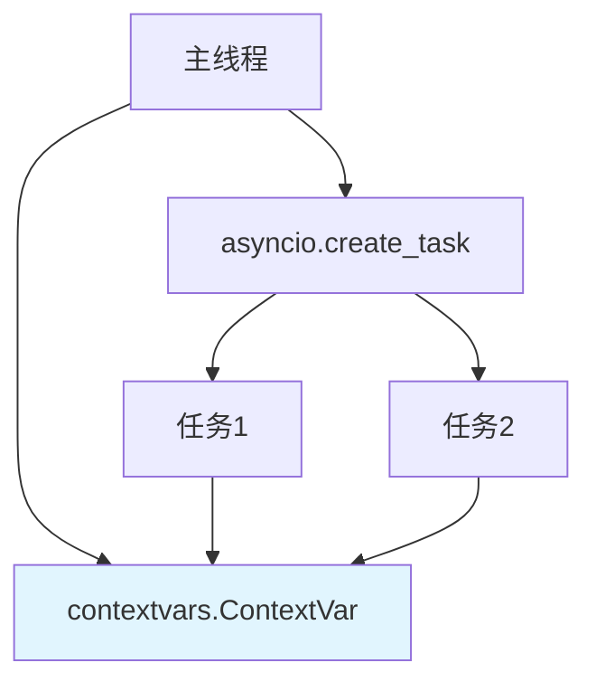

---

title: "contextvars + request_id 链路追踪"

tags:

  - python

  - 技术学习

created: "2026-07-21"

---

# contextvars + request_id 链路追踪

> **一句话**：`contextvars` 是Python 3.7+的上下文变量，用于在异步任务中保存和传递上下文状态。`request_id` 链路追踪是分布式系统中跟踪请求全链路的关键技术。

## 1. contextvars 基础
### 1.1 什么是contextvars？



**contextvars**：上下文变量，每个异步任务（`asyncio.Task`）都有自己的上下文副本，任务之间互不干扰。

**与全局变量的区别**：

- 全局变量：所有任务共享，容易竞争

- contextvars：每个任务独立，线程安全

### 1.2 基础用法

```python

import contextvars

import asyncio

# 定义上下文变量

request_id: contextvars.ContextVar[str] = contextvars.ContextVar('request_id', default='unknown')

async def handler(request_id_value: str):

    """设置request_id"""

    token = request_id.set(request_id_value)

    try:

        await process_request()

    finally:

        request_id.reset(token)

async def process_request():

    """使用request_id"""

    rid = request_id.get()

    print(f"处理请求: {rid}")

async def main():

    # 并发处理多个请求

    await asyncio.gather(

        handler("req-001"),

        handler("req-002"),

        handler("req-003")

    )

asyncio.run(main())

# 输出：每个任务使用自己的request_id

```

## 2. request_id 链路追踪
### 2.1 什么是链路追踪？


**链路追踪**：在分布式系统中，为每个请求分配唯一ID（request_id），跟踪请求在各个服务间的流转。

**好处**：

1. 问题定位：快速找到请求在哪个环节出错

2. 性能分析：分析每个环节的耗时

3. 依赖分析：了解服务间依赖关系

### 2.2 FastAPI中的request_id

```python

from fastapi import FastAPI, Request

import contextvars

import uuid

app = FastAPI()

# 定义上下文变量

request_id: contextvars.ContextVar[str] = contextvars.ContextVar('request_id')

@app.middleware("http")

async def add_request_id(request: Request, call_next):

    """中间件：添加request_id"""

    # 生成或获取request_id

    rid = request.headers.get("X-Request-ID", str(uuid.uuid4()))

    # 设置到上下文变量

    token = request_id.set(rid)

    try:

        response = await call_next(request)

        # 添加到响应头

        response.headers["X-Request-ID"] = rid

        return response

    finally:

        request_id.reset(token)

@app.get("/api/data")

async def get_data():

    """使用request_id"""

    rid = request_id.get()

    print(f"处理请求: {rid}")

    # 调用其他服务

    await call_service_a(rid)

    return {"request_id": rid, "data": "value"}

async def call_service_a(rid: str):

    """调用服务A"""

    print(f"[{rid}] 调用服务A")

    # request_id会自动传播到子任务

```

## 3. 上下文传播
### 3.1 自动传播

```python

import asyncio

import contextvars

var: contextvars.ContextVar[str] = contextvars.ContextVar('var')

async def child():

    """子任务自动继承父任务的上下文"""

    print(f"子任务: {var.get()}")

async def parent():

    var.set("parent_value")

    await child()

asyncio.run(parent())  # 输出：子任务: parent_value

```

### 3.2 手动传播

```python

import asyncio

import contextvars

var: contextvars.ContextVar[str] = contextvars.ContextVar('var')

async def child():

    print(f"子任务: {var.get()}")

async def parent():

    var.set("parent_value")

    # 手动传播上下文

    ctx = contextvars.copy_context()

    task = asyncio.create_task(child())

    # 注意：create_task会自动复制当前上下文

    await task

asyncio.run(parent())

```

## 4. 在AI应用中的使用
### 4.1 日志关联

```python

import logging

import contextvars

request_id: contextvars.ContextVar[str] = contextvars.ContextVar('request_id')

class RequestIdFilter(logging.Filter):

    """日志过滤器：添加request_id"""

    def filter(self, record):

        record.request_id = request_id.get('unknown')

        return True

# 配置日志

logger = logging.getLogger(__name__)

logger.addFilter(RequestIdFilter())

handler = logging.StreamHandler()

handler.setFormatter(logging.Formatter(

    '%(asctime)s [%(request_id)s] %(levelname)s: %(message)s'

))

logger.addHandler(handler)

async def process_request():

    rid = request_id.get()

    logger.info("开始处理请求")  # 自动包含request_id

    await some_operation()

    logger.info("请求处理完成")

```

### 4.2 数据库查询追踪

```python

import contextvars

from sqlalchemy import event

from sqlalchemy.ext.asyncio import AsyncSession

request_id: contextvars.ContextVar[str] = contextvars.ContextVar('request_id')

@event.listens_for(AsyncSession, "after_execute")

def after_execute(session, query, parameters, context):

    """SQL执行后记录日志"""

    rid = request_id.get('unknown')

    logger.debug(f"[{rid}] SQL: {query}")

async def get_user(user_id: int):

    """数据库查询"""

    rid = request_id.get()

    logger.debug(f"[{rid}] 查询用户: {user_id}")

    async with async_session() as session:

        user = await session.get(User, user_id)

        return user

```

### 4.3 外部API调用追踪

```python

import httpx

import contextvars

request_id: contextvars.ContextVar[str] = contextvars.ContextVar('request_id')

async def call_external_api(url: str):

    """调用外部API，传递request_id"""

    rid = request_id.get()

    async with httpx.AsyncClient() as client:

        response = await client.get(

            url,

            headers={"X-Request-ID": rid}  # 传递request_id

        )

        return response.json()

```

## 5. 高级用法
### 5.1 上下文管理器

```python

import contextvars

from contextlib import asynccontextmanager

request_id: contextvars.ContextVar[str] = contextvars.ContextVar('request_id')

@asynccontextmanager

async def request_context(rid: str):

    """请求上下文管理器"""

    token = request_id.set(rid)

    try:

        yield

    finally:

        request_id.reset(token)

# 使用

async def handler():

    async with request_context("req-001"):

        await process_request()

```

### 5.2 与FastAPI依赖注入

```python

from fastapi import Depends, Request

import contextvars

request_id: contextvars.ContextVar[str] = contextvars.ContextVar('request_id')

async def get_request_id():

    """获取request_id的依赖"""

    return request_id.get()

@app.get("/api/data")

async def get_data(rid: str = Depends(get_request_id)):

    """使用依赖注入获取request_id"""

    print(f"请求ID: {rid}")

    return {"request_id": rid}

```

## 6. 常见坑点
### 1. 忘记重置contextvar

```python

async def handler():

    token = request_id.set("new_id")

    # 如果异常退出，忘记reset会导致上下文污染

    await risky_operation()

    request_id.reset(token)  # 可能执行不到

# 解决：使用try/finally

async def handler():

    token = request_id.set("new_id")

    try:

        await risky_operation()

    finally:

        request_id.reset(token)

```

### 2. 多线程环境

```python

# contextvars在多线程中也有效，但需要在线程开始时设置

import threading

import contextvars

var: contextvars.ContextVar[str] = contextvars.ContextVar('var')

def thread_func():

    # 子线程会复制父线程的上下文

    print(var.get())  # 输出：parent_value

var.set("parent_value")

thread = threading.Thread(target=thread_func)

thread.start()

```

### 3. 性能考虑

```python

# 建议：在请求级别设置一次，不要在循环中频繁设置

```

## 核心要点

```python

import contextvars

# 定义

var: contextvars.ContextVar[str] = contextvars.ContextVar('var', default='default')

# 设置

token = var.set("value")

var.reset(token)  # 重置

# 获取

value = var.get()

# 复制上下文

ctx = contextvars.copy_context()

# FastAPI中间件

@app.middleware("http")

async def middleware(request: Request, call_next):

    token = var.set("value")

    try:

        response = await call_next(request)

        return response

    finally:

        var.reset(token)

```

## 速记卡（面试闪卡）

**Q1：一句话讲清「contextvars + request_id 链路追踪」到底是什么？**

A：contextvars 是 Python 为每个异步任务保存独立上下文的变量，request_id 用它做分布式链路追踪。

**Q2：1. contextvars 基础 —— 怎么理解？**

A：像每个骑手配独立保温箱：contextvars（Context Variables，上下文变量）让每个 asyncio 任务有自己的上下文副本，不像全局变量会被所有任务共享竞争。

**Q3：2. request_id 链路追踪 —— 怎么理解？**

A：像快递单号贯穿全程：request_id（请求 ID）给每个请求分配唯一编号，在各服务间传递，出问题能快速定位是哪个环节出错、分析耗时。

**Q4：3. 上下文传播 —— 怎么理解？**

A：像接力赛自动交棒：contextvars 的子任务会自动继承父任务上下文（Context Propagation，上下文传播），无需手动把 request_id 传来传去。

**Q5：4. 在AI应用中的使用 —— 怎么理解？**

A：像给每条日志贴标签：在 AI 应用里把 request_id 注入日志过滤器与数据库事件（Logging Filter，日志过滤器），一次请求的所有日志和 SQL 都能串起来看。

**Q6：核心速记主线有哪些？**

- contextvars 是 Python 3.7+ 的上下文变量，每个异步任务有独立副本、线程安全，区别于全局变量

- request_id 为分布式请求分配唯一 ID，在各服务间传递，做全链路追踪与问题定位

- 子任务自动继承父上下文（上下文传播），asyncio.create_task 默认复制当前上下文

- 用中间件设置并在 try/finally 重置，配合日志过滤器把整条链路日志串起来

**口诀**

A：contextvars 各任务分，互不打架线程安

request_id 单号贯全程，链路追踪好定位

子任务承父上下文，自动传播不用传

中间件设加 finally 重置，整条日志一线穿

## 相关链接

- 📋 目录：[[00-异步与鉴权]]

- 📚 学习清单：[[技术学习路线图#异步与鉴权]]

- 🔗 [[01-asyncio核心API与Task并发|asyncio核心API]]

- 🔗 [[06-asyncio-to_thread|asyncio.to_thread]]

- 🔗 [[04-FastAPI+JWT全链路实现|FastAPI+JWT全链路]]

