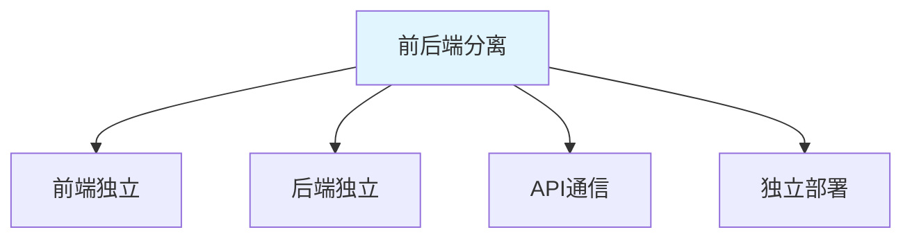
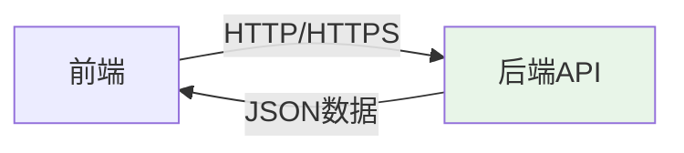
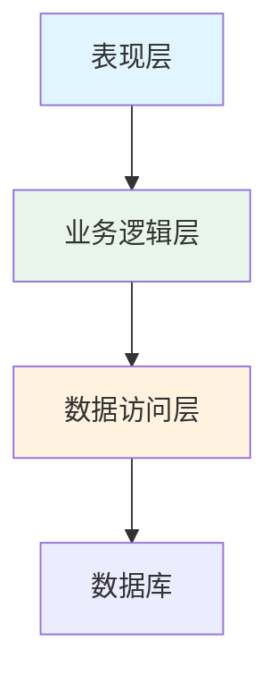

# 前后端分离架构 + 项目架构设计

> **一句话**：前后端分离是将前端和后端独立开发、部署的架构模式。项目架构设计是规划代码结构、模块划分、依赖关系的过程。

## 1. 前后端分离架构

### 1.1 什么是前后端分离？



**前后端分离**：将前端和后端作为独立应用开发，通过API进行通信。

### 1.2 架构优势

| 优势 | 说明 |
|------|------|
| 开发效率 | 前后端并行开发 |
| 技术选型 | 前后端独立选择技术栈 |
| 部署灵活 | 独立部署，互不影响 |
| 扩展性 | 可独立扩展前端或后端 |

### 1.3 通信方式



**通信方式**：
- RESTful API
- GraphQL
- WebSocket
- gRPC

## 2. 项目架构设计

### 2.1 分层架构



**分层架构**：
- 表现层：处理用户界面和请求
- 业务逻辑层：处理业务规则
- 数据访问层：处理数据存储

### 2.2 目录结构

```bash
project/
├── frontend/          # 前端代码
│   ├── src/
│   │   ├── components/  # 组件
│   │   ├── pages/       # 页面
│   │   ├── services/    # API服务
│   │   └── utils/       # 工具函数
│   └── package.json
├── backend/           # 后端代码
│   ├── app/
│   │   ├── api/         # API路由
│   │   ├── models/      # 数据模型
│   │   ├── services/    # 业务逻辑
│   │   └── utils/       # 工具函数
│   └── requirements.txt
├── docker-compose.yml # Docker配置
└── README.md
```

## 3. 实际案例

### 3.1 FastAPI + React项目

```yaml
# docker-compose.yml
version: '3'
services:
  frontend:
    build: ./frontend
    ports:
      - "3000:3000"
    depends_on:
      - backend
  
  backend:
    build: ./backend
    ports:
      - "8000:8000"
    environment:
      - DATABASE_URL=postgresql://user:pass@db:5432/mydb
    depends_on:
      - db
  
  db:
    image: postgres:15
    environment:
      - POSTGRES_USER=user
      - POSTGRES_PASSWORD=pass
      - POSTGRES_DB=mydb
    volumes:
      - postgres_data:/var/lib/postgresql/data

volumes:
  postgres_data:
```

### 3.2 API设计

```python
# FastAPI后端
from fastapi import FastAPI
from pydantic import BaseModel

app = FastAPI()

class UserCreate(BaseModel):
    name: str
    email: str

class UserResponse(BaseModel):
    id: int
    name: str
    email: str

@app.post("/api/users/", response_model=UserResponse)
async def create_user(user: UserCreate):
    # 创建用户逻辑
    return UserResponse(id=1, name=user.name, email=user.email)

@app.get("/api/users/{user_id}", response_model=UserResponse)
async def get_user(user_id: int):
    # 获取用户逻辑
    return UserResponse(id=user_id, name="Alice", email="alice@example.com")
```

### 3.3 React前端

```jsx
// React前端
import { useState, useEffect } from 'react';

function UserList() {
    const [users, setUsers] = useState([]);
    
    useEffect(() => {
        fetch('/api/users/')
            .then(response => response.json())
            .then(data => setUsers(data));
    }, []);
    
    return (
        <div>
            <h1>Users</h1>
            <ul>
                {users.map(user => (
                    <li key={user.id}>{user.name}</li>
                ))}
            </ul>
        </div>
    );
}
```

## 4. 设计原则

### 4.1 SOLID原则

```python
# 单一职责原则
class UserService:
    def create_user(self, user_data):
        # 只处理用户创建
        pass

# 开闭原则
class PaymentProcessor:
    def process(self, payment_method):
        # 对扩展开放，对修改关闭
        pass

# 里氏替换原则
class Animal:
    def speak(self):
        pass

class Dog(Animal):
    def speak(self):
        return "Woof!"
```

### 4.2 DRY原则

```python
# 不要重复自己
def validate_email(email):
    # 邮箱验证逻辑
    pass

# 使用装饰器避免重复
def validate_user(func):
    def wrapper(user_data):
        validate_email(user_data['email'])
        return func(user_data)
    return wrapper
```

## 5. 常见坑点

### 1. API设计不一致
```python
# 问题：API设计不一致
# /api/users
# /api/user
# /api/getUsers

# 解决：统一API设计
# /api/users (GET, POST)
# /api/users/{id} (GET, PUT, DELETE)
```

### 2. 跨域问题
```python
# 问题：前后端分离导致跨域
# 解决：配置CORS
from fastapi.middleware.cors import CORSMiddleware

app.add_middleware(
    CORSMiddleware,
    allow_origins=["http://localhost:3000"],
    allow_credentials=True,
    allow_methods=["*"],
    allow_headers=["*"],
)
```

## 核心要点

```bash
# 项目结构
project/
├── frontend/
├── backend/
├── docker-compose.yml
└── README.md

# API设计
GET /api/users/ - 获取用户列表
POST /api/users/ - 创建用户
GET /api/users/{id} - 获取用户
PUT /api/users/{id} - 更新用户
DELETE /api/users/{id} - 删除用户
```

## 速记卡（面试闪卡）

**Q1：一句话讲清「前后端分离架构 + 项目架构设计」到底是什么？**
A：**前后端分离**：将前端和后端作为独立应用开发，通过API进行通信。
| 优势 | 说明 |
|------|------|
| 开发效率 | 前后端并行开发 |
| 技术选型 | 前后端独立选择技术栈 |
| 部署灵活 | 独立部署，互不影响 |
| 扩展性 | 可独立扩展前端或后端 |
**通信方式**：
RESTful API
GraphQL
WebSocket
gRPC

**Q2：1. 前后端分离架构 —— 怎么理解？**
A：**前后端分离**：将前端和后端作为独立应用开发，通过API进行通信。
| 优势 | 说明 |
|------|------|
| 开发效率 | 前后端并行开发 |
| 技术选型 | 前后端独立选择技术栈 |
| 部署灵活 | 独立部署，互不影响 |
| 扩展性 | 可独立扩展前端或后端 |
**通信方式**：
RESTful API
GraphQL
WebSocket
gRPC

**Q3：2. 项目架构设计 —— 怎么理解？**
A：**分层架构**：
表现层：处理用户界面和请求
业务逻辑层：处理业务规则
数据访问层：处理数据存储

**Q4：核心速记主线有哪些？**
A：抓住这几根：1. 前后端分离架构、2. 项目架构设计、3. 实际案例、4. 设计原则、5. 常见坑点、核心要点。


## 相关链接

- 📋 目录：[[00-技术全景]]
- 📚 学习清单：[[技术学习清单#技术全景]]
- 🔗 [[语言与框架/FastAPI/实战/00-FastAPI|FastAPI]]
- 🔗 [[语言与框架/TypeScript-React/实战/00-TypeScript|TypeScript/React]]
- 项目实践：[[项目实战/ai-resume笔记/01_技术研读/01_架构概览|ai-resume: 架构概览]]
