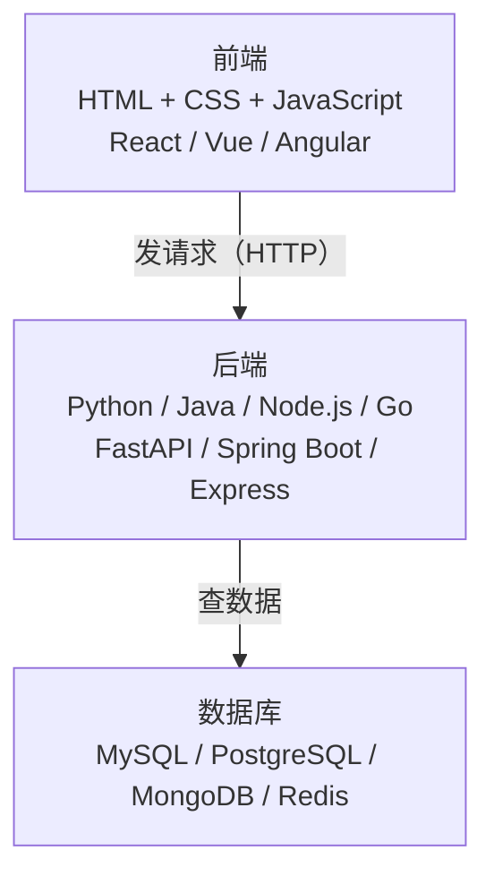
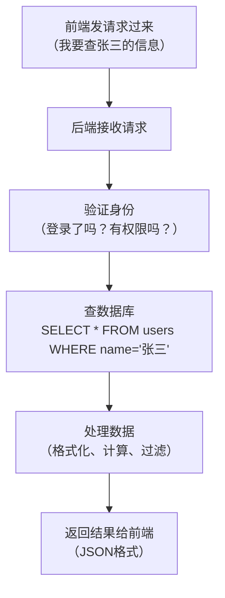
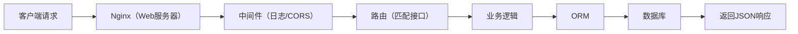
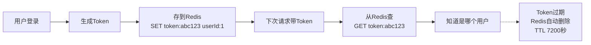
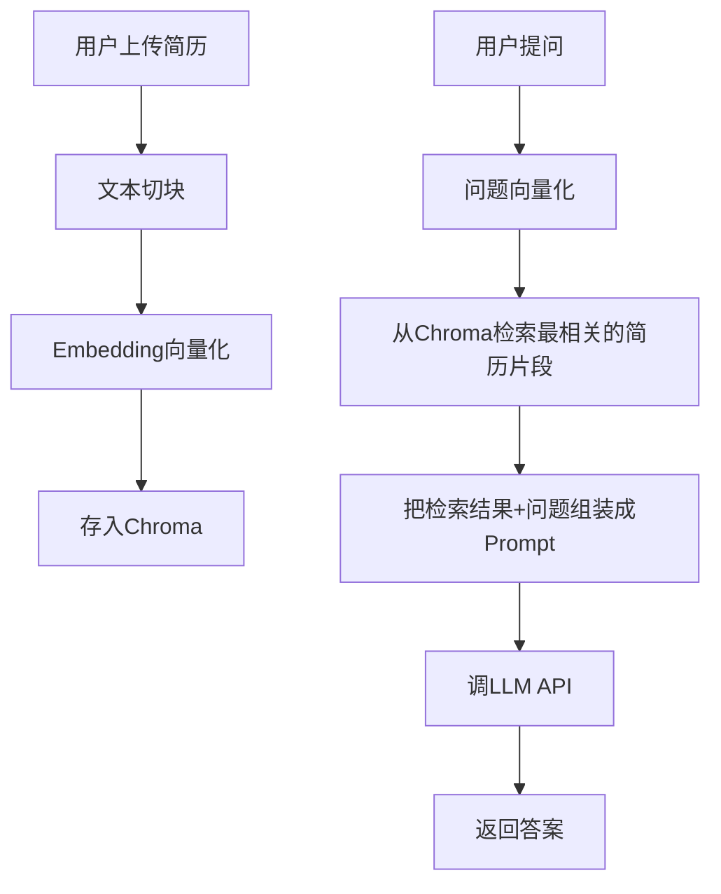
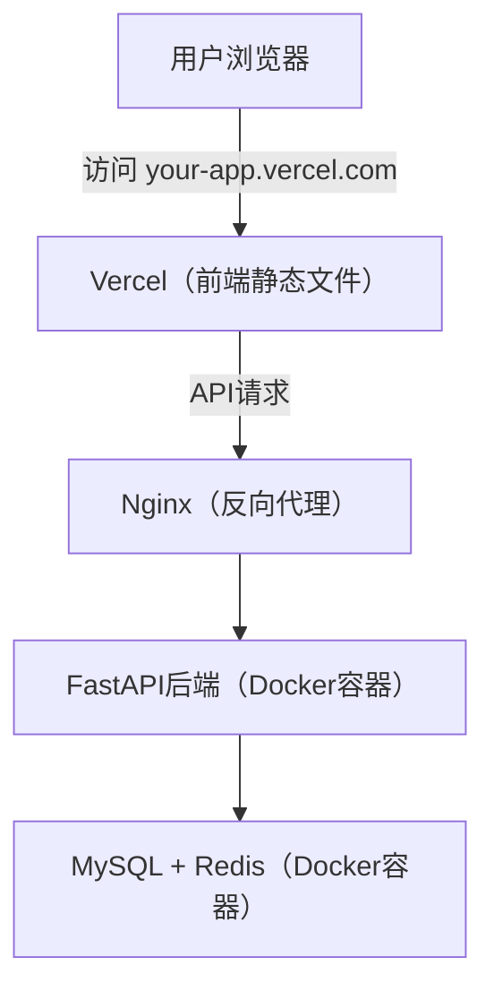
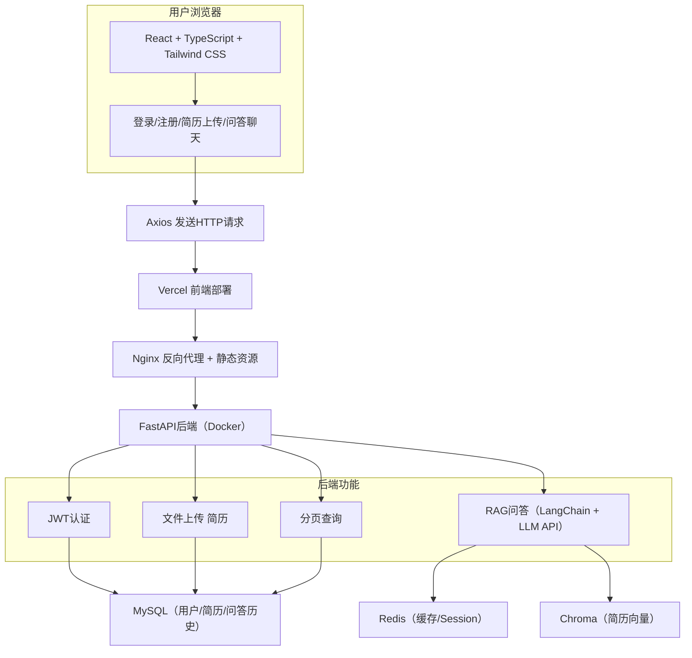

---

title: "技术全景扫盲"

created: "2025-07-12"

tags:

  - 技术学习

---

# 技术全景扫盲

> 写给零基础：从"听过这些名词"到"知道它们是什么、干嘛用、怎么配合"。

> 不需要会写代码，只需要建立全局认知。

---

## 一、一个网站/APP 是怎么跑起来的

你打开淘宝，看到商品页面。这个过程涉及三大部分：



**一句话总结**：前端负责"你看到什么"，后端负责"数据怎么处理"，数据库负责"数据存哪里"。

---

## 二、编程语言一览（不用都学，知道它们是干嘛的）
### 2.1 语言分类

| 语言 | 主要用途 | 通俗理解 |

|:---|:---|:---|

| **JavaScript/TypeScript** | 前端（浏览器里跑的） | 唯一能跑在浏览器里的语言 |

| **Python** | 后端、AI、数据分析 | 语法最简单，AI 生态最强 |

| **Java** | 企业级后端、安卓 | 大公司最爱，银行/电商/物流 |

| **Go** | 高性能后端、云原生 | 速度快，Docker/K8s 就是 Go 写的 |

| **C/C++** | 操作系统、游戏引擎、嵌入式 | 最接近硬件，性能最强 |

| **Rust** | 系统编程、WebAssembly | 新一代 C++，安全+高性能 |

| **Swift/Kotlin** | iOS/安卓 APP 开发 | 手机 APP 专用 |

| **SQL** | 数据库查询 | 不是编程语言，是数据库的"指令" |

### 2.2 语言和运行环境

```text

JavaScript  →  跑在浏览器里（前端）或 Node.js 里（后端）

TypeScript  →  编译成 JavaScript 再跑

Python      →  跑在 Python 解释器里

Java        →  编译成字节码，跑在 JVM（Java 虚拟机）里

Go          →  编译成机器码，直接跑

C/C++       →  编译成机器码，直接跑

```

**为什么前端只能用 JavaScript？** 因为浏览器内置了 JS 引擎（Chrome 的 V8、Firefox 的 SpiderMonkey），只认 JS。你用 Python 写的代码浏览器看不懂。

---

## 三、前端生态（用户看到的部分）
### 3.1 前端三件套

| 技术 | 干什么 | 通俗理解 |

|:---|:---|:---|

| **HTML** | 页面结构 | 骨架——标题、段落、按钮、图片 |

| **CSS** | 页面样式 | 皮肤——颜色、大小、位置、动画 |

| **JavaScript** | 页面交互 | 大脑——点击、滑动、发请求、动态更新 |

### 3.2 前端框架

不用框架，你要手动操作 DOM（页面元素）。用了框架，你只管描述"界面应该长什么样"，框架帮你更新。

| 框架 | 公司 | 特点 | 国内流行度 |

|:---|:---|:---|:---|

| **React** | Meta（Facebook） | 灵活、生态最大 | ⭐⭐⭐ 大厂主流 |

| **Vue** | 尤雨溪（个人） | 简单易学、中文文档好 | ⭐⭐⭐ 中小公司多 |

| **Angular** | Google | 大而全、企业级 | ⭐ 较少 |

| **Svelte** | 社区 | 编译时框架、极轻量 | ⭐ 新兴 |

### 3.3 CSS 方案

| 方案 | 怎么用 | 特点 |

|:---|:---|:---|

| **原生 CSS** | 自己写 `.css` 文件 | 基础，但写多了难维护 |

| **Sass/Less** | CSS 的增强版，支持变量、嵌套 | 原生 CSS 的升级 |

| **Tailwind CSS** | 用类名写样式，不写 CSS 文件 | 现在最流行，开发快 |

| **UI 组件库** | 别人写好的现成组件 | Ant Design、Element UI、Material UI |

```html

<!-- 原生 CSS -->

<style>

.btn { background: blue; color: white; padding: 8px 16px; }

</style>

<button class="btn">点击</button>

<!-- Tailwind CSS（不用写 style 标签）-->

<button class="bg-blue-500 text-white px-4 py-2">点击</button>

```

### 3.4 前端工程化工具

| 工具 | 干什么 | 通俗理解 |

|:---|:---|:---|

| **npm / yarn / pnpm** | 包管理器，下载第三方库 | 类似 Python 的 pip |

| **Vite / Webpack** | 打包工具，把代码编译+压缩 | 把散装零件组装成成品 |

| **ESLint** | 代码规范检查 | 自动检查你的代码风格 |

| **Prettier** | 代码格式化 | 自动整理代码缩进、换行 |

| **Git** | 版本控制 | 记录代码每次修改，能回滚 |

---

## 四、后端生态（处理逻辑的部分）
### 4.1 后端做什么



### 4.2 后端语言 + 框架搭配

| 语言 | 框架 | 特点 | 适合场景 |

|:---|:---|:---|:---|

| **Python** | FastAPI | 轻量、异步、自动文档 | AI 应用、快速原型 |

| **Python** | Django | 大而全、自带 ORM/后台/认证 | 内容管理系统 |

| **Python** | Flask | 极简微框架 | 小工具、API 服务 |

| **Java** | Spring Boot | 企业级标准、生态成熟 | 银行、电商、大型系统 |

| **JavaScript** | Express | Node.js 最流行的框架 | 全栈 JS 项目 |

| **JavaScript** | NestJS | 仿 Spring Boot 的 Node 框架 | 企业级 Node 项目 |

| **Go** | Gin | 高性能、轻量 | 微服务、高并发 |

### 4.3 后端核心组件

| 组件 | 干什么 | 通俗理解 |

|:---|:---|:---|

| **Web 服务器** | 接收 HTTP 请求，转发给你的代码 | Nginx、uvicorn、Gunicorn |

| **ORM** | 用代码操作数据库，不用写 SQL | SQLAlchemy（Python）、Prisma（JS） |

| **认证** | 登录、权限、Token | JWT、OAuth、Session |

| **中间件** | 请求经过的"关卡" | 日志、CORS、限流、压缩 |

| **任务队列** | 异步处理耗时任务 | Celery（Python）、Bull（JS） |

| **缓存** | 热点数据放内存，加速访问 | Redis |



### 4.4 API 是什么

API = Application Programming Interface，就是后端开的"窗口"，前端通过这个窗口拿数据、提交数据。

```text

前端："给我张三的用户信息"  →  GET /api/users/1

后端：返回 { "name": "张三", "age": 25 }

前端："帮我创建一个新用户"  →  POST /api/users  body: { "name": "李四" }

后端：返回 { "id": 2, "name": "李四" }

```

**RESTful** 是 API 的设计规范：用 GET 查、用 POST 增、用 PUT 改、用 DELETE 删。

---

## 五、数据库生态（存数据的部分）
### 5.1 数据库分类

```mermaid

mindmap

  数据库

    关系型数据库

      MySQL

      PostgreSQL

      SQLite

      Oracle

    非关系型数据库

      MongoDB

      Redis

      Elasticsearch

      Chroma

    数据仓库

      ClickHouse

      Hive

```

### 5.2 关系型 vs 非关系型

| 维度 | 关系型（MySQL） | 非关系型（MongoDB） |

|:---|:---|:---|

| 存储方式 | 表格（行和列） | 文档/键值对/图 |

| 适合场景 | 结构固定的数据（用户、订单） | 结构灵活的数据（日志、内容） |

| 查询语言 | SQL | 各有各的语法 |

| 事务支持 | ✅ 强 | 部分支持 |

| 扩展方式 | 垂直扩展（加配置） | 水平扩展（加机器） |

### 5.3 各数据库的特点和场景

| 数据库 | 类型 | 特点 | 典型场景 |

|:---|:---|:---|:---|

| **MySQL** | 关系型 | 最流行、免费、社区大 | 用户表、订单表、商品表 |

| **PostgreSQL** | 关系型 | 功能更强、支持 JSON/地理数据 | 复杂查询、地理信息系统 |

| **SQLite** | 关系型 | 一个文件就是数据库、零配置 | 手机 APP 本地存储、测试 |

| **MongoDB** | 文档型 | 存 JSON、schema 灵活 | 日志、内容管理、用户行为 |

| **Redis** | 键值型 | 极快（内存存储）、支持多种结构 | 缓存、Session、排行榜、限流 |

| **Elasticsearch** | 搜索引擎 | 全文检索、分析能力强 | 商品搜索、日志分析 |

| **Chroma** | 向量数据库 | 存向量、做语义相似度搜索 | AI 检索（RAG） |

| **ClickHouse** | 列式数据库 | 分析查询极快 | 数据报表、用户行为分析 |

### 5.4 Redis 详解（你项目用到的）

Redis 不是存普通数据的，它是**内存数据库**，速度极快但重启数据可能丢（可以配置持久化）。

Redis 支持的数据结构：

| 结构 | 类似 | 用途 | 例子 |

|:---|:---|:---|:---|

| **String** | Python 的 str | 缓存值、计数器 | `SET token abc123` |

| **Hash** | Python 的 dict | 存对象 | `HSET user:1 name 张三 age 25` |

| **List** | Python 的 list | 消息队列、最新动态 | `LPUSH news "新消息"` |

| **Set** | Python 的 set | 去重、共同好友 | `SADD tags "python" "ts"` |

| **ZSet** | 带分数的 set | 排行榜 | `ZADD rank 100 "张三"` |



### 5.5 ORM 是什么

ORM = Object-Relational Mapping，用代码操作数据库，不用手写 SQL。

```python

# 不用 ORM，手写 SQL：

cursor.execute("SELECT * FROM users WHERE age > 20")

results = cursor.fetchall()

# 用 ORM（SQLAlchemy），像操作 Python 对象：

users = session.query(User).filter(User.age > 20).all()

# ORM 自动帮你翻译成 SQL 执行

```

| 语言 | ORM 工具 |

|:---|:---|

| Python | SQLAlchemy、Tortoise ORM、Django ORM |

| JavaScript | Prisma、Sequelize、TypeORM |

| Java | Hibernate、MyBatis |

---

## 六、AI/LLM 生态（你的项目特色）

| 技术 | 干什么 | 通俗理解 |

|:---|:---|:---|

| **LLM API** | 调用大语言模型 | DeepSeek/通义千问/GPT 的接口 |

| **LangChain** | 拼装 AI 流程的框架 | 把"查数据库→组装Prompt→调LLM→返回结果"串起来 |

| **Embedding** | 把文字变成向量（数字数组） | 让计算机"理解"文字含义 |

| **向量数据库** | 存向量，做相似度搜索 | Chroma、Pinecone、Milvus |

| **RAG** | 检索增强生成 | 先搜相关资料，再让 LLM 回答（减少胡说八道） |

| **Prompt Engineering** | 设计提示词 | 怎么问 LLM 能得到更好的回答 |

| **Fine-tuning** | 微调模型 | 用自己的数据训练 LLM，让它更懂你的领域 |



---

## 七、部署与运维（让项目跑在公网上）
### 7.1 部署是什么

你本地写的代码只有你能访问。部署 = 把代码放到服务器上，让所有人都能通过网址访问。

### 7.2 部署工具

| 工具 | 干什么 | 通俗理解 |

|:---|:---|:---|

| **Docker** | 把项目打包成"容器" | 把你的代码+环境+依赖装进一个集装箱，搬到任何服务器都能跑 |

| **docker-compose** | 管理多个容器 | 前端一个容器、后端一个容器、数据库一个容器，一键启动 |

| **Nginx** | Web 服务器 + 反向代理 | 所有请求先到 Nginx，它再分发给前端或后端 |

| **Vercel** | 前端托管平台 | 把 React 项目一键部署，免费 |

| **Railway / 阿里云 / 腾讯云** | 后端+数据库托管 | 服务器，跑你的后端和数据库 |

| **GitHub Actions** | CI/CD 自动化 | 代码推到 GitHub 自动部署 |

| **Kubernetes (K8s)** | 容器编排 | 管理成百上千个 Docker 容器（大项目用） |



### 7.3 服务器是什么

服务器就是一台 24 小时开机的电脑，放在机房里，你通过 SSH 远程连接操作它。

| 云服务商 | 产品 | 特点 |

|:---|:---|:---|

| **阿里云** | ECS / 轻量应用服务器 | 国内最大，学生有优惠 |

| **腾讯云** | 轻量应用服务器 | 也便宜，学生有优惠 |

| **AWS** | EC2 | 全球最大，贵 |

| **Vercel** | 前端托管 | 静态网站免费，自动部署 |

| **Railway** | 全栈托管 | 免费额度，适合小项目 |

---

## 八、开发工具生态

| 工具 | 干什么 | 通俗理解 |

|:---|:---|:---|

| **VSCode** | 代码编辑器 | 你写代码的地方 |

| **Git** | 版本控制 | 记录每次修改，能回滚，能多人协作 |

| **GitHub** | 代码托管平台 | 存代码的"网盘"，开源项目都在这 |

| **Chrome DevTools** | 浏览器调试工具 | F12 打开，看网络请求、调试前端代码 |

| **Postman / Apifox** | API 测试工具 | 手动测试后端接口，不用写前端代码 |

| **Navicat / DBeaver** | 数据库管理工具 | 图形界面操作数据库，不用写 SQL |

| **Terminal** | 终端/命令行 | 执行命令的地方 |

- **VSCode**（写代码）

- **终端**（运行命令、看日志）

- **浏览器**（看效果、F12 调试）

- **Postman**（测试接口）

- **Navicat**（查数据库）

---

## 九、完整项目架构图



---

## 十、常见名词速查

| 名词 | 一句话解释 |

|:---|:---|

| **API** | 后端提供的接口，前端通过它拿数据 |

| **RESTful** | API 的设计规范，用 GET/POST/PUT/DELETE 操作资源 |

| **JSON** | 前后端传数据的格式，类似 Python 的 dict |

| **HTTP/HTTPS** | 前后端通信的协议 |

| **SDK** | 封装好的工具包，帮你更方便地调用某个服务 |

| **CLI** | 命令行工具，在终端里执行 |

| **开源** | 代码公开，免费用 |

| **npm** | JavaScript 的包管理器，类似 Python 的 pip |

| **pip** | Python 的包管理器 |

| **package.json** | Node.js 项目的"身份证"，记录依赖和脚本 |

| **requirements.txt** | Python 项目的依赖清单 |

| **依赖** | 你项目用到的第三方库 |

| **环境变量** | 配置信息（数据库密码、API Key），不写死在代码里 |

| **.env 文件** | 存环境变量的文件，不提交到 Git |

| **CI/CD** | 代码提交后自动测试+自动部署 |

| **微服务** | 把一个大项目拆成多个小服务，各管各的 |

| **单体应用** | 所有功能写在一个项目里（你的项目就是） |

| **域名** | 网址，比如 `baidu.com` |

| **DNS** | 把域名翻译成 IP 地址 |

| **CDN** | 把静态资源放到离用户最近的服务器，加速访问 |

| **WebSocket** | 全双工通信，服务器能主动推消息给前端 |

| **轮询** | 前端定时反复请求后端，模拟"实时"效果 |

| **SSR** | 服务端渲染，服务器生成 HTML 返回（SEO 友好） |

| **CSR** | 客户端渲染，浏览器用 JS 生成页面（你的项目用这种） |

| **Token** | 登录凭证，类似"通行证" |

| **JWT** | 一种 Token 格式，自带用户信息，不用查数据库 |

| **OAuth** | 第三方登录（用微信/GitHub 账号登录） |

| **CORS** | 跨域问题，浏览器的安全限制 |

| **反向代理** | Nginx 接收请求再转发给后端，隐藏真实服务器 |

| **负载均衡** | 把请求分发到多台服务器，避免单台过载 |

| **容器** | Docker 打包的运行环境，隔离、可移植 |

| **镜像** | Docker 的"模板"，用镜像创建容器 |

---

## 速记卡（面试闪卡）

**Q1：一句话讲清「技术全景扫盲」到底是什么？**

A：技术全景扫盲：给零基础的人建立全局认知——前端管"看到什么"、后端管"怎么算"、数据库管"存哪里"。

**Q2：一个网站怎么跑起来 —— 怎么理解？**

A：像开餐厅：你在手机点餐（前端），后厨按单做菜（后端），仓库管食材（数据库）。前端发 HTTP 请求点单，后端查数据库备料，JSON 把菜端回来。

**Q3：前后端语言怎么选 —— 怎么理解？**

A：像选工具：JavaScript 是唯一能跑在浏览器里的语言（V8 引擎只认它）；Python 写后端/AI 最省事；Java 是大厂企业级后台；Go 快适合高并发云原生。不用全会，知道干嘛用就行。

**Q4：数据库两大阵营怎么分 —— 怎么理解？**

A：像两种仓库：关系型（MySQL）是规整的表格行列，适合用户、订单；非关系型（MongoDB/Redis）存文档或键值，结构灵活、读写飞快。Redis 是内存里的"闪电柜"，重启可能丢但极快。

**Q5：AI/LLM 与部署怎么理解 —— 怎么理解？**

A：像给餐厅加智能顾问：Embedding 把文字变向量、向量数据库（Chroma）按相似度搜、RAG 先查资料再让 LLM（大语言模型）答，减少胡说。部署则用 Docker 打包、Nginx 反向代理、GitHub Actions 自动上线。

**Q6：核心速记主线有哪些？**

- 三层结构：前端（看）+ 后端（算）+ 数据库（存）

- 语言生态：JS 浏览器唯一，Python/Java/Go 各司其职

- 数据库：关系型表格 vs 非关系型文档/键值（Redis 内存极速）

- 部署运维：Docker 集装箱 + Nginx 反向代理 + CI/CD 自动上线

**口诀**

A：开餐厅三层，前看后端算；

JS 独霸浏览器，库里把数管。

关系排表格，非关系灵变；

Docker 打包装，AI 来助战。

## 相关链接

- 📋 目录：[[00-技术学习总目录]]

- 📚 学习清单：[[八股文学习路线图]]

---

→ [[技术学习路线图#八、技术全景]]

