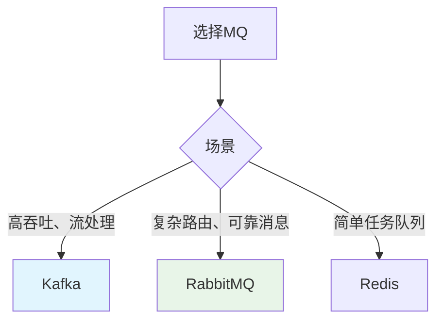

---

title: "Kafka / RabbitMQ 选一，本地跑通生产-消费流程"

tags:

  - kafka

  - rabbitmq

  - 技术学习

created: "2026-07-21"

---

# Kafka / RabbitMQ 选一，本地跑通生产-消费流程

> **一句话**：Kafka和RabbitMQ是流行的消息队列系统。Kafka适合高吞吐、流处理场景；RabbitMQ适合复杂路由、可靠消息场景。本地跑通生产-消费流程是学习MQ的第一步。

## 1. Kafka vs RabbitMQ
### 1.1 对比

| 特性 | Kafka | RabbitMQ |

|------|-------|----------|

| 架构 | 分布式日志 | 消息代理 |

| 吞吐量 | 极高 | 中等 |

| 消息顺序 | 保证 | 不保证 |

| 消息持久化 | 支持 | 支持 |

| 消息回溯 | 支持 | 不支持 |

| 适用场景 | 流处理、日志 | 任务队列、复杂路由 |

### 1.2 选择建议



## 2. Kafka本地部署
### 2.1 Docker部署

```yaml

# docker-compose.yml

version: '3'

services:

  zookeeper:

    image: confluentinc/cp-zookeeper:latest

    environment:

      ZOOKEEPER_CLIENT_PORT: 2181

      ZOOKEEPER_TICK_TIME: 2000

    ports:

      - "2181:2181"

  kafka:

    image: confluentinc/cp-kafka:latest

    depends_on:

      - zookeeper

    ports:

      - "9092:9092"

    environment:

      KAFKA_BROKER_ID: 1

      KAFKA_ZOOKEEPER_CONNECT: zookeeper:2181

      KAFKA_ADVERTISED_LISTENERS: PLAINTEXT://localhost:9092

      KAFKA_OFFSETS_TOPIC_REPLICATION_FACTOR: 1

```

### 2.2 Python客户端

```python

from kafka import KafkaProducer, KafkaConsumer

import json

# 生产者

producer = KafkaProducer(

    bootstrap_servers=['localhost:9092'],

    value_serializer=lambda v: json.dumps(v).encode('utf-8')

)

# 发送消息

producer.send('test-topic', {'message': 'hello'})

producer.flush()

# 消费者

consumer = KafkaConsumer(

    'test-topic',

    bootstrap_servers=['localhost:9092'],

    value_deserializer=lambda m: json.loads(m.decode('utf-8')),

    auto_offset_reset='earliest'

)

for message in consumer:

    print(message.value)

```

## 3. RabbitMQ本地部署
### 3.1 Docker部署

```yaml

# docker-compose.yml

version: '3'

services:

  rabbitmq:

    image: rabbitmq:3-management

    ports:

      - "5672:5672"

      - "15672:15672"

    environment:

      RABBITMQ_DEFAULT_USER: guest

      RABBITMQ_DEFAULT_PASS: guest

```

### 3.2 Python客户端

```python

import pika

import json

# 连接

connection = pika.BlockingConnection(pika.ConnectionParameters('localhost'))

channel = connection.channel()

# 声明队列

channel.queue_declare(queue='test_queue', durable=True)

# 生产者

channel.basic_publish(

    exchange='',

    routing_key='test_queue',

    body=json.dumps({'message': 'hello'}),

    properties=pika.BasicProperties(delivery_mode=2)

)

# 消费者

def callback(ch, method, properties, body):

    print(f"收到: {json.loads(body)}")

    ch.basic_ack(delivery_tag=method.delivery_tag)

channel.basic_consume(queue='test_queue', on_message_callback=callback)

channel.start_consuming()

```

## 4. 实际案例
### 4.1 Kafka日志收集

```python

# 日志生产者

import logging

from kafka import KafkaProducer

import json

class KafkaHandler(logging.Handler):

    def __init__(self, topic, bootstrap_servers):

        super().__init__()

        self.producer = KafkaProducer(

            bootstrap_servers=bootstrap_servers,

            value_serializer=lambda v: json.dumps(v).encode('utf-8')

        )

        self.topic = topic

    def emit(self, record):

        log_entry = {

            'timestamp': record.created,

            'level': record.levelname,

            'message': record.getMessage(),

            'module': record.module

        }

        self.producer.send(self.topic, log_entry)

# 使用

handler = KafkaHandler('app-logs', ['localhost:9092'])

logger = logging.getLogger()

logger.addHandler(handler)

```

### 4.2 RabbitMQ任务队列

```python

import pika

import json

from celery import Celery

# Celery配置

app = Celery('tasks', broker='pyamqp://guest@localhost//')

@app.task

def process_task(data):

    # 处理任务

    return f"处理完成: {data}"

# 发送任务

process_task.delay({'user_id': 123, 'action': 'send_email'})

```

## 5. 常见坑点
### 1. Kafka分区策略

```python

# 解决：使用相同的key发送消息

producer.send('topic', key=b'user_123', value=message)

```

### 2. RabbitMQ消息确认

```python

# 解决：使用手动ACK

channel.basic_consume(queue='queue', on_message_callback=callback, auto_ack=False)

def callback(ch, method, properties, body):

    # 处理消息

    process(body)

    # 手动确认

    ch.basic_ack(delivery_tag=method.delivery_tag)

```

### 3. 连接池管理

```python

# 解决：使用连接池

from kafka import KafkaProducer

producer = KafkaProducer(bootstrap_servers=['localhost:9092'])

# 复用producer实例

```

## 核心要点

```python

# Kafka

producer = KafkaProducer(bootstrap_servers=['localhost:9092'])

producer.send('topic', value=message)

consumer = KafkaConsumer('topic', bootstrap_servers=['localhost:9092'])

# RabbitMQ

connection = pika.BlockingConnection(pika.ConnectionParameters('localhost'))

channel = connection.channel()

channel.queue_declare(queue='queue')

channel.basic_publish(exchange='', routing_key='queue', body='message')

channel.basic_consume(queue='queue', on_message_callback=callback)

```

## 速记卡（面试闪卡）

**Q1：一句话讲清「Kafka / RabbitMQ 选一，本地跑通生产-消费流程」到底是什么？**

A：Kafka 与 RabbitMQ 是两种消息队列；Kafka 像高吞吐广播日志流，RabbitMQ 像带智能路由的快递柜台。

**Q2：Kafka vs RabbitMQ 怎么选（选型） —— 怎么理解？**

A：类比：Kafka 像小区广场大喇叭广播——消息贴墙上（分布式日志 log），谁爱看谁来，还能往回翻；RabbitMQ 像快递柜，按收件人精确投递、确认签收。高吞吐流处理选 Kafka，复杂路由可靠投递选 RabbitMQ。（Broadcast vs routing）

**Q3：Kafka 本地怎么跑（broker + zookeeper） —— 怎么理解？**

A：类比：Kafka 像个离不开"班长"的广播站——得先起 ZooKeeper 管名册，再用 docker-compose 拉起 broker，Python 里 KafkaProducer 发、KafkaConsumer 收，auto_offset_reset 决定从头还是从尾听。（Need a coordinator）

**Q4：RabbitMQ 本地怎么跑（manual ACK） —— 怎么理解？**

A：类比：RabbitMQ 像带柜员的快递点：docker 起带 management 插件的服务，pika 连上后先 queue_declare 开柜子，basic_publish 投递，消费者用 basic_ack 手动签收——不签收消息就丢，这就是可靠投递的秘诀。（Ack or lose）

**Q5：常见坑点（ordering & reuse） —— 怎么理解？**

A：类比：两个经典翻车：Kafka 想保顺序就给同 key 发消息（partition），否则乱序；RabbitMQ 忘开手动 ACK 就会丢消息，连接也别每次新建——复用 producer/connection，像复用同一个快递账号别反复注册。（Key & reuse）

**Q6：核心速记主线有哪些？**

- Kafka 分布式日志、高吞吐、保序靠 key、可回溯；RabbitMQ 消息代理、路由灵活、需手动 ACK

- 本地跑：Kafka 依赖 ZooKeeper + broker；RabbitMQ 用 docker management 镜像

- Python 客户端：kafka-python 的 Producer/Consumer；pika 的 publish/consume

- 坑：Kafka 同 key 保序、RabbitMQ 手动 ACK、连接复用

- 选型：流处理/日志选 Kafka，任务队列/复杂路由选 RabbitMQ

**口诀**

A：消息队列二选一，Kafka RabbitMQ；

高吞吐选广播流，路由可靠选快递；

本地跑通生产消费，docker 拉起 broker；

顺序靠 key、签收靠 ACK，复用连接莫新建。

## 相关链接

- 📋 目录：[[00-消息队列实战]]

- 📚 学习清单：[[技术学习路线图#消息队列实战]]

- 🔗 [[01-MQ核心概念|MQ核心概念]]

- 🔗 [[03-MQ在Agent系统中的应用|MQ在Agent系统中的应用]]

