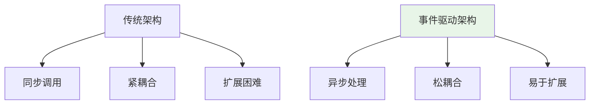
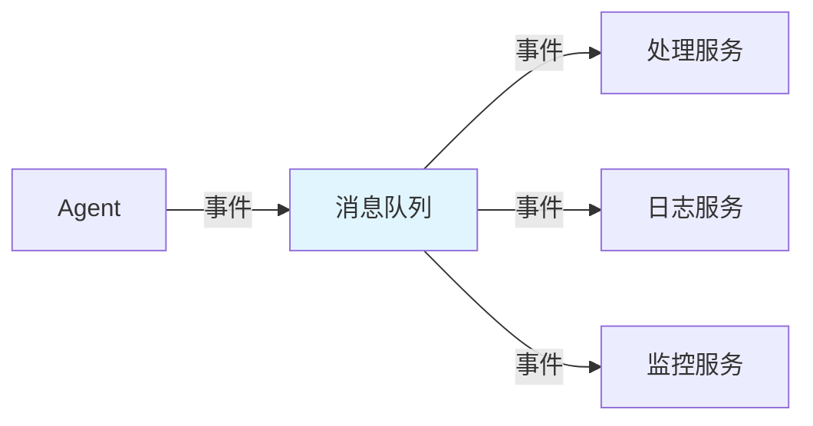

---

title: "MQ 在 Agent 系统中的典型场景：事件驱动 + 日志管道 + Langfuse 事件队列"

tags:

  - 消息队列

  - agent

  - 技术学习

created: "2026-07-21"

---

# MQ 在 Agent 系统中的典型场景：事件驱动 + 日志管道 + Langfuse 事件队列

> **一句话**：在Agent系统中，消息队列用于事件驱动架构、日志管道、Langfuse事件队列等场景，实现系统解耦、异步处理和可观测性。

## 1. Agent系统架构
### 1.1 传统架构 vs 事件驱动架构



### 1.2 MQ在Agent系统中的作用



## 2. 事件驱动场景
### 2.1 用户事件处理

```python

# 事件生产者

from kafka import KafkaProducer

import json

class EventProducer:

    def __init__(self):

        self.producer = KafkaProducer(

            bootstrap_servers=['localhost:9092'],

            value_serializer=lambda v: json.dumps(v).encode('utf-8')

        )

    def send_user_event(self, user_id, event_type, data):

        event = {

            'user_id': user_id,

            'event_type': event_type,

            'data': data,

            'timestamp': time.time()

        }

        self.producer.send('user-events', event)

# 事件消费者

from kafka import KafkaConsumer

class EventConsumer:

    def __init__(self):

        self.consumer = KafkaConsumer(

            'user-events',

            bootstrap_servers=['localhost:9092'],

            value_deserializer=lambda m: json.loads(m.decode('utf-8'))

        )

    def process_events(self):

        for message in self.consumer:

            event = message.value

            self.handle_event(event)

    def handle_event(self, event):

        if event['event_type'] == 'login':

            self.handle_login(event)

        elif event['event_type'] == 'query':

            self.handle_query(event)

```

### 2.2 Agent任务分发

```python

# 任务队列

import pika

import json

class TaskQueue:

    def __init__(self):

        self.connection = pika.BlockingConnection(

            pika.ConnectionParameters('localhost')

        )

        self.channel = self.connection.channel()

        self.channel.queue_declare(queue='agent-tasks', durable=True)

    def publish_task(self, task_type, data):

        task = {

            'type': task_type,

            'data': data,

            'status': 'pending'

        }

        self.channel.basic_publish(

            exchange='',

            routing_key='agent-tasks',

            body=json.dumps(task),

            properties=pika.BasicProperties(delivery_mode=2)

        )

    def consume_tasks(self):

        def callback(ch, method, properties, body):

            task = json.loads(body)

            self.process_task(task)

            ch.basic_ack(delivery_tag=method.delivery_tag)

        self.channel.basic_consume(

            queue='agent-tasks',

            on_message_callback=callback

        )

        self.channel.start_consuming()

```

## 3. 日志管道场景
### 3.1 日志收集

```python

# 日志生产者

import logging

import json

from kafka import KafkaProducer

class KafkaLogHandler(logging.Handler):

    def __init__(self, topic, bootstrap_servers):

        super().__init__()

        self.producer = KafkaProducer(

            bootstrap_servers=bootstrap_servers,

            value_serializer=lambda v: json.dumps(v).encode('utf-8')

        )

        self.topic = topic

    def emit(self, record):

        log_entry = {

            'timestamp': record.created,

            'level': record.levelname,

            'logger': record.name,

            'message': record.getMessage(),

            'module': record.module,

            'function': record.funcName,

            'line': record.lineno

        }

        # 添加额外字段

        if hasattr(record, 'request_id'):

            log_entry['request_id'] = record.request_id

        self.producer.send(self.topic, log_entry)

# 配置日志

handler = KafkaLogHandler('app-logs', ['localhost:9092'])

logger = logging.getLogger('agent')

logger.addHandler(handler)

```

### 3.2 日志处理

```python

# 日志消费者

from kafka import KafkaConsumer

class LogProcessor:

    def __init__(self):

        self.consumer = KafkaConsumer(

            'app-logs',

            bootstrap_servers=['localhost:9092'],

            value_deserializer=lambda m: json.loads(m.decode('utf-8'))

        )

    def process_logs(self):

        for message in self.consumer:

            log_entry = message.value

            self.process_log(log_entry)

    def process_log(self, log_entry):

        # 存储到Elasticsearch

        self.store_to_elasticsearch(log_entry)

        # 分析错误日志

        if log_entry['level'] == 'ERROR':

            self.analyze_error(log_entry)

        # 统计指标

        self.collect_metrics(log_entry)

```

## 4. Langfuse事件队列
### 4.1 Langfuse集成

```python

# Langfuse事件生产者

from langfuse import Langfuse

import json

class LangfuseEventProducer:

    def __init__(self):

        self.langfuse = Langfuse(

            public_key="pk-xxx",

            secret_key="sk-xxx",

            host="https://cloud.langfuse.com"

        )

    def trace_agent_call(self, agent_id, query, response):

        # 创建trace

        trace = self.langfuse.trace(

            name=f"agent-call-{agent_id}",

            metadata={

                'agent_id': agent_id,

                'query': query,

                'response': response

            }

        )

        # 添加span

        span = trace.span(

            name="llm-call",

            input=query,

            output=response

        )

        # 提交

        self.langfuse.flush()

# 使用

producer = LangfuseEventProducer()

producer.trace_agent_call("agent-1", "hello", "hi there")

```

### 4.2 事件队列集成

```python

# Langfuse事件队列

import pika

import json

class LangfuseEventQueue:

    def __init__(self):

        self.connection = pika.BlockingConnection(

            pika.ConnectionParameters('localhost')

        )

        self.channel = self.connection.channel()

        self.channel.queue_declare(queue='langfuse-events', durable=True)

    def publish_event(self, event_type, data):

        event = {

            'type': event_type,

            'data': data,

            'timestamp': time.time()

        }

        self.channel.basic_publish(

            exchange='',

            routing_key='langfuse-events',

            body=json.dumps(event),

            properties=pika.BasicProperties(delivery_mode=2)

        )

    def consume_events(self):

        def callback(ch, method, properties, body):

            event = json.loads(body)

            self.process_event(event)

            ch.basic_ack(delivery_tag=method.delivery_tag)

        self.channel.basic_consume(

            queue='langfuse-events',

            on_message_callback=callback

        )

        self.channel.start_consuming()

```

## 5. 实际案例
### 5.1 AI Agent事件驱动架构

```python

# Agent事件系统

import pika

import json

from typing import Dict, Any

class AgentEventSystem:

    def __init__(self):

        self.connection = pika.BlockingConnection(

            pika.ConnectionParameters('localhost')

        )

        self.channel = self.connection.channel()

        # 声明队列

        self.channel.queue_declare(queue='agent-events', durable=True)

        self.channel.queue_declare(queue='agent-responses', durable=True)

    def publish_event(self, event: Dict[str, Any]):

        self.channel.basic_publish(

            exchange='',

            routing_key='agent-events',

            body=json.dumps(event),

            properties=pika.BasicProperties(delivery_mode=2)

        )

    def consume_events(self):

        def callback(ch, method, properties, body):

            event = json.loads(body)

            response = self.process_event(event)

            # 发送响应

            self.channel.basic_publish(

                exchange='',

                routing_key='agent-responses',

                body=json.dumps(response),

                properties=pika.BasicProperties(delivery_mode=2)

            )

            ch.basic_ack(delivery_tag=method.delivery_tag)

        self.channel.basic_consume(

            queue='agent-events',

            on_message_callback=callback

        )

        self.channel.start_consuming()

    def process_event(self, event: Dict[str, Any]) -> Dict[str, Any]:

        # 处理事件

        return {

            'event_id': event['id'],

            'status': 'processed',

            'result': 'success'

        }

```

## 6. 常见坑点
### 1. 消息积压

```python

# 或者使用消息分片

```

### 2. 消息丢失

```python

# 解决：使用持久化消息和ACK机制

properties = pika.BasicProperties(delivery_mode=2)

```

### 3. 重复消费

```python

# 解决：实现幂等性处理

def process_event(event):

    if is_processed(event['id']):

        return

    # 处理事件

    mark_as_processed(event['id'])

```

## 核心要点

```python

# 事件驱动

producer.send('topic', event)

consumer = KafkaConsumer('topic', ...)

# 日志管道

handler = KafkaLogHandler('logs', ['localhost:9092'])

logger.addHandler(handler)

# Langfuse事件

langfuse.trace(name="agent-call", metadata={...})

```

## 速记卡（面试闪卡）

**Q1：一句话讲清「MQ 在 Agent 系统中的典型场景：事件驱动 + 日志管道 + Langfuse 事件队列」到底是什么？**

A：消息队列在 Agent 系统里做事件驱动解耦、日志管道收集、Langfuse 链路追踪队列，实现异步处理与可观测。

**Q2：1/2. 架构与事件驱动 —— 怎么理解？**

A：传统架构是同步紧耦合、扩展难；事件驱动像公司广播台：Agent 把「用户登录/查询」事件丢进 MQ，处理服务、日志服务、监控服务各自订阅领取。异步、松耦合、易扩容——这就是 Message Queue 的解耦魔法。

**Q3：3. 日志管道场景 —— 怎么理解？**

A：把每行 log 当消息发到 Kafka 主题，下游消费者存 Elasticsearch、分析 ERROR、统计指标。像工厂传送带：产线只管生产日志，质检/入库/统计在传送带另一端并行处理，互不阻塞。

**Q4：4. Langfuse 事件队列 —— 怎么理解？**

A：Langfuse 用 trace/span 记录每次 Agent 调用的输入输出做可观测性；事件队列把 trace 异步推给处理端，避免阻塞主链路。delivery_mode=2 持久化 + basic_ack 保证不丢。

**Q5：6. 常见坑点 —— 怎么理解？**

A：三大坑：消息积压（消费者跟不上→加消费者或分片）；消息丢失（用持久化+ACK）；重复消费（实现幂等，先查 is_processed 再处理）。MQ 不是银弹，可靠性靠持久化、ACK、幂等三件套。

**Q6：核心速记主线有哪些？**

- 事件驱动：Agent 发事件、多服务订阅，异步解耦易扩展

- 日志管道：log 发 Kafka，下游存 ES、分析、统计指标

- Langfuse：trace/span 异步入队，不阻塞主链路

- 三大坑：积压加消费者、丢失用持久化+ACK、重复靠幂等

**口诀**

A：MQ 串 Agent

事件解耦异步来

日志链路都入队

可靠三件套不赖

## 相关链接

- 📋 目录：[[00-消息队列实战]]

- 📚 学习清单：[[技术学习路线图#消息队列实战]]

- 🔗 [[01-MQ核心概念|MQ核心概念]]

- 🔗 [[02-Kafka或RabbitMQ实战|Kafka/RabbitMQ实战]]

