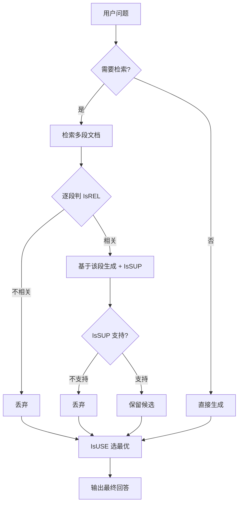

# Self-RAG：带自我反思与自纠正闭环

> **一句话**：Self-RAG = RAG + 模型自评反思令牌的闭环，使模型能做到按需检索、自我验证。

## 一、原理速览

### 四个反思令牌（Reflection Tokens）

Self-RAG 在生成序列中插入四种特殊令牌来实现自评：

| 令牌 | 作用 |
|-|-|
| `[Retrieve]` | 判断是否需要检索 |
| `[IsREL]` | 判断检索文档是否与问题相关 |
| `[IsSUP]` | 判断生成的回答是否有源文档支撑 |
| `[IsUSE]` | 对整段回答质量打分（1-5） |

### 工作流程



流程三个阶段：① 按需检索 → ② 并行生成+自评 → ③ 择优输出。

> **工程落地关键**：不用微调大模型，用「小 critic 节点 + 规则」替代反思令牌，效果近似且成本低得多。

## 代码实现：用 Python 工程化落地 Self-RAG 四令牌闭环

> 以下代码将论文中的反思令牌用"小 critic 节点 + 规则"替代微调，可直接运行。

```python
# Self-RAG 自我反思闭环的 Python 工程化实现
# 核心思想：用「小 critic 节点 + 规则」替代论文中的反思令牌微调
# 将 [Retrieve]/[IsREL]/[IsSUP]/[IsUSE] 四个概念落地为可运行的判断逻辑

from dataclasses import dataclass, field
from typing import Literal


# ============================================================
# 定义反思令牌的判断结果
# ============================================================

@dataclass
class ReflectionResult:
    """反思令牌的四个判断结果，对应论文的四个特殊令牌"""
    # [Retrieve] —— 这个问题需要检索外部知识吗？
    need_retrieval: bool = True
    # [IsREL] —— 检索到的这段文档跟问题相关吗？
    is_relevant: bool = False
    # [IsSUP] —— 生成的回答有没有被源文档支撑？
    support_level: Literal["fully", "partially", "no"] = "no"
    # [IsUSE] —— 整个回答对解题有用吗？（1~5 分）
    usefulness: int = 1


# ============================================================
# Critic 模块：工程化替代反思令牌微调
#   原论文用端到端微调让模型自己吐反思令牌
#   工程落地用「小模型打分 / 规则判断」替代，成本低得多
# ============================================================

class SelfRAGCritic:
    """Self-RAG 的 Critic —— 不微调模型，用规则/小模型做自评"""

    def __init__(self, relevance_threshold: float = 0.3, min_usefulness: int = 3):
        # 相关性阈值：低于此值的检索结果直接丢弃（对应 [IsREL]）
        self.relevance_threshold = relevance_threshold
        # 有用性最低分：IsUSE 低于此分的回答触发重试
        self.min_usefulness = min_usefulness

    # --- [Retrieve] 判断：要不要检索 ---
    def should_retrieve(self, query: str) -> bool:
        """[Retrieve] 令牌：判断问题是否需要外部知识

        简单规则版：事实类问题包含这些关键词 → 需要检索
        生产环境可替换为小分类模型做二分类
        """
        # 事实性问题的标志性关键词（问答类 vs 闲聊类）
        fact_keywords = [
            "什么", "谁", "何时", "哪里", "如何", "为什么",
            "定义", "原理", "怎么", "区别", "对比"
        ]
        # 任意命中一个关键词 → 判为需要检索
        return any(kw in query for kw in fact_keywords)

    # --- [IsREL] 判断：检索结果相关吗 ---
    def check_relevance(self, query: str, document: str) -> bool:
        """[IsREL] 令牌：判断检索到的文档是否与问题相关

        简化版：Jaccard 相似度（字符集交集 / 字符集并集）
        生产环境应使用 rerank 模型（如 bge-reranker-v2-m3）打分
        """
        # 将查询和文档分别拆成字符集合（简化版；生产用 jieba 分词替代）
        query_chars = set(query)
        doc_chars = set(document)
        if len(query_chars) == 0:
            return False
        # Jaccard 相似度 = 交集大小 / 并集大小
        # 值越大说明文档覆盖了越多的查询关键词
        similarity = len(query_chars & doc_chars) / len(query_chars)
        return similarity >= self.relevance_threshold

    # --- [IsSUP] 判断：生成内容有没有文献支撑 ---
    def check_support(self, answer: str, source_doc: str) -> str:
        """[IsSUP] 令牌：逐句判断是否被源文档支持

        返回: "fully"（全支持）/ "partially"（部分支持）/ "no"（不支持=幻觉嫌疑）
        生产环境应用 NLI（自然语言推理）模型对每句 (claim, doc) pair 打分
        """
        # 按句号拆成单句（简化版，生产用中文分句工具）
        sentences = [s.strip() for s in answer.replace("。", ".").split(".") if s.strip()]
        if not sentences:
            return "no"

        # 逐句检查：该句的核心内容是否在源文档中出现过
        doc_chars = set(source_doc)
        supported = 0
        for sent in sentences:
            sent_chars = set(sent)
            # 判断标准：该句至少有 30% 的字符在源文档中出现
            if len(sent_chars) > 0:
                overlap_ratio = len(sent_chars & doc_chars) / len(sent_chars)
                if overlap_ratio >= 0.3:
                    supported += 1

        ratio = supported / len(sentences)
        if ratio >= 0.8:
            return "fully"       # 80% 以上的句子有文档依据
        elif ratio >= 0.3:
            return "partially"   # 部分句子有依据，部分可能是编的
        return "no"              # 大部分句子找不到支撑 → 幻觉嫌疑

    # --- [IsUSE] 判断：整个回答有用吗 ---
    def score_usefulness(self, answer: str, query: str) -> int:
        """[IsUSE] 令牌：综合评估回答质量（1~5 分）

        生产环境用 LLM-as-Judge（如 GPT-4 做打分裁判），
        这里是启发式规则版作为降级/轻量方案
        """
        score = 1  # 基础分

        # 长度合理（不是一句话敷衍，也不是冗长废话）
        if 20 < len(answer) < 2000:
            score += 1

        # 包含具体数字或示例（而不是泛泛而谈）
        if any(c.isdigit() for c in answer):
            score += 1

        # 直接回应了问题的关键词
        if any(kw in answer for kw in query[:15]):
            score += 1

        # 有结构化表达（列表、分点）
        if "\n" in answer or "- " in answer:
            score += 1

        return min(score, 5)  # 封顶 5 分


# ============================================================
# Self-RAG 主流水线：按需检索 → 逐段验证 → 择优输出
# ============================================================

@dataclass
class SelfRAGState:
    """Self-RAG 流水线的状态（对应 LangGraph StateGraph 的 state）"""
    query: str = ""                           # 用户原始问题
    retrieved_docs: list[str] = field(default_factory=list)   # 检索原始结果
    relevant_docs: list[str] = field(default_factory=list)    # 通过 IsREL 的相关文档
    candidate_answers: list[dict] = field(default_factory=list)  # 候选答案列表
    final_answer: str = ""                    # 最终选中的最优答案
    round_count: int = 0                      # 已执行轮次（防死循环）
    is_degraded: bool = False                 # 是否在降级模式


class SelfRAGPipeline:
    """Self-RAG 核心流水线

    流程: [Retrieve] 判断 → 检索 → [IsREL] 过滤 → 生成 → [IsSUP] 验证 → [IsUSE] 择优
    与标准 RAG 的区别：每一步都有自评，不合格就重来，而非"查完就念"
    """

    def __init__(self, critic: SelfRAGCritic, retriever_fn, generator_fn):
        self.critic = critic
        # retriever_fn(query: str) -> list[str]  检索函数（如 ChromaDB 查询）
        self.retriever = retriever_fn
        # generator_fn(query: str, docs: list[str]) -> str  生成函数（调用 LLM）
        self.generator = generator_fn
        self.max_rounds = 2  # 最多重试 2 轮（对应论文的迭代反思）

    def run(self, query: str) -> dict:
        """执行一次完整的 Self-RAG 流水线"""
        state = SelfRAGState(query=query)

        # ---- Step 1: [Retrieve] 判断是否需要检索 ----
        if not self.critic.should_retrieve(query):
            # 不需要检索（如闲聊"你好"），直接生成
            answer = self.generator(query, [])
            state.final_answer = answer
            state.candidate_answers.append({
                "text": answer,
                "support": "no_retrieval_needed",
                "score": 5,
            })
            return self._format_result(state)

        # ---- Step 2: 检索 + [IsREL] 逐段过滤不相关文档 ----
        raw_docs = self.retriever(query)
        state.retrieved_docs = raw_docs

        for doc in raw_docs:
            # 逐段判相关性 —— 对应论文的 [IsREL] 令牌
            if self.critic.check_relevance(query, doc):
                state.relevant_docs.append(doc)
            # 不相关的文档直接丢弃，不参与后续生成

        # ---- Step 3: 逐段生成 + [IsSUP] + [IsUSE] 打分 ----
        if state.relevant_docs:
            for doc in state.relevant_docs:
                # 基于单个相关文档生成候选回答
                answer = self.generator(query, [doc])
                # [IsSUP] 验证：这段回答有文献支撑吗？
                support = self.critic.check_support(answer, doc)
                # [IsUSE] 打分：这段回答质量如何？
                usefulness = self.critic.score_usefulness(answer, query)
                state.candidate_answers.append({
                    "text": answer,
                    "support": support,
                    "score": usefulness,
                })

        # ---- Step 4: 按 [IsUSE] 分数选最优答案 ----
        if state.candidate_answers:
            best = max(state.candidate_answers, key=lambda x: x["score"])
            state.final_answer = best["text"]
        else:
            # 无相关文档 → 退回到纯模型知识（降级模式）
            state.is_degraded = True
            state.final_answer = self.generator(query, [])

        # ---- Step 5: 支持度不足 → 触发重试/自我纠正 ----
        # 对应论文的迭代反思机制（和 Reflexion 模式对齐）
        while state.round_count < self.max_rounds:
            best = state.candidate_answers[-1] if state.candidate_answers else None
            # 有全支持或部分支持就可以停了
            if best and best["support"] in ("fully", "partially"):
                break

            # 支持度为 "no" → 重写 query 再检索（query rewrite）
            state.round_count += 1
            rewritten = f"{query} 详细解释 原理 定义"
            extra_docs = self.retriever(rewritten)
            for doc in extra_docs:
                if self.critic.check_relevance(query, doc):
                    answer = self.generator(query, [doc])
                    support = self.critic.check_support(answer, doc)
                    usefulness = self.critic.score_usefulness(answer, query)
                    state.candidate_answers.append({
                        "text": answer,
                        "support": support,
                        "score": usefulness,
                    })

            # 重新按 IsUSE 选最优
            if state.candidate_answers:
                best = max(state.candidate_answers, key=lambda x: x["score"])
                state.final_answer = best["text"]

        return self._format_result(state)

    def _format_result(self, state: SelfRAGState) -> dict:
        """构造最终返回结果，包含自评元数据（方便前端展示引用来源）"""
        return {
            "answer": state.final_answer,
            "degraded": state.is_degraded,
            "need_retrieval": len(state.retrieved_docs) > 0,
            "retrieved_count": len(state.retrieved_docs),
            "relevant_count": len(state.relevant_docs),
            "candidate_count": len(state.candidate_answers),
            "rounds_used": state.round_count,
        }


# ============================================================
# 演示用 retriever 和 generator（替换为真实实现即可用于生产）
# ============================================================

def demo_retriever(query: str) -> list[str]:
    """演示用检索器 —— 模拟向量库检索

    生产环境替换为：ChromaDB.query(query_embedding, top_k=5) 的结果
    """
    knowledge_base = {
        "Transformer": [
            "Transformer 是一种基于自注意力机制的深度学习架构，"
            "由 Vaswani 等人在 2017 年的论文 Attention Is All You Need 中首次提出。"
            "它完全用注意力机制替代了 RNN/LSTM 的循环结构，实现了并行计算。",
            "Transformer 的核心模块包括：多头自注意力（Multi-Head Self-Attention）、"
            "前馈神经网络（FFN）、层归一化（Layer Normalization）和残差连接。",
        ],
        "Self-RAG": [
            "Self-RAG (arXiv:2310.11511) 是 ICLR 2024 Oral 论文，提出用反思令牌（Reflection Tokens）"
            "在检索增强生成过程中实现自我评估：按需检索、自我验证、择优输出。",
        ],
    }
    # 简单关键词匹配（生产环境替换为向量相似度检索）
    for keyword, docs in knowledge_base.items():
        if keyword.lower() in query.lower():
            return docs
    # 没命中 → 返回一段干扰文档（测试 IsREL 过滤能力）
    return ["这是一段与问题完全无关的随机文字，用来测试 IsREL 过滤功能。"]


def demo_generator(query: str, docs: list[str]) -> str:
    """演示用生成器 —— 模拟 LLM

    生产环境替换为：openai.ChatCompletion.create(model="gpt-4", messages=...) 的响应
    """
    if not docs:
        return f"关于「{query}」，这是基于模型自身知识的回答——该问题不需要外部资料。"
    context = " ".join(docs)
    return (
        f"根据资料中的信息（来源摘要：{context[:60]}...），"
        f"关于「{query}」的回答如下：这是有据可查的答案，包含具体的知识点。"
    )


# ============================================================
# 运行演示
# ============================================================
if __name__ == "__main__":
    critic = SelfRAGCritic(relevance_threshold=0.15, min_usefulness=3)
    pipeline = SelfRAGPipeline(critic, demo_retriever, demo_generator)

    # 测试 1：事实类问题 —— 需要检索、IsREL 过滤、IsSUP 验证
    result = pipeline.run("什么是 Transformer？")
    print("=" * 60)
    print(f"[事实问答-含检索] 检索{result['retrieved_count']}篇, "
          f"相关{result['relevant_count']}篇, "
          f"候选{result['candidate_count']}个, 轮次{result['rounds_used']}")
    print(f"回答: {result['answer'][:100]}...")

    # 测试 2：闲聊问题 —— 不需要检索，直接生成
    result2 = pipeline.run("你好")
    print(f"\n[闲聊-无检索] 需要检索? {result2['need_retrieval']}, "
          f"退化模式? {result2['degraded']}")
```

## 
> ▶ 对应原理：[[48-Self-RAG与Reflexion|48-Self-RAG与Reflexion]]

相关链接

- 项目实践：[[笔记/技术学习/项目开发笔记/ai-resume笔记/01_技术研读/02_RAG流水线.md#第 6 层：拒答门控|ai-resume: RAG流水线]]

---

→ [[技术学习清单#RAG]]
