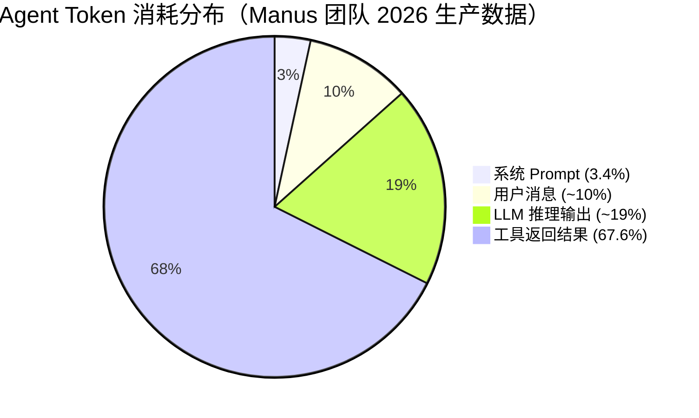

# Tool Description 设计铁律：清晰描述 + 参数约束 + 错误示例

> **一句话**：Tool Description（工具描述）是 LLM 决定「什么时候调哪个工具」的唯一依据——写得好 Agent 稳准狠，写得烂 AI 就变成瞎指挥。
>
---

## 一、为什么 Tool Description 如此重要？

LLM 选工具不是靠「理解代码逻辑」，而是靠你写在工具定义里的三样东西：

| 要素 | LLM 用它做什么 | 写烂了的后果 |
|------|---------------|-------------|
| `name` | 指定「我要调哪个工具」 | 名字太像另一个工具 → 选错 |
| `description` | 判断「什么时候该调」 | 该调不调，不该调乱调 |
| `parameters` | 知道「要传什么参数」 | 参数名写错 → LLM 瞎编 |

**核心原则**：工具的「说明书」是写给 LLM 看的，不是写给人类开发者看的。你要换位思考——一个只有文本理解能力、没有业务直觉的 LLM，看到你的工具定义时，能不能准确判断「现在该用它吗？参数该怎么填？」

---

## 二、工具设计五条铁律

### 铁律 1：少而精 > 多而全

```text
超过 30~50 个工具后，LLM 选错工具的比率线性上升。
```

不是工具越多越强大——每多一个工具，LLM 的决策空间就大一圈。工具越多，选错概率越高。**优先合并为任务级工具**。

### 铁律 2：高内聚任务级工具 > 零散 CRUD

```text
❌ list_users() + list_events() + create_event()    3 个零散工具
✅ schedule_event(user, time, description)           1 个任务级工具
```

任务级工具封装了完整的业务流程，LLM 只需要做一次决策。零散 CRUD 工具不仅增加数量，还让 LLM 自己编排步骤——更容易出错。

### 铁律 3：枚举约束 > 自由文本

```json
{
    "type": "object",
    "properties": {
        "status": {
            "type": "string",
            "enum": ["approved", "rejected", "pending"]
        }
    }
}
```

```text
❌ status: string          → LLM 可能填 "驳回"、"通过"、"OK" 等各种变体
✅ enum: ["approved", ...] → LLM 只能从选项里选，不会跑偏
```

每个 `string` 参数，问自己：**这个值真的是任意字符串吗？** 如果是有限选项，永远用 `enum`。

### 铁律 4：数字必须设上下限

```json
{
    "amount": {
        "type": "number",
        "minimum": 1,
        "maximum": 100000
    }
}
```

```text
❌ amount: number              → LLM 可能填负数、0、或者天文数字
✅ amount: number, minimum=1   → 防止非法值
```

LLM 没有「常识」判断数字的合理范围。你不约束，它就敢填 `-999999`。

### 铁律 5：参数命名无歧义

```text
❌ from, to                     → 容易搞反，LLM 分不清「从哪到哪」
✅ from_account_id, to_account_id → 一目了然
```

给参数取名时，把「唯一能区分它的信息」放进名字。`from` 还是 `source_account_id`？后者 LLM 几乎不会搞错。

---

## 三、工具返回错误的方式

这是最容易踩的坑：

```python
# ❌ 错误：抛异常 —— LLM 看不到！
def transfer_money(from_id: str, to_id: str, amount: float) -> str:
    if amount <= 0:
        raise ValueError("金额必须大于 0")

# ✅ 正确：返回错误字符串 —— LLM 读到后可以自己纠正
def transfer_money(from_id: str, to_id: str, amount: float) -> str:
    if amount <= 0:
        return "错误：转账金额必须大于 0。请修正后重试。"
    return f"成功从 {from_id} 向 {to_id} 转账 {amount} 元"
```

> [!tip] Exception → Agent 循环炸了。Error String → LLM 读到错误，自己纠正。
> **工具的错误信息是给 LLM 看的，不是给你的日志系统看的。**

**区分两种异常：**

| 异常类型 | 处理方式 | 例子 |
|:--------|:--------|:-----|
| **业务错误**（LLM 能纠正） | 返回错误字符串 | 金额超限、参数不合法 |
| **系统错误**（LLM 无法处理） | 抛异常，走重试/熔断 | 网络超时、数据库连不上 |

---

## 四、工具的 description 怎么写

Description 是 LLM 判断「该不该用这个工具」的唯一依据。写得好能让选准确率从 60% 提到 95%+。

### 4.1 坏的 vs 好的 description

```python
# ❌ 糟糕的 description
"获取天气"

# ✅ 好的 description
(
    "查询指定城市的实时天气，返回温度、湿度、天气状况。"
    "当用户询问以下内容时使用此工具："
    "  - 某地当前的天气情况"
    "  - 今天/明天会不会下雨"
    "不要用此工具查询："
    "  - 历史天气（请用 get_historical_weather）"
)
```

### 4.2 Description 写作模板

```text
[一句话概括：这个工具做什么]

当以下情况使用此工具：
  - [场景 1]
  - [场景 2]

不要用此工具：
  - [排除场景 1 → 指定替代工具]
```

### 4.3 参数 description 写作要点

每个参数的 `description` 也很关键。你要告诉 LLM 这个参数的值从哪里来：

```json
{
    "user_id": {
        "type": "string",
        "description": "用户唯一标识，从 auth_token 中解析获取。不要自己编造。"
    }
}
```

尤其注意：**LLM 会自己编造参数值**（幻觉）。如果参数值必须从上下文获取，一定在 description 里说明。

---

## 五、上下文成本真相

Manus 团队的生产数据（2026）告诉你该优化什么：



> [!note] 优化工具返回结果的 Token 量，比优化 System Prompt 重要 20 倍。

**两个实践建议：**
1. **工具返回结果要精简**：只返回必要字段，别把整张表 JSON 原样返回
2. **工具定义本身也有成本**：每次请求都带着全部工具定义，所以少而精的铁律既提高准确率也省钱

---

---

## 相关链接

- 目录：[[00-AI]]
- 上一篇：[[15-Agent架构与工具调用]]
- 下一篇：[[17-工具系统：定义→注册→发现→调用]]
- 项目实践：[[笔记/技术学习/项目开发笔记/ai-resume笔记/01_技术研读/05_MCP协议.md#5 Tools 逐行走读|ai-resume: MCP协议]]
- 项目实践：[[笔记/技术学习/项目开发笔记/cr-agent笔记/01-技术研读/12-项目规格与TechStack.md#Code Style|cr-agent: 工具系统设计]]

---
→ [[技术学习清单#Agent 架构（核心）]]
