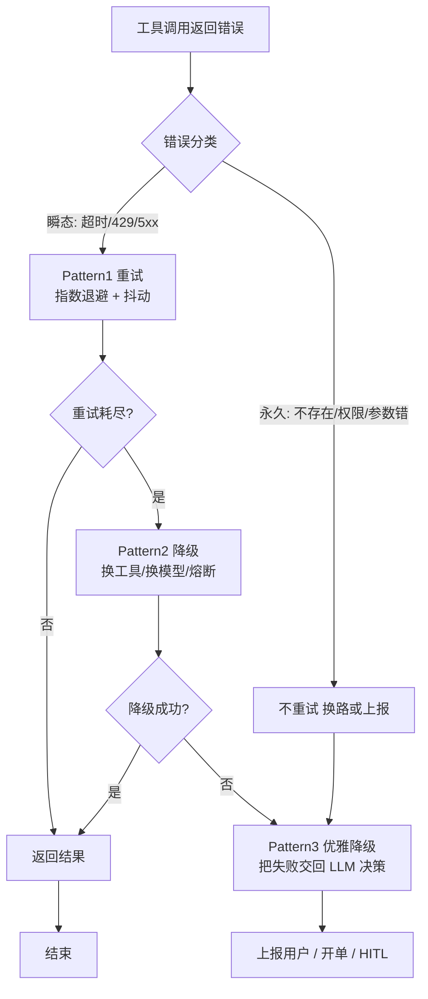
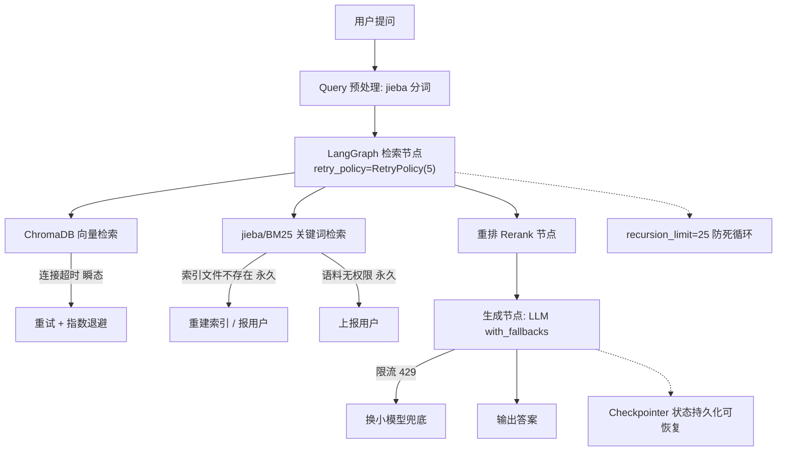

> **一句话**：工具失败是常态而非意外——先分瞬态（超时）和永久（文件不存在/权限不足），瞬态重试+退避、永久换路或上报，三道护栏防死循环。

# 工具调用失败处理：文件不存在 / 超时 / 权限不足 → 恢复与重试


## 二、工具失败不是「意外」，是「日常」

先纠一个误区：别把工具报错当小概率边缘情况。

> "Tool failures in LLM agents are not edge cases. They are the normal operating condition."【来源：dev.to《Three Error Recovery Patterns》, 2025；2026 年多家生产复盘报告一致印证——agentmarketcap.ai《Function Calling Reliability in Production 2026》】

生产环境里：API 会挂、限流会触发、负载上来就超时、文件会被删、token 会过期。而且 Agent 的训练数据**几乎只见过「成功调用工具」的例子**，没见过失败时该咋办【来源：rapidclaw.dev《Why AI Agents Fail in Production》】。所以它默认行为很蠢：要么重试同一个失败调用（以为自己格式写错了），要么把失败当成功、自己编一个结果糊弄你。

失败处理不到位，只有三种下场：

1. **整个任务崩溃**（直接抛异常终止）；
2. **无限重试烧光 token（钱）**（一次 prompt bug → 循环 50 次 → 几十美元打水漂，zirasoftware《AI Agents in Production 2026》把「无成本预算导致单次任务烧掉 \$500」列为头号生产故障）；
3. **静默跳过**（失败了假装成功，交付一份残缺的答案，还像模像样）。

## 三、第一步：给错误「分个类」——瞬态 vs 永久（核心直觉）

所有恢复策略的前提，是先判断错误**能不能靠重试解决**。一句话区分：

| 类型 | 含义 | 典型代表 | 该不该重试 |
|-|-|-|-|
| **瞬态 transient** | 过一会儿自己就好了 | 限流（HTTP 429）、网络超时（timeout）、服务端 5xx | ✅ 该重试（加退避） |
| **永久 permanent** | 再试一百次也白搭 | 认证失败（401）、参数错误（400）、**找不到（404 / 文件不存在）、权限不足（403）** | ❌ 别重试，换路或上报 |

把题目点名的三类对号入座：

- **超时** → 瞬态 → 重试（加退避）；
- **文件不存在** → 永久 → 不重试，换参数 / 换工具 / 追问用户；
- **权限不足** → 永久 → 不重试，上报用户或换身份。

> 类比收尾：超时像**快递爆仓**（等等就发货了）；权限不足像**没门禁卡**（再刷脸也没用）；文件不存在像**书被借走了**（换一本，或问问是不是记错编号）。

**工程落点**：别用字符串去解析报错信息猜类型（脆弱、易错、不同服务商文案还不一样）。用一个封闭的**错误枚举（ErrorKind）**来分支：

```text
# 感觉级：用枚举分类，而非解析报错字符串
classify(err) -> ErrorKind        # RATE_LIMIT / TIMEOUT / AUTH / NOT_FOUND / BAD_REQUEST ...
retry_only_on = {RATE_LIMIT, TIMEOUT, SERVER_ERROR}   # 瞬态才重试
fail_fast_on  = {AUTH, BAD_REQUEST, NOT_FOUND}         # 永久直接放弃
```

【来源：dev.to 同上；CSDN《Agent 工具调用失败重试完整容错方案》；ai-agentsplus.com《AI Agent Error Handling and Retry Strategies 2026》更把「按分类分级重试」列为生产共识】

⚠️ **2026 新共识（边界情形）**：agentmarketcap.ai 指出，除了「瞬态/永久」，还有两类最贵、最隐蔽的失败**绝不能靠重试解决**：

- **Schema 漂移（schema drift）**：工具签名悄悄变了，模型还在用旧参数调 → 重试 N 次也没用，要「把 schema 显式注入上下文后重试一次」。
- **语义空操作（semantic no-op）**：工具调用结构正确、返回 200、其实啥也没干（比如邮件因收件人校验失败被静默丢弃）。重试只会更糟，要靠**端到端验证**而非「调用成功」判断。

## 四、三套恢复模式（阶梯式：由便宜到贵）

原则：**用能解决当前故障的最便宜那档**，别一上来就上最重的。

**Pattern 1 · Retry 重试**——只用于瞬态错误。

- 关键不是「重试几次」，是**怎么重试**：指数退避（exponential backoff，第 n 次等 2ⁿ 秒）+ 抖动（jitter，随机扰动，避免所有请求同时重撞，防止「惊群」把刚恢复的服务又打挂）。
- 社区共识配置（来源：zylos.ai《Graceful Degradation Patterns 2026》、callsphere.tech）：base_delay=1s、max_delay 上限 60s、最大尝试 4 次、jitter 取 0\~100% 均匀随机。
- 重试在**工具包装层内部**悄悄完成，Agent 主循环无感知，只拿到最终结果或一句干净的错误。

**Pattern 2 · Fallback 降级 / 备用**——主路不可用或太慢时。

- 换一个实现同样接口的「备胎」：备用服务商、缓存结果、或弱化版调用（如 LLM 限流时切到更小更便宜的模型）。
- **熔断器（circuit breaker）**：某下游失败率超阈值（如滚动窗口 >50%）就「开路」，先别再打它，冷却一段时间再半开试探。否则重试逻辑会放大下游故障（来源：neelmishra.github.io、zylos.ai）。

**Pattern 3 · Graceful Degrade 优雅降级**——重试和降级都失败时。

- 返回**部分结果**，并**明确告诉 LLM 哪步失败了、为啥**，让它自己决定下一步（追问用户？换策略？）。
- 最忌「藏错误」。模型没法帮用户从它不知道的失败里恢复。【来源：dev.to；blog.rajpoot.dev《LLM Agent Error Recovery in 2026》】

三模式对比：

| 模式 | 适用错误 | 代价 | 谁来做 | LangGraph 怎么写 |
|-|-|-|-|-|
| Retry 重试 | 瞬态（超时 / 429 / 5xx） | 低（多等几秒） | 工具包装层 | `retry_policy=RetryPolicy(max_attempts=5)` |
| Fallback 降级 | 主路挂 / 慢 | 中（结果可能弱） | 路由 / 框架 | `with_fallbacks([小模型])` + 熔断 |
| Graceful 降级 | 都失败 | 高（结果不全） | LLM 自己决策 | 把结构化错误写回 State，交还 LLM |

决策总图（错误分类 → 三模式阶梯）：



## 五、防「死循环」的护栏（最重要，没有它前面白搭）

重试 + 自我纠正听起来美好，但 LLM 最容易**卡在循环里出不来**。三道护栏：

**① 硬步数上限（Hard Step Cap）**

最关键的单一护栏。给 Agent 设最大步数，超了就停、记录、上报。

```text
# 感觉级：LangGraph 调用时限制递归 / 循环次数
graph.invoke(input, config={"recursion_limit": 25})   # 默认 25
```

> 注意：ReAct 每调一次工具算**两步**（agent 节点 + tools 节点），按预期工具调用次数合理设值，否则容易 `GraphRecursionError`。【来源：掘金《LangGraph  100 题》；machinelearningplus.com】

**② 错误语义：给「有用」的错误，别给「没用」的**

- ✅ 有用："Order #42 没找到，用户可能打错 ID 了" / "数据库暂时不可用，稍后再试" / "你没权限看租户 7 的订单"。
- ❌ 没用："Error: 500" / "Internal server error" / "NullPointerException"。
- 没用的错误会**诱导模型进入循环**。工具设计要把错误类型、可恢复动作结构化地塞回上下文。【来源：blog.rajpoot.dev；agentmarketcap.ai 强调「schema 校验通过率」比「整体成功率」更能暴露系统性问题】

**③ 四种典型死循环**

- **缺字段循环**：工具返回 `email`，模型要 `user.email` → 它「再试一次」→ 又一样 → 死循环。修：描述性错误 / 稳定 schema。
- **陈旧缓存循环**：缓存返回旧值，模型以为错了又调 → 拿到同样的旧值 → 循环。修：强制刷新工具 / 步数上限。
- **认证循环**：API 返回 401，模型用同一个 token 重试 → 401 → 循环。修：**4xx 绝不重试**，直接上交用户。
- **幻觉工具**：模型编了个不存在的工具名（如 `searchOrder`）→ 调度器回「unknown tool」→ 它可能继续编。修：`handle_tool_errors=True` 把错误交还 LLM，让它选真实存在的工具。【来源：blog.rajpoot.dev；machinelearningplus.com】

补充护栏：**成本熔断（按美元预算封顶，防循环烧钱，zirasoftware 实测缺它单次任务烧 \$500）、状态检查点（checkpointer）**（每步持久化，worker 挂了从最后一步恢复）。

## 六、落到我的简历项目：Agentic RAG 怎么做容错

我的项目用 **LangGraph** 编排 **Agentic RAG**：检索层是 **ChromaDB（向量检索）+ jieba/BM25（关键词检索）**，生成层是 LLM。把上面的套路直接套进去：



- **ChromaDB 连接超时** → 瞬态 → 节点 `retry_policy=RetryPolicy(5)` + 指数退避；
- **jieba 词典 / BM25 索引文件不存在** → 永久 → 不重试，重建索引或明确报错给用户（别让 Agent 空转）；
- **读本地语料权限不足** → 永久 → 上报用户换路径 / 授权，不重试；
- **LLM 生成时限流（429）** → `with_fallbacks` 切到更小更便宜的模型兜底，宁可变弱一点也别卡 5 分钟；
- **全局** → `recursion_limit` 防工具调用死循环；`checkpointer` 持久化对话状态，中途崩了能从检查点续跑。

> 检索节点都包了重试策略，但只重试瞬态错误；文件不存在和权限类错误直接走降级和上报。图层面用 recursion_limit 兜底防死循环，checkpointer 保证可恢复。

## 七、生产环境额外细节

1. **LLM 调用重试 vs 工具调用重试要隔离**：大模型 API 自身网络超时是「模型层重试」，搜索 / 计算器是「工具层重试」，两套路逻辑别混。【来源：CSDN 同上】
2. **每次工具调用必须设超时**：防第三方接口阻塞把整个 Agent 线程卡死（neelmishra 实测 LLM 调用可挂 60\~120s，必须 `asyncio.wait_for(func(), timeout=30)`）。
3. **全局重试预算**：给单次对话设总重试上限，多个工具接连报错也不无限耗资源。
4. **可观测性**：结构化日志（工具名 / 入参 / 事件 / 重试次数 / 异常）+ 指标（失败率、schema 校验通过率）+ 告警。生产可直接接 Langfuse / LangSmith / Prometheus。【来源：agentmarketcap.ai 2026 监控栈】
5. **预检（pre-flight）**：调 LLM 前先用 tokenizer 估 token 数，接近上限先压缩上下文再调，避免上下文溢出类失败。【来源：zylos.ai】

## 代码实现：错误分类 + 三模式恢复 + 护栏

> 以下代码实现了本文核心逻辑：错误枚举分类（瞬态/永久）、三种恢复模式（重试→降级→优雅降级）、防死循环护栏。可直接运行。

```python
# 工具调用失败处理的完整 Python 实现
# 核心：先分瞬态/永久错误，瞬态重试+退避，永久换路或上报
# 三道护栏防死循环：递归上限 + 结构化错误 + 4xx 不重试

import time
import random
import functools
from enum import Enum, auto
from typing import Callable, Any


# ============================================================
# 第一部分：错误分类 —— 拒绝用字符串解析报错，用枚举做分支
# ============================================================

class ErrorKind(Enum):
    """错误类型枚举 —— 封闭分类，杜绝靠解析报错字符串判断类型的脆弱做法"""
    # === 瞬态（Transient）：等等就能好 ===
    RATE_LIMIT = auto()     # HTTP 429 — 被限流，等 Retry-After 秒后再来
    TIMEOUT = auto()        # 网络超时 — 对方暂时没响应，过一会可能好
    UPSTREAM = auto()       # 5xx 服务端错误 — 对方临时抽风
    # === 永久（Permanent）：重试一万次也白搭 ===
    AUTH = auto()           # 401/403 — 鉴权失败，重试不会让 token 变有效
    NOT_FOUND = auto()      # 404/文件不存在 — 资源就是没有，重试不会凭空出现
    BAD_REQUEST = auto()    # 400 — 请求参数写错，重试不改参数字还是错
    PERMISSION_DENIED = auto()  # 403 — 权限不足，重试不会变出权限
    # === 未知（Unknown）=== 
    UNKNOWN = auto()        # 无法归类 — 默认重试一次（保守策略）


# 瞬态错误集合：只对这类错误执行重试逻辑
RETRYABLE_ERRORS: set[ErrorKind] = {
    ErrorKind.RATE_LIMIT,
    ErrorKind.TIMEOUT,
    ErrorKind.UPSTREAM,
}

# 永久错误集合：直接放弃，不给重试机会
NON_RETRYABLE_ERRORS: set[ErrorKind] = {
    ErrorKind.AUTH,
    ErrorKind.NOT_FOUND,
    ErrorKind.BAD_REQUEST,
    ErrorKind.PERMISSION_DENIED,
}


def classify_error(exception: Exception, status_code: int | None = None) -> ErrorKind:
    """将任意异常归类为 ErrorKind 枚举值

    分层判断优先级：HTTP 状态码 > 异常类型 > 关键字匹配
    设计原则：宁可误判为可重试（多等一会），也不误判为永久（放弃太快）
    """
    # 第一层：HTTP 状态码（最可靠，服务端明确告知原因）
    if status_code is not None:
        if status_code == 429:
            return ErrorKind.RATE_LIMIT     # 被限流，等会就好
        if status_code in (500, 502, 503, 504):
            return ErrorKind.UPSTREAM       # 服务端临时故障
        if status_code == 401:
            return ErrorKind.AUTH           # token 过期/无效
        if status_code == 403:
            return ErrorKind.PERMISSION_DENIED  # 没权限
        if status_code == 404:
            return ErrorKind.NOT_FOUND      # 资源不存在
        if status_code == 400:
            return ErrorKind.BAD_REQUEST    # 请求参数错误

    # 第二层：Python 异常类型判断
    if isinstance(exception, TimeoutError):
        return ErrorKind.TIMEOUT            # asyncio.wait_for 超时
    if isinstance(exception, ConnectionError):
        return ErrorKind.UPSTREAM           # 网络连接失败（可能是临时的）
    if isinstance(exception, PermissionError):
        return ErrorKind.PERMISSION_DENIED  # 本地文件无读权限
    if isinstance(exception, FileNotFoundError):
        return ErrorKind.NOT_FOUND          # 本地文件不存在
    if isinstance(exception, (TypeError, ValueError, KeyError, AttributeError)):
        return ErrorKind.BAD_REQUEST        # 编程错误，参数/类型问题

    # 第三层：关键字兜底（不同服务商的报错格式千差万别）
    msg = str(exception).lower()
    if any(kw in msg for kw in ["rate limit", "too many requests", "429"]):
        return ErrorKind.RATE_LIMIT
    if any(kw in msg for kw in ["timeout", "timed out"]):
        return ErrorKind.TIMEOUT
    if any(kw in msg for kw in ["unauthorized", "forbidden", "403", "401"]):
        return ErrorKind.AUTH

    return ErrorKind.UNKNOWN  # 无法归类 → 默认策略：重试一次


# ============================================================
# 第二部分：三模式恢复 —— Retry → Fallback → Graceful Degrade
# ============================================================

def exponential_backoff_with_jitter(
    attempt: int,
    base_delay: float = 1.0,
    max_delay: float = 60.0,
) -> float:
    """指数退避 + Full Jitter 计算等待时间

    公式: sleep = random(0, min(max_delay, base_delay × 2^attempt))
    Full Jitter 把同步重试拆成随机分散，防惊群效应（Thundering Herd）
    """
    # 计算退避上界：base × 2^n，封顶 max_delay（防退避时间爆炸）
    raw_upper = min(max_delay, base_delay * (2 ** attempt))
    # Full Jitter：在 [0, 上界] 区间内完全随机
    return random.uniform(0, raw_upper)


def build_structured_error(
    error_kind: ErrorKind,
    tool_name: str,
    detail: str,
    suggestion: str = "",
) -> dict:
    """构造结构化错误信息 —— 交回 LLM 让它自己决定下一步

    最忌"藏错误"：模型没法从它不知道的失败里恢复。
    把错误类型 + 可恢复动作结构化地注入上下文，模型才能做出合理决策。
    """
    return {
        "error": True,
        "tool": tool_name,
        "kind": error_kind.name,
        "detail": detail,
        "suggestion": suggestion,
        "retryable": error_kind in RETRYABLE_ERRORS,
    }


def tool_retry_wrapper(
    tool_fn: Callable,
    tool_name: str,
    max_retries: int = 3,
    base_delay: float = 1.0,
    max_delay: float = 30.0,
) -> Callable:
    """工具重试包装器 —— Pattern 1: Retry

    只对瞬态错误（超时/限流/5xx）执行指数退避重试
    永久错误（文件不存在/权限不足）直接返回结构化错误，不浪费一次重试
    """

    @functools.wraps(tool_fn)
    def wrapper(*args, **kwargs) -> Any:
        last_error = None
        for attempt in range(max_retries + 1):  # 0 次 ~ max_retries 次，共 max_retries+1 次尝试
            try:
                # 执行工具调用
                result = tool_fn(*args, **kwargs)
                return result  # 成功，直接返回
            except Exception as e:
                last_error = e
                # 分类错误类型
                error_kind = classify_error(e)

                # 永久错误 → 不重试，直接返回结构化错误给 LLM
                if error_kind in NON_RETRYABLE_ERRORS:
                    return build_structured_error(
                        error_kind, tool_name,
                        detail=str(e),
                        suggestion=(
                            "文件不存在，请确认路径是否正确" if error_kind == ErrorKind.NOT_FOUND
                            else "无权限访问，请确认认证信息后重试" if error_kind == ErrorKind.AUTH
                            else "请求参数错误，请检查入参格式"
                        ),
                    )

                # 已达最大重试次数 → 不再尝试
                if attempt >= max_retries:
                    break

                # 瞬态错误 → 指数退避后重试
                wait_time = exponential_backoff_with_jitter(
                    attempt, base_delay, max_delay
                )
                print(f"[重试] {tool_name} 第{attempt+1}次重试, "
                      f"等待 {wait_time:.1f}s, 原因: {error_kind.name}")
                time.sleep(wait_time)

        # 所有重试耗尽 → 返回结构化错误，交 LLM 决策下一步
        return build_structured_error(
            classify_error(last_error) if last_error else ErrorKind.UNKNOWN,
            tool_name,
            detail=str(last_error) if last_error else "未知错误",
            suggestion="重试已耗尽，建议切换到备用方案或通知用户",
        )

    return wrapper


# ============================================================
# 第三部分：死循环护栏
# ============================================================

class AgentStepGuard:
    """Agent 步骤护栏 —— 三道防线防止死循环烧钱

    ① 硬步数上限：超出直接停（最关键的单一护栏）
    ② 错误语义：只给结构化有用错误，不给"Error: 500"
    ③ 4xx 不重试：认证/权限/参数错误直接放弃
    """

    def __init__(self, max_steps: int = 25, max_cost_usd: float = 5.0):
        # 硬步数上限（对应 LangGraph 的 recursion_limit）
        self.max_steps = max_steps
        # 成本上限（美元），防止死循环烧光预算
        self.max_cost_usd = max_cost_usd
        self.step_count = 0
        self.total_cost_estimate = 0.0

    def check_and_increment(self, estimated_token_cost: float = 0.01) -> bool:
        """每步执行前调用，返回 True = 允许继续，False = 该停了"""
        self.step_count += 1
        self.total_cost_estimate += estimated_token_cost

        # 护栏 1：步数上限（最关键的单一护栏）
        if self.step_count > self.max_steps:
            print(f"[护栏] 已达最大步数 {self.max_steps}，强制停止")
            return False

        # 护栏 2：成本上限
        if self.total_cost_estimate > self.max_cost_usd:
            print(f"[护栏] 已达成本上限 ${self.max_cost_usd}，强制停止")
            return False

        return True  # 正常，继续执行


# ============================================================
# 第四部分：三种典型失败场景的模拟演示
# ============================================================

def simulate_tool_call(tool_name: str, should_fail_with: str = "") -> str:
    """模拟工具调用 —— 根据 should_fail_with 抛出对应异常"""
    failures = {
        "timeout": TimeoutError("连接超时: 对方服务 30s 无响应"),
        "not_found": FileNotFoundError("文件 'report_2024.pdf' 不存在"),
        "permission": PermissionError("无权访问 '/secure/orders/' 目录"),
        "rate_limit": Exception("429 Too Many Requests: rate limit exceeded"),
        "upstream": ConnectionError("503 Service Unavailable: 上游服务暂不可用"),
        "auth": Exception("401 Unauthorized: token 已过期"),
    }
    if should_fail_with in failures:
        raise failures[should_fail_with]
    return f"[{tool_name}] 执行成功"


# ============================================================
# 运行演示
# ============================================================
if __name__ == "__main__":
    guard = AgentStepGuard(max_steps=10, max_cost_usd=2.0)

    # 场景 1：超时（瞬态）→ 重试，加上退避
    print("=" * 50)
    print("场景1: 工具超时（瞬态错误）")
    # 用 lambda 包装带有失败注入的工具调用
    safe_tool = tool_retry_wrapper(
        tool_fn=lambda: simulate_tool_call("search_db", "timeout"),
        tool_name="search_db",
        max_retries=3,
    )
    result = safe_tool()
    print(f"结果: {result}\n")

    # 场景 2：文件不存在（永久）→ 不重试，直接返回结构化错误
    print("场景2: 文件不存在（永久错误）")
    safe_tool2 = tool_retry_wrapper(
        tool_fn=lambda: simulate_tool_call("read_file", "not_found"),
        tool_name="read_file",
        max_retries=3,
    )
    result2 = safe_tool2()
    print(f"结果: {result2}\n")

    # 场景 3：权限不足（永久）→ 不重试，上报用户
    print("场景3: 权限不足（永久错误）")
    safe_tool3 = tool_retry_wrapper(
        tool_fn=lambda: simulate_tool_call("delete_order", "permission"),
        tool_name="delete_order",
        max_retries=3,
    )
    result3 = safe_tool3()
    print(f"结果: {result3}\n")

    # 演示护栏
    print("场景4: 步数护栏（模拟 Agent 循环）")
    for i in range(30):
        if not guard.check_and_increment():
            print(f"  在第 {guard.step_count} 步被护栏拦截")
            break
    else:
        print("  未触发护栏")
```

## 相关链接

- 项目实践：[[笔记/技术学习/项目开发笔记/ai-resume笔记/01_技术研读/06_韧性工程.md#retry.py 逐行走读（49 行全量）|ai-resume: 韧性工程]]
- 项目实践：cr-agent: 三层容错与并发bug

---
→ [[技术学习清单#Agent 架构（核心）]]
