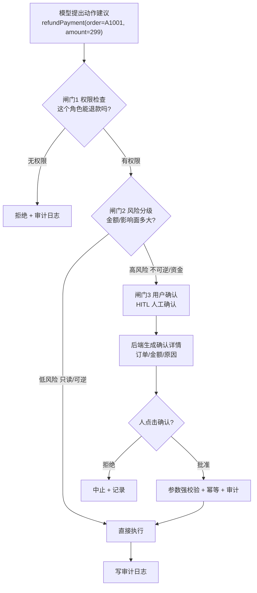
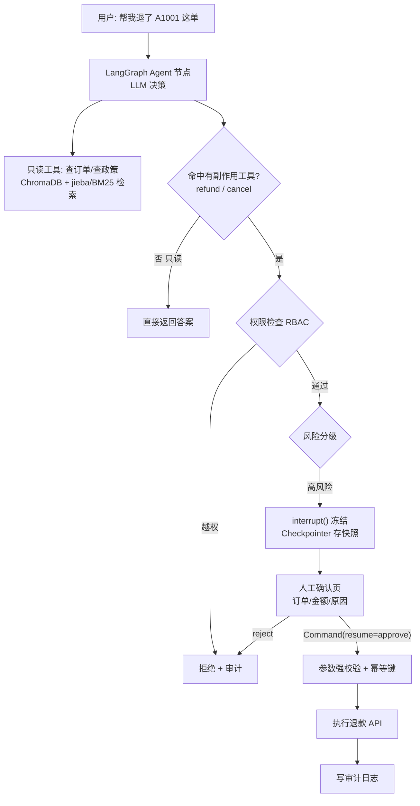

> **一句话**：有副作用的工具（退款/改单）必须过三道闸门——权限检查→风险分级→用户确认，模型只能建议、程序才能执行，安全是硬约束不是Prompt软提醒。

# 有副作用的工具（退款 / 改单）：确认 + 权限控制

## 二、什么叫「有副作用的工具」？——先分清读和写

「副作用（side effect）」这个词借自编程：一个函数除了返回值，还**改变了外部世界的状态**，就叫有副作用。

对 Agent 的工具来说，一句话判断：**执行后用户会立刻感知，且难以撤销 → 有副作用。**【来源：掘金《Agent 自动把机票改错了》, 2025；zirasoftware《AI Agents in Production 2026》把「能改变外部系统状态」列为 Agent 与「纯聊天助手」的本质区别】

| 操作类型 | 示例 | 副作用 | 出错代价 |
|-|-|-|-|
| **只读** | 查订单、查航班、查政策 | 无 | 几乎为零（重查即可） |
| **可逆写** | 加备注、存草稿 | 小 | 可撤回 |
| **不可逆写** | **退款、改签、取消订单** | **大** | **钱 / 信誉，无法撤销** |
| **系统可见操作** | 发邮件、发短信 | 中 | 用户已收到，难收回 |

**核心洞察**：真正的风险不是「Agent 太笨不会调工具」，而是**「Agent 太容易调工具」**——用户只是问「这单**能不能**退？」，模型可能直接理解成「退款！」然后就调了 `refundPayment`。【来源：掘金《前端开发者做 Agent》, 2025】

## 三、铁律：模型只能「建议」，程序才能「执行」

这是整篇最重要的一句话，请刻进 DNA：

> **模型可以提出动作建议，但最终能不能执行，必须由程序决定。**

看一个**危险写法**（模型说啥就干啥）：

```text
# 反面教材：模型输出直接执行，零拦截
def run(model_output):
    return run_tool(model_output.tool_call)   # 💀 refundPayment 也照跑
```

为什么**光靠 Prompt 提醒模型「谨慎执行」不够**？因为 **Prompt 是软约束**——你在系统提示里写「没权限别退款」，模型大概率听，但**不保证**。真金白银的操作，不能押注在「大概率」上。【来源：掘金《前端开发者做 Agent》；codeguru.app《Prompting Agentic Tasks 2026》明确把「confirm intent before side-effecting actions」列为不可协商的护栏】

正确姿势：把安全做成**硬约束**，写在程序里，模型绕不过去。具体就是下面的三道闸门 + 能力清单。

## 四、能力清单 + 三道闸门：权限检查 → 风险分级 → 用户确认

2026 共识的第一步是给 Agent 一份**能力清单（capability manifest）**：白纸黑字列清楚「允许哪些工具、能碰哪些域、单会话最高花费多少、支持哪些撤销」。它相当于开发者、用户、平台三方之间的合同（来源：codeguru.app）。在这之上，有副作用的工具调用前必须依次过三关，任何一关不过就不许执行：



**闸门 1 · 权限检查（谁能干）**

- 用 **RBAC（Role-Based Access Control，基于角色的访问控制）：客服角色只能「查订单 / 查物流 / 建售后工单」，不该**有「删订单 / 改用户等级 / 退款」。
- **工具白名单 + 能力清单**：别把所有工具都暴露给模型，按「场景 / 角色 / 任务」配白名单。模型连「看都看不到」越权工具，自然调不了。权限判断**永远在后端**——哪怕模型「觉得」这个用户能退款，后端 ACL 也不让步。【来源：zovps《AI Agent 安全加固方案》, 2025；掘金《从 Function Calling 到 MCP 三层境界与生产级安全护栏》, 2025，其示例代码 `dispatch_tool` 三步全在后端：权限 → 风险 → 幂等】

**闸门 2 · 风险分级（多危险）**

按风险给工具分级，级别决定安全策略：

| 风险等级 | 示例 | 安全策略 |
|-|-|-|
| 低（只读） | 查天气、查公开文档 | 可直接调用 |
| 中（业务查询） | 查订单、查客户信息 | 权限校验 + 脱敏 |
| 高（业务写入） | 改订单、建工单 | 参数强校验 + 审计 |
| **极高（资金 / 删除）** | **退款、转账、删数据** | **人工审批 + 二次确认** |
| 极高（系统执行） | SQL、Shell | 沙箱 + 白名单 + 强审计 |

**判断标准（务实）：「宁可漏掉几个『建议加审批』的工具，也别对读操作加审批。」 Agent 每查一次航班都要人批准，用户直接卸载。HITL 是高价值操作的安全阀，不是每个调用的护栏。**【来源：掘金《Agent 自动把机票改错了》】

**闸门 3 · 用户确认（人来按键）**

- 二次确认**不能只在模型层完成（模型说「我确认了」不算数），必须由前端 / 后端生成真实确认页**，展示订单号、金额、原因，由人**明确点击**。
- 对退款 / 转账 / 删除这类，进一步上**人工审批流**：Agent 生成建议 → 系统展示详情 → 审批人确认 → 后端执行 → 写审计日志。【来源：zovps；roamer-tech】

## 五、HITL 是怎么工作的：挂在「想好了但还没做」的瞬间

HITL（Human-in-the-Loop，人类介入循环）的精妙之处在于**挂载位置**：`after_model`——**LLM 已经生成了工具调用请求，但工具还没真正执行**的那一刻。【来源：掘金《Agent 自动把机票改错了》；LangChain 官方文档】

此刻模型已经推理完（「应该给客户 8821 退 340 元」），意图写进了消息，但**手还没落下**。HITL 就在这个瞬间把「即将执行」冻结成「待批准」。

它靠两个原语（primitive）实现（这块直接对应我的简历项目 LangGraph）：

1. **Checkpointer（检查点 / 持久化器）：每步执行后把整个图的状态存快照。这是暂停能恢复的前提**——状态存下来了，人两小时后再批，也能从原地续跑，而不是从头再来。
2. **interrupt（中断函数）**：在节点里调用它，图**立即暂停**，把「待审批信息」（工具名、参数、给人看的提示语）返回给调用者；人做完决定，用 `Command(resume=值)` 恢复，这个值成为 `interrupt()` 的返回值。【来源：LangChain 官方 Interrupts 文档；CSDN《LangGraph 实战·第三篇》, 2026】

感觉级骨架（非必要不展开，只留「长这样」的印象）：

```text
# LangGraph HITL：审批节点
def approval_node(state):
    decision = interrupt(f"Agent 想执行：{state['action']}，批准吗?")  # ← 图在此冻结
    return {"approved": decision}   # 人 Command(resume=True) 后才走到这
# 首次 invoke → 停在 interrupt；人审后 graph.invoke(Command(resume=True), config)
```

**人有四种决策**（不止「批 / 不批」）：`approve`（批准原样执行）、`edit`（改参数后执行，比如把退款金额从 299 改对）、`reject`（拒绝，回一条失败消息给模型）、`respond`（直接替工具回一个结果，如追问澄清）。【来源：LangChain HITL 文档】

⚠️ **生产大坑**：`Command(resume=...)` 恢复时，LangGraph 是**从中断节点的开头重新执行**，不是从 `interrupt()` 那一行继续。所以 **`interrupt()` 之前的代码会再跑一遍**——千万别把「扣款」写在 `interrupt()` 前面，否则人还没批，钱先扣了，批完再扣一次。

### 4.1 2026 升级版：propose-then-commit（提议—提交）

2026 年 HITL 共识已从「同步弹窗问 Approve」升级为 **propose-then-commit（提议—提交）**：

- **Propose（提议）**：把「动作 + 意图 + 数据血缘 + 触及的权限 + 爆炸半径 blast radius + 回滚方案 + 幂等键」持久化到 durable store（如 PostgreSQL），状态为 pending。
- **Surface（呈现）： reviewer（真人**）看到带全部元数据的提案。
- **Commit（提交）**：显式正向确认后才执行。
- **Verify（核验）**：执行后回读副作用，确认真的发生了；失败则进已知坏状态并告警。（来源：aiengineeringfromscratch.com《Propose-Then-Commit 2026》）

> LangGraph 的 `interrupt()` + PostgreSQL checkpointing、Microsoft 的 `RequestInfoEvent`、Cloudflare 的 `waitForApproval()` 都是同一形状的不同名字。

⚠️ **橡皮图章问题（rubber-stamp）**：默认「Approve / Reject」按钮会被用户秒点、从不真看。文档化缓解方案是 **challenge-and-response（质询式确认）**：必须勾选「我理解触及的资源？」「爆炸半径可接受？」「有回滚方案？」才放行按钮。【来源：aiengineeringfromscratch.com】

## 六、别信模型给的参数：执行三件套（强校验 + 幂等 + 审计）

过了三道闸门还不够，**执行前后**还有三件事：

**① 参数强校验（模型给的一律不可信）**

模型生成的 `{order_id, amount}` 绝不直接打给退款接口。后端必须验：

- 订单是否属于当前用户权限范围？
- 订单状态是否**允许**退款？
- 退款金额 ≤ 可退金额？是否超单笔 / 单日限额？
- 是否命中风控规则？是否需要人工审批？【来源：zovps；掘金《三层境界》把「权限判断永远在后端」列为三条死守点之首】

**② 幂等性（Idempotency，防重复扣款）**

网络抖动、Agent 重试（回顾 ⑥「失败处理」），同一个退款请求可能**发两次**。解法：每笔操作带一个 **idempotency key（幂等键，如订单号 + 操作类型的唯一串），后端见到重复 key 直接返回上次结果，不再执行第二次**。这样「重试」永远安全。

> 关键细节（来源：dev.to《Don't Delete Your Database》、aiengineeringfromscratch.com）：**幂等键由系统生成，不由模型生成**——系统用 `hash(操作类型 + 目标记录 ID + 时间窗)` 算出来，避免模型复用 key 或碰撞。这正是 Stripe、AWS API 用的同一套模式。

**③ 审计日志（Audit Log，可追溯 + 可复盘）**

每次有副作用的操作都记：谁（角色）、什么时间、调了什么工具、什么参数、谁审批的、结果如何。生产可直接接 ELK / Loki。**出了事能追责，也是合规要求。**【来源：zovps；roamer-tech】

## 七、给 Agentic RAG 加「写操作安全层」

以只读型 Agentic RAG 项目为例，扩展到写操作时的安全架构：



- **检索照旧**：只读的 ChromaDB / jieba-BM25 查询无需审批，保持流畅；
- **一旦命中 `refund`/`cancel`**：先 RBAC 权限检查 → 风险分级 → 高风险则 `interrupt()` 冻结（靠 Checkpointer 存状态）→ 人工确认页点批准 → `Command(resume)` 恢复 → 参数校验 + 幂等键 → 执行 → 审计。

> Agent 检索是只读的，如果扩展到写操作，用 LangGraph 的 interrupt + checkpointer 做 HITL：模型只能建议，高风险操作冻结等人工确认后再 resume 执行。执行前后加参数强校验、幂等键防重复扣款、审计日志可追溯。核心原则：模型建议、程序执行。

## 代码实现：三道闸门 + 幂等键 + HITL 中断确认

> 以下代码实现了：能力白名单、RBAC 权限检查、风险分级、HITL interrupt 冻结、幂等键生成、参数强校验、审计日志。可直接运行。

```python
# 有副作用工具的安全执行框架
# 核心原则：模型只能建议，程序才能执行
# 三道闸门：权限检查 → 风险分级 → 用户确认
# 执行三件套：强校验 + 幂等键 + 审计日志

import hashlib
import json
import time
import uuid
from dataclasses import dataclass, field
from enum import Enum, auto
from typing import Callable, Any


# ============================================================
# 第一部分：基础定义 —— 角色、风险等级、工具注解
# ============================================================

class Role(Enum):
    """RBAC 角色定义 —— 基于角色的访问控制"""
    ADMIN = auto()        # 管理员：可以做任何事
    MANAGER = auto()      # 经理：可退款、可改单，不可删数据
    SUPPORT = auto()      # 客服：只能查，不能动钱/删数据
    VIEWER = auto()       # 只读：什么都不能改


class RiskLevel(Enum):
    """工具风险等级 —— 等级决定安全策略的严格程度"""
    LOW = auto()          # 只读（查天气/查文档）：可直接调用
    MEDIUM = auto()       # 业务查询（查订单/客户信息）：需权限校验 + 脱敏
    HIGH = auto()         # 业务写入（改订单/建工单）：参数强校验 + 审计
    CRITICAL = auto()     # 资金/删除（退款/转账/删数据）：人工审批 + 二次确认
    SYSTEM = auto()       # 系统执行（SQL/Shell）：沙箱 + 白名单 + 强审计


@dataclass
class ToolAnnotation:
    """工具注解 —— 给每个工具打上元数据标签

    参考 FastMCP 的 readOnlyHint / destructiveHint / idempotencyHint
    """
    name: str                           # 工具名称
    description: str                    # 功能描述
    risk_level: RiskLevel               # 风险等级
    is_readonly: bool = True            # 是否只读（只读工具天然幂等）
    has_side_effect: bool = False       # 是否有副作用（改外部世界状态）
    allowed_roles: set[Role] = field(default_factory=lambda: {Role.ADMIN})  # 允许执行的角色白名单
    require_idempotency_key: bool = False  # 是否强制要求幂等键
    require_human_approval: bool = False   # 是否必须人工审批


# ============================================================
# 第二部分：能力清单 —— 白名单控制模型能看到哪些工具
# ============================================================

class CapabilityManifest:
    """能力清单：白纸黑字定义 Agent 能碰哪些工具、哪些域、单次花费上限

    这是开发者、用户、平台三方的合同 —— 不是你说了算，是清单说了算
    """

    def __init__(self):
        # 注册所有工具的能力注解（Production 中从配置文件加载）
        self._tools: dict[str, ToolAnnotation] = {}
        # 单次会话最大花费上限（美元）
        self.max_cost_per_session: float = 10.0

    def register(self, annotation: ToolAnnotation) -> None:
        """注册一个工具到能力清单"""
        self._tools[annotation.name] = annotation

    def get_tools_for_role(self, role: Role) -> list[ToolAnnotation]:
        """按角色返回可见的工具列表 —— 看不到的就没法调用"""
        return [
            t for t in self._tools.values()
            if role in t.allowed_roles
        ]

    def get_annotation(self, tool_name: str) -> ToolAnnotation | None:
        """获取指定工具的注解"""
        return self._tools.get(tool_name)


# ============================================================
# 第三部分：闸门 1 —— 权限检查（RBAC + 白名单）
# ============================================================

def check_permission(
    tool_name: str,
    user_role: Role,
    capability: CapabilityManifest,
) -> tuple[bool, str]:
    """闸门 1：权限检查 —— 权限判断永远在后端，不信任模型的判断

    返回 (是否通过, 失败原因)
    检查顺序：工具是否存在 → 角色是否在白名单内
    """
    annotation = capability.get_annotation(tool_name)
    if annotation is None:
        # 工具不在能力清单中 → 模型可能在"幻觉调用"一个不存在的工具
        return False, f"工具 '{tool_name}' 不在能力清单中，拒绝执行"

    if user_role not in annotation.allowed_roles:
        # 角色不在白名单 → 即使模型"觉得"这个用户能退款，后端 ACL 也不让步
        return False, (
            f"角色 '{user_role.name}' 无权调用 '{tool_name}'，"
            f"允许的角色: {[r.name for r in annotation.allowed_roles]}"
        )

    return True, "权限检查通过"


# ============================================================
# 第四部分：闸门 2 —— 风险分级
# ============================================================

def assess_risk(
    tool_name: str,
    params: dict,
    capability: CapabilityManifest,
) -> tuple[RiskLevel, str]:
    """闸门 2：风险分级 —— 根据工具等级 + 参数上下文决定安全策略

    返回 (风险等级, 说明)
    判断标准：宁可漏掉几个"建议加审批"的工具，也别对读操作加审批
    """
    annotation = capability.get_annotation(tool_name)
    if annotation is None:
        return RiskLevel.CRITICAL, f"未知工具 '{tool_name}'，按最高风险处理"

    risk = annotation.risk_level

    # 动态升级：即使是"业务写入"级别，金额超过阈值也升级为"资金级"
    if "amount" in params:
        amount = float(params["amount"])
        if amount > 1000:  # 超过 1000 元 → 升级为最高风险
            risk = RiskLevel.CRITICAL
            return risk, f"金额 {amount} 元超过单笔阈值，升级为 CRITICAL 需人工审批"

    # 只读工具：不需要审批，直接放行
    if risk in (RiskLevel.LOW, RiskLevel.MEDIUM):
        return risk, "低/中风险，可直接调用"

    # 写入类：需要审批
    return risk, f"风险等级 {risk.name}，需要对应安全策略"


# ============================================================
# 第五部分：幂等键生成 —— 系统生成，不让模型编
# ============================================================

def generate_idempotency_key(
    tool_name: str,
    target_id: str,
    session_id: str,
) -> str:
    """生成幂等键（Idempotency Key）

    关键原则：幂等键必须由应用层（系统）生成，绝不让 LLM 生成
    原因：LLM 每次重试可能编出不同的 ID，去重就失效了

    格式: session_id + tool_name + target_id → SHA-256 哈希
    Scope 设计：
    - 不能太宽（全局同工具名会碰撞）
    - 不能太窄（每次随机 UUID 等于没用）
    - 正确：session_id + 工具名 + 操作目标的指纹
    """
    # 拼接操作指纹
    raw = f"{session_id}:{tool_name}:{target_id}"
    # SHA-256 哈希 → 固定长度、不可猜测、无碰撞（实际使用中）
    return hashlib.sha256(raw.encode()).hexdigest()


# ============================================================
# 第六部分：闸门 3 —— 用户确认（HITL）
# ============================================================

# 模拟已执行过的幂等键存储（生产环境用 Redis/PostgreSQL）
_IDEMPOTENCY_STORE: dict[str, dict] = {}


def human_approval_gate(
    tool_name: str,
    params: dict,
    idempotency_key: str,
) -> dict:
    """闸门 3 + 幂等去重：模拟 HITL 确认流程

    生产环境对应 LangGraph 的 interrupt() + Command(resume=...) 模式：
    1. interrupt("Agent 想执行 {tool_name}({params})，批准吗？") → 冻结
    2. 人点击确认 → Command(resume=True) → 恢复执行
    3. 重要：interrupt() 之前的代码会在 resume 时重跑，所以不要
       把「扣款」写在 interrupt 之前！

    本函数模拟的是「人在前端点击了确认」之后的后端处理
    """
    # 幂等去重：检查这个操作是否已经执行过
    if idempotency_key in _IDEMPOTENCY_STORE:
        cached = _IDEMPOTENCY_STORE[idempotency_key]
        print(f"[幂等命中] 操作 {idempotency_key[:12]}... 已执行过，返回缓存结果")
        return {
            "status": "already_executed",
            "original_result": cached["result"],
            "executed_at": cached["executed_at"],
        }

    # 模拟人工确认（生产环境这里是人点击按钮，不是代码自动通过）
    print(f"\n[确认请求] 操作: {tool_name}")
    print(f"  参数: {json.dumps(params, ensure_ascii=False)}")
    print(f"  幂等键: {idempotency_key[:16]}...")
    # 生产环境中这里是：decision = interrupt(...)；人做决定
    approved = params.get("amount", 0) < 500  # 模拟：小于 500 自动通过，否则需人工

    if not approved:
        return {"status": "rejected", "reason": "金额超过 500 元，需人工审批"}

    # 审批通过 → 记录幂等键 + 执行结果
    result = {
        "status": "executed",
        "tool": tool_name,
        "params": params,
        "idempotency_key": idempotency_key,
        "executed_at": time.time(),
    }
    _IDEMPOTENCY_STORE[idempotency_key] = {
        "result": result,
        "executed_at": time.time(),
    }
    return result


# ============================================================
# 第七部分：安全执行主流程 —— 三道闸门串联
# ============================================================

def safe_tool_dispatch(
    tool_name: str,
    params: dict,
    user_role: Role,
    session_id: str,
    capability: CapabilityManifest,
    executor: Callable[[dict], Any],
    audit_logger: Callable[[dict], None] | None = None,
) -> dict:
    """有副作用工具的安全执行主入口

    流程: 能力检查 → 权限检查 → 风险分级 → (高风险)幂等键+确认 → 执行 → 审计
    每一步不过就直接拒绝，不"半推半就"
    """
    result = {
        "success": False,
        "tool": tool_name,
        "action": "",
        "message": "",
    }

    # ---- 闸门 1：权限检查 ----
    allowed, reason = check_permission(tool_name, user_role, capability)
    if not allowed:
        result["action"] = "permission_denied"
        result["message"] = reason
        _log_audit(tool_name, params, user_role, session_id, "permission_denied", audit_logger)
        return result

    # ---- 闸门 2：风险分级 ----
    annotation = capability.get_annotation(tool_name)
    risk, risk_reason = assess_risk(tool_name, params, capability)

    result["risk_level"] = risk.name

    # 极高风险操作（退款/转账/删除）→ 强制走 HITL 确认
    if risk == RiskLevel.CRITICAL:
        # 生成幂等键（防重复执行）
        target_id = str(params.get("order_id", params.get("id", "unknown")))
        idempotency_key = generate_idempotency_key(tool_name, target_id, session_id)

        # 闸门 3：人工确认 + 幂等去重
        approval_result = human_approval_gate(tool_name, params, idempotency_key)

        if approval_result["status"] == "rejected":
            result["action"] = "rejected_by_human"
            result["message"] = approval_result.get("reason", "人工审批未通过")
            _log_audit(tool_name, params, user_role, session_id, "rejected", audit_logger)
            return result

        if approval_result["status"] == "already_executed":
            # 幂等命中去重 → 返回上次结果，不再执行
            result["success"] = True
            result["action"] = "idempotency_hit"
            result["data"] = approval_result["original_result"]
            return result

    # ---- 执行前三件套之：参数强校验 ----
    # 模型生成的参数一律不可信，后端必须验证
    if not _validate_params(params, annotation):
        result["action"] = "param_validation_failed"
        result["message"] = "参数校验失败：订单状态不允许退款或金额超过可退上限"
        _log_audit(tool_name, params, user_role, session_id, "param_invalid", audit_logger)
        return result

    # ---- 执行工具 ----
    try:
        exec_result = executor(params)
        result["success"] = True
        result["action"] = "executed"
        result["data"] = exec_result
    except Exception as e:
        result["action"] = "execution_failed"
        result["message"] = str(e)
        _log_audit(tool_name, params, user_role, session_id, "failed", audit_logger)
        return result

    # ---- 审计日志 ----
    _log_audit(tool_name, params, user_role, session_id, "executed", audit_logger)
    return result


# ============================================================
# 辅助函数
# ============================================================

def _validate_params(params: dict, annotation: ToolAnnotation | None) -> bool:
    """参数强校验 —— 模型给的参数一律不可信

    检查项：订单归属、状态是否允许操作、金额是否超限
    生产环境这里接真实的订单服务做校验
    """
    if annotation is None:
        return False
    # 只读工具：参数无副作用，跳过校验
    if annotation.is_readonly:
        return True
    # 退款金额校验：不能超过可退金额上限
    if "amount" in params and float(params["amount"]) > 10000:
        return False  # 单笔退款不超过 10000
    return True


def _log_audit(
    tool_name: str,
    params: dict,
    user_role: Role,
    session_id: str,
    action: str,
    logger: Callable[[dict], None] | None = None,
) -> None:
    """写审计日志 —— 出事了能追责，也是合规要求

    每次有副作用的操作都记：谁、什么时间、调了什么工具、什么参数、
    谁审批的、结果如何。生产环境接 ELK/Loki。
    """
    entry = {
        "timestamp": time.strftime("%Y-%m-%dT%H:%M:%S"),
        "tool": tool_name,
        "params": str(params),
        "role": user_role.name,
        "session_id": session_id,
        "action": action,
    }
    if logger:
        logger(entry)
    else:
        print(f"[审计] {json.dumps(entry, ensure_ascii=False)}")


# ============================================================
# 运行演示
# ============================================================
if __name__ == "__main__":
    # 1. 初始化能力清单
    manifest = CapabilityManifest()
    manifest.register(ToolAnnotation(
        name="search_orders",
        description="查询订单列表",
        risk_level=RiskLevel.MEDIUM,
        is_readonly=True,
        allowed_roles={Role.ADMIN, Role.MANAGER, Role.SUPPORT, Role.VIEWER},
    ))
    manifest.register(ToolAnnotation(
        name="refund_payment",
        description="执行退款操作（不可逆）",
        risk_level=RiskLevel.CRITICAL,
        is_readonly=False,
        has_side_effect=True,
        allowed_roles={Role.ADMIN, Role.MANAGER},
        require_idempotency_key=True,
        require_human_approval=True,
    ))
    manifest.register(ToolAnnotation(
        name="cancel_order",
        description="取消订单（不可逆）",
        risk_level=RiskLevel.HIGH,
        is_readonly=False,
        has_side_effect=True,
        allowed_roles={Role.ADMIN, Role.MANAGER},
        require_idempotency_key=True,
    ))

    session = str(uuid.uuid4())[:8]  # 模拟会话 ID

    # 场景 1：客服尝试退款 → 闸门1 权限拒绝
    print("=" * 50)
    print("场景1: 客服尝试退款（无权限）")
    r1 = safe_tool_dispatch(
        "refund_payment",
        {"order_id": "A1001", "amount": 299},
        Role.SUPPORT,  # 客服角色
        session,
        manifest,
        executor=lambda p: f"退款成功: {p['order_id']}",
    )
    print(f"结果: {r1['action']} → {r1['message']}")

    # 场景 2：经理退款 299 元（风险等级 CRITICAL，需要确认）
    print("\n场景2: 经理退款 299 元（通过确认）")
    r2 = safe_tool_dispatch(
        "refund_payment",
        {"order_id": "A1001", "amount": 299},
        Role.MANAGER,
        session,
        manifest,
        executor=lambda p: f"退款成功: {p['order_id']}",
    )
    print(f"结果: {r2['action']} → {r2.get('message', r2.get('data', ''))}")

    # 场景 3：同一笔订单再次退款 → 幂等键命中，不重复扣款
    print("\n场景3: 同一订单再次退款（幂等去重）")
    r3 = safe_tool_dispatch(
        "refund_payment",
        {"order_id": "A1001", "amount": 299},
        Role.MANAGER,
        session,  # 相同 session → 相同幂等键 → 命中
        manifest,
        executor=lambda p: f"退款成功: {p['order_id']}",
    )
    print(f"结果: {r3['action']} → {r3.get('message', r3.get('data', ''))}")

    # 场景 4：只读查询 → 直接通过，不需要审批
    print("\n场景4: 客服查询订单（只读，直接通过）")
    r4 = safe_tool_dispatch(
        "search_orders",
        {"keyword": "最近7天"},
        Role.SUPPORT,
        session,
        manifest,
        executor=lambda p: ["订单 A1001", "订单 A1002"],
    )
    print(f"结果: {r4['action']} → {r4.get('data', '')}")
```

## 相关链接

- 项目实践：[[笔记/技术学习/项目开发笔记/cr-agent笔记/01-技术研读/10-安全加固四道防线.md#第二级：防线详解|cr-agent: 安全加固四道防线]]

---
→ [[技术学习清单#Agent 架构（核心）]]
