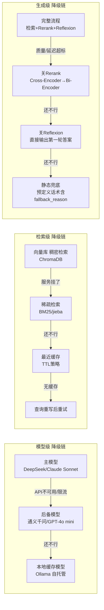
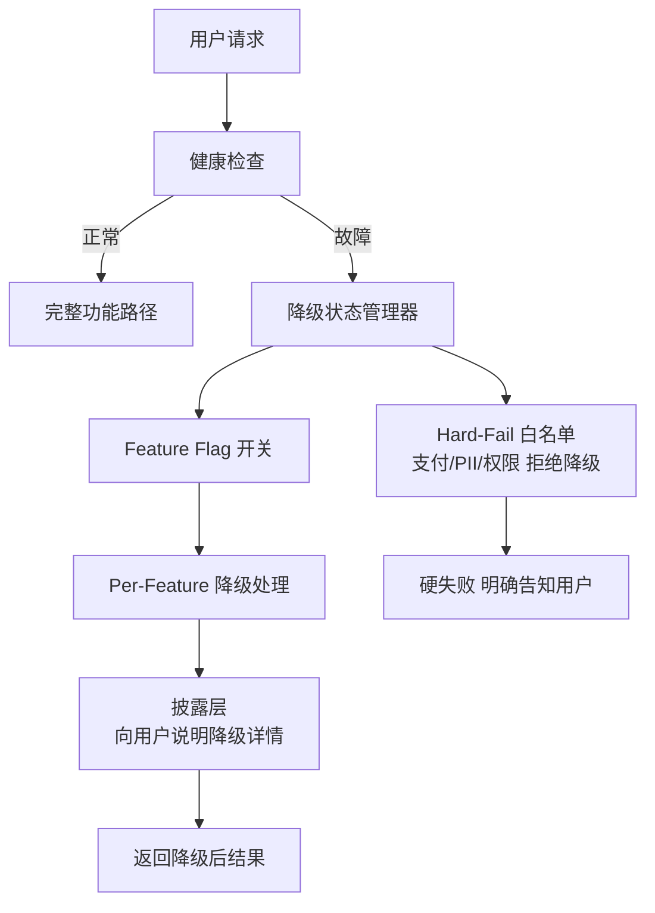

> **一句话**：降级=给不出满分就给80分但让用户知道——按功能做多级fallback链，必须披露不能静默降级，支付/PII类必须硬失败不能降级。

## 一、原理速览

**降级（Degradation）** vs 重试 vs 熔断：

| 机制 | 治什么 | 一句话 |
|------|--------|--------|
| 重试（Retry） | 偶发抖动 | 挂了再拨，但要退避+抖动 |
| 熔断（Circuit Breaker） | 持续性宕机 | 跳闸快速失败，别硬刚死马 |
| **降级（Degradation）** | **功能缺失但能凑合** | **换个次优方案，但能交付** |

**核心设计原则：per-feature 降级**——每个功能有自己的降级策略，一个功能坏了不影响别的。Search 挂了不影响 LLM 自己答，Rerank 超时了不影响按原始顺序返回。

### 多级降级链（Fallback Chain）

生产级降级不是二分，而是多级链条：



### 降级触发条件

| 条件 | 说明 | 典型阈值 |
|------|------|---------|
| 显式失败 | 工具抛出异常/返回错误码 | 任何异常 |
| 超时 | 响应超过预期时间 | P95 延迟 + 2σ（如 >3s） |
| 质量不达标 | 返回了 200 但内容是幻觉/分数低 | rerank_score < 0.3 |
| 成本/预算超限 | token 消耗超过预期 | token_budget > 80% |
| 高峰期保护 | 系统负载高时主动关非核心功能 | CPU > 80% |

### 降级的披露——绝不能静默降级

**静默降级**是最大反模式：检索挂了模型硬答（无来源标注），用户拿到看似完整但全是幻觉的报告。**正确做法**：必须在输出中告知用户「当前在降级模式」，例：「由于检索服务临时不可用，本次回答基于模型自身知识生成，信息可能不完整」。

**Hard-Fail 白名单**：涉及支付、PII、安全权限的操作绝不能降级（降级后可能导致更严重后果）。



## 二、代码实现

```python
# 降级路径（Degradation）的 Python 实现
# 核心：给不出满分就给 80 分，但必须让用户知道这是 80 分版

from dataclasses import dataclass, field
from enum import Enum, auto
from typing import Callable, Any


# ============================================================
# 第一部分：降级状态定义
# ============================================================

class DegradationLevel(Enum):
    FULL = auto()          # 完整功能
    LIGHT = auto()         # 轻度降级（如关 Rerank）
    MODERATE = auto()      # 中度降级（如切备用模型）
    SEVERE = auto()        # 重度降级（仅核心功能）
    MINIMAL = auto()       # 最低保底（静态话术）


@dataclass
class DegradationState:
    level: DegradationLevel = DegradationLevel.FULL
    degraded_components: dict[str, str] = field(default_factory=dict)
    disclosures: list[str] = field(default_factory=list)


# ============================================================
# 第二部分：Hard-Fail 白名单
# ============================================================

HARD_FAIL_TOOLS: set[str] = {
    "process_payment",
    "delete_user_data",
    "access_pii",
    "grant_admin",
    "execute_sql",
}

def is_hard_fail(tool_name: str) -> bool:
    return tool_name in HARD_FAIL_TOOLS


# ============================================================
# 第三部分：多级降级链
# ============================================================

class ModelFallbackChain:
    """模型级降级链：主模型 → 备用模型 → 本地模型 → 静态话术"""

    def __init__(self):
        self._chain: list[tuple[str, Callable[[str], str], str]] = []

    def add_level(self, name: str, call_fn: Callable[[str], str], disclosure: str = "") -> None:
        self._chain.append((name, call_fn, disclosure))

    def execute(self, prompt: str, state: DegradationState) -> str:
        for name, call_fn, disclosure in self._chain:
            try:
                result = call_fn(prompt)
                if disclosure:
                    state.disclosures.append(disclosure)
                    state.degraded_components["model"] = name
                return result
            except Exception as e:
                print(f"[降级] 模型 '{name}' 失败: {e}，尝试下一级")
                continue

        state.level = DegradationLevel.MINIMAL
        state.disclosures.append("所有模型均不可用，返回系统预设响应")
        return "服务暂时不可用，请稍后重试。[系统自动降级响应]"


class RetrievalFallbackChain:
    """检索级降级链：向量库 → BM25 → 缓存 → 仅模型知识"""

    def execute(
        self, query: str, state: DegradationState,
        vector_search: Callable[[str], list[str]],
        bm25_search: Callable[[str], list[str]],
        cache_search: Callable[[str], list[str] | None],
    ) -> tuple[list[str], DegradationState]:
        try:
            docs = vector_search(query)
            if docs:
                return docs, state
        except Exception as e:
            print(f"[降级] 向量库检索失败: {e}，降级到 BM25")
            state.disclosures.append("向量检索服务暂不可用，已切换到关键词检索")

        state.level = DegradationLevel.LIGHT
        state.degraded_components["vector_search"] = "降级为 BM25"

        try:
            docs = bm25_search(query)
            if docs:
                return docs, state
        except Exception as e:
            print(f"[降级] BM25 检索失败: {e}，降级到缓存")
            state.disclosures.append("关键词检索不可用，正在使用缓存数据")

        state.level = DegradationLevel.MODERATE
        state.degraded_components["bm25"] = "降级为缓存"

        try:
            docs = cache_search(query)
            if docs:
                state.disclosures.append("当前使用缓存数据，信息可能有延迟")
                return docs, state
        except Exception as e:
            print(f"[降级] 缓存查询失败: {e}，降级到纯模型")

        state.level = DegradationLevel.SEVERE
        state.degraded_components["retrieval"] = "降级为纯模型知识"
        state.disclosures.append(
            "检索服务不可用，本次回答基于模型自身知识生成，"
            "信息可能不完整，请以权威来源为准"
        )
        return [], state


class GenerationFallbackChain:
    """生成级降级链：完整流程 → 关 Rerank → 关 Reflexion → 静态话术"""

    def execute(
        self, query: str, docs: list[str], state: DegradationState,
        full_pipeline: Callable[[str, list[str]], str],
        no_rerank: Callable[[str, list[str]], str],
        no_reflexion: Callable[[str, list[str]], str],
        static_fallback: Callable[[], str],
        latency_threshold: float = 3.0,
    ) -> tuple[str, DegradationState]:
        import time
        try:
            start = time.time()
            result = full_pipeline(query, docs)
            elapsed = time.time() - start
            if elapsed > latency_threshold:
                state.disclosures.append(
                    f"响应时间 {elapsed:.1f}s 超过 {latency_threshold}s 阈值，"
                    "后续请求将关闭部分优化功能以保证响应速度"
                )
            return result, state
        except Exception as e:
            print(f"[降级] 完整流程失败: {e}，降级为关 Rerank")

        state.level = DegradationLevel.LIGHT
        state.degraded_components["rerank"] = "Rerank 已关闭，使用原始排序"

        try:
            result = no_rerank(query, docs)
            return result, state
        except Exception as e:
            print(f"[降级] 关 Rerank 仍失败: {e}，降级为关 Reflexion")

        state.level = DegradationLevel.MODERATE
        state.degraded_components["reflexion"] = "Reflexion 已关闭"

        try:
            result = no_reflexion(query, docs)
            state.disclosures.append("自我纠正功能暂时关闭，答案未经二次校验")
            return result, state
        except Exception as e:
            print(f"[降级] 关 Reflexion 仍失败: {e}，降级为静态话术")

        state.level = DegradationLevel.MINIMAL
        state.degraded_components["generation"] = "降级为静态话术"
        state.disclosures.append("生成服务不可用，返回系统预设响应")
        return static_fallback(), state


# ============================================================
# 第四部分：降级披露
# ============================================================

def format_degraded_response(answer: str, state: DegradationState) -> str:
    """格式化降级后的响应 —— 必须把降级信息披露给用户"""
    if state.level == DegradationLevel.FULL:
        return answer

    level_descriptions = {
        DegradationLevel.LIGHT: "[轻度降级]",
        DegradationLevel.MODERATE: "[中度降级]",
        DegradationLevel.SEVERE: "[重度降级 — 部分功能不可用]",
        DegradationLevel.MINIMAL: "[服务降级 — 仅提供基础响应]",
    }
    header = level_descriptions.get(state.level, "[降级模式]")
    if state.degraded_components:
        components_detail = "；".join(
            f"{comp}: {reason}" for comp, reason in state.degraded_components.items()
        )
        header += f"（{components_detail}）"

    parts = [header, "", answer, ""]
    if state.disclosures:
        parts.append("---")
        parts.append("**当前服务状态说明：**")
        for i, disclosure in enumerate(state.disclosures, 1):
            parts.append(f"{i}. {disclosure}")

    return "\n".join(parts)


# ============================================================
# 第五部分：完整降级编排器
# ============================================================

@dataclass
class DegradationOrchestrator:
    model_chain: ModelFallbackChain = field(default_factory=ModelFallbackChain)
    retrieval_chain: RetrievalFallbackChain = field(default_factory=RetrievalFallbackChain)
    generation_chain: GenerationFallbackChain = field(default_factory=GenerationFallbackChain)
    state: DegradationState = field(default_factory=DegradationState)

    def execute_safe(self, tool_name: str, params: dict) -> dict:
        if is_hard_fail(tool_name):
            return {
                "status": "hard_fail",
                "message": f"操作 '{tool_name}' 涉及资金/安全/隐私，无法降级执行",
                "suggestion": "请确认系统环境正常后重试，或联系管理员手动处理",
            }
        return {"status": "allowed", "can_degrade": True}


# ============================================================
# 运行演示
# ============================================================

if __name__ == "__main__":
    print("=" * 50)
    print("演示 1: Hard-Fail 白名单检查")
    orchestrator = DegradationOrchestrator()
    r1 = orchestrator.execute_safe("process_payment", {"amount": 299})
    print(f"  process_payment: {r1['status']} → {r1['message']}")
    r2 = orchestrator.execute_safe("search_knowledge", {"query": "test"})
    print(f"  search_knowledge: {r2['status']} (可降级: {r2.get('can_degrade')})")

    print("\n演示 2: 检索降级链（模拟向量库故障）")
    def mock_vector_search(q: str) -> list[str]:
        raise ConnectionError("ChromaDB 连接超时")
    def mock_bm25_search(q: str) -> list[str]:
        return ["[BM25] 文档1: 相关结果A", "[BM25] 文档2: 相关结果B"]
    def mock_cache_search(q: str) -> list[str] | None:
        return None

    state = DegradationState()
    retrieval = RetrievalFallbackChain()
    docs, updated_state = retrieval.execute(
        "什么是 Transformer？", state,
        vector_search=mock_vector_search,
        bm25_search=mock_bm25_search,
        cache_search=mock_cache_search,
    )
    print(f"  检索结果: {docs}")
    print(f"  降级级别: {updated_state.level.name}")
    print(f"  披露信息: {updated_state.disclosures}")

    print("\n演示 3: 降级披露格式化")
    degraded_state = DegradationState(
        level=DegradationLevel.SEVERE,
        degraded_components={"vector_search": "ChromaDB 超时", "rerank": "Rerank 服务限流"},
        disclosures=[
            "检索服务暂不可用，当前使用缓存数据（可能不是最新）",
            "Rerank 服务限流，结果按原始相似度排序",
        ],
    )
    formatted = format_degraded_response(
        "根据现有资料，Transformer 是一种基于自注意力机制的架构...", degraded_state,
    )
    print(formatted)
```

## 
> ▶ 对应原理：[[33-异常处理与降级策略|33-异常处理与降级策略]]

相关链接

- 项目实践：[[笔记/技术学习/项目开发笔记/ai-resume笔记/01_技术研读/06_韧性工程.md#降级全景图|ai-resume: 韧性工程]]
- 项目实践：cr-agent: 三层容错与并发bug

---
→ [[技术学习清单#Agent 韧性工程]]
