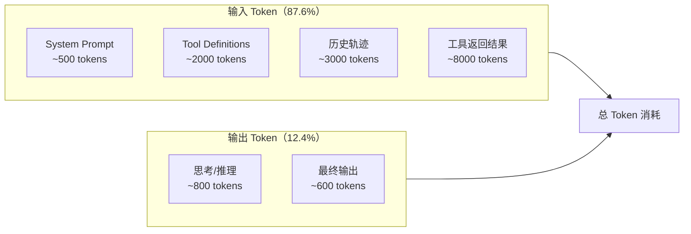
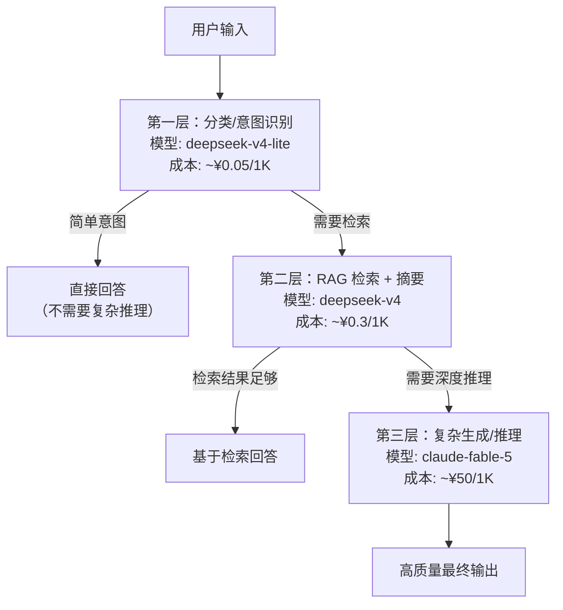
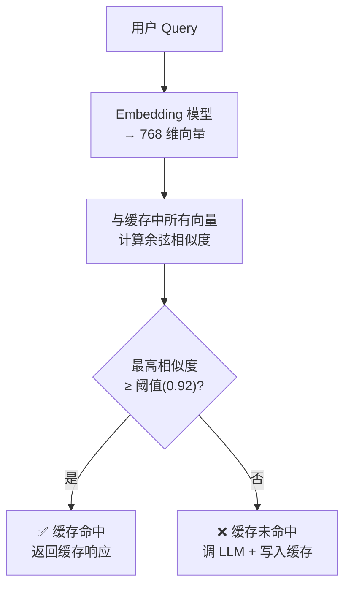

# Agent 成本控制：Token 用量分析 + 三级模型路由 + 语义缓存

> **一句话**：Agent 不是「调一次 API 就完事」——一个任务可能涉及十几次 LLM 调用、几十次工具调用、大量上下文反复传输。不控制成本，上线 = 烧钱。

---

## 一、Agent 的钱花在哪了？

很多人以为 LLM API 的费用大头是「模型生成文本」。实际上，**输入 token（把上下文喂给模型）才是真正的成本黑洞**。

### Token 消耗拆解

一次典型 Agent 任务（以代码审查为例）的 Token 流向：



| 消耗来源 | 占比 | 说明 |
|:----|:----|:-----|
| **工具返回结果** | ~67.6% | 每次工具调用的结果都要塞回上下文，大文件/长网页直接爆 |
| **LLM 输出** | ~19% | 包含推理 + 最终输出 |
| **System Prompt + Tool Defs** | ~8% | 每次调用都全量传入（除非用 Prompt Caching） |
| **历史轨迹** | ~5.4% | ReAct 循环中之前的 Thought/Action/Observation |

> **关键洞察**：省钱的重点不是「让模型少说话」，而是「控制塞进上下文的工具结果量」。工具返回 100KB 的网页全文，比模型多说 1000 个 token 贵得多。

### 费用速算公式

```text
单次任务费用 = (Prompt Tokens × Prompt 单价 + Completion Tokens × Completion 单价) × 调用次数

例子（deepseek-v4）:
  Prompt: 15000 tokens × ¥0.3/1M = ¥0.0045
  Completion: 2000 tokens × ¥0.6/1M = ¥0.0012
  单次调用: ¥0.0057
  一次任务 10 次调用: ¥0.057
  每天 1000 次任务: ¥57/天 = ¥1700/月
```

---

## 二、三级模型路由：该省省、该花花

核心思想：不是每个 LLM 调用都需要最贵的模型。把调用按复杂度分层，便宜模型做简单活，贵模型做关键活。



### 分层决策逻辑

| 层级 | 模型选择 | 单价（约） | 适用场景 | Token 特点 |
|:----|:--------|:---------|:--------|:----------|
| **L1: 路由层** | deepseek-v4-lite / gpt-4o-mini | ¥0.05-0.3/1M | 意图分类、简单判断、格式校验 | 低输入、低输出 |
| **L2: RAG 层** | deepseek-v4 / gpt-4o | ¥0.3-2/1M | 检索结果整合、摘要生成、中等推理 | 高输入（检索结果）、低输出 |
| **L3: 生成层** | claude-fable-5 / gpt-5 | ¥10-80/1M | 复杂代码生成、深度分析、最终报告 | 高输入、高输出 |

### 代码实现：ModelRouter

```python
from dataclasses import dataclass, field
from enum import Enum
from typing import Any, Callable
import hashlib
import json
import numpy as np

class TaskComplexity(Enum):
    """任务复杂度分级"""
    SIMPLE = "simple"        # 意图识别、分类、格式校验
    MODERATE = "moderate"    # RAG 检索整合、摘要
    COMPLEX = "complex"      # 深度推理、代码生成、最终报告

@dataclass
class ModelEndpoint:
    """模型端点配置"""
    name: str                          # 模型名称
    tier: TaskComplexity               # 所属层级
    api_key: str                       # API密钥
    base_url: str                      # API地址
    prompt_price_per_1m: float         # 输入价格（每百万token）
    completion_price_per_1m: float     # 输出价格（每百万token）
    max_tokens: int = 4096             # 单次最大输出
    priority: int = 0                  # 同层级内的优先级（越大越优先）

@dataclass
class CacheEntry:
    """语义缓存条目"""
    embedding: np.ndarray              # 缓存的 embedding 向量
    response: str                      # 缓存的响应
    hit_count: int = 0                 # 命中次数（用于淘汰策略）
    created_at: float = 0.0            # 创建时间戳


class ModelRouter:
    """
    三级模型路由 + 语义缓存。
    
    工作流程:
    1. 先查语义缓存 → 命中直接返回（省一次 LLM 调用）
    2. 未命中 → 按复杂度选择对应层级的模型
    3. 返回结果后写入缓存
    """

    def __init__(
        self,
        endpoints: list[ModelEndpoint],
        embed_fn: Callable[[str], np.ndarray],  # embedding 函数
        cache_threshold: float = 0.92,          # 缓存命中相似度阈值
        cache_max_size: int = 1000,             # 最大缓存条目数
    ):
        # 按层级组织模型端点
        self.endpoints: dict[TaskComplexity, list[ModelEndpoint]] = {}
        for ep in endpoints:
            self.endpoints.setdefault(ep.tier, []).append(ep)
        # 同层级内按优先级降序排列
        for tier in self.endpoints:
            self.endpoints[tier].sort(key=lambda e: e.priority, reverse=True)

        self.embed_fn = embed_fn
        self.cache_threshold = cache_threshold
        self.cache_max_size = cache_max_size
        self.cache: dict[str, CacheEntry] = {}  # query_hash → CacheEntry

    # ── 路由 + 缓存主入口 ──

    async def route(
        self,
        prompt: str,
        complexity: TaskComplexity,
        context: dict[str, Any] | None = None,
    ) -> tuple[str, dict]:
        """
        路由入口：先查缓存 → 选模型 → 调用 → 写缓存。
        返回 (响应文本, 调用元信息)。
        """
        # Step 1: 查语义缓存
        cache_key = self._hash(prompt)
        cached = await self._cache_lookup(prompt)
        if cached:
            return cached, {"source": "cache", "tier": None, "cost": 0}

        # Step 2: 选模型
        endpoint = self._select_endpoint(complexity)
        if not endpoint:
            raise RuntimeError(f"No available model for tier {complexity}")

        # Step 3: 调用 LLM
        response, usage = await self._call_llm(endpoint, prompt, context)

        # Step 4: 计算成本
        cost = (
            usage["prompt_tokens"] / 1_000_000 * endpoint.prompt_price_per_1m
            + usage["completion_tokens"] / 1_000_000 * endpoint.completion_price_per_1m
        )

        # Step 5: 写缓存
        await self._cache_write(prompt, response)

        meta = {
            "source": endpoint.name,
            "tier": complexity.value,
            "cost_rmb": cost,
            "prompt_tokens": usage["prompt_tokens"],
            "completion_tokens": usage["completion_tokens"],
        }
        return response, meta

    # ── 模型选择 ──

    def _select_endpoint(self, complexity: TaskComplexity) -> ModelEndpoint | None:
        """按复杂度选模型。失败可降级"""
        # 先查目标层级
        tier_endpoints = self.endpoints.get(complexity, [])
        if tier_endpoints:
            return tier_endpoints[0]  # 优先级最高的

        # 降级：complex → moderate → simple
        fallback_order = [TaskComplexity.MODERATE, TaskComplexity.SIMPLE]
        for fallback in fallback_order:
            if fallback in self.endpoints and self.endpoints[fallback]:
                return self.endpoints[fallback][0]

        return None

    # ── 语义缓存 ──

    async def _cache_lookup(self, query: str) -> str | None:
        """基于 embedding 相似度的语义缓存查询"""
        if not self.cache:
            return None

        query_emb = self.embed_fn(query)

        best_score = 0.0
        best_entry: CacheEntry | None = None

        for entry in self.cache.values():
            # 余弦相似度
            sim = np.dot(query_emb, entry.embedding) / (
                np.linalg.norm(query_emb) * np.linalg.norm(entry.embedding)
            )
            if sim > best_score:
                best_score = sim
                best_entry = entry

        if best_entry and best_score >= self.cache_threshold:
            best_entry.hit_count += 1
            return best_entry.response

        return None

    async def _cache_write(self, query: str, response: str):
        """写入语义缓存，超出容量时淘汰命中次数最少的条目"""
        if len(self.cache) >= self.cache_max_size:
            # LRU 风格淘汰：删 hit_count 最小的
            min_key = min(self.cache, key=lambda k: self.cache[k].hit_count)
            del self.cache[min_key]

        import time
        key = self._hash(query)
        self.cache[key] = CacheEntry(
            embedding=self.embed_fn(query),
            response=response,
            hit_count=0,
            created_at=time.time(),
        )

    # ── LLM 调用（简化）──

    async def _call_llm(
        self, endpoint: ModelEndpoint, prompt: str, context: dict | None
    ) -> tuple[str, dict]:
        """实际调用 LLM API。此处为示意，实际用 openai SDK"""
        # 伪代码：实际项目用 ChatOpenAI 或 httpx
        # response = await client.chat.completions.create(
        #     model=endpoint.name, messages=[...], max_tokens=endpoint.max_tokens,
        # )
        # return response.choices[0].message.content, response.usage
        ...
        return "response_text", {"prompt_tokens": 500, "completion_tokens": 200}

    @staticmethod
    def _hash(text: str) -> str:
        return hashlib.sha256(text.encode()).hexdigest()[:16]


# ── 使用示例 ──

async def main():
    # 定义模型端点
    endpoints = [
        ModelEndpoint(
            name="deepseek-v4-lite", tier=TaskComplexity.SIMPLE,
            api_key="sk-xxx", base_url="https://api.deepseek.com",
            prompt_price_per_1m=0.3, completion_price_per_1m=0.6, priority=10,
        ),
        ModelEndpoint(
            name="deepseek-v4", tier=TaskComplexity.MODERATE,
            api_key="sk-xxx", base_url="https://api.deepseek.com",
            prompt_price_per_1m=0.3, completion_price_per_1m=0.6, priority=10,
        ),
        ModelEndpoint(
            name="claude-fable-5", tier=TaskComplexity.COMPLEX,
            api_key="sk-xxx", base_url="https://api.anthropic.com",
            prompt_price_per_1m=50, completion_price_per_1m=200, priority=10,
        ),
    ]

    # 简单 embedding 函数（实际用 text-embedding-3-small 等）
    def dummy_embed(text: str) -> np.ndarray:
        return np.random.randn(768)  # 示意，实际调 embedding API

    router = ModelRouter(endpoints=endpoints, embed_fn=dummy_embed)

    # 简单任务 → 走便宜模型
    answer, meta = await router.route(
        "用户想问的是代码审查还是简历分析？", TaskComplexity.SIMPLE
    )
    print(f"Tier: {meta['tier']}, Cost: ¥{meta['cost_rmb']:.6f}")

    # 第二次问同样问题 → 走缓存
    answer2, meta2 = await router.route(
        "用户想问的是代码审查还是简历分析？", TaskComplexity.SIMPLE
    )
    print(f"Source: {meta2['source']}")  # "cache"
```

---

## 三、语义缓存：避免重复花钱

### 为什么不用精确缓存？

Agent 的输入很少一模一样——「提取这份简历的技能」和「帮我看看这份简历会什么技术」语义相同但字符串完全不同。精确匹配（`dict.get(query)`）命中率极低。

### 语义缓存的原理



### 缓存是否值得？

| 场景 | 缓存命中率预估 | 建议 |
|:----|:------------|:-----|
| 意图分类（"这是什么类型的问题"） | 60-80% | 强烈推荐缓存 |
| RAG 检索 + 摘要 | 20-40% | 推荐缓存（检索结果相似时命中） |
| 开放式生成（"写一篇文章"） | <5% | 不推荐缓存 |
| 代码审查（同文件反复审） | 30-50% | 推荐缓存（同文件不同 commit） |

### 缓存策略对比

| 策略 | 命中条件 | 实现复杂度 | 命中率 | 适用场景 |
|:----|:--------|:---------|:------|:--------|
| 精确缓存 | `query_str == cached_str` | 极低 | 极低 | 几乎无用 |
| 语义缓存 | `cos(emb(query), emb(cached)) ≥ 0.92` | 中等 | 中-高 | 分类、FAQ、RAG |
| 模板缓存 | 相同 Prompt 模板 + 不同变量 | 中等 | 中 | 结构化任务 |

---

## 四、其他省钱技巧

### 4.1 控制工具返回长度

```python
# ❌ 工具返回整个网页（8000 tokens）
def web_search(query: str) -> str:
    return requests.get(url).text  # 全量返回

# ✅ 工具只返回摘要（500 tokens）
def web_search(query: str) -> str:
    full_text = requests.get(url).text
    return summarizer(full_text, max_length=500)  # 先摘要再返回
```

### 4.2 Prompt Caching

OpenAI 和 Anthropic 都支持 Prompt Caching——重复出现的 System Prompt 和 Tool Definitions 只计费一次。

```python
# Anthropic: 自动缓存长 prompt 前缀
# 条件: System Prompt + Tools > 1024 tokens（Claude）
# 节省: 缓存命中部分按 10% 计费

# OpenAI: 显式标记缓存断点
# 节省: 缓存命中部分按 50% 计费
```

### 4.3 批处理（Batch API）

对于不需要实时响应的任务（如批量评测、离线分析），用 Batch API 可节省 50% 费用。


## 相关链接

- 目录：[[00-AI]]
- 上一篇：[[37-Multi-Agent协作模式]]
- 下一篇：[[39-Agent评测体系：benchmark-case-指标设计]]
- 前置知识：[[01-Token计费原理-Temperature控制-SystemPrompt层级]]（Token 计费基础）
- 前置知识：[[04-Embedding向量化原理+语义搜索场景]]（Embedding 是语义缓存的基础）
- 项目实践：[[笔记/技术学习/项目开发笔记/cr-agent笔记/02-项目复盘/15_多模型后端支持.md#二、逐个讲：问题 → 怎么想 → 怎么解|cr-agent: 多模型后端]]
- 项目实践：[[笔记/技术学习/项目开发笔记/cr-agent笔记/01-技术研读/00-17条架构决策总览.md#决策 16: 成本控制用 TokenMeter 包 client（不侵入 Worker）|cr-agent: 架构决策]]

---
→ [[技术学习清单#规划与高级模式]]
