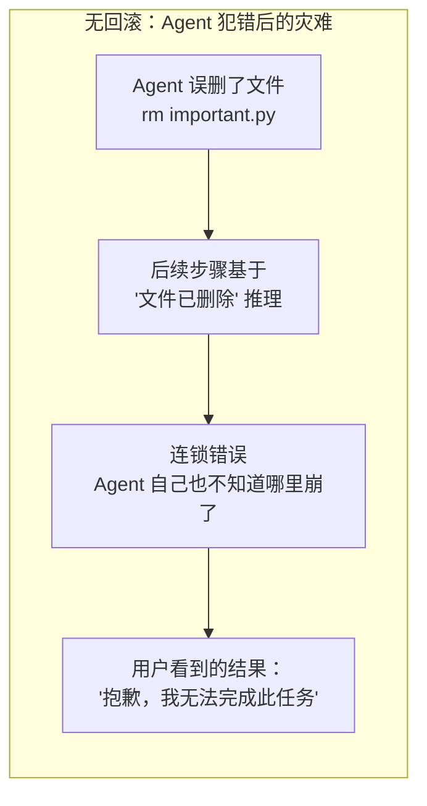
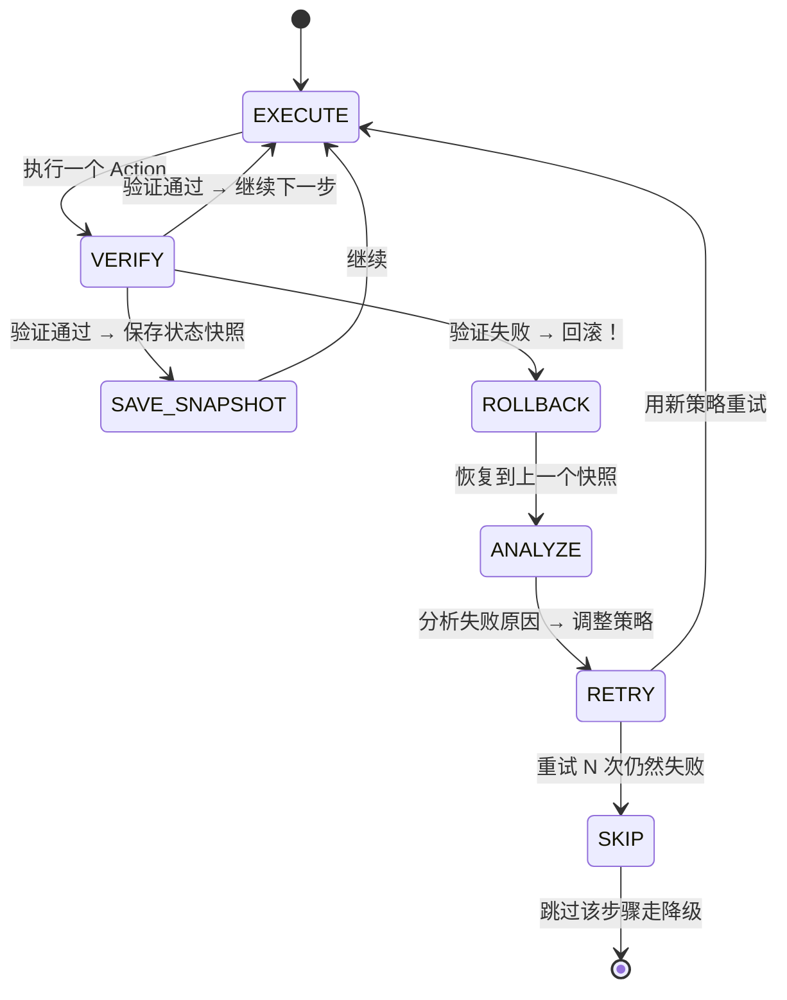
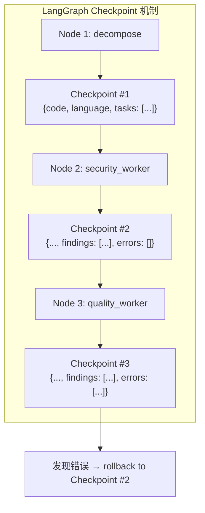
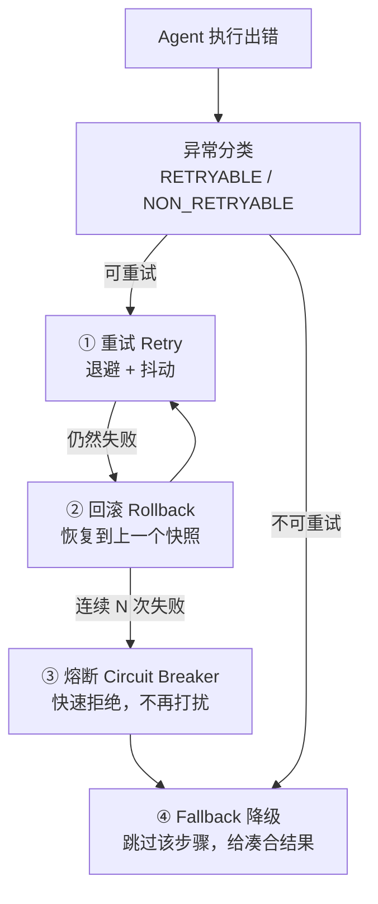

# 错误Patch回滚+验证+再尝试机制

> **一句话**：Agent 犯错后不能只是「说声抱歉」——需要像数据库事务一样支持回滚（Rollback），把状态恢复到错误发生前的快照，然后尝试修正路径继续执行。

---

## 一、为什么 Agent 需要回滚机制？

传统软件的执行是可逆的：Git revert 回退代码、数据库 ROLLBACK 回退事务、Ctrl+Z 撤销编辑。

Agent 执行的问题在于——**它真的改了东西**：



Agent 犯错不是「会不会」的问题，而是「什么时候」的问题。回滚机制的目标不是**阻止犯错**（这不可能），而是**犯错后能快速恢复**。

---

## 二、Patch-Rollback-Retry 三阶段循环



### 三个阶段分别做什么

| 阶段 | 动作 | 关键问题 |
|:----|:----|:--------|
| **Patch** | 执行一个动作（调工具、发请求、写文件） | 你怎么知道这个动作做对了？ |
| **Rollback** | 恢复到动作执行前的状态 | 你拿什么回滚？之前的状态存在哪？ |
| **Retry** | 分析失败原因后换策略再试 | 你怎么知道换什么策略？试多少次停？ |

---

## 三、不可变状态快照：LangGraph Checkpoint

回滚的前提是「之前的状态还保留着」。LangGraph 的 **Checkpointer** 机制天然支持这一步——每次节点执行后自动保存状态快照。



### 代码实现：基于 Checkpoint 的回滚

```python
"""
基于 LangGraph MemorySaver 的状态回滚机制。
核心思路：每个步骤前保存 checkpoint，出错后恢复到上一个 checkpoint 重试。
"""
from langgraph.checkpoint.memory import MemorySaver
from langgraph.graph import StateGraph
from typing import TypedDict, Annotated
import operator

# 第1步：定义状态（带 reducer 支持并发写入）
class AgentState(TypedDict):
    task_id: str
    current_step: int                    # 当前执行到第几步
    step_history: Annotated[list, operator.add]  # 历史步骤记录
    action_log: Annotated[list, operator.add]    # 动作日志（用于分析失败）
    errors: Annotated[list, operator.add]        # 错误收集
    retry_count: int                     # 当前步骤已重试次数

# 第2步：初始化 Checkpointer
checkpointer = MemorySaver()  # 生产环境换成 SqliteSaver / PostgresSaver

# 第3步：带检查点的节点执行器
async def execute_with_rollback(
    graph: StateGraph,
    state: AgentState,
    checkpointer: MemorySaver,
    thread_id: str,
    max_retries: int = 3,
) -> dict:
    """
    执行 Agent 并支持失败回滚。
    - thread_id: 隔离不同对话的状态
    - max_retries: 每个步骤最多重试次数
    """
    config = {"configurable": {"thread_id": thread_id}}

    # 保存初始状态快照
    await checkpointer.aput(config, state)

    while state["current_step"] < state.get("total_steps", 10):
        # 执行前保存快照
        snapshot_before = state.copy()

        try:
            # 执行当前步骤
            result = await graph.ainvoke(state, config)
            state = result  # 更新状态

            # 验证步骤结果
            if not verify_step(state, state["current_step"]):
                raise StepVerificationError("Step verification failed")

            # 成功 → 保存 checkpoint，前进到下一步
            state["current_step"] += 1
            state["retry_count"] = 0  # 重置重试计数
            await checkpointer.aput(config, state)

        except (StepVerificationError, Exception) as e:
            # 失败 → 回滚
            state = await rollback_and_retry(
                checkpointer=checkpointer,
                config=config,
                snapshot_before=snapshot_before,
                error=e,
                state=state,
                max_retries=max_retries,
            )
            if state is None:
                # 彻底失败，走降级
                break

    return state

async def rollback_and_retry(
    checkpointer: MemorySaver,
    config: dict,
    snapshot_before: dict,
    error: Exception,
    state: AgentState,
    max_retries: int,
) -> AgentState | None:
    """
    回滚到上一个快照 → 分析错误 → 重试。
    返回 None 表示放弃（走降级）。
    """
    state["retry_count"] += 1
    state["action_log"].append({
        "step": state["current_step"],
        "error": str(error),
        "retry_attempt": state["retry_count"],
    })

    if state["retry_count"] > max_retries:
        # 超过最大重试次数 → 放弃，走降级
        state["errors"].append({
            "step": state["current_step"],
            "error": str(error),
            "action": "max_retries_exceeded → skip_step",
        })
        state["current_step"] += 1  # 跳过这步
        state["retry_count"] = 0
        return state

    # 回滚：恢复快照 + 追加错误上下文
    rolled_back = snapshot_before.copy()
    rolled_back["errors"] = list(state.get("errors", []))  # 保留错误记录
    rolled_back["action_log"] = list(state.get("action_log", []))  # 保留日志
    rolled_back["retry_count"] = state["retry_count"]
    # 关键：step 不回退，但状态回退
    rolled_back["last_error_context"] = str(error)

    await checkpointer.aput(config, rolled_back)
    return rolled_back

def verify_step(state: AgentState, step: int) -> bool:
    """验证当前步骤的输出是否合法"""
    # 规则 1：检查是否有输出
    if not state.get("last_action_result"):
        return False

    # 规则 2：检查输出格式（如 JSON 是否可解析）
    result = state["last_action_result"]
    if isinstance(result, str):
        import json
        try:
            json.loads(result)
            return True
        except json.JSONDecodeError:
            return False

    # 规则 3：检查是否包含禁止的错误模式
    forbidden_patterns = ["I cannot", "I'm unable to", "Error:"]
    if isinstance(result, str):
        for pattern in forbidden_patterns:
            if pattern in result:
                return False

    return True
```

---

## 四、回滚粒度：回退到什么程度？

不是所有错误都需要全量回滚。选错粒度 = 要么白做了太多工作，要么回退不够干净：

| 粒度 | 回退范围 | 适用场景 | 代价 |
|:----|:--------|:--------|:----|
| **Action 级** | 回退单次工具调用 | 工具返回格式错误、参数填错 | 最小 |
| **Sub-task 级** | 回退一个子任务的所有步骤 | 子任务方向走错 | 中等 |
| **Task 级** | 回退整个任务从头来 | Agent 完全跑偏 | 最大（token 全浪费） |

```python
class RollbackGranularity(enum.Enum):
    """回滚粒度"""
    ACTION = "action"      # 回退单次工具调用
    SUBTASK = "subtask"    # 回退一个子任务
    TASK = "task"          # 回退整个任务

def decide_rollback_granularity(error: Exception, state: AgentState) -> RollbackGranularity:
    """
    根据错误类型决定回滚粒度。
    不是所有错误都要全量回滚——浪费 token。
    """
    # 工具参数错误 → 只回退这一次调用
    if isinstance(error, (ValueError, TypeError, ToolArgError)):
        return RollbackGranularity.ACTION

    # 子任务路径错误（如该用搜索却用了计算器）→ 回退这个子任务
    if isinstance(error, (WrongToolError, SubTaskPathError)):
        return RollbackGranularity.SUBTASK

    # Agent 完全跑偏（如审代码却去搜天气）→ 全量回退
    if isinstance(error, (CriticalPathError,)):
        return RollbackGranularity.TASK

    # 默认：最小回滚
    return RollbackGranularity.ACTION
```

---

## 五、与熔断和 Fallback 的关系

回滚不是孤立存在的——它是韧性工程四道防线中的一环：



| 防线 | 机制 | 回滚与之的关系 |
|:----|:----|:------------|
| 重试 (Retry) | 同一路径再试一次 | 回滚是重试的**前置条件**——不先回滚，重试是在错误状态上继续跑 |
| 熔断 (Circuit Breaker) | 连续失败快速失败 | 回滚 N 次仍失败 → 触发熔断，避免死循环 |
| Fallback (降级) | 跳过该步骤 | 回滚 + 重试全部失败后，放弃该步骤走降级 |

## 相关链接

- 目录：[[00-AI]]
- 上一篇：[[40-LLM-as-Judge评测工具链：Ragas-DeepEval-Langfuse配置与接入]]
- 韧性工程系列：[[27-指数退避重试：Exponential Backoff + Jitter]]
- 韧性工程系列：[[28-降级路径（Degradation）：某环节失败 → 回退到次优但可用方案]]
- 韧性工程系列：[[29-熔断模式-Circuit Breaker]]
- 韧性工程系列：[[30-Fallback兜底值设计]]
- 项目实践：cr-agent: 三层容错
- 项目实践：[[笔记/技术学习/项目开发笔记/cr-agent笔记/01-技术研读/00-17条架构决策总览.md#决策 4: 三层容错（熔断 + 超时 + 异常不阻塞）|cr-agent: 决策4-三层容错]]

---

→ [[技术学习清单#Harness 与评测]]
