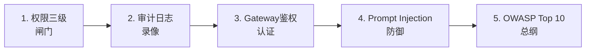

# Agent 安全防护目录索引

> 沉淀 cr-agent 安全四道防线实战经验。2026 年新增重要考点。

## 笔记列表

1. [[1-工具权限三级：read-only-write-destructive设计与实现|工具权限三级]] —— read-only / write / destructive 三级权限体系 + 声明式装饰器 + 人工审批流程
2. [[2-审计日志：操作全量记录-溯源-异常行为熔断|审计日志]] —— 结构化 JSON 审计事件 + append-only 哈希链 + 异常行为检测 + 熔断器
3. [[3-MCP Gateway鉴权：Bearer Token + JWT中间件实现|MCP Gateway鉴权]] —— Bearer Token + JWT 双层认证 + contextvars 身份传递 + Token 刷新
4. [[4-Prompt Injection防御：输入过滤-上下文隔离-前置规则|Prompt Injection防御]] —— 三层防御（输入消毒 + 上下文隔离 + 前置规则）+ LLM 二次判断
5. [[5-OWASP Top 10 for Agentic AI概念了解|OWASP Top 10 for Agentic AI]] —— OWASP Top 10 概览 + Agent 部署安全检查脚本 + 安全 vs 不安全 Tool 对比

## 学习递进关系

## 相关链接

- 学习计划：[[技术学习清单#Agent 安全防护]]
- 项目实践：[[笔记/技术学习/项目开发笔记/cr-agent笔记/01-技术研读/10-安全加固四道防线.md#第一级：四道防线总览|cr-agent: 安全四道防线]]
- 项目实践：[[笔记/技术学习/项目开发笔记/ai-resume笔记/02_项目复盘/03_生产与安全加固.md#一、传输层与响应层加固|ai-resume: 安全加固]]
- 项目实践：[[笔记/技术学习/项目开发笔记/cr-agent笔记/01-技术研读/07-MCP协议实战.md#🔴 记忆级|cr-agent: MCP实战]]
- 项目实践：[[笔记/技术学习/项目开发笔记/ai-resume笔记/01_技术研读/05_MCP协议.md#server.py — FastMCP 实例 + JWT 认证中间件|ai-resume: MCP协议]]

---
→ [[技术学习清单#Agent 安全防护]]
