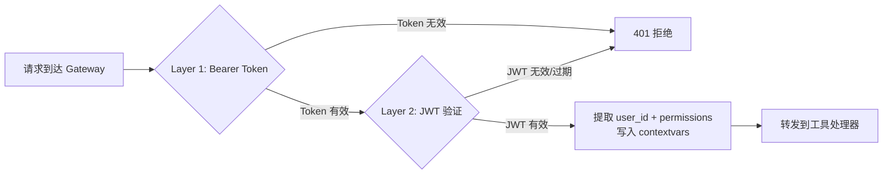
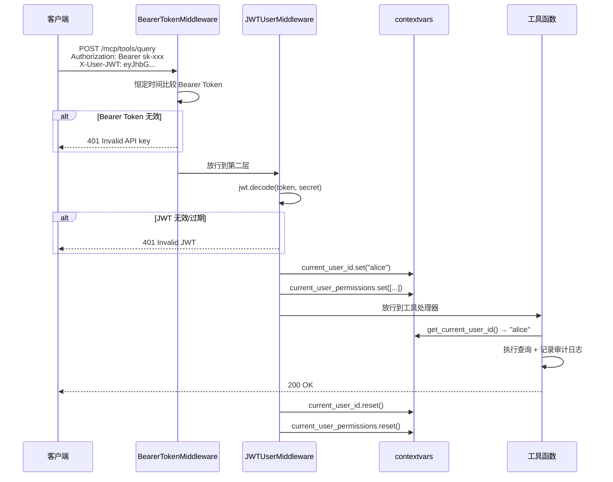

> **一句话**：MCP Gateway 是所有 MCP 工具请求的唯一入口，鉴权在这里集中做——Bearer Token 验证"调用方是谁"（应用级身份），JWT 验证"用户是谁"（请求级身份），通过 contextvars 在整个请求链路中传递用户身份，工具函数内无需显式传参即可获取当前用户。

## 基本原理

没有 Gateway 时，每个 MCP Server 各自实现鉴权——重复代码、不一致的实现、新增 Server 可能忘了加鉴权。Gateway 把鉴权逻辑集中在一处：**单点认证 + 集中审计**。

两层鉴权的分工：

| 层 | 验证什么 | 放在哪 | 生命周期 | 类比 |
|----|----------|--------|----------|------|
| Bearer Token | 调用方身份（是哪个应用在调） | `Authorization: Bearer <token>` | 长期（可手动撤销） | 门禁卡——证明你是这栋楼的人 |
| JWT | 终端用户身份（是哪个用户） | `X-User-JWT: <jwt>` | 短期（自动过期） | 身份证——证明你是具体哪个人 |

为什么必须两层？只有 Bearer → 审计日志只有 `app: frontend`，查不出谁干的。只有 JWT → 任何人都能伪造请求打到 Gateway，没有应用级门槛。



## 代码实现

### JWT 创建与验证 + 双层中间件 + contextvars

```python
"""
MCP Gateway 鉴权：Bearer Token + JWT 双层中间件。
基于 FastMCP / Starlette，包含 JWT 签发、验证、contextvars 传递、Token 刷新。

运行方式：pip install python-jose fastmcp starlette && python gateway_auth.py
"""
from __future__ import annotations

import os
import time
import hashlib
import hmac
import logging
import contextvars
from dataclasses import dataclass
from typing import Optional, Any

# python-jose 提供 JWT 的签发和验证
from jose import jwt, JWTError, ExpiredSignatureError

from starlette.middleware.base import BaseHTTPMiddleware
from starlette.requests import Request
from starlette.responses import JSONResponse

logging.basicConfig(
    level=logging.INFO,
    format="%(asctime)s [%(levelname)s] %(message)s",
    datefmt="%H:%M:%S",
)
logger = logging.getLogger(__name__)


# ============================================================
# 1. 配置 —— 生产环境从环境变量或配置中心读取
# ============================================================
@dataclass
class GatewayConfig:
    """
    Gateway 鉴权配置。

    生产环境中这些值绝不硬编码，从环境变量注入：
    - GATEWAY_API_KEY: Bearer Token，每个调用方（如前端应用）一个
    - JWT_SECRET: JWT 签名密钥，至少 256 位随机值
    - JWT_ALGORITHM: 签名算法，推荐 RS256（非对称）或 HS256（对称）
    """
    gateway_api_key: str = os.environ.get("GATEWAY_API_KEY", "sk-gateway-demo-key")
    jwt_secret: str = os.environ.get("JWT_SECRET", "super-secret-key-change-me")
    jwt_algorithm: str = "HS256"                    # HS256 = HMAC + SHA-256
    jwt_access_expiry_minutes: int = 30             # Access Token 有效期
    jwt_refresh_expiry_days: int = 7                # Refresh Token 有效期


config = GatewayConfig()


# ============================================================
# 2. contextvars —— 在请求生命周期内传递用户身份
# ============================================================
# ContextVar 是 Python 标准库提供的线程安全、协程安全的上下文变量。
# 每个请求有自己独立的上下文副本，不会串到其他请求。
current_user_id: contextvars.ContextVar[Optional[str]] = contextvars.ContextVar(
    "current_user_id", default=None
)
current_user_permissions: contextvars.ContextVar[list[str]] = contextvars.ContextVar(
    "current_user_permissions", default_factory=list
)


def get_current_user_id() -> str:
    """
    在工具函数中获取当前用户 ID。

    使用示例：
        user_id = get_current_user_id()
        logger.info("用户 %s 调用了工具", user_id)
    """
    uid = current_user_id.get()
    if uid is None:
        raise RuntimeError(
            "当前请求没有用户上下文——请确保 JWTUserMiddleware 已挂载"
        )
    return uid


def get_current_user_permissions() -> list[str]:
    """在工具函数中获取当前用户的权限列表。"""
    return current_user_permissions.get()


# ============================================================
# 3. JWT 签发器 —— 负责生成和刷新 Token
# ============================================================
class JWTIssuer:
    """
    JWT Token 的签发和刷新。

    Access Token（短期）：放在 X-User-JWT header 中，每次 API 调用都带上。
    Refresh Token（长期）：只在 Access Token 过期时用一次，换取新的 Access Token。
    """

    def __init__(self, config: GatewayConfig) -> None:
        self._config = config

    def create_access_token(
        self,
        user_id: str,
        permissions: Optional[list[str]] = None,
    ) -> str:
        """
        签发 Access Token。

        JWT payload 包含：
        - sub: 用户 ID（subject，JWT 标准字段）
        - permissions: 用户的权限列表
        - iat: 签发时间（issued at）
        - exp: 过期时间（expiration）
        - jti: Token 唯一 ID（JWT ID），用于撤销机制
        """
        now = int(time.time())
        payload = {
            "sub": user_id,                          # subject —— 用户标识
            "permissions": permissions or [],         # 权限列表
            "iat": now,                               # 签发时间
            "exp": now + self._config.jwt_access_expiry_minutes * 60,  # 过期时间
            "jti": f"{user_id}_{now}",               # 唯一 ID，用于撤销
        }
        token = jwt.encode(
            payload,
            self._config.jwt_secret,
            algorithm=self._config.jwt_algorithm,
        )
        logger.info("Access Token 已签发: user=%s exp=%s", user_id,
                     payload["exp"])
        return token

    def create_refresh_token(self, user_id: str) -> str:
        """
        签发 Refresh Token。

        Refresh Token 有效期更长（如 7 天），但只能用于换取新的 Access Token，
        不能直接用于 API 调用（Gateway 会拒绝 type=refresh 的 Token 访问业务接口）。
        """
        now = int(time.time())
        payload = {
            "sub": user_id,
            "type": "refresh",                        # 标记为 Refresh Token
            "iat": now,
            "exp": now + self._config.jwt_refresh_expiry_days * 86400,
            "jti": f"refresh_{user_id}_{now}",
        }
        token = jwt.encode(
            payload,
            self._config.jwt_secret,
            algorithm=self._config.jwt_algorithm,
        )
        logger.info("Refresh Token 已签发: user=%s", user_id)
        return token

    def refresh_access_token(self, refresh_token: str) -> str:
        """
        用 Refresh Token 换取新的 Access Token。

        验证 Refresh Token 的有效性，从中提取 user_id，
        然后签发一个新的 Access Token。
        """
        try:
            payload = jwt.decode(
                refresh_token,
                self._config.jwt_secret,
                algorithms=[self._config.jwt_algorithm],
            )
        except ExpiredSignatureError:
            raise InvalidTokenError("Refresh Token 已过期，请重新登录")
        except JWTError as e:
            raise InvalidTokenError(f"Refresh Token 无效: {e}")

        # 验证 Token 类型必须是 refresh
        if payload.get("type") != "refresh":
            raise InvalidTokenError("Token 类型不是 refresh，拒绝刷新")

        user_id = payload["sub"]
        permissions = payload.get("permissions", [])
        logger.info("Refresh Token 验证通过，签发新 Access Token: user=%s", user_id)
        return self.create_access_token(user_id, permissions)

    def decode_token(self, token: str) -> dict[str, Any]:
        """
        解码并验证 Access Token，返回 payload。

        Raises:
            InvalidTokenError: Token 无效或已过期
        """
        try:
            payload = jwt.decode(
                token,
                self._config.jwt_secret,
                algorithms=[self._config.jwt_algorithm],
            )
        except ExpiredSignatureError:
            raise InvalidTokenError("Access Token 已过期")
        except JWTError as e:
            raise InvalidTokenError(f"Token 无效: {e}")

        # 验证这不是 Refresh Token（防止用 Refresh Token 访问业务接口）
        if payload.get("type") == "refresh":
            raise InvalidTokenError("不能使用 Refresh Token 访问业务接口")

        return payload


class InvalidTokenError(Exception):
    """Token 无效或过期的统一异常。"""
    pass


# ============================================================
# 4. 恒定时间字符串比较 —— 防止时序攻击
# ============================================================
def constant_time_compare(a: str, b: str) -> bool:
    """
    恒定时间比较两个字符串。

    普通 == 操作符逐字符比较，越早不匹配返回越快。
    攻击者可以通过测量响应时间，逐字符猜出正确的 Token——
    这就是"时序攻击（Timing Attack）"。

    恒定时间比较无论是否匹配，都遍历全部字符，
    相同的运算量 → 相同的耗时 → 攻击者无法从时间差异中获取信息。
    """
    if len(a) != len(b):
        return False
    # 用异或运算比较每个字符：相同字符异或得 0，不同得非 0
    result = 0
    for x, y in zip(a, b):
        result |= ord(x) ^ ord(y)  # 按位或累加——只要有一处不同，result 就不为 0
    return result == 0


# ============================================================
# 5. Layer 1: Bearer Token 中间件 —— 验证调用方身份
# ============================================================
class BearerTokenMiddleware(BaseHTTPMiddleware):
    """
    第一层鉴权：验证调用方身份（API Key 级别）。

    检查 HTTP Header 中的 Authorization: Bearer <token>，
    与 Gateway 配置的 API Key 做恒定时间比较。

    设计要点：
    - 健康检查端点 (/health) 跳过鉴权
    - 格式错误和 Key 错误返回相同的 401 状态码（不泄露信息）
    - 使用恒定时间比较防止时序攻击
    """

    def __init__(self, app, config: GatewayConfig) -> None:
        super().__init__(app)
        self._config = config

    async def dispatch(self, request: Request, call_next):
        # ---- 白名单路径：健康检查不鉴权 ----
        if request.url.path in ("/health", "/metrics"):
            return await call_next(request)

        # ---- 检查 Authorization header 格式 ----
        auth_header = request.headers.get("Authorization", "")
        if not auth_header.startswith("Bearer "):
            logger.warning("请求缺少 Authorization header: %s", request.client.host)
            return JSONResponse(
                {"error": "Missing or invalid Authorization header"},
                status_code=401,
            )

        # ---- 提取并验证 Bearer Token ----
        token = auth_header[len("Bearer "):]  # 去掉 "Bearer " 前缀

        if not constant_time_compare(token, self._config.gateway_api_key):
            logger.warning("无效的 Bearer Token: 来源 %s", request.client.host)
            # 注意：错误消息与格式错误一致，不给攻击者任何线索
            return JSONResponse(
                {"error": "Missing or invalid Authorization header"},
                status_code=401,
            )

        # ---- Token 有效，放行到下一层 ----
        logger.debug("Bearer Token 验证通过")
        return await call_next(request)


# ============================================================
# 6. Layer 2: JWT 用户中间件 —— 验证终端用户身份
# ============================================================
class JWTUserMiddleware(BaseHTTPMiddleware):
    """
    第二层鉴权：验证终端用户身份（per-request 级别）。

    从 X-User-JWT header 提取 JWT，解码后：
    1. 验证签名（确保 Token 没被篡改）
    2. 检查过期时间
    3. 提取 user_id 和 permissions 写入 contextvars
    4. 请求结束后清理 contextvars（避免泄露到下一个请求）
    """

    def __init__(self, app, config: GatewayConfig) -> None:
        super().__init__(app)
        self._issuer = JWTIssuer(config)

    async def dispatch(self, request: Request, call_next):
        # ---- 白名单路径：登录/注册不需要 JWT ----
        if request.url.path in ("/auth/login", "/auth/register", "/health"):
            return await call_next(request)

        # ---- 提取 JWT Token ----
        jwt_token = request.headers.get("X-User-JWT", "")
        if not jwt_token:
            logger.warning("请求缺少 X-User-JWT header: path=%s", request.url.path)
            return JSONResponse(
                {"error": "Missing X-User-JWT header"},
                status_code=401,
            )

        # ---- 验证 JWT ----
        try:
            payload = self._issuer.decode_token(jwt_token)
        except InvalidTokenError as e:
            logger.warning("JWT 验证失败: %s path=%s", e, request.url.path)
            return JSONResponse(
                {"error": str(e)},
                status_code=401,
            )

        # ---- 提取用户身份，写入 contextvars ----
        user_id = payload["sub"]
        permissions = payload.get("permissions", [])

        # ContextVar.set() 返回一个 token，用于后续恢复
        uid_token = current_user_id.set(user_id)
        perm_token = current_user_permissions.set(permissions)

        logger.debug("JWT 验证通过: user=%s permissions=%s", user_id, permissions)

        try:
            # ---- 放行到工具处理器 ----
            response = await call_next(request)
            return response
        finally:
            # ---- 请求结束后清理 contextvars ----
            # 这一步至关重要：不清理的话，可能泄露到同一线程/协程的下一个请求
            current_user_id.reset(uid_token)
            current_user_permissions.reset(perm_token)


# ============================================================
# 7. 组装 Gateway —— 在 FastMCP 应用中挂载中间件
# ============================================================
# 注意：以下代码展示了如何挂载中间件。
# 在实际项目中，这部分放在 Gateway 的启动文件（如 main.py）中。

# from mcp.server.fastmcp import FastMCP
# mcp = FastMCP("My MCP Gateway")
# app = mcp.get_asgi_app()
#
# # 中间件的挂载顺序非常重要——Starlette 是洋葱模型
# # 请求: 外层 → 内层
# # 响应: 内层 → 外层
# # 所以 Bearer Token 应该在最外层——无效请求不应浪费 CPU 解析 JWT
# app.add_middleware(BearerTokenMiddleware, config=config)   # 第1层
# app.add_middleware(JWTUserMiddleware, config=config)       # 第2层


# ============================================================
# 8. 使用示例：在工具函数中读取用户身份
# ============================================================
def example_tool_query_database(sql: str) -> dict:
    """
    模拟一个受保护的 MCP 工具函数。

    工具函数内部无需手动接收 user_id，通过 get_current_user_id()
    自动从 contextvars 中获取——由 JWTUserMiddleware 在请求进入时设置。
    """
    # ---- 自动获取当前用户身份 ----
    user_id = get_current_user_id()
    permissions = get_current_user_permissions()

    # ---- 细粒度权限检查（在通用权限系统之上的额外限制） ----
    if "database:read" not in permissions:
        raise PermissionError(f"用户 {user_id} 没有 database:read 权限")

    # ---- 业务逻辑 + 审计记录 ----
    logger.info("tool=query_database user=%s sql_preview=%s", user_id, sql[:100])

    # 模拟查询
    return {
        "rows": [{"id": 1, "name": "示例数据"}],
        "queried_by": user_id,
    }


# ============================================================
# 9. Token 刷新端点 —— 完整的刷新流程
# ============================================================
def handle_refresh_token(refresh_token: str) -> dict:
    """
    处理 Token 刷新请求。

    客户端在 Access Token 过期后，用 Refresh Token 换取新的 Token 对。
    这使得 Access Token 可以设得很短（如 15 分钟），
    而用户体验不受影响（Refresh Token 自动续期）。

    返回:
        新的 Access Token 和 Refresh Token
    """
    issuer = JWTIssuer(config)

    try:
        # 用 Refresh Token 签发新的 Access Token
        new_access_token = issuer.refresh_access_token(refresh_token)

        # 同时轮换 Refresh Token（安全最佳实践：每次刷新都换新的）
        payload = jwt.decode(
            refresh_token,
            config.jwt_secret,
            algorithms=[config.jwt_algorithm],
        )
        new_refresh_token = issuer.create_refresh_token(payload["sub"])

        return {
            "access_token": new_access_token,
            "refresh_token": new_refresh_token,
            "expires_in": config.jwt_access_expiry_minutes * 60,
        }
    except InvalidTokenError as e:
        logger.warning("Token 刷新失败: %s", e)
        return {"error": str(e)}


# ============================================================
# 10. 完整演示
# ============================================================
if __name__ == "__main__":
    issuer = JWTIssuer(config)

    print("=" * 60)
    print("场景 1: 签发 Access Token + Refresh Token")
    print("=" * 60)

    # ---- 用户登录后签发 Token ----
    access_token = issuer.create_access_token(
        user_id="alice",
        permissions=["database:read", "resume:write"],
    )
    refresh_token = issuer.create_refresh_token(user_id="alice")

    print(f"Access Token (前50字符):  {access_token[:50]}...")
    print(f"Refresh Token (前50字符): {refresh_token[:50]}...")

    # ---- 解码 Access Token 查看 payload ----
    payload = issuer.decode_token(access_token)
    print(f"\n解码 payload:")
    for key, value in payload.items():
        print(f"  {key}: {value}")

    print("\n" + "=" * 60)
    print("场景 2: 用 Refresh Token 刷新")
    print("=" * 60)

    new_tokens = handle_refresh_token(refresh_token)
    if "error" not in new_tokens:
        print(f"新的 Access Token (前50字符):  {new_tokens['access_token'][:50]}...")
        print(f"有效期: {new_tokens['expires_in']} 秒")
    else:
        print(f"刷新失败: {new_tokens['error']}")

    print("\n" + "=" * 60)
    print("场景 3: 模拟工具函数读取用户身份")
    print("=" * 60)

    # ---- 模拟中间件设置 contextvars ----
    uid_token = current_user_id.set("alice")
    perm_token = current_user_permissions.set(["database:read", "resume:write"])

    try:
        result = example_tool_query_database("SELECT * FROM resumes LIMIT 10")
        print(f"工具返回: {result}")
    finally:
        # 清理 contextvars
        current_user_id.reset(uid_token)
        current_user_permissions.reset(perm_token)
```

### 请求完整链路



### 中间件顺序（洋葱模型）

Starlette 的中间件是洋葱模型——请求从外到内，响应从内到外。Bearer Token 必须在最外层：无有效 API Key 的请求不应消耗 CPU 去解析 JWT，否则攻击者可以发大量无效请求搞 DoS。

```text
请求 → BearerTokenMiddleware → JWTUserMiddleware → 工具函数
响应 ← BearerTokenMiddleware ← JWTUserMiddleware ← 工具函数
```

## 相关链接

- 上一篇：[[2-审计日志：操作全量记录-溯源-异常行为熔断]]
- 下一篇：[[4-Prompt Injection防御：输入过滤-上下文隔离-前置规则]]
- 项目实践：[[笔记/技术学习/项目开发笔记/cr-agent笔记/01-技术研读/10-安全加固四道防线.md#第二级：防线详解|cr-agent: 安全四道防线]]
- 项目实践：[[笔记/技术学习/项目开发笔记/cr-agent笔记/01-技术研读/07-MCP协议实战.md#🔴 记忆级|cr-agent: MCP实战]]
- 项目实践：[[笔记/技术学习/项目开发笔记/ai-resume笔记/01_技术研读/05_MCP协议.md#server.py — FastMCP 实例 + JWT 认证中间件|ai-resume: MCP协议]]

---
→ [[技术学习清单#Agent 安全防护]]
