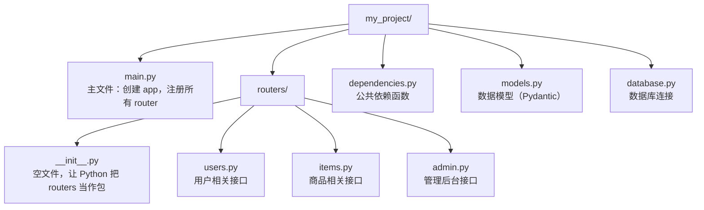

# 依赖注入与路由分组

> 写给初学者：每个概念都从"为什么需要它"开始讲，配合通俗比喻和完整可运行代码。

---

## 一、依赖注入（Dependencies）

### 1.1 为什么需要依赖注入？

假设你有 10 个接口都需要校验用户身份，每个接口都写一遍校验逻辑：

```python
# ❌ 重复代码：每个接口都写一遍校验逻辑
# 假设你有 10 个接口，每个都要写一遍，改起来要改 10 处——很容易漏

@app.get("/users")
async def get_users(token: str = Header(...)):
    # Header(...) 表示从请求头取 token 字段
    user = verify_token(token)   # 校验 token 的逻辑
    if not user:                 # token 无效
        raise HTTPException(status_code=401)  # 返回 401 未授权
    return ...                   # token 有效，继续处理

@app.get("/items")
async def get_items(token: str = Header(...)):
    user = verify_token(token)   # 又写一遍！和上面一模一样
    if not user:
        raise HTTPException(status_code=401)  # 又写一遍！
    return ...
# 如果有 10 个接口，就要写 10 遍——这就是"重复代码"的问题
```

**依赖注入的作用：把公共逻辑抽出来，声明"我需要什么"，FastAPI 自动帮你注入。**

### 1.2 基本用法

```python
from fastapi import FastAPI, Depends, HTTPException, Header

app = FastAPI()

# ==================== 第一步：定义依赖函数 ====================
# 这个函数就是"公共逻辑"——校验用户身份
# 它不是接口，不能直接访问，而是被接口"依赖"调用
async def get_current_user(token: str = Header(...)):
    # Header(...) 表示从请求头里取 token 字段
    # ... 表示这个字段是必填的，不传就报 422 错误
    """校验 token，返回当前用户"""
    if token != "secret":
        # raise HTTPException 会直接中断请求，返回 401 错误给客户端
        # 接口函数不会执行
        raise HTTPException(status_code=401, detail="无效的 token")
    # 校验通过，返回用户信息（这个返回值会传给接口函数的参数）
    return {"username": "张三", "role": "admin"}

# ==================== 第二步：在接口里使用依赖 ====================
# Depends(get_current_user) 的意思是：
# "在执行这个接口之前，先调用 get_current_user 函数"
# get_current_user 的返回值会作为 current_user 参数传进来
@app.get("/users")
async def get_users(current_user: dict = Depends(get_current_user)):
    # 到这里时，current_user 一定是合法用户（不合法的已经在上面被 401 拦截了）
    return {"msg": f"你好, {current_user['username']}", "user": current_user}

@app.get("/items")
async def get_items(current_user: dict = Depends(get_current_user)):
    # 不用再写一遍校验逻辑！依赖函数已经帮你做了
    return {"msg": "这是你的商品列表", "owner": current_user["username"]}
```

**发生了什么？**
1. 请求进来时，FastAPI 先调用 `get_current_user`
2. `get_current_user` 返回的结果，作为 `current_user` 参数传入你的函数
3. 如果 `get_current_user` 抛了 `HTTPException`，请求直接中断

**通俗比喻**：依赖注入就像餐厅的"食材采购"——厨师（接口函数）说"我需要鸡蛋"（`Depends(get_egg)`），采购员（FastAPI）自动把鸡蛋买好放桌上，厨师直接用就行。

### 1.3 带参数的依赖

依赖函数也可以有自己的参数：

```python
# 依赖函数也可以有自己的参数（比如从路径获取 item_id）
# 这个依赖的作用：通用的"查不到就 404"逻辑，任何需要查商品的接口都能复用
async def get_item_or_404(item_id: int):
    """通用依赖：查不到就 404"""
    items = {1: "键盘", 2: "鼠标", 3: "显示器"}  # 模拟数据库
    if item_id not in items:
        # 商品不存在 → 抛 404，请求到此结束
        raise HTTPException(status_code=404, detail=f"商品 {item_id} 不存在")
    return items[item_id]  # 商品存在 → 返回商品名

@app.get("/items/{item_id}")
async def read_item(item_name: str = Depends(get_item_or_404)):
    return {"item": item_name}
```

### 1.4 类作为依赖

除了函数，类也可以当依赖：

```python
# 类也可以当依赖！好处是可以把多个参数封装成一个对象
class Pagination:
    """分页参数类"""
    def __init__(self, skip: int = 0, limit: int = 10):
        self.skip = skip
        self.limit = limit

@app.get("/users")
async def list_users(pagination: Pagination = Depends()):
    # Depends() 里不写类名！FastAPI 会从参数类型注解 Pagination 自动推断
    return {
        "skip": pagination.skip,
        "limit": pagination.limit,
        "msg": f"返回 {pagination.limit} 条，跳过前 {pagination.skip} 条"
    }
```

### 1.5 多层依赖嵌套

依赖函数里还可以用其他依赖：

```python
# ==================== 第一层依赖：校验 token ====================
async def get_current_user(token: str = Header(...)):
    if token != "secret":
        raise HTTPException(status_code=401)
    return {"username": "张三", "role": "admin"}

# ==================== 第二层依赖：检查权限 ====================
async def require_admin(user: dict = Depends(get_current_user)):
    """只有管理员才能访问"""
    if user["role"] != "admin":
        raise HTTPException(status_code=403, detail="需要管理员权限")
    return user

# ==================== 接口：依赖第二层 ====================
@app.get("/admin/dashboard")
async def admin_dashboard(admin: dict = Depends(require_admin)):
    return {"msg": f"欢迎进入管理后台, {admin['username']}"}
```

**401 vs 403 区别**：401 是"我不认识你"（未认证），403 是"我认识你，但你没权限"（未授权）。

### 1.6 yield 依赖 —— 带"收尾"的依赖

有时候依赖函数需要"做完之后清理一下"，比如数据库连接用完要关闭。这时候用 `yield` 代替 `return`：

```python
async def get_db():
    db = connect_to_db()   # 第一步：创建连接（请求进来时执行）
    yield db               # 第二步：把连接"借"出去给接口用
    db.close()             # 第三步：关闭连接（响应返回后执行）
```

**`yield` 的执行时机**：
1. `yield` 之前的代码 → 请求进来时执行（准备资源）
2. `yield` 把值传出去 → 接口函数拿到这个值
3. `yield` 之后的代码 → 响应返回后执行（清理资源）

**正确写法：用 `try...finally`**

```python
async def get_db():
    db = connect_to_db()   # ① 创建连接
    try:
        yield db           # ② 把连接借出去给接口用
    finally:
        db.close()         # ③ 不管有没有异常，一定关闭连接
```

---

## 二、路由分组（APIRouter）

### 2.1 为什么需要路由分组？

假设你在做一个用户管理系统，有这些接口：

```text
GET    /users          获取用户列表
GET    /users/{id}     获取单个用户
POST   /users          创建用户
PUT    /users/{id}     更新用户
DELETE /users/{id}     删除用户
GET    /items          获取商品列表
POST   /items          创建商品
```

如果全部写在一个 `main.py` 里，文件会越来越大。**APIRouter 让你按功能拆分成多个文件。**

### 2.2 基本用法

#### 第一步：创建 router 文件

```python
# routers/users.py —— 用户相关的接口都放这里

from fastapi import APIRouter

router = APIRouter()

@router.get("/")
async def list_users():
    """获取用户列表"""
    return [{"username": "张三"}, {"username": "李四"}]

@router.get("/{user_id}")
async def get_user(user_id: int):
    """获取单个用户"""
    return {"username": "张三", "id": user_id}

@router.post("/")
async def create_user(username: str):
    """创建用户"""
    return {"msg": f"用户 {username} 创建成功"}
```

#### 第二步：在主文件里注册 router

```python
# main.py —— 主文件，负责组装各个 router

from fastapi import FastAPI
from routers.users import router as users_router

app = FastAPI()

# 注册 router，并加统一前缀
# prefix="/users" 表示这个 router 里的所有路由都以 /users 开头
# tags=["用户"] 表示在 API 文档里归类到"用户"分组
app.include_router(users_router, prefix="/users", tags=["用户"])
```

**访问路径对照**：

| routers/users.py 里写的 | 实际访问路径 | 说明 |
|------------------------|------------|------|
| `@router.get("/")` | `GET /users` | prefix 自动拼在前面 |
| `@router.get("/{user_id}")` | `GET /users/123` | 路径参数也正常工作 |
| `@router.post("/")` | `POST /users` | POST 请求也一样 |

### 2.3 完整项目结构

一个典型的 FastAPI 项目长这样：



### 2.4 APIRouter 的常用参数

```python
from fastapi import APIRouter, Depends

router = APIRouter(
    prefix="/users",      # 统一前缀
    tags=["用户"],         # API 文档标签
    dependencies=[        # 公共依赖
        Depends(verify_token)
    ],
    responses={           # 公共响应描述（给 API 文档看的）
        404: {"description": "未找到"},
        401: {"description": "未授权"},
    },
)
```

**推荐参数写在 router 文件里**：
- 路由的配置跟路由定义放在一起，看 router 文件就知道完整情况
- main.py 保持简洁，只负责组装

---

## 速查表

| 概念 | 一句话解释 | 关键代码 |
|------|---------|---------|
| `Depends` | 声明依赖，FastAPI 自动注入 | `def f(user = Depends(get_user))` |
| 依赖函数 | 抽出来的公共逻辑 | `async def get_user(token): ...` |
| 类依赖 | 用类当依赖，自动解析查询参数 | `pagination: Pagination = Depends()` |
| 多层依赖 | 依赖里再依赖 | `require_admin` 依赖 `get_current_user` |
| yield 依赖 | 带资源清理的依赖 | `yield db` + `try...finally` |
| `APIRouter` | 把接口按功能拆分成多个文件 | `router = APIRouter()` |
| `include_router` | 在主文件里注册 router | `app.include_router(router, prefix="/users")` |
| `prefix` | 给 router 的所有接口加统一前缀 | `prefix="/api/v1/users"` |
| `tags` | API 文档里的分组标签 | `tags=["用户"]` |

---

## 
> ▶ 对应原理：[[02-依赖注入Depends原理与生命周期|02-依赖注入Depends原理与生命周期]]

相关链接

- 目录：[[00-FastAPI]]
- 上一篇：[[05-错误处理与数据校验]]
- 下一篇：[[07-中间件]]
- 项目实践：[[笔记/技术学习/项目开发笔记/ai-resume笔记/01_技术研读/01_架构概览|ai-resume: 架构概览]]
- 项目实践：[[笔记/技术学习/项目开发笔记/cr-agent笔记/01-技术研读/05-API与CLI接口契约|cr-agent: API与CLI接口契约]]

---
→ [[技术学习清单#工程化篇]]
