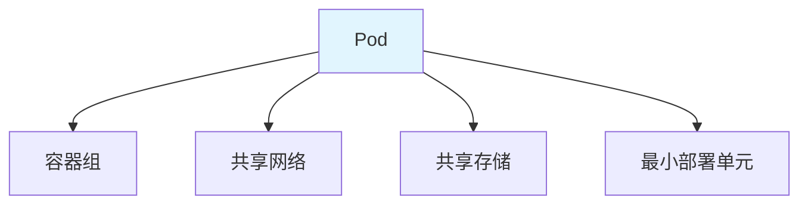
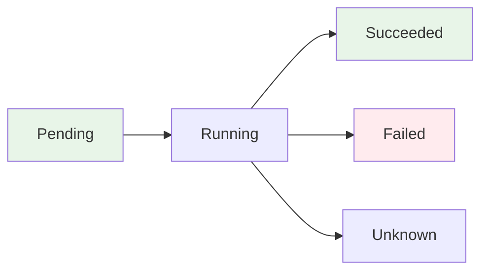
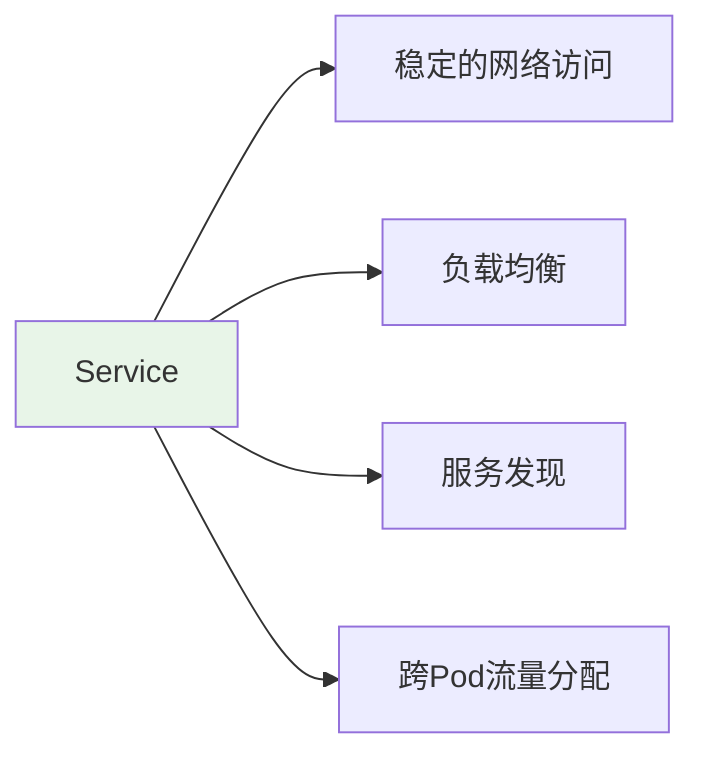
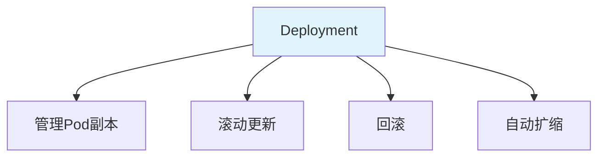
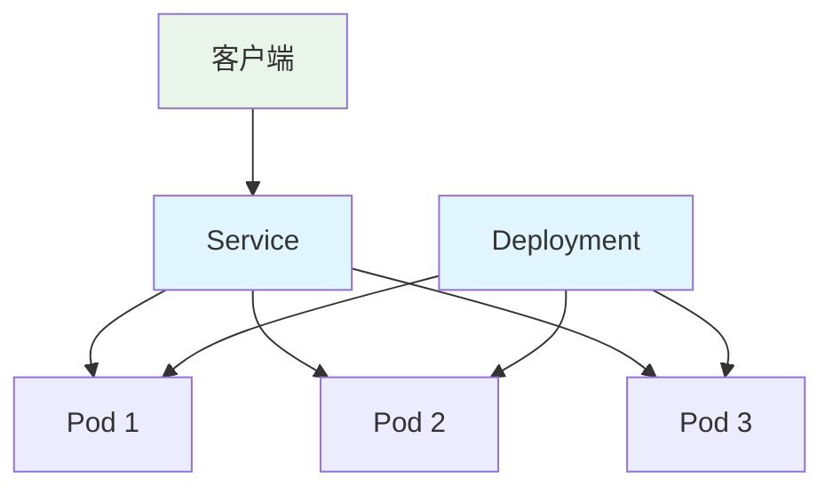
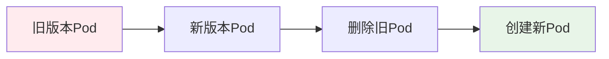

# Pod / Service / Deployment 核心概念与关系

> **一句话**：Pod是K8s中最小的部署单元，Service提供稳定的网络访问，Deployment管理Pod的副本数和滚动更新。三者共同构成了K8s应用部署的核心。

## 1. Pod 基础

### 1.1 什么是Pod？



**Pod**：K8s中最小的部署单元，包含一个或多个容器，共享网络和存储。

### 1.2 Pod生命周期



| 状态 | 说明 |
|------|------|
| Pending | 等待调度 |
| Running | 运行中 |
| Succeeded | 成功完成 |
| Failed | 失败 |
| Unknown | 未知状态 |

### 1.3 Pod配置示例

```yaml
apiVersion: v1
kind: Pod
metadata:
  name: myapp-pod
  labels:
    app: myapp
spec:
  containers:
  - name: myapp
    image: myapp:latest
    ports:
    - containerPort: 8000
    resources:
      requests:
        memory: "64Mi"
        cpu: "250m"
      limits:
        memory: "128Mi"
        cpu: "500m"
```

## 2. Service 基础

### 2.1 什么是Service？



**Service**：为一组Pod提供稳定的网络访问入口，实现负载均衡和服务发现。

### 2.2 Service类型

| 类型 | 说明 | 适用场景 |
|------|------|----------|
| ClusterIP | 集群内部访问 | 内部服务 |
| NodePort | 节点端口暴露 | 开发测试 |
| LoadBalancer | 云负载均衡 | 生产环境 |
| ExternalName | 外部服务映射 | 外部服务 |

### 2.3 Service配置示例

```yaml
apiVersion: v1
kind: Service
metadata:
  name: myapp-service
spec:
  selector:
    app: myapp
  ports:
  - protocol: TCP
    port: 80
    targetPort: 8000
  type: ClusterIP
```

## 3. Deployment 基础

### 3.1 什么是Deployment？



**Deployment**：管理Pod的副本数、滚动更新和回滚，提供声明式应用管理。

### 3.2 Deployment配置示例

```yaml
apiVersion: apps/v1
kind: Deployment
metadata:
  name: myapp-deployment
spec:
  replicas: 3
  selector:
    matchLabels:
      app: myapp
  template:
    metadata:
      labels:
        app: myapp
    spec:
      containers:
      - name: myapp
        image: myapp:latest
        ports:
        - containerPort: 8000
        resources:
          requests:
            memory: "64Mi"
            cpu: "250m"
          limits:
            memory: "128Mi"
            cpu: "500m"
```

## 4. 三者关系

### 4.1 架构图



### 4.2 工作流程

```yaml
# 1. Deployment创建Pod
apiVersion: apps/v1
kind: Deployment
metadata:
  name: myapp
spec:
  replicas: 3
  selector:
    matchLabels:
      app: myapp
  template:
    metadata:
      labels:
        app: myapp
    spec:
      containers:
      - name: myapp
        image: myapp:latest

---
# 2. Service暴露Pod
apiVersion: v1
kind: Service
metadata:
  name: myapp-service
spec:
  selector:
    app: myapp  # 匹配Deployment的Pod标签
  ports:
  - port: 80
    targetPort: 8000
  type: ClusterIP
```

## 5. 滚动更新

### 5.1 什么是滚动更新？



**滚动更新**：逐步替换旧版本Pod为新版本，保证服务不中断。

### 5.2 更新策略

```yaml
apiVersion: apps/v1
kind: Deployment
metadata:
  name: myapp
spec:
  replicas: 3
  strategy:
    type: RollingUpdate
    rollingUpdate:
      maxSurge: 1      # 最多多出1个Pod
      maxUnavailable: 0 # 最少保持所有Pod可用
  selector:
    matchLabels:
      app: myapp
  template:
    metadata:
      labels:
        app: myapp
    spec:
      containers:
      - name: myapp
        image: myapp:v2  # 更新镜像版本
```

## 6. 实际案例

### 6.1 FastAPI应用部署

```yaml
# Deployment
apiVersion: apps/v1
kind: Deployment
metadata:
  name: fastapi-app
spec:
  replicas: 3
  selector:
    matchLabels:
      app: fastapi
  template:
    metadata:
      labels:
        app: fastapi
    spec:
      containers:
      - name: fastapi
        image: fastapi-app:latest
        ports:
        - containerPort: 8000
        env:
        - name: DATABASE_URL
          valueFrom:
            secretKeyRef:
              name: db-secret
              key: url

---
# Service
apiVersion: v1
kind: Service
metadata:
  name: fastapi-service
spec:
  selector:
    app: fastapi
  ports:
  - port: 80
    targetPort: 8000
  type: LoadBalancer
```

### 6.2 多环境部署

```yaml
# 开发环境
apiVersion: apps/v1
kind: Deployment
metadata:
  name: myapp-dev
  namespace: development
spec:
  replicas: 1
  template:
    spec:
      containers:
      - name: myapp
        image: myapp:dev

# 生产环境
apiVersion: apps/v1
kind: Deployment
metadata:
  name: myapp-prod
  namespace: production
spec:
  replicas: 3
  template:
    spec:
      containers:
      - name: myapp
        image: myapp:latest
```

## 7. 常见坑点

### 1. 标签不匹配
```yaml
# 问题：Service标签与Pod标签不匹配
# 解决：确保selector与Pod标签一致
metadata:
  labels:
    app: myapp
spec:
  selector:
    app: myapp  # 必须匹配
```

### 2. 资源限制未设置
```yaml
# 问题：Pod没有设置资源限制
# 解决：设置resources.requests和limits
containers:
- name: myapp
  resources:
    requests:
      memory: "64Mi"
      cpu: "250m"
    limits:
      memory: "128Mi"
      cpu: "500m"
```

### 3. 健康检查缺失
```yaml
# 问题：没有设置健康检查
# 解决：添加liveness和readiness探针
containers:
- name: myapp
  livenessProbe:
    httpGet:
      path: /health
      port: 8000
    initialDelaySeconds: 30
    periodSeconds: 10
  readinessProbe:
    httpGet:
      path: /ready
      port: 8000
    initialDelaySeconds: 5
    periodSeconds: 5
```

## 核心要点

```yaml
# Pod
apiVersion: v1
kind: Pod
metadata:
  name: myapp-pod
spec:
  containers:
  - name: myapp
    image: myapp:latest

# Service
apiVersion: v1
kind: Service
metadata:
  name: myapp-service
spec:
  selector:
    app: myapp
  ports:
  - port: 80
    targetPort: 8000

# Deployment
apiVersion: apps/v1
kind: Deployment
metadata:
  name: myapp-deployment
spec:
  replicas: 3
  selector:
    matchLabels:
      app: myapp
  template:
    metadata:
      labels:
        app: myapp
    spec:
      containers:
      - name: myapp
        image: myapp:latest
```

## 相关链接

- 📋 目录：[[00-K8s]]
- 📚 学习清单：[[技术学习清单#K8s 容器编排]]
- 🔗 [[02-minikube本地部署|minikube本地部署]]
- 🔗 [[03-GPU调度原理|GPU调度原理]]
- 项目实践：[[笔记/技术学习/项目开发笔记/ai-resume笔记/01_技术研读/01_架构概览|ai-resume: 架构概览]]
