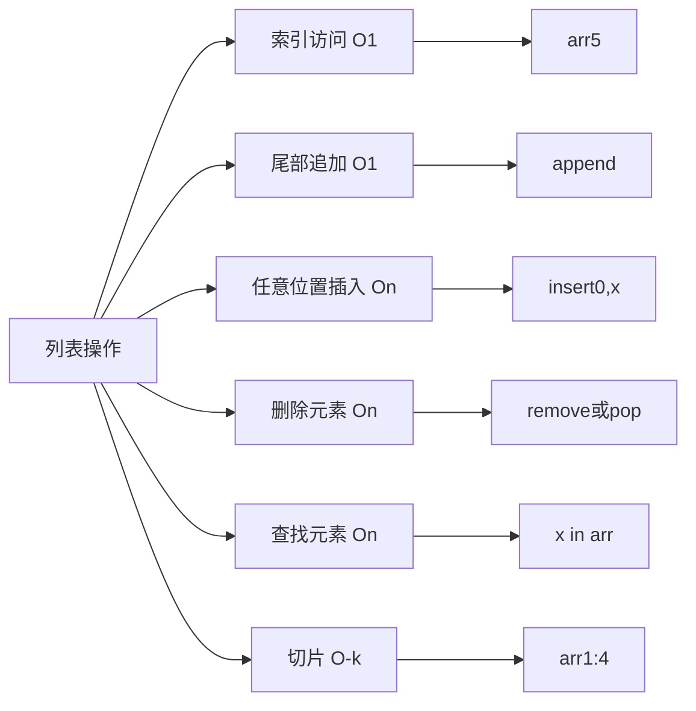

# Day 04：循环与列表

> 🎯 **学习目标**：精通 for 循环与列表操作，理解序列概念，掌握列表推导式


## 1. 作业讲解

回顾 Day 03 的猜数字游戏，常见问题和优化：

```python
# 问题 1：忘记类型转换
# guess = input("猜数字：")  # ❌ guess 是 str，不能和 int 比较
guess = int(input("猜数字："))  # ✅ 先转换

# 问题 2：空输入没处理
user_input = input("猜数字（输入 q 退出）：")
if user_input.lower() == "q":
    break
guess = int(user_input)

# 优化：使用 try-except 处理非法输入（预习 Day 10）
try:
    guess = int(input("猜数字："))
except ValueError:
    print("请输入有效数字！")
    continue
```


## 2. for 循环

### 2.1 基本语法

```python
# for 循环：遍历可迭代对象中的每一个元素
for item in [1, 2, 3, 4, 5]:
    print(item)
# 输出：1 2 3 4 5（每个一行）

# 遍历字符串（每个字符）
for ch in "Python":
    print(ch)
# 输出：P y t h o n

# 遍历字典（默认遍历 key）
d = {"name": "张三", "age": 20}
for key in d:
    print(key, d[key])
```

### 2.2 for 的底层原理

```python
# for 循环本质上是在调用迭代器
# for item in obj 等价于：
iterator = iter(obj)     # 获取迭代器
while True:
    try:
        item = next(iterator)  # 获取下一个元素
        # 执行循环体
    except StopIteration:
        break            # 没有更多元素，退出
```

## 3. range 函数

range 是 for 循环的最佳搭档：

```python
# range(stop)：从 0 到 stop-1
for i in range(5):
    print(i, end=" ")     # 0 1 2 3 4

# range(start, stop)：从 start 到 stop-1
for i in range(2, 6):
    print(i, end=" ")     # 2 3 4 5

# range(start, stop, step)：步长为 step
for i in range(0, 10, 2):
    print(i, end=" ")     # 0 2 4 6 8

# 负数步长：倒序
for i in range(10, 0, -1):
    print(i, end=" ")     # 10 9 8 7 6 5 4 3 2 1

# range 是惰性的（不会一次性生成所有数）
r = range(1000000000)
print(r[999999999])       # 可以直接按索引取，不占内存
```

> [!tip] range 不是列表
> `range(5)` 返回的是一个 range 对象，它只在需要时生成数字，内存占用极小。

## 4. 循环嵌套

### 4.1 基本嵌套

```python
# 九九乘法表
for i in range(1, 10):
    for j in range(1, i + 1):
        print(f"{j}×{i}={i*j}", end="\t")
    print()  # 换行
```

**输出：**
```text
1×1=1
1×2=2  2×2=4
1×3=3  2×3=6  3×3=9
...
```

### 4.2 嵌套循环的执行过程

```python
# 外层循环每执行 1 次，内层循环执行完整的 N 次
for i in range(3):          # 外循环 3 次
    for j in range(2):      # 内循环 2 次
        print(f"({i},{j})", end=" ")
    print()
# 输出：
# (0,0) (0,1)
# (1,0) (1,1)
# (2,0) (2,1)
# 总执行次数：3 × 2 = 6
```

## 5. continue、break、pass、else

### 5.1 break—终止循环

```python
# break 立即退出整个循环
for i in range(10):
    if i == 5:
        break          # 到 5 就停止
    print(i)
# 输出：0 1 2 3 4
```

### 5.2 continue—跳过本次

```python
# continue 跳过当前迭代，继续下一次
for i in range(5):
    if i == 2:
        continue       # 跳过 i=2 的情况
    print(i)
# 输出：0 1 3 4
```

### 5.3 pass—占位符

```python
# pass 什么都不做，用于占位
def not_implemented_yet():
    pass               # 以后再来实现

if condition:
    pass               # 暂时还没想好写什么

# 没有 pass 会语法错误：
# if True:
#                       # ❌ 缩进块不能为空！
```

### 5.4 for-else

```python
# else 在循环没有被 break 中断时执行
# 经典用法：查找元素
items = [1, 3, 5, 7, 9]
target = 4
for item in items:
    if item == target:
        print("找到了！")
        break
else:
    print(f"{target} 不在列表中")   # ← 找不到时执行

# 如果找到（break），else 不执行
# 如果找不到（正常结束），else 执行
```

## 6. 序列介绍

列表（List）是 Python 中最重要的数据结构之一，属于**序列**类型。

### 序列的共同特性

```python
# 所有序列类型（str、list、tuple）都支持：
# 1. 索引访问
s = "Python"
print(s[0])       # 'P'
print(s[-1])      # 'n'（负数索引从末尾开始）

# 2. 切片（见下一节）

# 3. 长度
print(len(s))     # 6

# 4. 成员检查
print("th" in s)  # True
```

## 7. 列表的创建与切片

### 7.1 创建列表

```python
# 多种创建方式
empty = []                      # 空列表
nums = [1, 2, 3, 4, 5]        # 整数列表
mixed = [1, "hello", 3.14, True]  # 混合类型（Python 允许但不推荐）
nested = [[1, 2], [3, 4]]     # 嵌套列表

# 用 list() 构造
chars = list("Python")         # ['P', 'y', 't', 'h', 'o', 'n']
range_list = list(range(5))   # [0, 1, 2, 3, 4]

# 列表乘法（重复）
zeros = [0] * 5                # [0, 0, 0, 0, 0]

# ⚠️ 乘法陷阱：嵌套列表是浅拷贝！
matrix = [[0] * 3] * 3
matrix[0][0] = 99
print(matrix)  # [[99, 0, 0], [99, 0, 0], [99, 0, 0]]
# 三行都变了！因为它们引用的是同一个子列表
```

### 7.2 索引与切片

```python
nums = [10, 20, 30, 40, 50, 60, 70, 80]

# 正向索引：从 0 开始
print(nums[0])     # 10
print(nums[3])     # 40

# 负向索引：从 -1 开始（最后一个）
print(nums[-1])    # 80
print(nums[-3])    # 60

# 切片语法：list[start:stop:step]
# start 默认 0，stop 默认末尾，step 默认 1
print(nums[0:3])    # [10, 20, 30]（索引 0,1,2）
print(nums[:3])     # [10, 20, 30]（同上，start 默认 0）
print(nums[3:])     # [40, 50, 60, 70, 80]（从索引 3 到末尾）
print(nums[::2])    # [10, 30, 50, 70]（步长 2，隔一个取一个）
print(nums[::-1])   # [80, 70, 60, 50, 40, 30, 20, 10]（倒序！）

# 切片不会越界
print(nums[2:100])  # [30, 40, 50, 60, 70, 80]（自动截断）
```

> [!tip] 切片口诀
> **"包左不包右"**：`[start:stop]` 包含 start 位置的元素，不包含 stop 位置的元素。
> 元素个数 = stop - start

## 8. 列表常用方法

### 8.1 增加元素

```python
fruits = ["苹果", "香蕉"]

# append：在末尾添加一个元素
fruits.append("橘子")        # ['苹果', '香蕉', '橘子']

# insert：在指定位置插入
fruits.insert(1, "葡萄")     # ['苹果', '葡萄', '香蕉', '橘子']

# extend：在末尾添加另一个列表的所有元素
fruits.extend(["西瓜", "草莓"])  # ['苹果', '葡萄', '香蕉', '橘子', '西瓜', '草莓']

# append vs extend
fruits.append(["芒果", "榴莲"])   # 把整个列表当一个元素加进去
# fruits 变成 [..., ['芒果', '榴莲']] ← 嵌套列表
# extend 则会把每个元素拆开加进去
```

### 8.2 删除元素

```python
nums = [1, 2, 3, 4, 5, 3]

# pop()：删除并返回最后一个元素（默认）
last = nums.pop()        # last=5, nums=[1,2,3,4,3]
# pop(index)：删除并返回指定索引的元素
second = nums.pop(1)     # second=2, nums=[1,3,4,3]

# remove(value)：删除第一个匹配的值
nums.remove(3)           # nums=[1,4,3]（只删了第一个 3）
# nums.remove(99)        # ❌ 值不存在时报错！

# del：按索引删除
del nums[1]              # nums=[1,3]

# clear：清空列表
nums.clear()             # nums=[]
```

### 8.3 修改和查找

```python
nums = [10, 20, 30, 20, 40]

# 修改
nums[0] = 100            # [100, 20, 30, 20, 40]

# index(value)：查找第一次出现的索引
print(nums.index(20))    # 1
# nums.index(99)         # ❌ 不存在时报错

# count(value)：统计出现次数
print(nums.count(20))    # 2

# len()：获取长度
print(len(nums))         # 5
```

### 8.4 排序和反转

```python
nums = [3, 1, 4, 1, 5, 9, 2]

# sort()：原地排序（修改原列表）
nums.sort()                   # [1, 1, 2, 3, 4, 5, 9]
nums.sort(reverse=True)       # [9, 5, 4, 3, 2, 1, 1] 降序

# sorted()：返回新排序列表（不修改原列表）
original = [3, 1, 4]
new = sorted(original)        # [1, 3, 4]
print(original)               # [3, 1, 4]（原列表不变）

# reverse()：原地反转
nums.reverse()                # 反转列表

# 自定义排序（按 key 函数）
words = ["apple", "kiwi", "banana", "pear"]
words.sort(key=len)           # 按长度排序：['kiwi', 'pear', 'apple', 'banana']
words.sort(key=lambda w: w[-1]) # 按最后一个字母排序
```

### 8.5 列表遍历

```python
nums = [10, 20, 30, 40, 50]

# 方式 1：直接遍历值
for num in nums:
    print(num)

# 方式 2：遍历索引+值（推荐 enumerate）
for index, value in enumerate(nums):
    print(f"nums[{index}] = {value}")
# 输出：
# nums[0] = 10
# nums[1] = 20
# ...

# enumerate 可以指定起始索引
for index, value in enumerate(nums, start=1):
    print(f"第 {index} 个元素是 {value}")
```

## 9. 列表推导式 ⭐

列表推导式是 Python 最具特色的语法之一，一行搞定"过滤+映射"：

### 9.1 基本推导式

```python
# 任务：生成 0~9 的平方列表
# 传统写法：
squares = []
for i in range(10):
    squares.append(i ** 2)

# 推导式写法：
squares = [i ** 2 for i in range(10)]
# 结果：[0, 1, 4, 9, 16, 25, 36, 49, 64, 81]
```

### 9.2 带过滤条件的推导式

```python
# 任务：0~19 中的所有偶数
evens = [i for i in range(20) if i % 2 == 0]
# 结果：[0, 2, 4, 6, 8, 10, 12, 14, 16, 18]

# 等价于：
evens = []
for i in range(20):
    if i % 2 == 0:
        evens.append(i)
```

### 9.3 带 if-else 的推导式

```python
# 任务：偶数保留，奇数变为 "odd"
result = [i if i % 2 == 0 else "odd" for i in range(6)]
# 结果：[0, 'odd', 2, 'odd', 4, 'odd']

# 注意：if 在 for 后面 = 过滤
#       if-else 在 for 前面 = 映射变换
```

### 9.4 嵌套推导式

```python
# 展开二维列表
matrix = [[1, 2, 3], [4, 5, 6], [7, 8, 9]]
flat = [num for row in matrix for num in row]
# 结果：[1, 2, 3, 4, 5, 6, 7, 8, 9]

# 等价于：
flat = []
for row in matrix:
    for num in row:
        flat.append(num)
```


## 📝 综合练习：成绩统计分析

```python
"""
成绩统计分析系统
"""
# 生成测试数据：20 个随机成绩
import random
scores = [random.randint(40, 100) for _ in range(20)]
print(f"原始成绩：{scores}")

# 1. 排序
sorted_scores = sorted(scores, reverse=True)
print(f"排序后（降序）：{sorted_scores}")

# 2. 统计
total = sum(scores)
average = total / len(scores)
highest = max(scores)
lowest = min(scores)

print(f"\n人数：{len(scores)}")
print(f"总分：{total}")
print(f"平均分：{average:.1f}")
print(f"最高分：{highest}")
print(f"最低分：{lowest}")

# 3. 等级分布（推导式 + 条件）
excellent = [s for s in scores if s >= 90]
good = [s for s in scores if 80 <= s < 90]
medium = [s for s in scores if 70 <= s < 80]
passed = [s for s in scores if 60 <= s < 70]
failed = [s for s in scores if s < 60]

print(f"\n优秀（≥90）：{len(excellent)} 人 → {excellent}")
print(f"良好（80-89）：{len(good)} 人 → {good}")
print(f"中等（70-79）：{len(medium)} 人 → {medium}")
print(f"及格（60-69）：{len(passed)} 人 → {passed}")
print(f"不及格（<60）：{len(failed)} 人 → {failed}")

# 4. 计算及格率
pass_rate = (len(scores) - len(failed)) / len(scores) * 100
print(f"\n及格率：{pass_rate:.1f}%")
```


## 相关链接
- 上一篇：[[03_运算符与流程控制]]
- 下一篇：[[05_容器类型]]
- 项目实践：[[笔记/技术学习/项目开发笔记/ai-resume笔记/01_技术研读/01_架构概览|ai-resume: 架构概览]]

---
## for 循环执行流程图

```mermaid
graph TD
    A[for循环开始] --> B[获取可迭代对象迭代器<br/>iter(obj)]
    B --> C[调用next获取下一个元素<br/>next(iterator)]
    C --> D{是否有元素?}
    D -->|是| E[执行循环体]
    E --> C
    D -->|否| F[捕获StopIteration异常]
    F --> G[循环结束]
    
    style A fill:#e1f5fe
    style F fill:#f3e5f5
    style G fill:#e8f5e8
```

## 列表操作时间复杂度



## 常见坑点

### 1. for 循环中修改列表
```python
arr = [1, 2, 3, 4, 5]
for item in arr:
    if item % 2 == 0:
        arr.remove(item)  # ❌ 删除元素后索引错位
print(arr)  # [1, 3, 5]？实际可能是 [1, 3, 4]
```
- **原理**：删除元素后，后续元素前移，但迭代器索引继续递增
- **解决**：使用列表推导式或倒序遍历
```python
arr = [x for x in arr if x % 2 != 0]  # ✅ 推导式
# 或
for item in reversed(arr):  # ✅ 倒序
    if item % 2 == 0:
        arr.remove(item)
```

### 2. 列表推导式副作用
```python
x = 10
result = [x for x in range(5)]  # [0, 1, 2, 3, 4]
print(x)  # 4 ← 外部x被修改！
```
- **原理**：推导式的循环变量会覆盖外部变量
- **解决**：使用不同变量名或临时变量
```python
result = [i for i in range(5)]  # 用i代替x
```

### 3. range 索引越界
```python
arr = [10, 20, 30]
for i in range(len(arr) + 1):  # ❌ range(4) 但只有3个元素
    print(arr[i])  # IndexError: list index out of range
```
- **正确**：`range(len(arr))` 或直接遍历 `for item in arr`

### 4. 列表复制陷阱
```python
a = [1, 2, 3]
b = a          # ❌ 引用赋值，指向同一对象
b.append(4)
print(a)       # [1, 2, 3, 4] ← a也被修改

c = a.copy()   # ✅ 浅拷贝
d = a[:]       # ✅ 切片拷贝
import copy
e = copy.deepcopy(a)  # ✅ 深拷贝（嵌套列表）
```

### 5. 列表作为默认参数
```python
def add_item(item, lst=[]):  # ❌ 默认参数是列表
    lst.append(item)
    return lst

print(add_item(1))  # [1]
print(add_item(2))  # [1, 2] ← 不是[2]！
```
- **原理**：默认参数在函数定义时创建，后续调用共享同一对象
- **解决**：使用 `None` 作为默认值
```python
def add_item(item, lst=None):
    if lst is None:
        lst = []
    lst.append(item)
    return lst
```

### 6. 列表排序 vs sorted
```python
arr = [3, 1, 4, 1, 5]
arr.sort()      # 原地排序，返回None
print(arr)      # [1, 1, 3, 4, 5]

arr2 = sorted(arr)  # 返回新列表，原列表不变
print(arr2)     # [1, 1, 3, 4, 5]
```
- **选择**：需要保留原列表用 `sorted()`，否则用 `.sort()` 更高效

→ [[技术学习清单#语法核心]]
