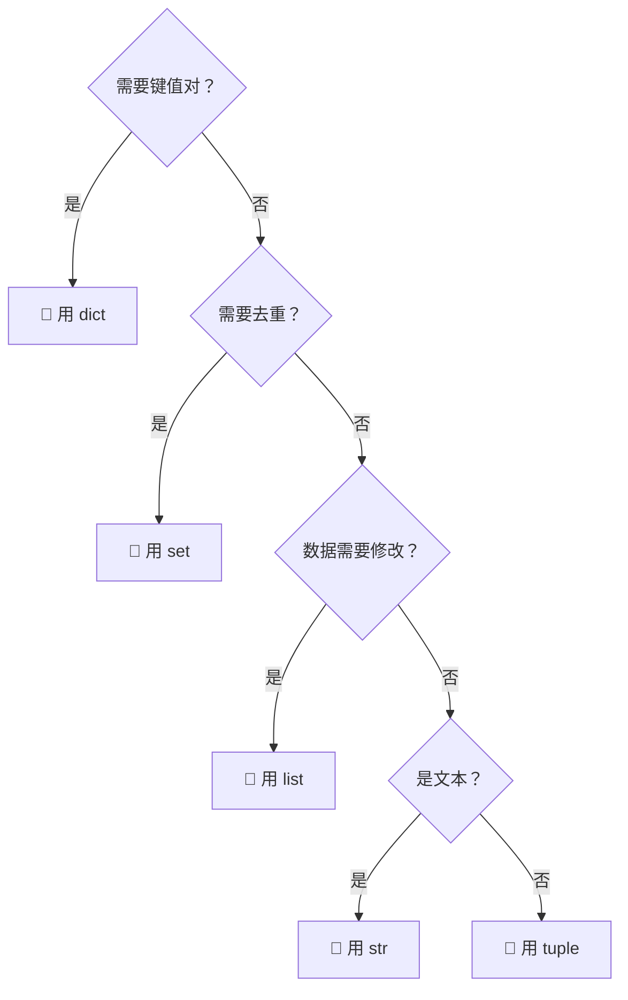

# Day 05：字符串/元组/集合/字典

> 🎯 **学习目标**：掌握 Python 四大容器类型，能根据场景选择正确的数据结构


## 1. 字符串 String

### 1.1 字符串的不可变性

```python
# 字符串是不可变类型——一旦创建，不能修改
s = "Python"
# s[0] = "J"    # ❌ TypeError: 'str' object does not support item assignment

# 任何"修改"操作实际上创建了一个新字符串
s = "J" + s[1:]   # "Jython"——这是创建了新字符串，不是修改原字符串
```

### 1.2 字符串常用方法（全）

```python
s = "  Hello Python World  "

# 大小写转换
s.upper()          # "  HELLO PYTHON WORLD  "
s.lower()          # "  hello python world  "
s.capitalize()     # "  hello python world  "→"  hello python world  "
s.title()          # "  Hello Python World  "（每个单词首字母大写）
s.swapcase()       # "  hELLO pYTHON wORLD  "（大小写反转）

# 去除空白
s.strip()          # "Hello Python World"（两端去空白）
s.lstrip()         # 去左侧空白
s.rstrip()         # 去右侧空白

# 分割与拼接
s.split()          # ['Hello', 'Python', 'World']（默认按空白分割）
s.split(",")       # 按逗号分割
",".join(["a","b","c"])  # "a,b,c"（用逗号拼接列表）
# ⚠️ join 是字符串方法，不是列表方法！

# 查找
s.find("Python")    # 8（返回索引，找不到返回 -1）
s.index("Python")   # 8（找不到抛出 ValueError）
s.rfind("o")        # 从右边找
s.count("o")        # 统计出现次数

# 判断
s.startswith("He")   # False（因为开头有空格）
s.strip().startswith("H")  # True
s.endswith("ld ")
"123".isdigit()      # True（是否全数字）
"abc".isalpha()      # True（是否全字母）
"abc123".isalnum()   # True（是否全字母或数字）
"  ".isspace()       # True（是否全空白）

# 替换
s.replace("Python", "Java")  # "Hello Java World"
s.replace("o", "O", 1)       # 只替换第一个 o

# 格式化
"Hello {}".format("World")
"{name} is {age}".format(name="Tom", age=20)
f"{name} is {age}"           # 推荐！
```

### 1.3 字符串切片与遍历

```python
s = "Python"

# 切片
s[0:3]       # "Pyt"
s[::2]       # "Pto"
s[::-1]      # "nohtyP"（反转）

# 遍历每个字符
for ch in s:
    print(ch)

# 遍历索引+字符
for i, ch in enumerate(s):
    print(f"s[{i}] = {ch}")
```


## 2. 元组 Tuple

### 2.1 创建与基本操作

```python
# 创建
t1 = (1, 2, 3)
t2 = 1, 2, 3           # 括号可以省略（但不推荐）
t3 = (1,)              # ⚠️ 单元素元组必须加逗号！
not_tuple = (1)        # 这不是元组，是整数 1！

empty = tuple()        # 空元组

# 访问（和列表一样）
print(t1[0])           # 1
print(t1[-1])          # 3
print(t1[0:2])         # (1, 2)

# 不可变！
# t1[0] = 100          # ❌ TypeError

# 但元组内部的可变对象可以修改
t4 = ([1, 2], 3)
t4[0].append(3)        # 可以！因为改的是元组内的列表，不是元组本身
print(t4)              # ([1, 2, 3], 3)
```

### 2.2 元组的解包 ⭐

```python
# 基本解包
a, b, c = (1, 2, 3)     # a=1, b=2, c=3

# 函数返回多值（实际返回元组）
def min_max(nums):
    return min(nums), max(nums)    # 返回元组

lo, hi = min_max([3, 1, 4, 1, 5])  # lo=1, hi=5

# 星号解包（Python 3+）
first, *middle, last = (1, 2, 3, 4, 5)
print(first)   # 1
print(middle)  # [2, 3, 4]（注意：中间部分变成列表！）
print(last)    # 5

# 交换变量（本质是元组解包）
a, b = b, a
```

### 2.3 元组的应用场景

| 场景 | 为什么用元组 |
|------|-------------|
| 函数返回多个值 | 简洁、不可变 |
| 字典的 key | 元组可哈希，列表不可 |
| 不希望被修改的数据 | 不可变保证安全 |
| 配置常量 | 防止意外修改 |


## 3. 集合 Set

### 3.1 Set 的特点

- **无序**：元素没有固定顺序
- **不重复**：自动去重
- **可变**：可以增删元素
- **只能存可哈希对象**：不能存列表、字典

```python
# 创建
s = {1, 2, 3, 3, 2, 1}   # 自动去重
print(s)                   # {1, 2, 3}

empty = set()              # 空集合（⚠️ {} 是空字典！）
```

### 3.2 增删查

```python
s = {1, 2, 3}

# 增
s.add(4)                   # {1, 2, 3, 4}
s.update([5, 6])           # {1, 2, 3, 4, 5, 6}

# 删
s.remove(3)                # 删除，不存在报错
s.discard(99)              # 删除，不存在不报错
s.pop()                    # 随机删除一个（因为无序）
s.clear()                  # 清空
```

### 3.3 集合运算 ⭐

```python
a = {1, 2, 3, 4}
b = {3, 4, 5, 6}

# 交集：两个集合都有的元素
print(a & b)               # {3, 4}
print(a.intersection(b))   # 同上

# 并集：两个集合的所有元素（去重）
print(a | b)               # {1, 2, 3, 4, 5, 6}
print(a.union(b))          # 同上

# 差集：在 a 但不在 b 中
print(a - b)               # {1, 2}
print(a.difference(b))     # 同上

# 对称差集：只在其中一个集合中的元素
print(a ^ b)               # {1, 2, 5, 6}

# 子集和超集
{1, 2}.issubset({1, 2, 3})       # True
{1, 2, 3}.issuperset({1, 2})     # True
{1, 2}.isdisjoint({3, 4})        # True（没有公共元素）
```

### 3.4 Set 的应用

```python
# 去重
nums = [1, 2, 2, 3, 3, 3, 4]
unique = list(set(nums))          # [1, 2, 3, 4]

# 找公共元素
students_python = {"张三", "李四", "王五"}
students_java = {"李四", "王五", "赵六"}
both = students_python & students_java   # {"李四", "王五"}
```


## 4. 字典 Dict

### 4.1 特点

- **键值对**存储
- **Key 唯一**且必须可哈希
- Python 3.7+ 字典**保持插入顺序**
- 查找速度极快（O(1) 哈希表）

### 4.2 创建与访问

```python
# 创建方式
d1 = {"name": "张三", "age": 20}
d2 = dict(name="李四", age=25)
d3 = dict([("name", "王五"), ("age", 30)])

# 推导式创建
squares = {x: x**2 for x in range(5)}
# {0: 0, 1: 1, 2: 4, 3: 9, 4: 16}

# 访问
print(d1["name"])              # "张三"
# print(d1["phone"])           # ❌ KeyError
print(d1.get("phone"))         # None（安全访问，不存在返回 None）
print(d1.get("phone", "无"))   # "无"（自定义默认值）
```

### 4.3 增改删

```python
d = {"name": "张三", "age": 20}

# 增/改
d["age"] = 21                  # 修改已存在的 key
d["score"] = 95                # 添加新 key
d.update({"city": "北京", "age": 22})  # 批量更新

# 删
d.pop("score")                 # 删除并返回值
d.pop("phone", "不存在")       # 安全删除
del d["age"]                   # 直接删除
d.popitem()                    # 删除最后插入的一项（Python 3.7+）
d.clear()
```

### 4.4 遍历

```python
d = {"name": "张三", "age": 20, "city": "北京"}

# 遍历 key（默认）
for key in d:
    print(key, d[key])

# 遍历 value
for value in d.values():
    print(value)

# 遍历 key + value（最常用）
for key, value in d.items():
    print(f"{key}: {value}")

# 同时获取索引
for i, (key, value) in enumerate(d.items()):
    print(f"{i}: {key} = {value}")
```

### 4.5 字典常用方法

```python
d = {"name": "张三", "age": 20}

# 获取所有 key / value / 键值对
d.keys()        # dict_keys(['name', 'age'])
d.values()      # dict_values(['张三', 20])
d.items()       # dict_items([('name', '张三'), ('age', 20)])

# 设置默认值
d.setdefault("score", 0)   # 如果 key 不存在则设为 0，返回最终值

# 合并字典
d1 = {"a": 1, "b": 2}
d2 = {"b": 3, "c": 4}
merged = {**d1, **d2}       # {'a': 1, 'b': 3, 'c': 4}（Python 3.5+）
merged2 = d1 | d2            # 同上（Python 3.9+）
```


## 5. 各容器类型总结与选型

| 容器 | 可变 | 有序 | 可重复 | 查找速度 | 典型场景 |
|------|:--:|:--:|:--:|:--:|------|
| **str** | ❌ | ✅ | ✅ | — | 文本处理 |
| **tuple** | ❌ | ✅ | ✅ | O(1) | 不可变序列、函数返回多值 |
| **list** | ✅ | ✅ | ✅ | O(n) | 有序集合、栈/队列 |
| **set** | ✅ | ❌ | ❌ | O(1) | 去重、成员判断、集合运算 |
| **dict** | ✅ | ✅* | key唯一 | O(1) | 键值映射、计数、缓存 |

> \* Python 3.7+ 保持插入顺序

### 选型决策树




## 相关链接
- 上一篇：[[04_循环与列表]]
- 下一篇：[[06_函数基础]]
- 项目实践：[[笔记/技术学习/项目开发笔记/ai-resume笔记/01_技术研读/01_架构概览|ai-resume: 架构概览]]

---
→ [[技术学习清单#语法核心]]
