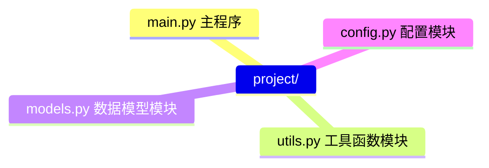
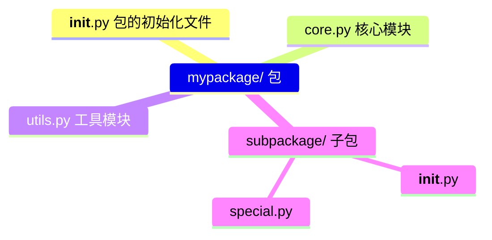
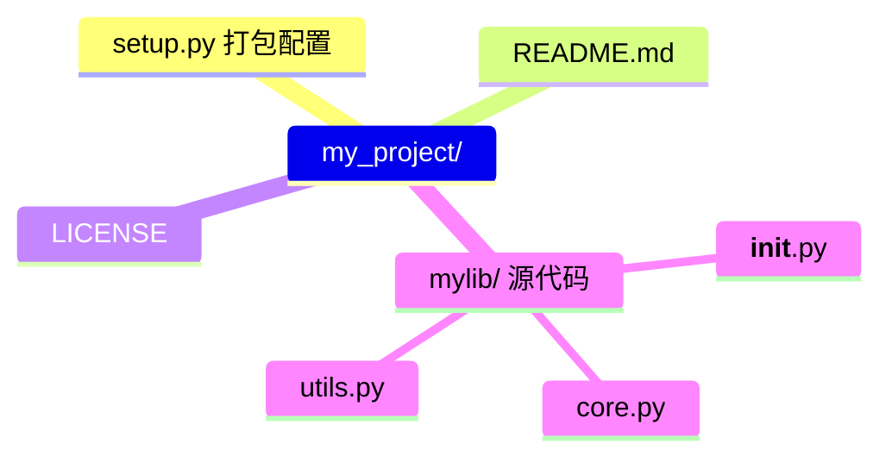

# Day 11：模块与包

> 🎯 **学习目标**：理解模块化编程，掌握导入方式、包管理、第三方库安装与打包


## 1. 模块介绍

### 1.1 什么是模块

模块就是一个 `.py` 文件。将代码按功能拆分到不同模块中，便于维护和复用。



### 1.2 为什么要模块化

```python
# ❌ 全部写在一个文件里
# main.py（5000 行代码，难以维护）

# ✅ 拆分为多个模块
# main.py（核心流程，100 行）
# database.py（数据库操作，200 行）
# api.py（接口处理，300 行）
# utils.py（工具函数，100 行）
```


## 2. 导入方式

### 2.1 四种导入方式

```python
# 方式一：import 模块名
import math
print(math.sqrt(16))    # 4.0
print(math.pi)          # 3.141592653589793

# 方式二：import...as 别名
import numpy as np        # 行业惯例
arr = np.array([1, 2, 3])

import pandas as pd       # 行业惯例
df = pd.DataFrame({"a": [1, 2]})

# 方式三：from...import 部分内容
from math import sqrt, pi, sin, cos
print(sqrt(16))           # 不需要 math. 前缀
print(pi)

# 方式四：from...import *（不推荐！）
from math import *        # 导入所有公开名字，污染命名空间
```

### 2.2 导入路径

```python
import sys
# sys.path 决定了模块的搜索顺序
for path in sys.path:
    print(path)
# 1. 当前脚本所在目录
# 2. PYTHONPATH 环境变量
# 3. Python 标准库目录
# 4. 第三方库目录（site-packages）

# 临时添加搜索路径
import sys
sys.path.append("/path/to/my/modules")
```


## 3. `__all__` 与 `__name__`

### 3.1 `__all__` 控制导出

```python
# my_module.py
__all__ = ["public_func", "PublicClass"]   # 白名单

def public_func():
    """可以被 from module import * 导入"""
    return "公开函数"

def _internal_func():
    """_ 开头表示私有，但只是约定"""
    return "内部函数"

class PublicClass:
    pass

# 使用方
from my_module import *
# public_func ✅   PublicClass ✅
# _internal_func ❌（不在 __all__ 中）
```

### 3.2 `__name__` 判断运行方式

```python
# utils.py
def helper():
    return "工具函数"

print(f"utils.py 的 __name__ = {__name__}")

if __name__ == "__main__":
    # 只有直接运行 python utils.py 时才执行
    # 被 import 时不会执行
    print("模块被直接运行")
    print(helper())
```

| `__name__` 的值 | 场景 |
|----------------|------|
| `"__main__"` | 直接运行 `python xxx.py` |
| `"模块名"` | 被 `import` 导入 |


## 4. 包的创建与导入

包 = 包含 `__init__.py` 的文件夹：



### 4.1 创建包

```python
# mypackage/__init__.py
"""
mypackage - 我的 Python 包
"""

# 可以在 __init__.py 中提前导入常用内容
from .core import CoreClass
from .utils import helper

# 版本信息
__version__ = "1.0.0"
```

### 4.2 导入包

```python
# 导入包内模块
import mypackage.core
from mypackage import utils
from mypackage.subpackage import special

# 如果 __init__.py 中已经导入了 CoreClass
from mypackage import CoreClass   # 直接可用

# 相对导入（在包内部使用）
# 在 mypackage/utils.py 中
from .core import CoreClass        # . 表示当前包
from .. import other_package       # .. 表示上级包
```


## 5. 安装第三方库

### 5.1 pip 基础操作

```bash
# 安装最新版
pip install requests

# 安装指定版本
pip install numpy==1.24.0

# 安装版本范围
pip install "django>=4.0,<5.0"

# 升级
pip install --upgrade requests

# 卸载
pip uninstall requests

# 查看已安装
pip list
pip show numpy          # 查看某个包的详细信息

# 搜索（pip 新版已移除 search 命令）
# 改用在 pypi.org 网站搜索
```

### 5.2 requirements.txt

```bash
# 导出当前环境所有包
pip freeze > requirements.txt

# 根据文件批量安装
pip install -r requirements.txt
```

**requirements.txt 示例：**
```text
numpy==1.24.0
pandas>=2.0.0
requests
scikit-learn~=1.3.0    # ~= 表示兼容版本（1.3.x）
```

### 5.3 虚拟环境 venv

```bash
# 创建虚拟环境
python -m venv myenv

# 激活（Windows）
myenv\Scripts\activate
# 激活（Mac/Linux）
source myenv/bin/activate

# 激活后，pip install 只影响当前环境
pip install requests

# 退出
deactivate
```

> [!important] 为什么需要虚拟环境
> 项目 A 需要 Django 4.0，项目 B 需要 Django 3.2，全局安装会冲突。
> 虚拟环境为每个项目创建**隔离的 Python 环境**，互不影响。


## 6. 打包自己的代码

### 6.1 传统方式（setup.py）



```python
# setup.py
from setuptools import setup, find_packages

setup(
    name="mylib",
    version="0.1.0",
    author="你的名字",
    description="我的 Python 库",
    packages=find_packages(),
    install_requires=[
        "requests>=2.0",
        "numpy>=1.20",
    ],
    python_requires=">=3.8",
)
```

### 6.2 现代方式（pyproject.toml 推荐）

```toml
# pyproject.toml
[build-system]
requires = ["setuptools>=61.0"]
build-backend = "setuptools.backends._legacy:_Backend"

[project]
name = "mylib"
version = "0.1.0"
authors = [{name = "你的名字"}]
description = "我的 Python 库"
requires-python = ">=3.8"
dependencies = [
    "requests>=2.0",
    "numpy>=1.20",
]

[project.optional-dependencies]
dev = ["pytest", "ruff", "black"]
```

### 6.3 发布到 PyPI

```bash
# 安装打包工具
pip install build twine

# 构建
python -m build

# 上传到 PyPI（需要注册账号）
twine upload dist/*
```


## 相关链接
- 上一篇：[[10_异常处理]]
- 下一篇：[[12_迭代器装饰器]]
- 项目实践：[[笔记/技术学习/项目开发笔记/ai-resume笔记/01_技术研读/01_架构概览|ai-resume: 架构概览]]
