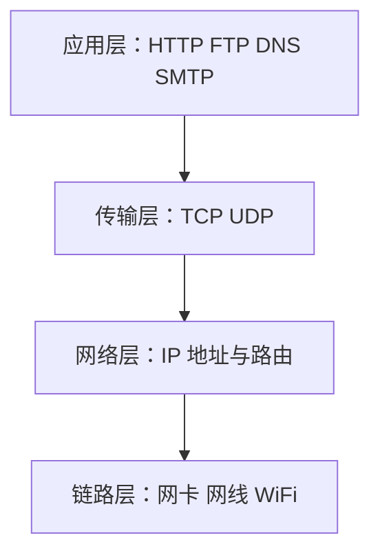

# Day 14：网络编程

> 🎯 **学习目标**：理解网络通信原理，掌握 UDP/TCP/HTTP 编程


## 1. 加锁解决线程安全问题（续 Day 13）

```python
import threading

# 除了 Lock，还有 RLock（可重入锁）
rlock = threading.RLock()

def recursive_function(n):
    with rlock:       # 同一线程可以多次获取 RLock
        if n > 0:
            recursive_function(n - 1)  # 递归时不会死锁

# 死锁演示（两个锁互相等待）
lock_a = threading.Lock()
lock_b = threading.Lock()

def thread1():
    with lock_a:
        time.sleep(0.1)
        with lock_b:    # 等待 lock_b（被 thread2 持有）
            pass

def thread2():
    with lock_b:
        time.sleep(0.1)
        with lock_a:    # 等待 lock_a（被 thread1 持有）
            pass
# thread1 和 thread2 互相等待 → 死锁！
```


## 2. 进程和线程对比

| 维度         | 进程              | 线程        |
| ---------- | --------------- | --------- |
| **资源**     | 独立内存空间          | 共享进程内存    |
| **创建开销**   | 大（复制整个进程）       | 小（共享内存）   |
| **通信**     | IPC（Queue、Pipe） | 共享变量（需加锁） |
| **GIL 影响** | 无（各自有独立 GIL）    | IO 型不受影响  |
| **适用场景**   | CPU 密集型         | IO 密集型    |
| **稳定性**    | 一个崩了不影响其他       | 一个崩了全崩    |


## 3. 网络相关概念

### 3.1 IP 与端口

```python
# IP 地址：网络中定位一台计算机
# 127.0.0.1（localhost）— 始终指向本机

# 端口：一台计算机上不同程序的标识（0~65535）
# 0-1023：系统保留（HTTP=80, HTTPS=443, SSH=22）
# 1024-49151：注册端口
# 49152-65535：动态/私有端口
```

### 3.2 协议



### 3.3 TCP vs UDP

| 特性 | TCP | UDP |
|------|-----|-----|
| **连接** | 需要建立连接（三次握手） | 无连接 |
| **可靠性** | 可靠，有确认重传机制 | 不可靠，可能丢包 |
| **顺序** | 保证有序 | 不保证 |
| **速度** | 相对慢 | 快 |
| **适用** | 网页、文件、邮件 | 视频、直播、游戏 |
| **类比** | 打电话（确认对方收到） | 寄信（不知道是否收到） |


## 4. UDP 通信

### 4.1 服务端

```python
import socket

# 创建 UDP socket
udp_server = socket.socket(socket.AF_INET, socket.SOCK_DGRAM)
udp_server.bind(("127.0.0.1", 8888))

print("UDP 服务器启动，等待消息...")
while True:
    data, addr = udp_server.recvfrom(1024)  # 接收（阻塞）
    text = data.decode("utf-8")
    print(f"收到来自 {addr} 的消息：{text}")

    if text == "quit":
        break

    # 回复
    reply = f"收到：{text}"
    udp_server.sendto(reply.encode("utf-8"), addr)

udp_server.close()
```

### 4.2 客户端

```python
import socket

# 创建 UDP socket
udp_client = socket.socket(socket.AF_INET, socket.SOCK_DGRAM)

while True:
    msg = input("输入消息（quit 退出）：")
    udp_client.sendto(msg.encode("utf-8"), ("127.0.0.1", 8888))

    if msg == "quit":
        break

    data, addr = udp_client.recvfrom(1024)
    print(f"服务器回复：{data.decode('utf-8')}")

udp_client.close()
```


## 5. TCP 通信

### 5.1 服务端

```python
import socket

tcp_server = socket.socket(socket.AF_INET, socket.SOCK_STREAM)
tcp_server.setsockopt(socket.SOL_SOCKET, socket.SO_REUSEADDR, 1)  # 端口复用
tcp_server.bind(("127.0.0.1", 9999))
tcp_server.listen(5)    # 最大等待连接数
print("TCP 服务器启动，等待连接...")

while True:
    client_socket, client_addr = tcp_server.accept()
    print(f"客户端 {client_addr} 已连接")

    # 接收数据
    data = client_socket.recv(1024)
    print(f"收到：{data.decode('utf-8')}")

    # 回复
    client_socket.send(f"服务器收到：{data.decode('utf-8')}".encode("utf-8"))

    client_socket.close()

tcp_server.close()
```

### 5.2 客户端

```python
import socket

tcp_client = socket.socket(socket.AF_INET, socket.SOCK_STREAM)
tcp_client.connect(("127.0.0.1", 9999))

tcp_client.send("Hello TCP！".encode("utf-8"))
response = tcp_client.recv(1024)
print(f"服务器回复：{response.decode('utf-8')}")

tcp_client.close()
```

### 5.3 多线程 TCP 服务端（优化）

```python
import socket
import threading

def handle_client(client_socket, client_addr):
    """处理单个客户端（运行在线程中）"""
    print(f"新连接：{client_addr}")
    try:
        while True:
            data = client_socket.recv(1024)
            if not data:
                break
            print(f"{client_addr}：{data.decode('utf-8')}")
            client_socket.send(f"Echo：{data.decode('utf-8')}".encode())
    except ConnectionResetError:
        print(f"{client_addr} 断开连接")
    finally:
        client_socket.close()

# 主循环
tcp_server = socket.socket(socket.AF_INET, socket.SOCK_STREAM)
tcp_server.setsockopt(socket.SOL_SOCKET, socket.SO_REUSEADDR, 1)
tcp_server.bind(("127.0.0.1", 9999))
tcp_server.listen(10)
print("多线程 TCP 服务器启动...")

while True:
    client, addr = tcp_server.accept()
    thread = threading.Thread(target=handle_client, args=(client, addr), daemon=True)
    thread.start()
```


## 6. HTTP 请求

### 6.1 requests 库

```python
import requests

# GET 请求
resp = requests.get("https://api.github.com")
print(f"状态码：{resp.status_code}")
print(f"Content-Type：{resp.headers['Content-Type']}")
data = resp.json()

# POST 请求
resp = requests.post(
    "https://httpbin.org/post",
    json={"name": "张三", "age": 20},
    headers={"X-Custom": "value"}
)
print(resp.json())

# 带参数的 GET
resp = requests.get(
    "https://api.example.com/search",
    params={"q": "python", "page": 1}
)

# 超时和异常处理
try:
    resp = requests.get("https://api.example.com", timeout=5)
    resp.raise_for_status()  # 非 200 状态码抛出异常
except requests.Timeout:
    print("请求超时")
except requests.HTTPError as e:
    print(f"HTTP 错误：{e}")
except requests.ConnectionError:
    print("连接失败")
```

### 6.2 一言网案例

```python
import requests

# 获取随机句子
def get_hitokoto():
    """从一言网获取一句随机名言"""
    try:
        resp = requests.get("https://v1.hitokoto.cn/", timeout=5)
        data = resp.json()
        return f"{data['hitokoto']}\n—— {data['from']}"
    except Exception as e:
        return f"获取失败：{e}"

print(get_hitokoto())
```


## 7. starlette 部署 Web 服务

```python
from starlette.applications import Starlette
from starlette.responses import JSONResponse, PlainTextResponse
from starlette.routing import Route
import uvicorn

# 路由处理函数
async def hello(request):
    return JSONResponse({"message": "Hello World!"})

async def greet(request):
    name = request.path_params.get("name", "World")
    return PlainTextResponse(f"Hello, {name}!")

# 创建应用
app = Starlette(debug=True, routes=[
    Route("/", hello),
    Route("/greet/{name}", greet),
])

# 启动：uvicorn app:app --reload
if __name__ == "__main__":
    uvicorn.run(app, host="127.0.0.1", port=8000)
```

> [!tip] 后续学习
> 在大模型项目中，你会使用 FastAPI（基于 starlette）构建 API，用 asyncio 实现异步高并发。


## 相关链接
- 上一篇：[[13_多进程多线程]]
- 下一篇：[[15_正则与项目]]
- 项目实践：[[笔记/技术学习/项目开发笔记/ai-resume笔记/01_技术研读/01_架构概览|ai-resume: 架构概览]]

---
→ [[技术学习清单#进阶特性]]
