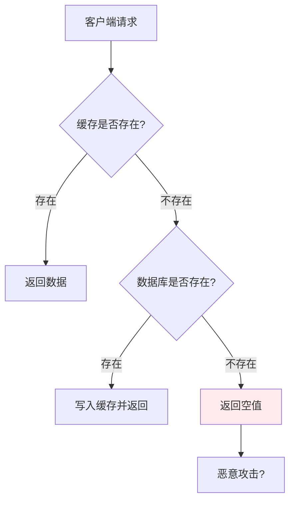
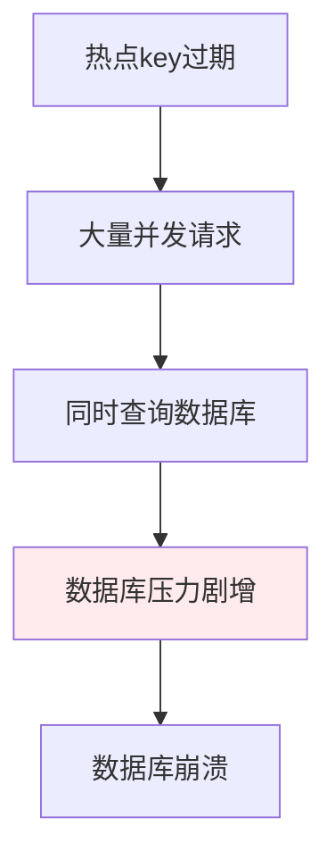
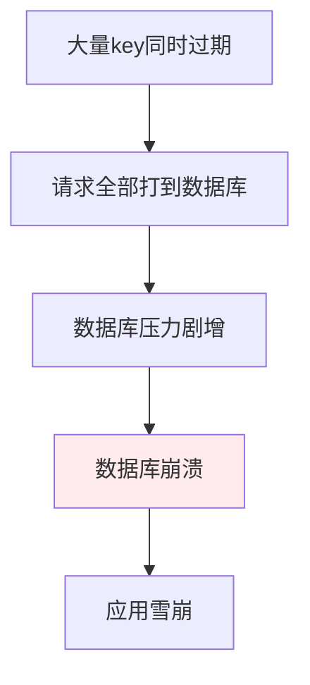

# 缓存穿透/击穿/雪崩 + 解决方案

> **一句话**：缓存穿透、击穿、雪崩是Redis缓存的三种常见问题，分别对应不同的场景和解决方案。

## 1. 缓存穿透

### 1.1 什么是缓存穿透？



**缓存穿透**：查询一个一定不存在的数据，由于缓存不命中，每次都要去数据库查询，但数据库也没有这条数据，所以也不会写入缓存。这导致每次请求都打到数据库。

**常见场景**：
1. 恶意攻击：故意查询不存在的数据
2. 业务Bug：查询错误的数据ID
3. 数据未初始化：新数据还没写入数据库

### 1.2 解决方案

#### 方案1：缓存空值

```python
import redis
import json

r = redis.Redis()

def get_user(user_id):
    # 1. 查询缓存
    cache_key = f"user:{user_id}"
    cached = r.get(cache_key)
    
    if cached is not None:
        # 缓存命中
        if cached == "NULL":
            return None  # 缓存的空值
        return json.loads(cached)
    
    # 2. 查询数据库
    user = db.query_user(user_id)
    
    if user is None:
        # 数据不存在，缓存空值（短时间）
        r.setex(cache_key, 60, "NULL")  # 缓存60秒
        return None
    
    # 3. 写入缓存
    r.setex(cache_key, 3600, json.dumps(user))
    return user
```

**优点**：简单直接
**缺点**：占用内存，可能短期数据不一致

#### 方案2：布隆过滤器

```python
from pybloom_live import BloomFilter

# 创建布隆过滤器
bf = BloomFilter(capacity=1000000, error_rate=0.001)

# 初始化时添加所有有效的user_id
for user_id in db.get_all_user_ids():
    bf.add(user_id)

def get_user_with_bloom(user_id):
    # 1. 先检查布隆过滤器
    if user_id not in bf:
        return None  # 一定不存在
    
    # 2. 查询缓存
    cache_key = f"user:{user_id}"
    cached = r.get(cache_key)
    
    if cached:
        return json.loads(cached)
    
    # 3. 查询数据库
    user = db.query_user(user_id)
    
    if user:
        r.setex(cache_key, 3600, json.dumps(user))
    
    return user
```

**优点**：内存占用小，效率高
**缺点**：有误判率，删除困难

## 2. 缓存击穿

### 2.1 什么是缓存击穿？



**缓存击穿**：某个热点key在某个时间点过期，恰好在这个时间点有大量并发请求访问这个key，这些请求都打到数据库。

**常见场景**：
1. 热点数据过期：如秒杀商品、热门新闻
2. 突发流量：如明星微博、热点事件

### 2.2 解决方案

#### 方案1：互斥锁

```python
import redis
import json
import threading

r = redis.Redis()
lock = threading.Lock()

def get_hot_data(key):
    # 1. 查询缓存
    cached = r.get(key)
    if cached:
        return json.loads(cached)
    
    # 2. 获取锁
    if lock.acquire(blocking=False):
        try:
            # 再次检查缓存（双重检查）
            cached = r.get(key)
            if cached:
                return json.loads(cached)
            
            # 3. 查询数据库
            data = db.query_hot_data(key)
            
            # 4. 写入缓存
            r.setex(key, 3600, json.dumps(data))
            
            return data
        finally:
            lock.release()
    else:
        # 未获取到锁，等待后重试
        import time
        time.sleep(0.1)
        return get_hot_data(key)
```

**优点**：保证数据一致性
**缺点**：性能下降，可能死锁

#### 方案2：逻辑过期

```python
import redis
import json

r = redis.Redis()

def get_hot_data_with_logical_expire(key):
    # 1. 查询缓存
    cached = r.get(key)
    if not cached:
        return None
    
    data = json.loads(cached)
    
    # 2. 检查逻辑过期时间
    if data.get("expire_time", 0) < time.time():
        # 已过期，异步更新
        if r.set(f"lock:{key}", "1", nx=True, ex=10):
            # 获取锁，异步更新
            threading.Thread(
                target=update_hot_data,
                args=(key,)
            ).start()
    
    # 3. 返回数据（可能是旧数据）
    return data.get("value")

def update_hot_data(key):
    try:
        # 查询数据库
        data = db.query_hot_data(key)
        
        # 写入缓存（带逻辑过期时间）
        cache_data = {
            "value": data,
            "expire_time": time.time() + 3600
        }
        r.setex(key, 7200, json.dumps(cache_data))
    finally:
        r.delete(f"lock:{key}")
```

**优点**：用户体验好，不阻塞
**缺点**：可能返回旧数据

## 3. 缓存雪崩

### 3.1 什么是缓存雪崩？



**缓存雪崩**：大量key在同一时间过期，或者Redis服务宕机，导致大量请求打到数据库。

**常见场景**：
1. 批量设置相同过期时间
2. Redis服务宕机
3. 流量突增

### 3.2 解决方案

#### 方案1：随机过期时间

```python
import random

def set_with_random_expire(key, value, base_expire=3600):
    # 随机过期时间（±10%）
    expire = base_expire + random.randint(-360, 360)
    r.setex(key, expire, json.dumps(value))
```

**优点**：避免同时过期
**缺点**：仍有可能集中过期

#### 方案2：多级缓存

```python
import redis
import memcache

# 本地缓存
local_cache = {}

# 分布式缓存
r = redis.Redis()

# 数据库
db = Database()

def get_data(key):
    # 1. 查询本地缓存
    if key in local_cache:
        return local_cache[key]
    
    # 2. 查询Redis
    cached = r.get(key)
    if cached:
        data = json.loads(cached)
        local_cache[key] = data
        return data
    
    # 3. 查询数据库
    data = db.query(key)
    
    # 4. 写入缓存
    r.setex(key, 3600, json.dumps(data))
    local_cache[key] = data
    
    return data
```

**优点**：减少Redis压力
**缺点**：实现复杂，数据一致性问题

#### 方案3：熔断降级

```python
import redis
import json
from circuitbreaker import circuit

r = redis.Redis()

@circuit(failure_threshold=5, recovery_timeout=60)
def get_data_with_circuit(key):
    # 1. 查询缓存
    cached = r.get(key)
    if cached:
        return json.loads(cached)
    
    # 2. 查询数据库
    data = db.query(key)
    
    # 3. 写入缓存
    r.setex(key, 3600, json.dumps(data))
    
    return data

def get_data_safe(key):
    try:
        return get_data_with_circuit(key)
    except Exception:
        # 熔断，返回降级数据
        return get_fallback_data(key)
```

**优点**：保护数据库
**缺点**：用户体验下降

## 4. 对比总结

| 问题 | 场景 | 原因 | 解决方案 |
|------|------|------|----------|
| 缓存穿透 | 查询不存在的数据 | 缓存和数据库都没有 | 缓存空值、布隆过滤器 |
| 缓存击穿 | 热点key过期 | 大量并发请求 | 互斥锁、逻辑过期 |
| 缓存雪崩 | 大量key同时过期 | 缓存集体失效 | 随机过期、多级缓存、熔断降级 |

## 核心要点

```python
# 缓存穿透：查询不存在的数据
# 解决方案：缓存空值、布隆过滤器

# 缓存击穿：热点key过期
# 解决方案：互斥锁、逻辑过期

# 缓存雪崩：大量key同时过期
# 解决方案：随机过期、多级缓存、熔断降级
```

## 相关链接

- 📋 目录：[[00-Redis]]
- 📚 学习清单：[[技术学习清单#Redis 缓存]]
- 🔗 [[01-Redis数据结构与缓存|Redis数据结构与缓存]]
- 项目实践：[[笔记/技术学习/项目开发笔记/ai-resume笔记/01_技术研读/01_架构概览|ai-resume: 架构概览]]
