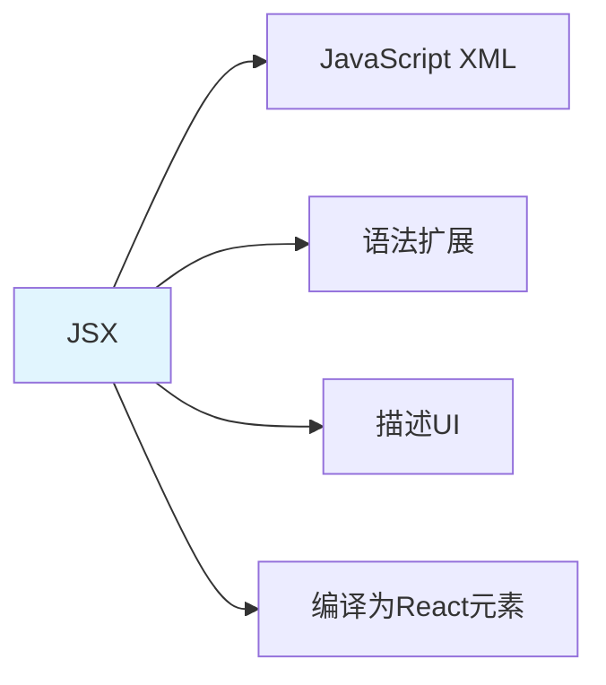

# JSX + 函数组件 + Props

> **一句话**：JSX是JavaScript的语法扩展，用于描述UI结构。函数组件是使用函数定义的React组件，Props是组件接收的参数。

## 1. JSX基础

### 1.1 什么是JSX？



**JSX**：JavaScript的语法扩展，允许在JavaScript中编写类似HTML的代码。

### 1.2 JSX语法

```jsx
// JSX表达式
const element = <h1>Hello, world!</h1>;

// 嵌入表达式
const name = "Alice";
const element = <h1>Hello, {name}!</h1>;

// 条件渲染
const isLoggedIn = true;
const element = (
    <div>
        {isLoggedIn ? <h1>Welcome!</h1> : <h1>Please log in.</h1>}
    </div>
);

// 列表渲染
const numbers = [1, 2, 3, 4, 5];
const listItems = numbers.map((number) =>
    <li key={number.toString()}>{number}</li>
);
```

## 2. 函数组件

### 2.1 基础函数组件

```jsx
// 基础函数组件
function Welcome() {
    return <h1>Hello, world!</h1>;
}

// 箭头函数组件
const Welcome = () => {
    return <h1>Hello, world!</h1>;
};
```

### 2.2 带Props的函数组件

```jsx
// 带Props的函数组件
function Welcome(props) {
    return <h1>Hello, {props.name}!</h1>;
}

// 使用
<Welcome name="Alice" />
```

### 2.3 解构Props

```jsx
// 解构Props
function Welcome({ name, age }) {
    return (
        <div>
            <h1>Hello, {name}!</h1>
            <p>Age: {age}</p>
        </div>
    );
}

// 使用
<Welcome name="Alice" age={30} />
```

## 3. Props

### 3.1 Props类型

```jsx
// Props可以是任何类型
function UserCard({ name, age, isActive, hobbies }) {
    return (
        <div>
            <h2>{name}</h2>
            <p>Age: {age}</p>
            <p>Active: {isActive ? "Yes" : "No"}</p>
            <ul>
                {hobbies.map((hobby, index) => (
                    <li key={index}>{hobby}</li>
                ))}
            </ul>
        </div>
    );
}

// 使用
<UserCard
    name="Alice"
    age={30}
    isActive={true}
    hobbies={["reading", "coding"]}
/>
```

### 3.2 默认Props

```jsx
// 默认Props
function Welcome({ name = "World" }) {
    return <h1>Hello, {name}!</h1>;
}

// 使用
<Welcome /> // Hello, World!
<Welcome name="Alice" /> // Hello, Alice!
```

### 3.3 children Props

```jsx
// children Props
function Card({ title, children }) {
    return (
        <div className="card">
            <h2>{title}</h2>
            <div className="card-content">
                {children}
            </div>
        </div>
    );
}

// 使用
<Card title="My Card">
    <p>This is the card content.</p>
    <button>Click me</button>
</Card>
```

## 4. 实际案例

### 4.1 用户卡片组件

```jsx
function UserCard({ user }) {
    return (
        <div className="user-card">
            
            <h3>{user.name}</h3>
            <p>{user.email}</p>
            <p>Joined: {user.joinDate}</p>
        </div>
    );
}

// 使用
<UserCard
    user={{
        name: "Alice",
        email: "alice@example.com",
        avatar: "/avatars/alice.jpg",
        joinDate: "2026-01-01"
    }}
/>
```

### 4.2 列表组件

```jsx
function UserList({ users }) {
    return (
        <div className="user-list">
            {users.map(user => (
                <UserCard key={user.id} user={user} />
            ))}
        </div>
    );
}

// 使用
<UserList users={usersArray} />
```

## 5. 常见坑点

### 1. 忘记key属性
```jsx
// 问题：列表渲染没有key
{items.map(item => <li>{item}</li>)}

// 解决：添加key属性
{items.map(item => <li key={item.id}>{item}</li>)}
```

### 2. Props修改
```jsx
// 问题：尝试修改Props
function Welcome({ name }) {
    name = "Bob"; // 错误：Props是只读的
    return <h1>Hello, {name}!</h1>;
}

// 解决：使用state
function Welcome({ name }) {
    const [displayName, setDisplayName] = useState(name);
    return <h1>Hello, {displayName}!</h1>;
}
```

## 核心要点

```jsx
// JSX
const element = <h1>Hello, {name}!</h1>;

// 函数组件
function Welcome({ name }) {
    return <h1>Hello, {name}!</h1>;
}

// 使用
<Welcome name="Alice" />

// children
<Card title="My Card">
    <p>Content</p>
</Card>
```

## 相关链接

- 📋 目录：[[00-TypeScript-React]]
- 📚 学习清单： React
- 🔗 [[04-useState+useEffect+自定义Hook|React Hooks]]
- 🔗 [[05-React-Router路由系统|React Router]]
- 项目实践：[[笔记/技术学习/项目开发笔记/ai-resume笔记/01_技术研读/01_架构概览|ai-resume: 架构概览]]
