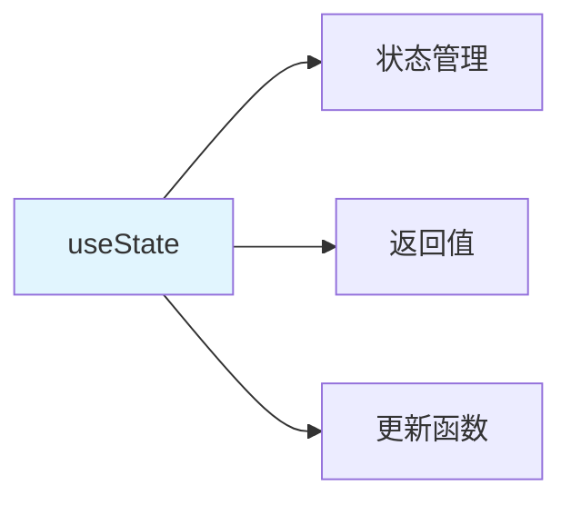
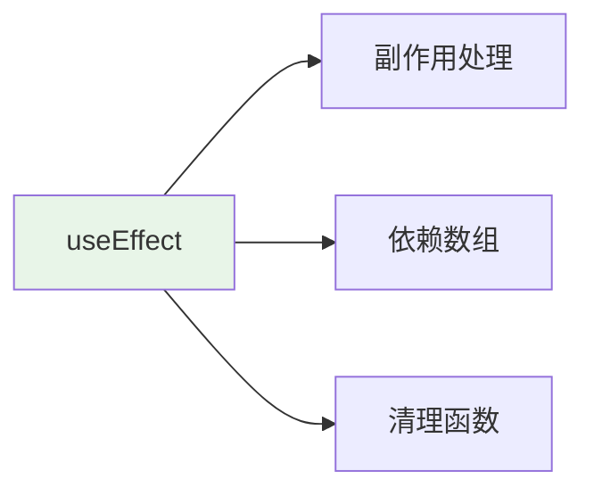
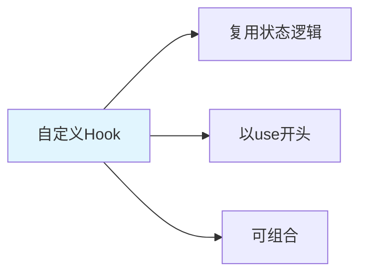

# useState + useEffect + 自定义 Hook

> **一句话**：useState用于管理组件状态，useEffect用于处理副作用，自定义Hook是复用状态逻辑的机制。

## 1. useState

### 1.1 什么是useState？



**useState**：React Hook，用于在函数组件中添加状态。

### 1.2 基础用法

```jsx
import { useState } from 'react';

function Counter() {
    const [count, setCount] = useState(0);
    
    return (
        <div>
            <p>Count: {count}</p>
            <button onClick={() => setCount(count + 1)}>
                Increment
            </button>
        </div>
    );
}
```

### 1.3 函数式更新

```jsx
// 函数式更新
function Counter() {
    const [count, setCount] = useState(0);
    
    // 好：使用函数式更新
    const increment = () => {
        setCount(prev => prev + 1);
    };
    
    // 不好：直接使用当前值
    const incrementBad = () => {
        setCount(count + 1); // 可能有问题
    };
    
    return (
        <div>
            <p>Count: {count}</p>
            <button onClick={increment}>Increment</button>
        </div>
    );
}
```

## 2. useEffect

### 2.1 什么是useEffect？



**useEffect**：React Hook，用于处理组件的副作用（如数据获取、订阅、手动修改DOM等）。

### 2.2 基础用法

```jsx
import { useState, useEffect } from 'react';

function UserProfile({ userId }) {
    const [user, setUser] = useState(null);
    
    useEffect(() => {
        // 数据获取
        fetch(`/api/users/${userId}`)
            .then(response => response.json())
            .then(data => setUser(data));
    }, [userId]); // 依赖数组
    
    if (!user) return <div>Loading...</div>;
    
    return (
        <div>
            <h1>{user.name}</h1>
            <p>{user.email}</p>
        </div>
    );
}
```

### 2.3 清理函数

```jsx
import { useEffect } from 'react';

function Timer() {
    useEffect(() => {
        const interval = setInterval(() => {
            console.log('Timer tick');
        }, 1000);
        
        // 清理函数
        return () => {
            clearInterval(interval);
        };
    }, []); // 空依赖数组
    
    return <div>Timer running...</div>;
}
```

## 3. 自定义Hook

### 3.1 什么是自定义Hook？



**自定义Hook**：以"use"开头的函数，用于复用状态逻辑。

### 3.2 基础示例

```jsx
import { useState, useEffect } from 'react';

// 自定义Hook：获取用户信息
function useUser(userId) {
    const [user, setUser] = useState(null);
    const [loading, setLoading] = useState(true);
    const [error, setError] = useState(null);
    
    useEffect(() => {
        setLoading(true);
        setError(null);
        
        fetch(`/api/users/${userId}`)
            .then(response => {
                if (!response.ok) {
                    throw new Error('Failed to fetch user');
                }
                return response.json();
            })
            .then(data => {
                setUser(data);
                setLoading(false);
            })
            .catch(err => {
                setError(err.message);
                setLoading(false);
            });
    }, [userId]);
    
    return { user, loading, error };
}

// 使用自定义Hook
function UserProfile({ userId }) {
    const { user, loading, error } = useUser(userId);
    
    if (loading) return <div>Loading...</div>;
    if (error) return <div>Error: {error}</div>;
    
    return (
        <div>
            <h1>{user.name}</h1>
            <p>{user.email}</p>
        </div>
    );
}
```

### 3.3 多个自定义Hook组合

```jsx
// 自定义Hook：表单处理
function useForm(initialValues) {
    const [values, setValues] = useState(initialValues);
    
    const handleChange = (e) => {
        const { name, value } = e.target;
        setValues(prev => ({
            ...prev,
            [name]: value
        }));
    };
    
    const reset = () => {
        setValues(initialValues);
    };
    
    return { values, handleChange, reset };
}

// 自定义Hook：提交处理
function useSubmit(onSubmit) {
    const [isSubmitting, setIsSubmitting] = useState(false);
    
    const handleSubmit = async (values) => {
        setIsSubmitting(true);
        try {
            await onSubmit(values);
        } finally {
            setIsSubmitting(false);
        }
    };
    
    return { handleSubmit, isSubmitting };
}

// 组合使用
function LoginForm() {
    const { values, handleChange } = useForm({
        email: '',
        password: ''
    });
    
    const { handleSubmit, isSubmitting } = useSubmit(async (values) => {
        await login(values);
    });
    
    return (
        <form onSubmit={(e) => {
            e.preventDefault();
            handleSubmit(values);
        }}>
            <input
                name="email"
                value={values.email}
                onChange={handleChange}
            />
            <input
                name="password"
                type="password"
                value={values.password}
                onChange={handleChange}
            />
            <button type="submit" disabled={isSubmitting}>
                {isSubmitting ? 'Logging in...' : 'Login'}
            </button>
        </form>
    );
}
```

## 4. 实际案例

### 4.1 数据获取Hook

```jsx
function useFetch(url) {
    const [data, setData] = useState(null);
    const [loading, setLoading] = useState(true);
    const [error, setError] = useState(null);
    
    useEffect(() => {
        const abortController = new AbortController();
        
        setLoading(true);
        setError(null);
        
        fetch(url, { signal: abortController.signal })
            .then(response => {
                if (!response.ok) {
                    throw new Error('Network response was not ok');
                }
                return response.json();
            })
            .then(data => {
                setData(data);
                setLoading(false);
            })
            .catch(err => {
                if (err.name !== 'AbortError') {
                    setError(err.message);
                    setLoading(false);
                }
            });
        
        return () => {
            abortController.abort();
        };
    }, [url]);
    
    return { data, loading, error };
}

// 使用
function UserList() {
    const { data: users, loading, error } = useFetch('/api/users');
    
    if (loading) return <div>Loading...</div>;
    if (error) return <div>Error: {error}</div>;
    
    return (
        <ul>
            {users.map(user => (
                <li key={user.id}>{user.name}</li>
            ))}
        </ul>
    );
}
```

## 5. 常见坑点

### 1. 依赖数组问题
```jsx
// 问题：缺少依赖
useEffect(() => {
    fetchData(userId);
}, []); // 缺少userId

// 解决：添加所有依赖
useEffect(() => {
    fetchData(userId);
}, [userId]);
```

### 2. 无限循环
```jsx
// 问题：useEffect导致无限循环
useEffect(() => {
    setCount(count + 1); // 每次渲染都更新状态
});

// 解决：使用依赖数组
useEffect(() => {
    setCount(prev => prev + 1);
}, [dependency]);
```

## 核心要点

```jsx
// useState
const [count, setCount] = useState(0);

// useEffect
useEffect(() => {
    // 副作用
    return () => {
        // 清理
    };
}, [dependencies]);

// 自定义Hook
function useCustomHook() {
    const [state, setState] = useState(initial);
    // ...
    return { state, setState };
}
```

## 相关链接

- 📋 目录：[[00-TypeScript-React]]
- 📚 学习清单： React
- 🔗 [[03-JSX+函数组件+Props|JSX和组件]]
- 🔗 [[05-React-Router路由系统|React Router]]
- 项目实践：[[笔记/技术学习/项目开发笔记/ai-resume笔记/01_技术研读/01_架构概览|ai-resume: 架构概览]]
