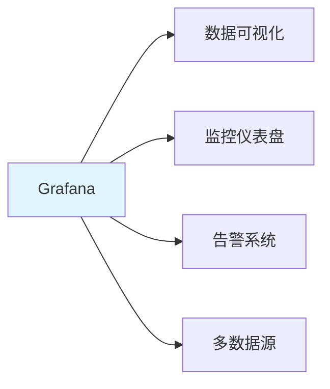
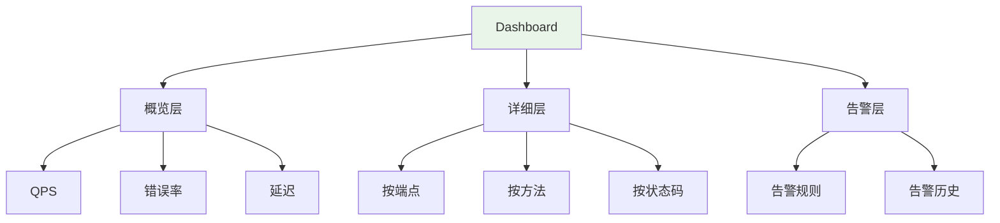

# Grafana Dashboard 预置面板：QPS / 延迟分位 / 错误率 / 告警可视化

> **一句话**：Grafana是一个开源的数据可视化和监控平台，支持多种数据源。预置面板可以快速搭建监控仪表盘，展示QPS、延迟分位、错误率等关键指标。

## 1. Grafana 基础

### 1.1 什么是Grafana？



**Grafana**：开源的数据可视化和监控平台，支持Prometheus、InfluxDB等多种数据源。

### 1.2 核心概念

| 概念 | 说明 |
|------|------|
| Dashboard | 仪表盘，包含多个面板 |
| Panel | 面板，展示单个指标 |
| Data Source | 数据源，如Prometheus |
| Query | 查询，获取指标数据 |
| Alert | 告警规则 |

## 2. 预置面板

### 2.1 QPS面板

```json
{
  "title": "QPS (Queries Per Second)",
  "type": "graph",
  "targets": [
    {
      "expr": "rate(http_requests_total[5m])",
      "legendFormat": "{{method}} {{endpoint}}",
      "refId": "A"
    }
  ],
  "yaxes": [
    {
      "label": "QPS",
      "format": "short"
    }
  ]
}
```

### 2.2 延迟分位面板

```json
{
  "title": "延迟分位数",
  "type": "graph",
  "targets": [
    {
      "expr": "histogram_quantile(0.50, rate(http_request_duration_seconds_bucket[5m]))",
      "legendFormat": "P50",
      "refId": "A"
    },
    {
      "expr": "histogram_quantile(0.90, rate(http_request_duration_seconds_bucket[5m]))",
      "legendFormat": "P90",
      "refId": "B"
    },
    {
      "expr": "histogram_quantile(0.99, rate(http_request_duration_seconds_bucket[5m]))",
      "legendFormat": "P99",
      "refId": "C"
    }
  ],
  "yaxes": [
    {
      "label": "延迟 (秒)",
      "format": "s"
    }
  ]
}
```

### 2.3 错误率面板

```json
{
  "title": "错误率",
  "type": "stat",
  "targets": [
    {
      "expr": "sum(rate(http_requests_total{status=~\"5..\"}[5m])) / sum(rate(http_requests_total[5m])) * 100",
      "legendFormat": "错误率 %",
      "refId": "A"
    }
  ],
  "options": {
    "colorMode": "background",
    "thresholds": {
      "steps": [
        {"color": "green", "value": null},
        {"color": "yellow", "value": 1},
        {"color": "red", "value": 5}
      ]
    }
  }
}
```

### 2.4 告警可视化面板

```json
{
  "title": "告警状态",
  "type": "alertlist",
  "options": {
    "showOptions": "current",
    "sortOrder": 1,
    "stateFilter": {
      "firing": true,
      "pending": true,
      "noData": true,
      "normal": false,
      "error": true
    }
  }
}
```

## 3. Dashboard设计

### 3.1 监控仪表盘结构



### 3.2 AI应用监控面板

```json
{
  "dashboard": {
    "title": "AI应用监控",
    "panels": [
      {
        "title": "LLM调用QPS",
        "targets": [
          {
            "expr": "rate(llm_requests_total[5m])"
          }
        ]
      },
      {
        "title": "LLM延迟",
        "targets": [
          {
            "expr": "histogram_quantile(0.95, rate(llm_request_duration_seconds_bucket[5m]))"
          }
        ]
      },
      {
        "title": "RAG查询QPS",
        "targets": [
          {
            "expr": "rate(rag_queries_total[5m])"
          }
        ]
      },
      {
        "title": "Token使用量",
        "targets": [
          {
            "expr": "rate(llm_tokens_total[5m])"
          }
        ]
      }
    ]
  }
}
```

## 4. 告警规则

### 4.1 高错误率告警

```yaml
# 告警规则配置
groups:
  - name: http
    rules:
      - alert: HighErrorRate
        expr: sum(rate(http_requests_total{status=~"5.."}[5m])) / sum(rate(http_requests_total[5m])) > 0.05
        for: 5m
        labels:
          severity: critical
        annotations:
          summary: "高错误率告警"
          description: "错误率超过5%，当前值: {{ $value }}"
```

### 4.2 高延迟告警

```yaml
groups:
  - name: http
    rules:
      - alert: HighLatency
        expr: histogram_quantile(0.95, rate(http_request_duration_seconds_bucket[5m])) > 2
        for: 5m
        labels:
          severity: warning
        annotations:
          summary: "高延迟告警"
          description: "P95延迟超过2秒，当前值: {{ $value }}"
```

## 5. 实际案例

### 5.1 FastAPI监控Dashboard

```json
{
  "dashboard": {
    "title": "FastAPI监控",
    "panels": [
      {
        "title": "请求QPS",
        "targets": [
          {
            "expr": "sum(rate(http_requests_total[5m]))",
            "legendFormat": "总QPS"
          }
        ]
      },
      {
        "title": "延迟分布",
        "targets": [
          {
            "expr": "histogram_quantile(0.50, rate(http_request_duration_seconds_bucket[5m]))",
            "legendFormat": "P50"
          },
          {
            "expr": "histogram_quantile(0.95, rate(http_request_duration_seconds_bucket[5m]))",
            "legendFormat": "P95"
          }
        ]
      },
      {
        "title": "错误率",
        "targets": [
          {
            "expr": "sum(rate(http_requests_total{status=~\"5..\"}[5m])) / sum(rate(http_requests_total[5m])) * 100",
            "legendFormat": "错误率 %"
          }
        ]
      }
    ]
  }
}
```

### 5.2 AI应用监控Dashboard

```json
{
  "dashboard": {
    "title": "AI应用监控",
    "panels": [
      {
        "title": "LLM调用",
        "targets": [
          {
            "expr": "rate(llm_requests_total[5m])",
            "legendFormat": "{{model}}"
          }
        ]
      },
      {
        "title": "RAG性能",
        "targets": [
          {
            "expr": "rate(rag_queries_total[5m])",
            "legendFormat": "查询QPS"
          }
        ]
      },
      {
        "title": "Token使用",
        "targets": [
          {
            "expr": "rate(llm_tokens_total[5m])",
            "legendFormat": "{{type}}"
          }
        ]
      }
    ]
  }
}
```

## 6. 常见坑点

### 1. 面板过多
```json
// 问题：面板太多，信息过载
// 解决：分层设计，概览层+详细层
{
  "dashboard": {
    "panels": [
      // 概览层：4-6个关键指标
      // 详细层：按需展开
    ]
  }
}
```

### 2. 查询性能差
```json
// 问题：Prometheus查询太慢
// 解决：优化查询，使用recording rules
{
  "recording_rules": {
    "groups": [
      {
        "rules": [
          {
            "record": "http_requests_per_second",
            "expr": "rate(http_requests_total[5m])"
          }
        ]
      }
    ]
  }
}
```

### 3. 告警风暴
```yaml
# 问题：太多告警，无法处理
# 解决：设置合理的告警阈值和静默规则
groups:
  - name: http
    rules:
      - alert: HighErrorRate
        expr: sum(rate(http_requests_total{status=~"5.."}[5m])) / sum(rate(http_requests_total[5m])) > 0.05
        for: 10m  # 增加等待时间
```

## 核心要点

```json
// QPS面板
{
  "expr": "rate(http_requests_total[5m])",
  "legendFormat": "{{method}} {{endpoint}}"
}

// 延迟分位
{
  "expr": "histogram_quantile(0.95, rate(http_request_duration_seconds_bucket[5m]))",
  "legendFormat": "P95"
}

// 错误率
{
  "expr": "sum(rate(http_requests_total{status=~\"5..\"}[5m])) / sum(rate(http_requests_total[5m])) * 100"
}
```

## 相关链接

- 📋 目录：[[00-可观测性与监控]]
- 📚 学习清单：[[技术学习清单#可观测性与监控]]
- 🔗 [[01-Prometheus四层指标|Prometheus指标]]
- 🔗 [[03-监控告警规则|监控告警规则]]
- 项目实践：[[笔记/技术学习/项目开发笔记/ai-resume笔记/01_技术研读/01_架构概览|ai-resume: 架构概览]]
- 项目实践：[[笔记/技术学习/项目开发笔记/cr-agent笔记/01-技术研读/09-LLM评测体系搭建|cr-agent: LLM评测体系搭建]]
