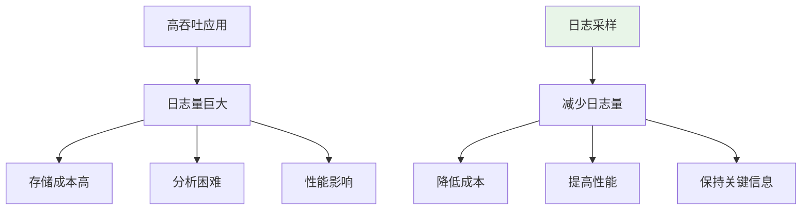

# 日志采样：基于 request_id hash 的高吞吐日志采样控制

> **一句话**：日志采样是在高吞吐场景下，通过采样策略减少日志量，同时保证关键信息不丢失。基于request_id hash的采样可以确保同一请求的所有日志都被采样或丢弃。

## 1. 日志采样基础

### 1.1 为什么需要日志采样？



**高吞吐场景问题**：
- 日志量巨大，存储成本高
- 日志分析困难
- 影响应用性能

### 1.2 采样策略

| 策略 | 说明 | 适用场景 |
|------|------|----------|
| 随机采样 | 随机采样一定比例 | 通用场景 |
| 固定采样 | 每N条采样1条 | 稳定流量 |
| 基于哈希采样 | 基于request_id哈希 | 分布式系统 |
| 动态采样 | 根据流量动态调整 | 流量波动大 |

## 2. 基于request_id哈希采样

### 2.1 实现原理

```python
import hashlib

def should_sample(request_id: str, sample_rate: float = 0.1) -> bool:
    """基于request_id哈希判断是否采样"""
    # 计算哈希值
    hash_value = int(hashlib.md5(request_id.encode()).hexdigest(), 16)
    
    # 转换为0-1之间的值
    normalized = hash_value / (2**128)
    
    # 判断是否采样
    return normalized < sample_rate

# 示例
request_id = "req-1234567890"
print(should_sample(request_id, 0.1))  # 10%采样率
```

### 2.2 优势

```python
# 优势：
# 1. 同一request_id的所有日志都会被采样或丢弃
# 2. 采样结果可预测
# 3. 分布式系统中保持一致性
```

## 3. 日志过滤器实现

### 3.1 基础过滤器

```python
import logging
import hashlib

class SamplingFilter(logging.Filter):
    """日志采样过滤器"""
    
    def __init__(self, sample_rate: float = 0.1):
        super().__init__()
        self.sample_rate = sample_rate
    
    def filter(self, record):
        # 获取request_id
        request_id = getattr(record, 'request_id', None)
        
        if request_id:
            # 基于request_id采样
            return self._should_sample(request_id)
        else:
            # 没有request_id，随机采样
            import random
            return random.random() < self.sample_rate
    
    def _should_sample(self, request_id: str) -> bool:
        """基于request_id判断是否采样"""
        hash_value = int(hashlib.md5(request_id.encode()).hexdigest(), 16)
        normalized = hash_value / (2**128)
        return normalized < self.sample_rate

# 使用
logger = logging.getLogger("myapp")
logger.addFilter(SamplingFilter(sample_rate=0.1))  # 10%采样率
```

### 3.2 高级过滤器

```python
import logging
import hashlib
import time
from collections import defaultdict

class AdvancedSamplingFilter(logging.Filter):
    """高级日志采样过滤器"""
    
    def __init__(self, sample_rate: float = 0.1, window_size: int = 1000):
        super().__init__()
        self.sample_rate = sample_rate
        self.window_size = window_size
        self.sample_window = defaultdict(int)
        self.window_start = time.time()
    
    def filter(self, record):
        # 获取request_id
        request_id = getattr(record, 'request_id', None)
        
        if request_id:
            # 基于request_id采样
            return self._should_sample(request_id)
        else:
            # 基于时间窗口采样
            return self._window_sampling()
    
    def _should_sample(self, request_id: str) -> bool:
        """基于request_id判断是否采样"""
        hash_value = int(hashlib.md5(request_id.encode()).hexdigest(), 16)
        normalized = hash_value / (2**128)
        return normalized < self.sample_rate
    
    def _window_sampling(self) -> bool:
        """基于时间窗口采样"""
        current_time = time.time()
        
        # 检查是否需要重置窗口
        if current_time - self.window_start > 60:  # 1分钟窗口
            self.sample_window.clear()
            self.window_start = current_time
        
        # 检查窗口是否已满
        if sum(self.sample_window.values()) >= self.window_size:
            # 窗口已满，降低采样率
            return False
        
        # 随机采样
        import random
        if random.random() < self.sample_rate:
            self.sample_window[int(current_time)] += 1
            return True
        
        return False
```

## 4. 实际案例

### 4.1 FastAPI集成

```python
from fastapi import FastAPI, Request
import logging
import uuid

app = FastAPI()

# 配置日志采样
logger = logging.getLogger("fastapi")
logger.addFilter(SamplingFilter(sample_rate=0.1))  # 10%采样率

@app.middleware("http")
async def sampling_middleware(request: Request, call_next):
    # 生成或获取request_id
    request_id = request.headers.get("X-Request-ID", str(uuid.uuid4()))
    
    # 处理请求
    response = await call_next(request)
    
    # 记录日志（会被采样过滤器处理）
    logger.info("请求处理完成", extra={
        "request_id": request_id,
        "status_code": response.status_code
    })
    
    return response
```

### 4.2 分布式系统采样

```python
import logging
import hashlib
from typing import Dict

class DistributedSamplingFilter(logging.Filter):
    """分布式系统日志采样过滤器"""
    
    def __init__(self, sample_rate: float = 0.1, service_name: str = "default"):
        super().__init__()
        self.sample_rate = sample_rate
        self.service_name = service_name
    
    def filter(self, record):
        # 获取分布式追踪信息
        trace_id = getattr(record, 'trace_id', None)
        span_id = getattr(record, 'span_id', None)
        
        if trace_id:
            # 基于trace_id采样
            return self._should_sample(trace_id)
        elif span_id:
            # 基于span_id采样
            return self._should_sample(span_id)
        else:
            # 没有追踪信息，随机采样
            import random
            return random.random() < self.sample_rate
    
    def _should_sample(self, trace_id: str) -> bool:
        """基于trace_id判断是否采样"""
        # 组合service_name和trace_id
        combined = f"{self.service_name}:{trace_id}"
        hash_value = int(hashlib.md5(combined.encode()).hexdigest(), 16)
        normalized = hash_value / (2**128)
        return normalized < self.sample_rate
```

### 4.3 动态采样率

```python
import logging
import time
from collections import deque

class DynamicSamplingFilter(logging.Filter):
    """动态采样率过滤器"""
    
    def __init__(self, base_rate: float = 0.1, window_size: int = 100):
        super().__init__()
        self.base_rate = base_rate
        self.window_size = window_size
        self.log_counts = deque(maxlen=window_size)
        self.window_start = time.time()
    
    def filter(self, record):
        current_time = time.time()
        
        # 检查是否需要重置窗口
        if current_time - self.window_start > 60:  # 1分钟窗口
            self.log_counts.clear()
            self.window_start = current_time
        
        # 记录当前日志
        self.log_counts.append(current_time)
        
        # 计算当前日志速率
        current_rate = len(self.log_counts) / (current_time - self.window_start)
        
        # 动态调整采样率
        if current_rate > 1000:  # 每秒超过1000条日志
            adjusted_rate = self.base_rate * 0.1  # 降低采样率
        elif current_rate > 100:  # 每秒超过100条日志
            adjusted_rate = self.base_rate * 0.5
        else:
            adjusted_rate = self.base_rate
        
        # 随机采样
        import random
        return random.random() < adjusted_rate
```

## 5. 采样率选择

### 5.1 采样率计算

```python
def calculate_sample_rate(
    total_logs_per_second: int,
    max_storage_per_day: int,  # GB
    avg_log_size: int,  # bytes
    retention_days: int = 7
) -> float:
    """计算采样率"""
    # 每天日志量
    daily_logs = total_logs_per_second * 86400
    
    # 每天存储量
    daily_storage = daily_logs * avg_log_size / (1024**3)  # GB
    
    # 总存储量
    total_storage = daily_storage * retention_days
    
    # 采样率
    sample_rate = max_storage_per_day / (total_storage / retention_days)
    
    return min(sample_rate, 1.0)

# 示例
sample_rate = calculate_sample_rate(
    total_logs_per_second=10000,
    max_storage_per_day=100,  # 100GB/天
    avg_log_size=500,  # 500字节/条
    retention_days=7
)
print(f"推荐采样率: {sample_rate:.2%}")
```

### 5.2 采样率建议

```python
# 采样率建议
SAMPLE_RATE_RECOMMENDATIONS = {
    "低流量": {"rate": 1.0, "description": "每秒<100条日志"},
    "中流量": {"rate": 0.1, "description": "每秒100-1000条日志"},
    "高流量": {"rate": 0.01, "description": "每秒1000-10000条日志"},
    "极高流量": {"rate": 0.001, "description": "每秒>10000条日志"}
}
```

## 6. 常见坑点

### 1. 采样率设置不当
```python
# 问题：采样率太低，丢失关键信息
sample_rate = 0.001  # 0.1%采样率

# 解决：根据实际情况调整采样率
sample_rate = 0.1  # 10%采样率
```

### 2. 采样不一致
```python
# 问题：同一请求的不同日志采样结果不一致
# 解决：基于request_id或trace_id采样
def should_sample(request_id):
    hash_value = int(hashlib.md5(request_id.encode()).hexdigest(), 16)
    return (hash_value % 100) < 10  # 10%采样率
```

### 3. 性能问题
```python
# 问题：采样过滤器影响性能
# 解决：简化采样逻辑，缓存哈希结果
```

## 核心要点

```python
import hashlib

def should_sample(request_id: str, sample_rate: float = 0.1) -> bool:
    """基于request_id哈希采样"""
    hash_value = int(hashlib.md5(request_id.encode()).hexdigest(), 16)
    normalized = hash_value / (2**128)
    return normalized < sample_rate

# 使用
logger.addFilter(SamplingFilter(sample_rate=0.1))
```

## 相关链接

- 📋 目录：[[00-可观测性与监控]]
- 📚 学习清单：[[技术学习清单#可观测性与监控]]
- 🔗 [[05-结构化JSON日志|结构化日志]]
- 🔗 [[08-Request-ID-全链路追踪|Request ID追踪]]
- 项目实践：[[笔记/技术学习/项目开发笔记/ai-resume笔记/01_技术研读/01_架构概览|ai-resume: 架构概览]]
- 项目实践：[[笔记/技术学习/项目开发笔记/cr-agent笔记/01-技术研读/09-LLM评测体系搭建|cr-agent: LLM评测体系搭建]]
