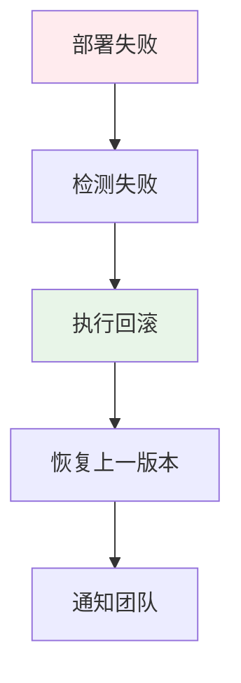

# GitHub Actions CD 流水线：条件部署 staging/production + 健康检查 + 自动回滚

> **一句话**：CD（持续部署）是CI的延续，自动将通过测试的代码部署到生产环境。GitHub Actions CD流水线可以实现条件部署、健康检查、自动回滚等功能。

## 1. CD流水线基础

### 1.1 什么是CD？


**CD（持续部署）**：自动将代码部署到生产环境的过程，通常包括部署、测试、监控等环节。

### 1.2 基础配置

```yaml
# .github/workflows/deploy.yml
name: Deploy

on:
  push:
    branches: [ main ]

jobs:
  deploy:
    runs-on: ubuntu-latest
    
    steps:
    - uses: actions/checkout@v3
    
    - name: Deploy to production
      run: |
        echo "Deploying to production..."
        # 部署脚本
```

## 2. 条件部署

### 2.1 分支条件部署

```yaml
# .github/workflows/deploy.yml
name: Deploy

on:
  push:
    branches: [ main, develop ]

jobs:
  deploy-staging:
    if: github.ref == 'refs/heads/develop'
    runs-on: ubuntu-latest
    steps:
    - uses: actions/checkout@v3
    - name: Deploy to staging
      run: |
        echo "Deploying to staging..."
  
  deploy-production:
    if: github.ref == 'refs/heads/main'
    runs-on: ubuntu-latest
    steps:
    - uses: actions/checkout@v3
    - name: Deploy to production
      run: |
        echo "Deploying to production..."
```

### 2.2 标签条件部署

```yaml
# .github/workflows/deploy.yml
name: Deploy

on:
  push:
    tags:
      - 'v*'

jobs:
  deploy:
    runs-on: ubuntu-latest
    steps:
    - uses: actions/checkout@v3
    - name: Deploy
      run: |
        echo "Deploying version ${{ github.ref_name }}..."
```

### 2.3 手动触发部署

```yaml
# .github/workflows/deploy.yml
name: Deploy

on:
  workflow_dispatch:
    inputs:
      environment:
        description: 'Deploy environment'
        required: true
        default: 'staging'
        type: choice
        options:
        - staging
        - production

jobs:
  deploy:
    runs-on: ubuntu-latest
    environment: ${{ github.event.inputs.environment }}
    steps:
    - uses: actions/checkout@v3
    - name: Deploy
      run: |
        echo "Deploying to ${{ github.event.inputs.environment }}..."
```

## 3. 健康检查

### 3.1 HTTP健康检查

```yaml
# .github/workflows/deploy.yml
name: Deploy

on:
  push:
    branches: [ main ]

jobs:
  deploy:
    runs-on: ubuntu-latest
    steps:
    - uses: actions/checkout@v3
    
    - name: Deploy
      run: |
        echo "Deploying..."
        # 部署脚本
    
    - name: Health check
      run: |
        echo "Running health check..."
        for i in {1..30}; do
          if curl -f http://localhost:8000/health; then
            echo "Health check passed!"
            exit 0
          fi
          echo "Waiting for service to be ready... ($i/30)"
          sleep 10
        done
        echo "Health check failed!"
        exit 1
```

### 3.2 自定义健康检查脚本

```python
# scripts/health_check.py
import requests
import sys
import time

def health_check(url, max_retries=30, interval=10):
    """健康检查脚本"""
    for i in range(max_retries):
        try:
            response = requests.get(url, timeout=5)
            if response.status_code == 200:
                print(f"Health check passed! Response: {response.json()}")
                return True
        except requests.exceptions.RequestException as e:
            print(f"Attempt {i+1}/{max_retries} failed: {e}")
        
        if i < max_retries - 1:
            print(f"Waiting {interval} seconds before next attempt...")
            time.sleep(interval)
    
    print("Health check failed after all retries!")
    return False

if __name__ == "__main__":
    url = sys.argv[1] if len(sys.argv) > 1 else "http://localhost:8000/health"
    success = health_check(url)
    sys.exit(0 if success else 1)
```

```yaml
# 在GitHub Actions中使用
- name: Health check
  run: python scripts/health_check.py http://localhost:8000/health
```

## 4. 自动回滚

### 4.1 回滚策略



### 4.2 实现回滚

```yaml
# .github/workflows/deploy.yml
name: Deploy with Rollback

on:
  push:
    branches: [ main ]

jobs:
  deploy:
    runs-on: ubuntu-latest
    steps:
    - uses: actions/checkout@v3
    
    - name: Deploy
      id: deploy
      run: |
        echo "Deploying..."
        # 保存当前版本
        echo "previous_version=$(curl -s http://localhost:8000/version)" >> $GITHUB_OUTPUT
        # 部署新版本
        # ...
    
    - name: Health check
      id: health
      run: |
        if curl -f http://localhost:8000/health; then
          echo "healthy=true" >> $GITHUB_OUTPUT
        else
          echo "healthy=false" >> $GITHUB_OUTPUT
        fi
    
    - name: Rollback
      if: steps.health.outputs.healthy == 'false'
      run: |
        echo "Health check failed! Rolling back..."
        # 回滚到上一版本
        # ...
    
    - name: Notify
      if: failure()
      run: |
        echo "Deployment failed! Notifying team..."
        # 发送通知
```

### 4.3 Docker回滚

```yaml
# .github/workflows/docker-deploy.yml
name: Docker Deploy with Rollback

on:
  push:
    branches: [ main ]

jobs:
  deploy:
    runs-on: ubuntu-latest
    steps:
    - uses: actions/checkout@v3
    
    - name: Get current version
      id: version
      run: |
        echo "current=$(docker inspect --format='{{.Config.Image}}' myapp)" >> $GITHUB_OUTPUT
    
    - name: Deploy new version
      run: |
        docker pull myapp:latest
        docker stop myapp || true
        docker rm myapp || true
        docker run -d --name myapp -p 8000:8000 myapp:latest
    
    - name: Health check
      id: health
      run: |
        for i in {1..30}; do
          if curl -f http://localhost:8000/health; then
            echo "healthy=true" >> $GITHUB_OUTPUT
            exit 0
          fi
          sleep 10
        done
        echo "healthy=false" >> $GITHUB_OUTPUT
    
    - name: Rollback
      if: steps.health.outputs.healthy == 'false'
      run: |
        echo "Rolling back to previous version..."
        docker stop myapp || true
        docker rm myapp || true
        docker run -d --name myapp -p 8000:8000 ${{ steps.version.outputs.current }}
```

## 5. 多环境部署

### 5.1 环境配置

```yaml
# .github/workflows/deploy.yml
name: Multi-environment Deploy

on:
  push:
    branches: [ main, develop ]

jobs:
  deploy-staging:
    if: github.ref == 'refs/heads/develop'
    runs-on: ubuntu-latest
    environment: staging
    steps:
    - uses: actions/checkout@v3
    - name: Deploy to staging
      run: |
        echo "Deploying to staging..."
  
  deploy-production:
    if: github.ref == 'refs/heads/main'
    runs-on: ubuntu-latest
    environment: production
    steps:
    - uses: actions/checkout@v3
    - name: Deploy to production
      run: |
        echo "Deploying to production..."
```

### 5.2 环境特定配置

```yaml
# .github/workflows/deploy.yml
jobs:
  deploy:
    runs-on: ubuntu-latest
    environment: ${{ github.ref == 'refs/heads/main' && 'production' || 'staging' }}
    steps:
    - uses: actions/checkout@v3
    - name: Deploy
      run: |
        echo "Deploying to ${{ github.ref == 'refs/heads/main' && 'production' || 'staging' }}..."
```

## 6. 实际案例

### 6.1 FastAPI应用部署

```yaml
# .github/workflows/deploy-fastapi.yml
name: Deploy FastAPI

on:
  push:
    branches: [ main ]

jobs:
  deploy:
    runs-on: ubuntu-latest
    steps:
    - uses: actions/checkout@v3
    
    - name: Set up Python
      uses: actions/setup-python@v4
      with:
        python-version: '3.11'
    
    - name: Install dependencies
      run: |
        pip install -r requirements.txt
    
    - name: Run tests
      run: pytest
    
    - name: Deploy to Cloud
      run: |
        # 部署到云平台（如阿里云、AWS等）
        echo "Deploying to cloud..."
    
    - name: Health check
      run: |
        for i in {1..30}; do
          if curl -f https://your-app.com/health; then
            echo "Health check passed!"
            exit 0
          fi
          sleep 10
        done
        echo "Health check failed!"
        exit 1
```

### 6.2 前端应用部署

```yaml
# .github/workflows/deploy-frontend.yml
name: Deploy Frontend

on:
  push:
    branches: [ main ]

jobs:
  deploy:
    runs-on: ubuntu-latest
    steps:
    - uses: actions/checkout@v3
    
    - name: Set up Node.js
      uses: actions/setup-node@v3
      with:
        node-version: '18'
    
    - name: Install dependencies
      run: npm ci
    
    - name: Build
      run: npm run build
    
    - name: Deploy to CDN
      run: |
        # 部署到CDN（如阿里云OSS、AWS S3等）
        echo "Deploying to CDN..."
    
    - name: Invalidate cache
      run: |
        # 清除CDN缓存
        echo "Invalidating CDN cache..."
```

## 7. 监控和告警

### 7.1 部署后监控

```yaml
# .github/workflows/deploy.yml
jobs:
  deploy:
    runs-on: ubuntu-latest
    steps:
    - uses: actions/checkout@v3
    
    - name: Deploy
      run: echo "Deploying..."
    
    - name: Monitor
      run: |
        # 监控应用状态
        echo "Monitoring deployment..."
    
    - name: Alert on failure
      if: failure()
      run: |
        echo "Deployment failed! Sending alert..."
        # 发送告警（邮件、Slack等）
```

### 7.2 Slack通知

```yaml
# .github/workflows/deploy.yml
jobs:
  deploy:
    runs-on: ubuntu-latest
    steps:
    - uses: actions/checkout@v3
    
    - name: Deploy
      run: echo "Deploying..."
    
    - name: Notify Slack
      if: always()
      uses: 8398a7/action-slack@v3
      with:
        status: ${{ job.status }}
        fields: repo,message,commit,author,action,eventName,ref,workflow,job,took
      env:
        SLACK_WEBHOOK_URL: ${{ secrets.SLACK_WEBHOOK_URL }}
```

## 8. 常见坑点

### 1. 部署权限
```yaml
# 问题：部署权限不足
# 解决：配置正确的权限和密钥
permissions:
  contents: read
  deployments: write
```

### 2. 环境变量
```yaml
# 问题：环境变量未正确传递
# 解决：使用GitHub Secrets
env:
  DATABASE_URL: ${{ secrets.DATABASE_URL }}
```

### 3. 健康检查超时
```yaml
# 问题：健康检查超时
# 解决：调整超时时间和重试次数
- name: Health check
  run: |
    for i in {1..60}; do  # 增加重试次数
      if curl -f --connect-timeout 10 http://localhost:8000/health; then
        echo "Health check passed!"
        exit 0
      fi
      sleep 5
    done
    echo "Health check failed!"
    exit 1
```

## 核心要点

```yaml
# 条件部署
if: github.ref == 'refs/heads/main'

# 健康检查
- name: Health check
  run: |
    for i in {1..30}; do
      if curl -f http://localhost:8000/health; then
        echo "Health check passed!"
        exit 0
      fi
      sleep 10
    done
    exit 1

# 自动回滚
- name: Rollback
  if: failure()
  run: echo "Rolling back..."
```

## 相关链接

- 📋 目录：[[00-工程化与部署]]
- 📚 学习清单：[[技术学习清单#工程化与部署]]
- 🔗 [[04-GitHub-Actions-CI流水线|GitHub Actions CI]]
- 🔗 [[01-Docker多阶段构建|Docker多阶段构建]]
- 项目实践：[[笔记/技术学习/项目开发笔记/ai-resume笔记/01_技术研读/01_架构概览|ai-resume: 架构概览]]
- 项目实践：[[笔记/技术学习/项目开发笔记/cr-agent笔记/01-技术研读/08-GitHub集成|cr-agent: GitHub集成]]
